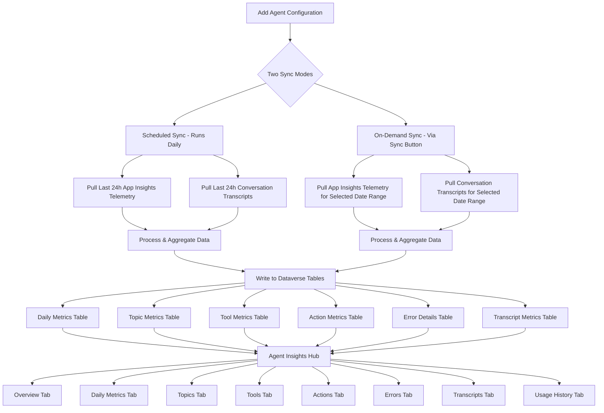

# Agent Insights Hub - Documentation (Preview)

## Table of Contents

- [1. Overview](#1-overview)
- [2. Prerequisites](#2-prerequisites)
- [3. Setup Instructions](#3-setup-instructions)
  - [3.1 Integrate Copilot Studio with Application Insights](#31-integrate-copilot-studio-with-application-insights)
  - [3.2 Register Azure App for Application Insights Access](#32-register-azure-app-for-application-insights-access)
  - [3.3 Run Agent Inventory Sync](#33-run-agent-inventory-sync)
  - [3.4 Add an Agent Configuration](#34-add-an-agent-configuration)
  - [3.5 Run Your First Sync](#35-run-your-first-sync)
- [4. How It Works — End-to-End Flow](#4-how-it-works--end-to-end-flow)
- [5. Action Buttons](#5-action-buttons)
- [6. Filters](#6-filters)
- [7. Tabs](#7-tabs)
  - [7.1 Overview](#71-overview)
  - [7.2 Daily Metrics](#72-daily-metrics)
  - [7.3 Topics](#73-topics)
  - [7.4 Tools](#74-tools)
  - [7.5 Actions](#75-actions)
  - [7.6 Errors](#76-errors)
  - [7.7 Transcripts](#77-transcripts)
  - [7.8 Usage History](#78-usage-history)
  - [7.9 Sync Logs (Troubleshooting)](#79-sync-logs-troubleshooting)
  - [7.10 Transcripts Staging (Troubleshooting)](#710-transcripts-staging-troubleshooting)
- [8. Data Sources & Differences](#8-data-sources--differences)
- [9. Troubleshooting](#9-troubleshooting)

---

## 1. Overview

**Agent Insights Hub** is a comprehensive analytics and monitoring dashboard for Microsoft Copilot Studio agents. It provides real-time visibility into agent performance, conversation metrics, topic analytics, tool execution, and error tracking.

Built as a Power Apps Code App using React and Fluent UI v9, it connects directly to Dataverse to display aggregated telemetry data imported from three sources:

| Data Source | Tabs Powered | What It Captures |
|---|---|---|
| **Azure Application Insights** | Overview, Daily Metrics, Topics, Tools, Actions, Errors | Telemetry logs from agent conversations — response times, topic triggers, tool calls, errors |
| **Conversation Transcripts** | Transcripts | Session-level data from Copilot Studio — engagement, resolution, escalation, CSAT, feedback |
| **Power Platform Admin Center** | Usage History | Copilot credit consumption — billed and non-billed credits by agent, environment, and feature |

---

## 2. Prerequisites

Before using Agent Insights Hub, ensure the following are in place:

1. **Agent Inventory Sync must be run** — The Agent Inventory sync job must have completed at least once so that agent details are available for selection.

2. **Application Insights integration** — Your Copilot Studio agents must be connected to an Azure Application Insights resource. See [Section 3.1](#31-integrate-copilot-studio-with-application-insights).

3. **Azure App Registration** — An Azure AD app must be registered with access to the Application Insights telemetry data. Follow the setup guide: [Enable Application Insights Support](https://github.com/microsoft/Power-CAT-Copilot-Studio-Kit/blob/main/ENABLE-APPINSIGHTS.md#enable-application-insights-support).

4. **App sharing** — The owner of the Copilot Studio Kit code app (or the System Administrator who installed kit) must share the app with other users on their team. Follow these steps:
   1. Go to [make.powerapps.com](https://make.powerapps.com/)
   2. Click **Apps** in the left navigation
   3. Search for **Copilot Studio Kit** and locate the one with type **Code** (not the Model-driven app)
   4. Click the **three dots (...)** menu next to the app
   5. Select **Share**
   6. Search for and add the users or security groups who need access
   7. Click **Share** to confirm

   For detailed instructions, see: [Share a canvas app with your organization](https://learn.microsoft.com/en-us/power-apps/maker/canvas-apps/share-app). This step will be automated in a future release.

---

## 3. Setup Instructions

### 3.1 Integrate Copilot Studio with Application Insights

To collect telemetry from your Copilot Studio agents, you must connect them to Azure Application Insights:

1. Open [Copilot Studio](https://copilotstudio.microsoft.com) and select your agent
2. Go to **Settings** > **Advanced** > **Application Insights**
3. Enter your Application Insights **Connection String** (found in Azure Portal > Application Insights > Overview > Connection String)
4. Click **Save**

For detailed instructions, refer to the official Microsoft documentation:
[Connect your copilot to Application Insights](https://learn.microsoft.com/en-us/microsoft-copilot-studio/advanced-bot-framework-composer-capture-telemetry)

### 3.2 Register Azure App for Application Insights Access

The sync flow needs programmatic access to query Application Insights telemetry. This requires an Azure AD app registration with appropriate permissions.

Follow the complete setup guide: **[Enable Application Insights Support](https://github.com/microsoft/Power-CAT-Copilot-Studio-Kit/blob/main/ENABLE-APPINSIGHTS.md#enable-application-insights-support)**

This guide covers:
- Creating an Azure AD app registration
- Granting the app access to your Application Insights resource
- Obtaining the Application ID, Tenant ID, Client ID, and Client Secret
- Configuring secret storage (Dataverse only currently; Key Vault support planned for a future release)

### 3.3 Run Agent Inventory Sync

Before adding agents to the Insights Hub, ensure the **Agent Inventory** sync has been run at least once. This populates the agent list that appears in the "Add Agent" dialog. For detailed instructions, see: [Agent Inventory Documentation](https://github.com/microsoft/Power-CAT-Copilot-Studio-Kit/blob/main/AGENT_INVENTORY.md).

### 3.4 Add an Agent Configuration

1. Open Agent Insights Hub
2. Click the **Add agent** button
3. Fill in the configuration form:

| Field | Description |
|---|---|
| **Agent** | Select an agent from the inventory. This auto-fills Name, Agent Name, Agent ID, and Dataverse URL. |
| **Name** | A friendly display name for this configuration. Must be unique. |
| **Agent Name** | The name of the Copilot Studio agent. Auto-filled when an agent is selected. Not visible when adding a new agent. |
| **Agent ID** | The unique identifier (GUID) of the Copilot Studio agent. Found in Copilot Studio under Settings > Session Info. |
| **Dataverse URL** | The base URL of the Dataverse environment (e.g., `https://org.crm.dynamics.com`). |
| **Application Insights App ID** | The Application ID from your Azure Application Insights resource (Azure Portal > Application Insights > API Access). |
| **Tenant ID** | The Azure AD Tenant ID where the Application Insights resource is registered. |
| **Client ID** | The Client ID of the Azure AD app registration used to authenticate with Application Insights. |
| **Secret Location** | Currently supports Dataverse storage only. Key Vault storage will be supported in a future release. |
| **Secret** | The client secret for the Azure AD app registration. |
| **KPI Source** | Select which data sources to use: Application Insights, Conversation Transcripts, Usage History.  Select one, two or all three options based on requirement. |
| **Capture User Details** | When enabled, user identity information (User name interacted with agent) will be captured from telemetry logs. |
| **Capture User Feedback** | When enabled, end-user satisfaction feedback will be collected. |

4. Click **Save**

### 3.5 Run Your First Sync

After adding an agent configuration:

1. Click the **Sync** button
2. In the Generate Metrics dialog:
   - Select a configuration (or "All Agents" to sync all at once)
   - Set the **Start Date** and **End Date** for historical data extraction (up to 365 days back)
3. Click **Run**
4. The sync triggers a Cloud Flow that:
   - Queries Application Insights for telemetry data
   - Fetches Conversation Transcripts from Copilot Studio
   - Processes and aggregates the data into KPI records
   - Writes the results to Dataverse tables
5. Monitor progress in the **Sync Logs** tab

---

## 4. How It Works — End-to-End Flow

### Sync Modes

| Mode | Trigger | Data Range | Use Case |
|---|---|---|---|
| **Scheduled** | Runs automatically every day | Last 24 hours | Keeps metrics up to date with daily incremental syncs |
| **On-Demand** | User clicks **Sync** button | Custom start and end date (up to 365 days) | Backfill historical data or re-sync a specific date range |

---

## 5. Action Buttons

These buttons appear on the Overview section header and in empty state screens:

| Button | Description |
|---|---|
| **Sync** | Opens the Generate Metrics dialog to trigger a historical data sync for one or all agents. Select a date range (up to 365 days) and click Run. |
| **Add agent** | Opens the Add Agent dialog to create a new agent configuration with Application Insights credentials and KPI source selection. |
| **Show agents** | Opens a dialog listing all configured agents with their details, KPI sources, and status. Allows editing, cloning, and deleting configurations. |

---

## 6. Filters

A global filter bar appears on all tabs except Sync Logs, Transcripts Staging, and Usage History (which has its own filters).

| Filter | Options | Default | Description |
|---|---|---|---|
| **Agent** | All agents, or a specific configured agent | All agents | Filters data to a specific agent configuration. |
| **Date Range** | Last 7 / 30 / 90 / 180 / 365 days, Custom range | Last 90 days | Controls the time period for all metrics. Custom range shows start/end date pickers. |
| **Channel** | All channels, Teams, Web Chat, Direct Line, Test Panel, Autonomous, Published Engine, Mobile, WhatsApp, Unknown | All channels | Filters by the communication channel used for conversations. |
| **Data Mode** | Production, Test data, All data | Production | Filters by data source type. Production shows real user data; Test data shows test panel interactions. |

**Usage History** has its own independent filters:

| Filter | Description |
|---|---|
| **Environment** | Filter by Power Platform environment |
| **Agent** | Filter by agent (derived from usage data, not configurations) |
| **Date** | Month to date, previous months, or last 6 months |
| **Feature** | Filter by Copilot feature name |

---

## 7. Tabs

### 7.1 Overview

**Data Source**: Application Insights telemetry (Daily Metrics, Topic Metrics, Tool Metrics, Error Details tables)

The Overview tab provides a high-level summary of agent performance. It displays 7 KPI cards with trend indicators comparing the current period against the previous period of equal length.

#### KPI Cards

| KPI | Calculation | Display | Trend |
|---|---|---|---|
| **Conversations** | Sum of Daily Conversation Count across all days | Number | Higher is better |
| **Average DAU** | Sum of Daily Unique Users / Number of distinct days in the period | Number (rounded) | Higher is better |
| **Responses** | Sum of Total Responses (bot messages sent) | Number | Higher is better |
| **Avg Response** | Sum of Total Response Time (ms) / Sum of Total Responses | Seconds (if >= 1s) or ms | Lower is better (inverted trend) |
| **Duration** | Sum of Total Duration (ms) / Sum of Conversations With Duration Data / 60,000 | Minutes (1 decimal) | Lower is better (inverted trend) |
| **Tool Success** | (Sum of Tool Success Count / Sum of Tool Call Count) x 100 | Percentage | Higher is better |
| **Errors** | Sum of Error Count | Number | Lower is better (inverted trend) |

**Trend Calculation**: Compares the current period value against the previous period of equal length. For example, if viewing the last 30 days, the trend compares against the 30 days before that. When the previous period has no data but the current period does, it shows "New" instead of a percentage.

#### Charts

| Chart | Type | Description |
|---|---|---|
| **Top Topics** | Donut | Top 10 topics ranked by trigger count |
| **Slowest Topics** | Horizontal Bar | Top 5 topics by weighted average duration (Total Duration / Duration Count per topic) |
| **Conversations by Channel** | Donut | Distribution of conversations across channels (Teams, Web Chat, etc.) |
| **Single vs Multi-turn** | Donut | Single-turn conversations (1 user message) vs multi-turn (2+ messages) |
| **Session Duration Distribution** | Donut | Short (<1 min), Medium (1-10 min), Long (>10 min) |
| **Error Distribution** | Donut | Top 10 errors by error code |
| **Top Tools** | Donut | Top 10 tools by call volume |
| **Slowest Tools** | Horizontal Bar | Top 5 tools by weighted average response time (Avg Response Time x Call Count / Total Calls per tool) |
| **Response Time** | Grouped Bar | Daily average and P90 response times |
| **Unique Users** | Interactive tags | Displays unique users from Application Insights telemetry logs. Anonymous users are filtered out. |

---

### 7.2 Daily Metrics

**Data Source**: Application Insights telemetry (Daily Metrics table)

Shows daily aggregated conversation metrics with time-series charts and a detailed data table.

#### Charts

| Chart | Type | Description |
|---|---|---|
| **Conversation Volume** | Area (full width) | Daily distinct conversation count — shows engagement trends and peak usage |
| **Daily Active Users** | Area (half width) | Daily unique users — requires user capture enabled in agent configuration |
| **Daily Messages** | Area (half width) | User messages and bot responses sent per day |

#### Data Table

Contains all daily metric fields including: conversation counts, unique users/tools/topics, message counts, response time percentiles (P10/P50/P90/P95/P99), duration metrics, conversation type breakdown (single/multi-turn, short/medium/long), tool stats, and error counts.

---

### 7.3 Topics

**Data Source**: Application Insights telemetry (Topic Metrics table)

Analyzes topic performance — which topics users trigger most, completion rates, and where errors occur.

#### KPI Cards

| KPI | Calculation | Description |
|---|---|---|
| **Total Triggers** | Sum of Trigger Count | Total times topics were triggered (TopicStart events) |
| **Completed** | Sum of Completion Count | Topics that ran to completion (TopicEnd events) |
| **Abandoned** | Sum of Abandonment Count | Topics where triggers exceeded completions and redirects |
| **Avg Duration** | Sum of Total Duration (ms) / Sum of Duration Count | Average time from TopicStart to TopicEnd, displayed as human-readable duration |
| **Errors** | Sum of Error Count | Errors attributed to topics based on the most recent active topic |
| **Messages** | Sum of Message Count | Total user messages (text only) attributed to topics |

#### Charts

| Chart | Type | Description |
|---|---|---|
| **Topic Triggers Over Time** | Area | Daily trend of topic triggers |
| **Topics with Most Errors** | Horizontal Bar | Top 5 topics by error count (only shown if errors exist) |
| **Top Topics by Triggers** | Donut | Top 10 most frequently triggered topics |
| **Messages In vs Out** | Donut | User messages vs bot responses attributed to topics |

---

### 7.4 Tools

**Data Source**: Application Insights telemetry (Tool Metrics table)

Monitors the reliability and speed of external dependencies (HTTP requests, connectors, flows, GenAI calls) that agents invoke during conversations.

#### KPI Cards

| KPI | Calculation | Description |
|---|---|---|
| **Total Calls** | Sum of Call Count | Total external dependency calls |
| **Unique Tools** | Count of distinct Tool Name values | Number of different tools called |
| **Success Rate** | (Sum of Success Count / Sum of Call Count) x 100 | Percentage of successful tool calls |
| **Total Failures** | Sum of Failure Count | Number of failed tool calls |
| **Avg Response Time** | Weighted average of Avg Response Time (ms), weighted by Call Count per record | Average tool response time, displayed in ms or seconds |
| **P90 Response Time** | Weighted average of P90 Response Time (ms), weighted by Call Count per record | 90th percentile — 90% of calls were faster than this value |

#### Charts

| Chart | Type | Description |
|---|---|---|
| **Tool Calls Over Time** | Area | Daily trend of tool invocations |
| **Tool Type Distribution** | Donut | Distribution by tool type (Action, Connector, etc.) |
| **Tool Failures Over Time** | Area | Daily trend of failures — spikes indicate reliability issues |
| **Tool Success Rate (%)** | Horizontal Bar | Top 10 tools ranked by success percentage (Success Count / Call Count x 100 per tool) |

---

### 7.5 Actions

**Data Source**: Application Insights telemetry (Action Metrics table)

Tracks how action nodes perform — execution volume, speed, and the types of actions being used (HTTP requests, Flow invocations, Connector actions, etc.).

#### KPI Cards

| KPI | Calculation | Description |
|---|---|---|
| **Total Executions** | Sum of Execution Count | Total action node executions |
| **Unique Actions** | Count of distinct Node Kind values | Number of different action types (HTTP, Flow, Connector, etc.) |
| **Avg Elapsed Time** | Sum of Total Elapsed (ms) / Sum of Execution Count | Average time per action execution, displayed in ms or seconds |

#### Charts

| Chart | Type | Description |
|---|---|---|
| **Execution Trend** | Area | Daily count of action executions over time |
| **Node Kind Distribution** | Donut | Breakdown by action type — shows most used types |

---

### 7.6 Errors

**Data Source**: Application Insights telemetry (Error Details table)

Identifies what's going wrong — which errors are most frequent, how many users are impacted, and how errors trend over time.

#### KPI Cards

| KPI | Calculation | Description |
|---|---|---|
| **Total Errors** | Sum of Error Count | Total OnErrorLog events recorded |
| **Unique Error Codes** | Count of distinct Error Code values | Number of different error types encountered |
| **Affected Conversations** | Sum of Daily Affected Conversations | Conversations that experienced errors (may include duplicates across days) |
| **Impacted Users** | Sum of Daily Affected Users | Users who encountered errors (may include duplicates across days) |

#### Charts

| Chart | Type | Description |
|---|---|---|
| **Error Trend** | Area | Daily error counts — spikes indicate system issues |
| **Top Error Codes** | Horizontal Bar | Top 5 most frequent error codes |
| **Errors by Channel** | Donut | Error distribution across channels |
| **Impacted Users** | Area | Daily trend of users impacted by errors |

---

### 7.7 Transcripts

**Data Source**: Conversation Transcripts from Copilot Studio (Transcript Metrics table)

Analyzes conversation quality — how users engage, whether sessions get resolved or escalated, and overall satisfaction.

#### KPI Cards (with period-over-period trends)

| KPI | Calculation | Description |
|---|---|---|
| **Conversation Sessions** | Sum of Session Count | Total conversation sessions in the period |
| **Engaged** | Sum of Engaged Count. **Engagement Rate** = (Engaged Count / Session Count) x 100 | Sessions where the user sent at least one message after the greeting |
| **Avg. Turns** | Sum of Total Turns / Sum of Session Count | Average message exchanges per session |
| **Feedback** | Sum of Like Count + Dislike Count | User feedback reactions (thumbs up/down) |
| **Satisfaction Score** | Sum of CSAT Score / Sum of CSAT Count | Average satisfaction score on a 1–5 scale, displayed as X.X/5.0. Only shown when CSAT data exists. |
| **Resolved** | Sum of Resolved Count. **Resolution Rate** = (Resolved Count / Session Count) x 100 | Sessions marked as resolved |
| **Escalated** | Sum of Escalated Count. **Escalation Rate** = (Escalated Count / Session Count) x 100 | Sessions escalated to a human agent |
| **Abandoned** | Sum of Abandoned Count. **Abandonment Rate** = (Abandoned Count / Session Count) x 100 | Sessions where users left without resolution |

#### Charts

| Chart | Type | Description |
|---|---|---|
| **Conversation Outcomes** | Stacked Area + KPIs | Session outcomes over time (Resolved, Escalated, Abandoned, Unengaged) with side KPIs |
| **Engagement Breakdown** | Donut | Engaged vs unengaged sessions |
| **Session Outcomes** | Donut | Distribution of Resolved, Escalated, Abandoned outcomes |
| **Survey Satisfaction Score** | Stacked Bar + Area | Average CSAT score (1-5) with satisfaction trend over time. Satisfied: 4-5, Neutral: 3, Dissatisfied: 1-2  |
| **Satisfaction Score Trend** | Area | Daily average CSAT score over the last 45 days. Each day's score is computed as: **Daily CSAT Score Sum / Daily CSAT Response Count**, rounded to 1 decimal place. Days with no survey responses are excluded.  |

#### Feedback Dialog

Clicking the Feedback KPI card opens a dialog that loads detailed feedback from file attachments (cat_feedbackdetailsfile). Each feedback record shows: reaction (thumbs up/down), agent name, conversation ID, conversation date, agent response, and user feedback text. Supports filtering by reaction type and Excel export.

> **Note**: Feedback data is only available when **Capture User Feedback** is enabled in the agent configuration (Add/Edit Agent dialog).

---

### 7.8 Usage History

**Data Source**: Power Platform Admin Center (Agent Usage History table)

Tracks Copilot credit consumption to understand cost and usage patterns across environments and features.

> **Note**: This tab only appears when usage history data exists in the system.

#### KPI Cards

| KPI | Calculation | Description |
|---|---|---|
| **Billed Credits** | Sum of Billed Copilot Credits | Total billed credits consumed |
| **Non-billed Credits** | Sum of Non-billed Copilot Credits | Total non-billed credits consumed |

#### Charts

| Chart | Type | Description |
|---|---|---|
| **Credit Consumption Over Time** | Area | Billed and non-billed credit trends over time |
| **Credits by Environment** | Horizontal Bar | Top 5 environments by billed credit consumption |
| **Credits by Feature** | Donut | Credit distribution across Copilot features |

This tab uses its own independent filters (Environment, Agent, Date, Feature) rather than the global filter bar.

---

### 7.9 Sync Logs (Troubleshooting)

Shows the execution history of data synchronization flows. Use this tab to verify whether metric generation jobs completed successfully.

#### Data Table Columns

| Column | Description |
|---|---|
| **Name** | Sync job name |
| **Status** | Execution status badge: Not Started, Running, Complete, Error, Cancelled |
| **Cloud Flow** | Link to the Cloud Flow run instance (opens in new tab) |
| **Start Date** | When the sync started |
| **End Date** | When the sync ended |
| **Duration** | Total flow execution time |
| **Error Message** | Error details if the sync failed |
| **Created** | When the log record was created |

---

### 7.10 Transcripts Staging (Troubleshooting)

Monitors the ingestion pipeline for transcript data. Use this tab to check processing status and identify stuck or failed records.

#### Data Table Columns

| Column | Description |
|---|---|
| **Name** | Record name |
| **Agent Name** | Agent that generated the transcript |
| **Conversation Date** | When the conversation occurred |
| **Conversation ID** | Unique conversation identifier |
| **Channel ID** | Communication channel used |
| **Data Source** | Badge: Production or Test Data |
| **Workflow Status** | Badge: Pending, Completed, or Failed |
| **Transcript ID** | Unique transcript GUID |

Supports filtering by workflow status (All, Pending, Completed, Failed) with a refresh button.

---

## 8. Data Sources & Differences

### Important Note on Data Discrepancies

There can be differences in KPI values generated from **Application Insights** versus **Conversation Transcripts** due to the nature of their data sources:

| Factor | Application Insights | Conversation Transcripts |
|---|---|---|
| **Data availability** | Telemetry logs available as long as App Insights retention is configured (default 90 days, configurable up to 730 days) | Conversation transcripts **older than 30 days are automatically deleted** by a bulk-delete system job. To change or disable this, see [Change the default retention period](https://learn.microsoft.com/en-us/microsoft-copilot-studio/analytics-transcripts-powerapps#change-the-default-retention-period). |
| **Data completeness** | Only captures data if telemetry logging is enabled and the agent is connected to App Insights | Captures all conversations regardless of App Insights integration |
| **Metrics focus** | Response times, tool performance, error details, topic execution | Session outcomes, engagement, CSAT, user feedback |
| **Granularity** | Event-level telemetry aggregated daily | Session-level aggregated daily |

**Recommendation**: Use Application Insights metrics (Overview, Daily Metrics, Topics, Tools, Actions, Errors tabs) for performance monitoring and debugging. Use Conversation Transcripts metrics (Transcripts tab) for conversation quality and customer satisfaction analysis.

---

## 9. Troubleshooting

### After Every Sync

1. **Check Sync Logs tab** — Verify the sync job status is **Complete** (green badge). If it shows **Error** (red), check the Error Message column for details and the Cloud Flow link for the full run history.

2. **Check Transcripts Staging tab** — For transcript data, verify that staging records have **Completed** status (green badge). If records are stuck in **Pending** or show **Failed**:
   - Filter by "Failed" status to identify problematic records
   - Check if the conversation transcript data is still available (transcripts older than 30 days may have been deleted)
   - Re-run the sync for the affected date range

### Common Issues

| Issue | Possible Cause | Resolution |
|---|---|---|
| No data after sync | App Insights not connected to agent | Verify Application Insights integration in Copilot Studio Settings > Advanced |
| Sync job shows Error | Invalid App Insights credentials | Check Application ID, Tenant ID, Client ID, and Secret in the agent configuration |
| "No insights yet" on all tabs | No sync has been run | Click "Sync" and run a sync for your desired date range |
| Partial data on some tabs | KPI Source not selected | Edit the agent configuration and ensure the correct KPI sources are checked (Application Insights, Conversation Transcripts, Usage History) |
| Transcript data missing for older dates | Transcripts deleted after 30 days | A bulk-delete system job removes transcripts older than 30 days. Sync regularly to capture data before it expires, or disable/modify the job — see [Change the default retention period](https://learn.microsoft.com/en-us/microsoft-copilot-studio/analytics-transcripts-powerapps#change-the-default-retention-period). |
| Usage History tab not visible | No usage data available | The Usage History feature requires the separate **AgentInventoryUsage** solution to be imported. This solution connects to the Power Platform licensing API to pull credit consumption data. See [Using Usage Metrics in Agent Inventory](https://github.com/microsoft/Power-CAT-Copilot-Studio-Kit/blob/main/AGENT_INVENTORY.md#using-usage-metrics-in-agent-inventory) for installation steps. During import, set up the "HTTP with Microsoft Entra ID (preauthorized)" connection pointing to `https://licensing.powerplatform.microsoft.com/`. Requires Power Platform admin role and system admin permissions. |
| Filters return no results | Restrictive filter combination | Try resetting to default filters (All agents, Last 90 days, All channels, Production) |
| Run button greyed out in Sync dialog | No configuration selected | Select an agent configuration or "All Agents" from the dropdown before clicking Run |
