# Agent Insights Hub

## Table of Contents

1. [Overview](#overview)
2. [Architecture](#architecture)
3. [Prerequisites](#prerequisites)
4. [Setup Guide](#setup-guide)
   - [Step 1: Connect Copilot to Application Insights](#step-1-connect-copilot-to-application-insights)
   - [Step 2: Create Azure App Registration](#step-2-create-azure-app-registration)
   - [Step 3: Configure Agent in Agent Insights Hub](#step-3-configure-agent-in-agent-insights-hub)
   - [Step 4: Run Initial Sync](#step-4-run-initial-sync)
5. [Features & Navigation](#features--navigation)
6. [KPIs & Metrics Reference](#kpis--metrics-reference)
   - [Daily Metrics](#daily-metrics)
   - [Topic Metrics](#topic-metrics)
   - [Error Details](#error-details)
   - [Tool Metrics](#tool-metrics)
   - [Action Metrics](#action-metrics)
7. [Import Queries (KQL)](#import-queries-kql)
8. [Sync Operations](#sync-operations)
9. [UI Components Reference](#ui-components-reference)
   - [Action Buttons](#action-buttons-home-page)
   - [Key Metrics Cards](#key-metrics-cards-home-page)
   - [Charts Reference](#charts-reference)
   - [Dialogs Reference](#dialogs-reference)
   - [Page-Specific Features](#page-specific-features)
   - [Global Filter Bar](#global-filter-bar)
10. [Troubleshooting Guide](#troubleshooting-guide)
11. [Useful Links](#useful-links)

---

## Overview

**Agent Insights Hub** is an enterprise analytics layer that complements existing Copilot Studio analytics capabilities. It pulls aggregated metrics from Application Insights and stores them within Dataverse, making agent analytics accessible within the Copilot Studio Kit.

### What Agent Insights Hub Brings to the Table

| Capability                         | Description                                                                                                                                                                     |
| ---------------------------------- | ------------------------------------------------------------------------------------------------------------------------------------------------------------------------------- |
| **🏢 Enterprise-Wide Visibility**  | Managing dozens of agents across multiple business units and environments? Get one unified dashboard—no jumping between individual agent analytics pages or workbooks           |
| **📊 Cross-Agent Benchmarking**    | Compare engagement rates, resolution rates, and satisfaction scores across your entire agent portfolio. Which agents are excelling? Which need attention? One view answers that |
| **🔑 Simplified Access**           | Using non-interactive authentication, your operations and leadership teams can access centralized reporting without per-user Azure RBAC setup                                   |
| **🎯 No Kusto Expertise Required** | Business analysts get a no-code UI with intuitive visualizations and filters—no need to write complex KQL queries                                                               |
| **📅 365+ Day Retention**          | Store historical metrics in Dataverse without extra Azure costs                                                                                                                 |
| **🔒 Privacy-Safe Access**         | Users view aggregates only; no access to message content or PII                                                                                                                 |

---

## Architecture

### High-Level Architecture Diagram

```mermaid
flowchart TB
    subgraph "Azure Cloud"
        AI[("🔷 Application Insights<br/>Raw Telemetry")]
        AAD["🔐 Azure AD<br/>App Registration"]
    end

    subgraph "Power Platform"
        subgraph "Power Automate"
            F1["⚡ Daily Sync Flow<br/>Scheduled @ 2 AM UTC"]
            F2["⚡ On-Demand Sync Flow<br/>Manual Trigger / Historical Backfill"]
        end

        subgraph "Dataverse"
            DV1[("📊 Metrics Tables<br/>📊 Daily Metrics<br/>📊 Topic Metrics<br/>📊 Error Details<br/>📊 Tool Metrics<br/>📊 Action Metrics")]
            DV2[("⚙️ Agent Configurations")]
            DV3[("📝 Sync Logs")]
        end

        subgraph "Code Apps"
            APP["🖥️ Agent Insights Hub<br/>React + Fluent UI"]
        end
    end

    subgraph "Copilot Studio"
        CS["🤖 Agent"]
    end

    CS -->|"Telemetry Events"| AI
    AAD -->|"OAuth Token"| F1
    AAD -->|"OAuth Token"| F2

    F1 -->|"KQL Queries"| AI
    F2 -->|"KQL Queries"| AI

    F1 -->|"Upsert"| DV1
    F2 -->|"Upsert"| DV1

    DV2 -->|"Config"| F1
    DV2 -->|"Config"| F2

    F1 -->|"Log"| DV3
    F2 -->|"Log"| DV3

    APP -->|"Read"| DV1
    APP -->|"CRUD"| DV2
    APP -->|"Read"| DV3

    style AI fill:#0078D4,color:white
    style AAD fill:#00A4EF,color:white
    style APP fill:#742774,color:white
    style CS fill:#0F6CBD,color:white
```



### Data Flow Sequence

```mermaid
sequenceDiagram
    participant User as 👤 User
    participant App as 🖥️ Agent Insights Hub
    participant DV as 📊 Dataverse
    participant PA as ⚡ Power Automate
    participant AAD as 🔐 Azure AD
    participant AI as 🔷 App Insights

    Note over User,AI: Daily Automated Sync (2 AM UTC)
    PA->>DV: Get Active Configurations
    DV-->>PA: Configuration List
    loop For Each Configuration
        PA->>AAD: Request OAuth Token
        AAD-->>PA: Access Token
        PA->>AI: Execute KQL Queries
        AI-->>PA: Aggregated Metrics
        PA->>DV: Upsert Metrics Records
        PA->>DV: Create Sync Log Entry
    end

    Note over User,AI: Manual Sync (Sync Now)
    User->>App: Click "Sync Now"
    App->>DV: Update ActionParameters
    DV-->>PA: Trigger Flow (Record Modified)
    PA->>AAD: Request OAuth Token
    AAD-->>PA: Access Token
    PA->>AI: Execute KQL Queries
    AI-->>PA: Aggregated Metrics
    PA->>DV: Upsert Metrics Records
    DV-->>App: Data Refreshed
    App-->>User: Show Updated Dashboard
```



---

## Prerequisites

Before setting up Agent Insights Hub, ensure you have:

### Azure Requirements

- [ ] Azure subscription with Application Insights resources
- [ ] Azure AD admin permissions (to create App Registrations)
- [ ] Access to Copilot Studio agents you want to monitor

### Power Platform Requirements

- [ ] CSK - Administrator / System Administrator role in Dataverse environment
- [ ] Power Automate Premium license
- [ ] Copilot Studio Kit solution installed

---

## Setup Guide

### Step 1: Connect Copilot to Application Insights

Before Agent Insights Hub can collect metrics, your Copilot Studio agent must be connected to Azure Application Insights.

> 📖 **Official Guide:** [Connect your Copilot Studio agent to Application Insights](https://learn.microsoft.com/en-us/microsoft-copilot-studio/advanced-bot-framework-composer-capture-telemetry#connect-your-copilot-studio-agent-to-application-insights)

#### Quick Steps:

1. **Create Application Insights Resource** (if not exists)

   - Go to [Azure Portal](https://portal.azure.com)
   - Create new Application Insights resource
   - Note the **Connection String** and **Instrumentation Key**

2. **Connect Agent to App Insights**

   - Open Copilot Studio
   - Go to **Settings** → **Agent details**
   - Scroll to **Application Insights**
   - Enter your **Connection String**
   - Click **Save**

3. **Verify Connection**
   - Have a test conversation with your agent
   - Go to Application Insights → **Logs**
   - Run: `customEvents | where timestamp > ago(1h) | take 10`
   - You should see events from your Copilot

#### Key Events Captured

| Event Name           | Description                 |
| -------------------- | --------------------------- |
| `ConversationStart`  | New conversation initiated  |
| `ConversationEnd`    | Conversation completed      |
| `TopicStart`         | Topic triggered             |
| `TopicEnd`           | Topic completed             |
| `TopicRedirect`      | Topic redirected to another |
| `BotMessageReceived` | User sent a message         |
| `BotMessageSend`     | Bot responded               |
| `OnErrorLog`         | Error occurred              |

---

### Step 2: Create Azure App Registration

Agent Insights Hub uses OAuth 2.0 client credentials to securely query Application Insights.

> 📖 **Official Guide:** [Set up Azure AD authentication for Application Insights](https://learn.microsoft.com/en-us/azure/azure-monitor/app/azure-ad-authentication?tabs=aspnetcore#set-up-authentication)

#### 2.1 Register Application in Azure AD

1. Sign in to [Azure Portal](https://portal.azure.com)
2. Navigate to **Azure Active Directory** → **App registrations**
3. Click **New registration**
4. Enter details:
   - **Name:** `Copilot Monitoring Hub - App Insights Reader`
   - **Supported account types:** Accounts in this organizational directory only
   - **Redirect URI:** Leave blank
5. Click **Register**
6. **Copy these values:**

| Field                   | Store In                       |
| ----------------------- | ------------------------------ |
| Application (client) ID | `cat_azureappinsightsclientid` |
| Directory (tenant) ID   | `cat_azureappinsightstenantid` |

#### 2.2 Create Client Secret

1. In your App Registration, go to **Certificates & secrets**
2. Click **New client secret**
3. Enter:
   - **Description:** `Copilot Monitoring Hub Secret`
   - **Expires:** 24 months (or per your policy)
4. Click **Add**
5. **IMPORTANT:** Copy the secret **Value** immediately

#### 2.3 Grant API Permissions

1. In App Registration → **API permissions**
2. Click **Add a permission**
3. Select **APIs my organization uses**
4. Search for **Log Analytics API**
5. Select **Application permissions** → **Data.Read**
6. Click **Add permissions**
7. Click **Grant admin consent for [Your Organization]**

#### 2.4 Assign Azure RBAC Role

1. Go to your **Application Insights** resource
2. Click **Access control (IAM)**
3. Click **Add** → **Add role assignment**
4. Select role: **Monitoring Reader** or **Log Analytics Reader**
5. Search for your app registration name
6. Click **Review + assign**

#### 2.5 Get Application Insights Details

From your Application Insights resource, copy:

| Field          | Where to Find    | Store In              |
| -------------- | ---------------- | --------------------- |
| Application ID | API Access blade | `App Insights App ID` |

---

### Step 3: Configure Agent in Agent Insights Hub

#### Option A: Add Single Agent (Manual)

1. Open **Agent Insights Hub** in your Power Apps environment
2. Click **Add Agent** button (+ icon)
3. Fill in the configuration form:

| Field                   | Description                    | Example             |
| ----------------------- | ------------------------------ | ------------------- |
| **Name**                | Display name for this config   | `Production HR Bot` |
| **Agent Name**          | Exact name from Copilot Studio | `HR Assistant`      |
| **App Insights App ID** | Application ID from Azure      | `abc123-...`        |
| **Tenant ID**           | Azure AD Tenant ID             | `xyz789-...`        |
| **Client ID**           | App Registration Client ID     | `def456-...`        |
| **Secret Location**     | Where secret is stored         | Dataverse           |
| **Secret**              | Client secret value            | `***`               |

4. Click **Save**

#### Option B: Bulk Import (Multiple Agents)

1. Click **Bulk Import** button
2. **Download Template:** Click the download icon to get Excel template
3. **Fill in Template:** One row per agent configuration

| Column               | Required        | Description                      |
| -------------------- | --------------- | -------------------------------- |
| Name                 | ✅              | Configuration display name       |
| Agent Name           | ✅              | Copilot Studio agent name        |
| App Insights App ID  | ✅              | Application Insights App ID      |
| Tenant ID            | ✅              | Azure AD Tenant ID               |
| Client ID            | ✅              | App Registration Client ID       |
| Secret Location      | ✅              | `1` = Dataverse, `2` = Key Vault |
| Secret               | When Location=1 | Client secret value              |
| Environment Variable | When Location=2 | Key Vault secret name            |

4. **Paste:** Copy all cells from Excel and paste directly into the import grid
5. **Review:** Check the preview grid for errors
6. **Import:** Click **Import All** to create configurations

#### Bulk Import Features

- **Paste from Excel:** Copy cells from Excel and paste directly into the grid
- **Edit in Grid:** Modify values directly in the spreadsheet-like interface
- **Row Validation:** Red highlighting shows invalid rows
- **Progress Tracking:** See real-time import progress

---

### Step 4: Run Initial Sync

After configuring agents, sync historical data:

#### Sync Now

Use the **Sync Now** button to sync data for selected agent(s):

1. Click **Sync now** button on the Overview tab
2. Select agent configuration:
   - "All Agents" to sync all configured agents
   - Or select a specific agent
3. Set date range using the Start Date and End Date pickers
   - Maximum range is 365 days
4. Click **Run**
5. Monitor progress in the **Sync Logs** tab

> ⚠️ **Note:** Syncing large date ranges may take several minutes depending on data volume. Estimated time is shown in the dialog.

---

## Features & Navigation

### Navigation Structure

Agent Insights Hub uses a two-level navigation structure:

1. **App-Level Navigation (NavRail)** - Collapsible side rail with Home and Features
2. **Feature-Level Navigation (TabList)** - Horizontal tabs within the Monitoring feature

### App-Level Navigation

| Item                   | Icon                | Description                                        |
| ---------------------- | ------------------- | -------------------------------------------------- |
| **Home**               | 🏠                  | App landing page showing available features        |
| **Agent Insights Hub** | 📊 (DataUsage icon) | Main monitoring feature with tabbed sub-navigation |

### Feature Tab Navigation (Agent Insights Hub)

| Tab               | Description                                                      |
| ----------------- | ---------------------------------------------------------------- |
| **Overview**      | Dashboard with key metrics, charts, insights, and action buttons |
| **Daily Metrics** | Day-by-day session, message, and response time metrics           |
| **Topics**        | Topic performance, trigger counts, completion rates, durations   |
| **Actions**       | Node kind execution times, action performance by topic           |
| **Tools**         | Tool/connector invocation counts, success rates, elapsed times   |
| **Errors**        | Error tracking, error codes, affected sessions, trends           |
| **Sync Logs**     | History of sync operations with status and execution details     |

### Global Filters

All tabs (except Sync Logs) share common filters in the header bar:

| Filter      | Options                                   | Description                    |
| ----------- | ----------------------------------------- | ------------------------------ |
| **Agent**   | All Agents / [Specific Agent]             | Filter data by agent           |
| **Date**    | Last 7/30/90/180/365 days, Custom         | Time period for metrics        |
| **Channel** | All / Teams / WebChat / DirectLine / etc. | Filter by conversation channel |
| **Data**    | Production / Test data / All data         | Include or exclude test data   |

> **Note:** Sync Logs tab does not display the global filter bar as it shows all log records.

### Action Buttons

| Button          | Action                         | Availability    |
| --------------- | ------------------------------ | --------------- |
| **Add Agent**   | Create new agent configuration | Overview tab    |
| **Show Agents** | View/edit all configurations   | Overview tab    |
| **Bulk Import** | Import multiple configurations | Overview tab    |
| **Sync Now**    | Sync data for selected agents  | Overview tab    |
| **Download**    | Download data as Excel         | All metric tabs |
| **Refresh**     | Reload sync log data           | Sync Logs tab   |

---

## KPIs & Metrics Reference

### Daily Metrics

| KPI                            | Description                 | Calculation                                          |
| ------------------------------ | --------------------------- | ---------------------------------------------------- |
| **Total Sessions**             | Unique conversations        | Count of distinct `conversationId`                   |
| **Unique Users**               | Distinct users              | Count of distinct `user_Id`                          |
| **Total Messages**             | User messages sent          | Count of `BotMessageReceived` where `type='message'` |
| **Bot Responses**              | Messages from bot           | Count of `BotMessageSend`                            |
| **Error Count**                | Errors occurred             | Count of `OnErrorLog` events                         |
| **Error Rate**                 | Error percentage            | `(Errors / Sessions) × 100`                          |
| **Avg Response Time**          | Mean response duration      | `Total Response Time / Response Count`               |
| **P50/P90/P95/P99 Response**   | Percentile response times   | Percentile calculations on response durations        |
| **Single-Turn Sessions**       | One-message conversations   | Sessions with exactly 1 user message                 |
| **Multi-Turn Sessions**        | Multi-message conversations | Sessions with 2+ user messages                       |
| **Short/Medium/Long Sessions** | Duration categories         | <1min / 1-5min / >5min                               |

### Topic Metrics

| KPI                   | Description              | Calculation                              |
| --------------------- | ------------------------ | ---------------------------------------- |
| **Trigger Count**     | Times topic started      | Count of `TopicStart` events             |
| **Completion Count**  | Times topic finished     | Count of `TopicEnd` events               |
| **Completion Rate**   | Success percentage       | `(Completions / Triggers) × 100`         |
| **Redirect Count**    | Topic redirections       | Count of `TopicRedirect` events          |
| **Abandonment Count** | Incomplete topics        | `Triggers - Completions - Redirects`     |
| **Abandonment Rate**  | Drop-off percentage      | `(Abandonments / Triggers) × 100`        |
| **Avg Duration**      | Mean topic duration      | `Total Duration / Duration Count`        |
| **Median Duration**   | P50 topic duration       | 50th percentile of topic durations       |
| **P95 Duration**      | 95th percentile duration | For identifying slow topics              |
| **Message Count**     | Messages within topic    | Messages between TopicStart and TopicEnd |
| **Action Count**      | Actions executed         | Connector/Flow calls within topic        |
| **Avg Action Time**   | Mean action duration     | `Total Action Time / Action Count`       |

### Error Details

| KPI                   | Description       | Calculation                          |
| --------------------- | ----------------- | ------------------------------------ |
| **Error Code**        | Error identifier  | From `customDimensions.errorCode`    |
| **Error Message**     | Error description | From `customDimensions.errorMessage` |
| **Occurrence Count**  | Error frequency   | Count of errors with same code       |
| **Sessions Affected** | Impact scope      | Distinct sessions with this error    |
| **Users Affected**    | User impact       | Distinct users encountering error    |
| **First/Last Seen**   | Error timeline    | Min/Max timestamp for error          |

### Tool Metrics

| KPI                  | Description              | Calculation                                   |
| -------------------- | ------------------------ | --------------------------------------------- |
| **Node Kind**        | Action type              | InvokeFlowAction, InvokeConnectorAction, etc. |
| **Invocation Count** | Times called             | Count of action executions                    |
| **Success Count**    | Successful calls         | Actions without errors                        |
| **Success Rate**     | Reliability              | `(Successes / Invocations) × 100`             |
| **Avg Elapsed Time** | Mean execution time      | `Total Elapsed / Invocation Count`            |
| **P90 Elapsed Time** | 90th percentile duration | For SLA monitoring                            |
| **Max Elapsed Time** | Slowest execution        | For identifying bottlenecks                   |

### Action Metrics

Tracks execution times by action node type for performance investigations, with granularity down to specific topics and actions.

| KPI                      | Description               | Calculation                                |
| ------------------------ | ------------------------- | ------------------------------------------ |
| **Node Kind**            | Type of action node       | e.g., InvokeFlowAction, SearchAndSummarize |
| **Topic ID**             | Associated topic          | Topic where action executed                |
| **Action ID**            | Specific action instance  | Unique action identifier within topic      |
| **Execution Count**      | Times action executed     | Count of action executions                 |
| **Total Elapsed (ms)**   | Sum of all elapsed times  | For weighted average calculations          |
| **Daily Conversations**  | Distinct conversations    | `dcount(conversationId)` for the day       |
| **Avg Elapsed Time**     | Mean execution time       | `Total Elapsed / Execution Count`          |
| **Min/Max Elapsed Time** | Time boundaries           | Fastest and slowest executions             |
| **Std Dev Elapsed Time** | Time variability          | Standard deviation of elapsed times        |
| **P10/P50/P90/P95/P99**  | Percentile response times | Distribution analysis for SLAs             |

#### Node Kinds (Action Types)

| Node Kind                   | Description                  |
| --------------------------- | ---------------------------- |
| `InvokeFlowAction`          | External Power Automate flow |
| `InvokeConnectorAction`     | Connector/API call           |
| `SearchAndSummarizeContent` | Generative answers search    |
| `HttpRequest`               | HTTP request action          |
| `SendActivity`              | Send message to user         |
| `SetVariable`               | Variable assignment          |
| `ConditionAction`           | If/then branching            |
| `QuestionAction`            | User input prompt            |
| `MessageAction`             | Bot message                  |
| `TopicRedirectAction`       | Redirect to another topic    |
| `ForEachAction`             | Loop over collection         |
| `ParseValueAction`          | Parse/transform data         |
| `CreateRecordAction`        | Dataverse create             |
| `UpdateRecordAction`        | Dataverse update             |
| `DeleteRecordAction`        | Dataverse delete             |
| `ListRecordAction`          | Dataverse query              |
| `AuthenticateAction`        | Auth/login flow              |
| `EndConversationAction`     | End session                  |
| `HandoffAction`             | Transfer to human agent      |

---

## Import Queries (KQL)

The following KQL queries are used to extract aggregated metrics from Application Insights:

### Query Files

| File                                                                           | Target Table        | Grain                                                               |
| ------------------------------------------------------------------------------ | ------------------- | ------------------------------------------------------------------- |
| [Import_DailyMetrics.kql](../../../Import%20Queries/Import_DailyMetrics.kql)   | `cat_dailymetrics`  | date + agent + channel + dataSource                                 |
| [Import_TopicMetrics.kql](../../../Import%20Queries/Import_TopicMetrics.kql)   | `cat_topicmetrics`  | date + agent + topic + channel + dataSource                         |
| [Import_ErrorDetails.kql](../../../Import%20Queries/Import_ErrorDetails.kql)   | `cat_errordetails`  | date + agent + errorCode + channel + dataSource                     |
| [Import_ToolMetrics.kql](../../../Import%20Queries/Import_ToolMetrics.kql)     | `cat_toolmetrics`   | date + agent + nodeKind + channel + dataSource                      |
| [Import_ActionMetrics.kql](../../../Import%20Queries/Import_ActionMetrics.kql) | `cat_actionmetrics` | date + agent + nodeKind + topicId + actionId + channel + dataSource |

### Running Queries Manually

1. Open Azure Portal → Application Insights → Logs
2. Copy query content from the `.kql` file
3. Modify variables if needed:
   ```kql
   let startDate = ago(180d);  // Adjust lookback period
   let endDate = now();
   ```
4. Run query and export results

### Query Output Format

Each query outputs data ready for Dataverse import with:

- **name**: Alternate key for upsert operations
- **metricDate**: Date of aggregation
- **agentName**: Agent identifier
- **channelId**: Conversation channel
- **dataSource**: "Production" or "Test Data"
- **[Metric Columns]**: Aggregated values

### Important: BotMessageReceived Event Types

```
BotMessageReceived fires for TWO different things:
1. messageType = "message" → Actual user typed a message (COUNT THIS)
2. messageType = "event"   → System events (conversation start, etc.) - IGNORE

Always filter: name == "BotMessageReceived" AND messageType == "message"
```

---

## Sync Operations

### Automated Daily Sync

A Power Automate flow runs daily at **2:00 AM UTC** to:

1. Retrieve all active agent configurations
2. Authenticate with Azure AD
3. Execute KQL queries for yesterday's data
4. Upsert results into Dataverse tables
5. Log execution status

### Manual Sync (Sync Now)

Triggers sync for selected agent(s) and date range:


### Sync Log Status Codes

| Code | Status      | Description               |
| ---- | ----------- | ------------------------- |
| 1    | Not Started | Sync queued but not begun |
| 2    | Running     | Currently executing       |
| 3    | Complete    | Successfully finished     |
| 4    | Error       | Failed with error         |
| 5    | Cancelled   | Manually cancelled        |

---

## Troubleshooting Guide

### Common Issues

#### 1. No Data Showing in Dashboard

**Symptoms:** Dashboard shows empty state, no metrics displayed

**Checklist:**

- [ ] Agent is connected to Application Insights (verify in Copilot Studio settings)
- [ ] Test conversations have been made (data exists in App Insights)
- [ ] Agent configuration exists and is active
- [ ] Sync has been run (check Sync Logs)
- [ ] Date range filter includes data dates
- [ ] Agent filter matches configuration name

#### 2. Sync Failing with Authentication Error

**Symptoms:** Sync logs show "Error" status with auth-related message

**Checklist:**

- [ ] Client secret hasn't expired
- [ ] Tenant ID is correct
- [ ] Client ID is correct
- [ ] API permissions granted and admin consented
- [ ] RBAC role assigned on Application Insights resource

**Debug Steps:**

1. Test authentication manually:
   ```powershell
   $body = @{
       grant_type    = "client_credentials"
       client_id     = "YOUR_CLIENT_ID"
       client_secret = "YOUR_SECRET"
       scope         = "https://api.loganalytics.io/.default"
   }
   $token = Invoke-RestMethod -Uri "https://login.microsoftonline.com/YOUR_TENANT_ID/oauth2/v2.0/token" -Method POST -Body $body
   $token.access_token
   ```
2. If token fails, verify Azure AD app registration settings

#### 3. Data Not Matching Application Insights Dashboard

**Symptoms:** Numbers differ between Agent Insights Hub and native Azure dashboard

**Possible Causes:**

- Different time zones (Agent Insights uses UTC)
- Different date range selections
- Test data inclusion/exclusion differences
- Aggregation grain differences

**Resolution:**

1. Ensure same date range is selected
2. Check "Data Mode" filter (Production vs Test)
3. Review query logic in KQL files for calculation methods

#### 4. Bulk Import Failures

**Symptoms:** Some rows fail during bulk import

**Checklist:**

- [ ] All required fields populated (Name, Agent Name, App Insights App ID, Tenant ID, Client ID)
- [ ] No special characters in Name field
- [ ] Secret provided when Secret Location = Dataverse

**Resolution:**

1. Check row highlighting for validation errors
2. Hover over red cells for specific error message
3. Fix issues and retry

#### 5. Charts Not Rendering

**Symptoms:** Charts show loading spinner indefinitely or error

**Checklist:**

- [ ] Data exists for selected filters
- [ ] Browser is up to date
- [ ] No console errors in browser dev tools

**Resolution:**

1. Clear browser cache
2. Try different date range
3. Check browser console (F12) for JavaScript errors

### Error Messages Reference

| Error           | Cause               | Solution                                   |
| --------------- | ------------------- | ------------------------------------------ |
| `AADSTS7000215` | Secret expired      | Regenerate client secret in Azure AD       |
| `AADSTS700016`  | Wrong tenant        | Verify tenant ID in configuration          |
| `403 Forbidden` | Missing permissions | Add Monitoring Reader role on App Insights |
| `Invalid query` | KQL syntax error    | Check query in App Insights Logs blade     |
| `Rate limited`  | Too many requests   | Wait and retry, or reduce query frequency  |

---

## Useful Links

### Microsoft Documentation

| Topic                           | Link                                                                                                                                                                                      |
| ------------------------------- | ----------------------------------------------------------------------------------------------------------------------------------------------------------------------------------------- |
| Connect Copilot to App Insights | [Microsoft Learn](https://learn.microsoft.com/en-us/microsoft-copilot-studio/advanced-bot-framework-composer-capture-telemetry#connect-your-copilot-studio-agent-to-application-insights) |
| Azure AD Authentication Setup   | [Microsoft Learn](https://learn.microsoft.com/en-us/azure/azure-monitor/app/azure-ad-authentication?tabs=aspnetcore#set-up-authentication)                                                |
| Copilot Studio Analytics        | [Microsoft Learn](https://learn.microsoft.com/en-us/microsoft-copilot-studio/analytics-overview)                                                                                          |
| Application Insights Overview   | [Microsoft Learn](https://learn.microsoft.com/en-us/azure/azure-monitor/app/app-insights-overview)                                                                                        |
| KQL Quick Reference             | [Microsoft Learn](https://learn.microsoft.com/en-us/azure/data-explorer/kql-quick-reference)                                                                                              |

---

## UI Components Reference

### Action Buttons (Home Page)

The Overview tab displays action buttons in the header area:

| Button          | Icon           | Description                      | Action                                                                                |
| --------------- | -------------- | -------------------------------- | ------------------------------------------------------------------------------------- |
| **Sync now**    | 🔄 ArrowSync   | Sync data for selected agents    | Opens Sync Now Dialog to sync data for selected agent(s) and date range               |
| **Add agent**   | ➕ Add         | Create a new agent configuration | Opens Add Agent Dialog to configure a new Copilot agent with App Insights credentials |
| **Bulk import** | ⬆️ ArrowUpload | Import multiple agents at once   | Opens Excel-like grid for bulk configuration import                                   |
| **Show agents** | 👁️ Eye         | View all configured agents       | Opens dialog showing all agent configurations with edit/delete options                |

> **Note:** When no configurations or metrics exist, the page displays an empty state with these same buttons prominently displayed.

### Key Metrics Cards (Home Page)

The "Key metrics" section displays 6 metric cards at the top of the Overview tab:

| Metric Card               | Icon           | Description                                   | Trend Calculation                          |
| ------------------------- | -------------- | --------------------------------------------- | ------------------------------------------ |
| **Conversation sessions** | 💬 Chat        | Total unique conversations in selected period | Compares to previous period of same length |
| **Unique users**          | 👥 People      | Distinct users who interacted with agent      | Compares to previous period                |
| **Responses**             | ↩️ ArrowReply  | Total bot responses sent                      | No trend shown                             |
| **Avg response**          | ⏱️ Gauge       | Average response time in seconds              | No trend shown                             |
| **Duration**              | ⏲️ Timer       | Average session duration in minutes           | Compares to previous period                |
| **Errors**                | ❌ ErrorCircle | Total errors occurred                         | Inverted trend (down is good)              |

**Trend Indicators:**

- 🟢 **Green arrow up**: Positive change (more users, sessions)
- 🔴 **Red arrow up**: Negative change (more errors - uses inverted trend logic)
- ⬇️ **Arrow down**: Decrease from previous period
- Percentage shows change vs previous period of same length
- **No arrow**: Trend not applicable or no previous data available
  |

### Charts Reference

#### Usage Overview Section

| Chart                        | Type      | Data Source        | Description                                                          |
| ---------------------------- | --------- | ------------------ | -------------------------------------------------------------------- |
| **Top Topics**               | List      | `cat_topicmetrics` | Top 5 most triggered topics ranked by trigger count                  |
| **Conversations by Channel** | Donut Pie | `cat_dailymetrics` | Distribution of conversations across channels (Teams, WebChat, etc.) |

#### Session Analysis Section

| Chart                             | Type      | Data Source        | Description                                                           |
| --------------------------------- | --------- | ------------------ | --------------------------------------------------------------------- |
| **Single vs Multi-turn Sessions** | Donut Pie | `cat_dailymetrics` | Ratio of one-message conversations vs multi-message conversations     |
| **Session Duration Distribution** | Donut Pie | `cat_dailymetrics` | Breakdown by duration: Short (<1min), Medium (1-10min), Long (>10min) |

#### Health & Errors Section

| Chart                          | Type           | Data Source        | Description                                                      |
| ------------------------------ | -------------- | ------------------ | ---------------------------------------------------------------- |
| **Error Distribution by Type** | Donut Pie      | `cat_errordetails` | Top 8 most common error codes                                    |
| **Tool Success Rate (%)**      | Horizontal Bar | `cat_toolmetrics`  | Success percentage for each tool/connector (sorted lowest first) |

#### Response Performance Section

| Chart                         | Type         | Data Source        | Description                                                      |
| ----------------------------- | ------------ | ------------------ | ---------------------------------------------------------------- |
| **Average Response Time**     | Area Chart   | `cat_dailymetrics` | Daily trend of average response time (seconds) over last 30 days |
| **P90 Response Time**         | Area Chart   | `cat_dailymetrics` | Daily trend of 90th percentile response time (seconds)           |
| **Response Time Percentiles** | Vertical Bar | `cat_dailymetrics` | P10, P50, P90, P95, P99 response times comparison                |
| **Slow Responses Over Time**  | Area Chart   | `cat_dailymetrics` | Daily count of responses taking >16 seconds                      |

#### Slowest Execution Section

| Chart                                | Type           | Data Source        | Description                                          |
| ------------------------------------ | -------------- | ------------------ | ---------------------------------------------------- |
| **Tool Execution (Top 10 Slowest)**  | Horizontal Bar | `cat_toolmetrics`  | Top 10 slowest tools by P90 execution time (seconds) |
| **Topic Execution (Top 10 Slowest)** | Horizontal Bar | `cat_topicmetrics` | Top 10 slowest topics by median duration (seconds)   |

### Data Aggregation Methods

#### How Metrics Are Calculated

| Aggregation     | Method              | Formula                                   |
| --------------- | ------------------- | ----------------------------------------- |
| **Sum**         | Simple total        | `SUM(field)` across filtered records      |
| **Average**     | Weighted average    | `SUM(total_field) / SUM(count_field)`     |
| **Percentiles** | Weighted percentile | Weight by response count when aggregating |
| **Trend**       | Period comparison   | `((Current - Previous) / Previous) × 100` |

#### Period Comparison Logic

```
Current Period: [startDate, endDate] from filter
Previous Period: Same length BEFORE startDate

Example (Last 30 Days):
- Current: Dec 17, 2025 → Jan 16, 2026
- Previous: Nov 17, 2025 → Dec 16, 2025

Trend = ((Current Total - Previous Total) / Previous Total) × 100%
```

### Dialogs Reference

#### Add Agent Dialog

| Field                | Type        | Required    | Description                                     |
| -------------------- | ----------- | ----------- | ----------------------------------------------- |
| Name                 | Text        | ✅          | Display name for this configuration             |
| Agent                | Lookup/Text | ✅          | Select from Agent Details or enter name         |
| App Insights App ID  | GUID        | ✅          | Application Insights Application ID             |
| Tenant ID            | GUID        | ✅          | Azure AD Tenant ID                              |
| Client ID            | GUID        | ✅          | App Registration Client ID                      |
| Secret Location      | Choice      | ✅          | Dataverse (1) or Key Vault (2)                  |
| Secret               | Text        | Conditional | Client secret (when Location=Dataverse)         |
| Environment Variable | Text        | Conditional | Key Vault secret name (when Location=Key Vault) |

#### Show Agents Dialog

Displays a table of all configured agents with:

- Agent Name
- App Insights App ID
- Last Sync Date
- Status
- **Edit** button (opens Add Agent Dialog in edit mode)
- **Delete** button (with confirmation)

#### Bulk Import Dialog

Excel-like spreadsheet interface with:

- **Download Template**: Get Excel template with headers
- **Paste from Excel**: Copy all cells from Excel and paste directly into grid
- **Edit in Grid**: Modify values directly in the spreadsheet-like interface
- **Row Validation**: Real-time validation with error highlighting
- **Progress Bar**: Shows import progress during bulk create
- **Import All**: Creates all valid configurations

| Column               | Width | Required    | Description                |
| -------------------- | ----- | ----------- | -------------------------- |
| Name                 | 140px | ✅          | Configuration display name |
| Agent Name           | 140px | ✅          | Copilot Studio agent name  |
| App Insights App ID  | 280px | ✅          | Application ID GUID        |
| Tenant ID            | 280px | ✅          | Tenant GUID                |
| Client ID            | 280px | ✅          | Client ID GUID             |
| Secret Location      | 120px | ✅          | 1=Dataverse, 2=Key Vault   |
| Secret               | 200px | Conditional | Client secret value        |
| Environment Variable | 200px | Conditional | Key Vault reference        |

#### Sync Now Dialog (GenerateMetricsDialog)

This dialog is titled "Generate Metrics - Historical Backfill" and triggers the historical backfill flow.

| Field                    | Type        | Options/Description                                               |
| ------------------------ | ----------- | ----------------------------------------------------------------- |
| **Select Configuration** | Dropdown    | "Select an agent..." / "All Agents" / [List of configured agents] |
| **Start Date**           | Date picker | Start date for historical data sync                               |
| **End Date**             | Date picker | End date for historical data sync                                 |

**Validation Rules:**

- Configuration is required
- Maximum date range is 365 days
- Shows estimated processing time based on date range

**Progress & Status:**

- Progress bar during execution
- Success message: "Historical backfill has been triggered successfully. The flow is running in the background."
- Error messages displayed if sync fails

### Page-Specific Features

#### Daily Metrics Page

| Component                     | Description                                              |
| ----------------------------- | -------------------------------------------------------- |
| **Daily Conversation Volume** | Line chart showing daily session counts over 30 days     |
| **Daily Active Users**        | Line chart showing daily unique users over 30 days       |
| **Daily Messages**            | Line chart showing daily message volumes over 30 days    |
| **Data Table**                | Sortable, filterable table with all daily metric columns |
| **Download Button**           | Export visible data as Excel                             |

**Data Table Columns:**
Date, Agent, Channel, Data Source, Sessions, Users, Messages, Responses, Single-Turn, Multi-Turn, Short (<1m), Medium (1-5m), Long (>5m), Avg Duration, P50/P95 Duration, P50/P95/P99 Response, Slow (>16s), Tool Calls, Tool Success, Tool Failures, Errors

#### Topic Metrics Page

| Component                    | Description                                                          |
| ---------------------------- | -------------------------------------------------------------------- |
| **Summary Cards**            | Total Triggers, Completed, Abandoned, Avg Duration, Errors, Messages |
| **Topic Triggers Over Time** | Area chart of trigger counts over time                               |
| **Top Topics by Triggers**   | Horizontal bar chart of most triggered topics                        |
| **Completion Status**        | Donut pie chart showing completed vs abandoned vs redirected         |
| **Topics with Most Errors**  | Horizontal bar chart of topics with highest error counts             |
| **Messages In vs Out**       | Donut pie chart showing message distribution                         |
| **Data Table**               | Full topic metrics with all columns                                  |
| **Download Button**          | Export filtered data as Excel                                        |

#### Error Details Page

| Component                    | Description                                                              |
| ---------------------------- | ------------------------------------------------------------------------ |
| **Summary Cards**            | Total Errors, Unique Error Codes, Affected Conversations, Affected Users |
| **Error Trend Chart**        | Line chart of daily error count over time                                |
| **Top Error Codes**          | Horizontal bar chart of most frequent error codes                        |
| **Errors by Channel**        | Donut pie chart showing error distribution by channel                    |
| **Affected Users Over Time** | Area chart of affected user count trend                                  |
| **Data Table**               | Detailed error records with codes, messages, counts                      |
| **Download Button**          | Export filtered data as Excel                                            |

#### Action Metrics Page

| Component                         | Description                                                                                   |
| --------------------------------- | --------------------------------------------------------------------------------------------- |
| **Summary Cards**                 | Total executions, avg elapsed time, unique node kinds, conversations                          |
| **Execution Trend Chart**         | Line chart of daily execution counts over time                                                |
| **Top Actions Bar Chart**         | Horizontal bar chart of top 10 actions by execution count                                     |
| **Executions by Node Kind Chart** | Vertical bar chart showing execution distribution by node type                                |
| **Data Table**                    | Full action metrics with Date, Node Kind, Action ID, Agent, Executions, Avg/P50/P95/Max times |
| **Download Button**               | Export filtered data as Excel                                                                 |

**Data Table Columns:**

- **Date**: Metric date
- **Node Kind**: Action type (with color-coded badge)
- **Action ID**: Specific action identifier
- **Agent**: Agent name
- **Executions**: Execution count
- **Avg Time**: Average elapsed time (ms or seconds)
- **P50**: 50th percentile elapsed time
- **P95**: 95th percentile elapsed time
- **Max**: Maximum elapsed time

#### Tool Metrics Page

| Component                     | Description                                                                                       |
| ----------------------------- | ------------------------------------------------------------------------------------------------- |
| **Summary Cards**             | Total Calls, Unique Tools, Success Rate (%), Total Failures, Avg Response Time, P90 Response Time |
| **Calls by Tool Type**        | Donut pie chart showing distribution of tool/action invocations                                   |
| **Tool Calls Over Time**      | Area chart showing tool call trend                                                                |
| **P90 Response Time by Tool** | Horizontal bar chart of P90 execution time per tool                                               |
| **Tool Failures Over Time**   | Area chart showing failure trend                                                                  |
| **Data Table**                | Full tool metrics data with searchable, sortable columns                                          |
| **Download Button**           | Export filtered data as Excel                                                                     |

**Empty State:** If no tool metrics exist for selected filters, displays a helpful message suggesting to adjust filters.

#### Sync Logs Page

| Component          | Description                                               |
| ------------------ | --------------------------------------------------------- |
| **Refresh Button** | Reload sync log data (ArrowSync icon)                     |
| **Data Table**     | Sync execution history with searchable, paginated columns |

**Data Table Columns:**

- **Name**: Log record name
- **Created On**: Timestamp of log creation
- **Execution Status**: Color-coded badge (Not Started, Running, Complete, Error, Cancelled)
- **Cloud Flow Name**: Name of the Power Automate flow
- **Cloud Flow Instance URL**: Link to open flow run in Power Automate
- **Agent Configuration**: Associated agent configuration name
- **Start Date / End Date**: Date range for the sync operation
- **Plugin Name**: Plugin or action that ran
- **Error Message**: Error details if sync failed

**Status Badge Colors:**

- Subtle (grey): Not Started
- Informative (blue): Running
- Success (green): Complete
- Danger (red): Error
- Warning (yellow): Cancelled

**Pagination:** Default 25 rows per page, options for 10/25/50/100

### Global Filter Bar

Present on all tabs except Sync Logs:

| Filter           | Type        | Options                                                   | Default      |
| ---------------- | ----------- | --------------------------------------------------------- | ------------ |
| **Agent**        | Dropdown    | "All agents" + list of configured agents                  | All agents   |
| **Date**         | Dropdown    | Last 7/30/90/180/365 days, Custom range                   | Last 90 days |
| **Custom Start** | Date Picker | Any date (shown when "Custom range" selected)             | Hidden       |
| **Custom End**   | Date Picker | Any date (shown when "Custom range" selected)             | Hidden       |
| **Channel**      | Dropdown    | All + available channels from data (Teams, WebChat, etc.) | All          |
| **Data**         | Dropdown    | Production, Test data, All data                           | Production   |

> **Note:** Filter values persist across tab navigation within the same session.

### Theme Support

| Theme          | Description                               |
| -------------- | ----------------------------------------- |
| **Light Mode** | Default Fluent UI light theme             |
| **Dark Mode**  | Fluent UI dark theme (toggle in nav rail) |

Navigation rail includes a theme toggle button (sun/moon icon) in the header area.

---

## Appendix

### Dataverse Tables Used

| Table                      | Display Name        | Purpose                                   |
| -------------------------- | ------------------- | ----------------------------------------- |
| `cat_copilotconfiguration` | Agent Configuration | Agent settings and Azure credentials      |
| `cat_dailymetrics`         | Daily Metrics       | Daily aggregated session/message data     |
| `cat_topicmetrics`         | Topic Metrics       | Topic-level performance data              |
| `cat_errordetails`         | Error Details       | Error tracking and analysis               |
| `cat_toolmetrics`          | Tool Metrics        | Tool/connector invocation performance     |
| `cat_actionmetrics`        | Action Metrics      | Node kind execution times by topic/action |
| `cat_copilotstudiokitlogs` | Sync Logs           | Flow execution history                    |
| `cat_agentdetails`         | Agent Details       | Agent registry                            |

### Technology Stack

| Layer          | Technology                 |
| -------------- | -------------------------- |
| Frontend       | React 18 + TypeScript      |
| UI Components  | Fluent UI v9               |
| Charts         | Fluent UI React Charts     |
| Build Tool     | Vite                       |
| Data Layer     | Dataverse SDK (generated)  |
| Backend        | Power Automate Cloud Flows |
| Authentication | Azure AD OAuth 2.0         |
| Data Source    | Azure Application Insights |

---

_Document generated for Agent Insights Hub v1.1.4_
