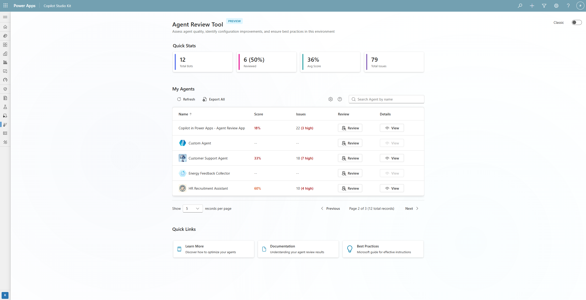
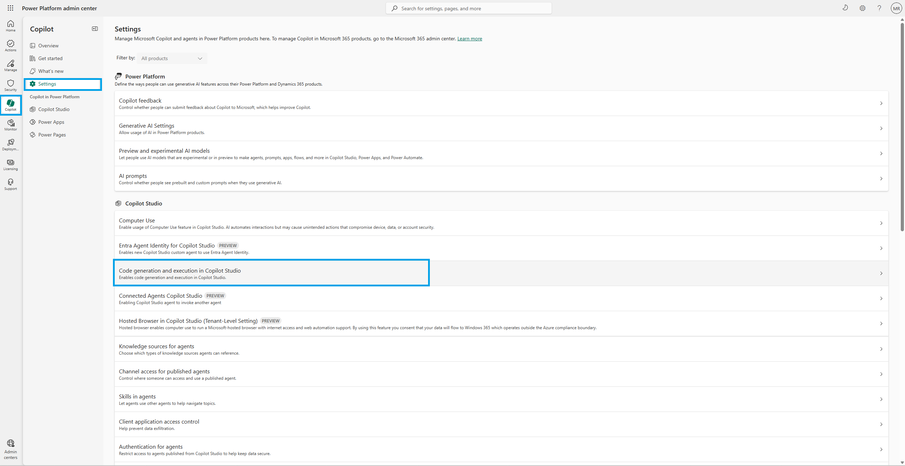
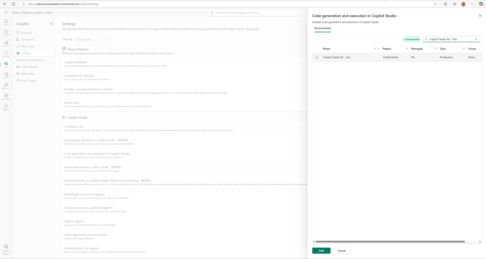
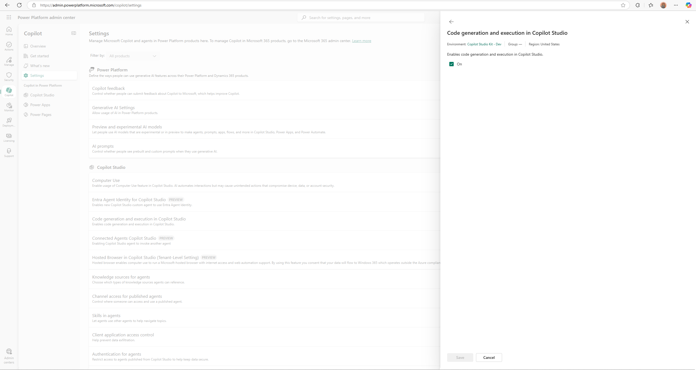

# Agent Review Tool for Copilot Studio

The Agent Review Tool is a feature in Copilot Studio kit that provides automated quality assessment for Microsoft Copilot Studio agents using Generative AI Orchestration. This tool evaluates agent configuration patterns and instruction quality to help developers build production-ready conversational AI solutions.

## Overview

The Agent Review Tool analyzes two key aspects of Copilot Studio agents that use Generative AI Orchestration:

- **Pattern Analysis**: Evaluates technical configuration including naming conventions, variable definitions, tool usage, and test coverage
- **Instruction Analysis**: Assesses AI prompt quality across safety, scope definition, and user experience criteria

## Prerequisites

1. **Microsoft Dataverse environment with prompts enabled** in the Power Platform admin center - [Enable or disable AI Builder preview features](https://learn.microsoft.com/en-us/ai-builder/administer#enable-or-disable-ai-builder-preview-features)

2. **Copilot Studio Kit installed**

3. **AI Builder**: Ensure AI Builder credits are assigned to your environment - [AI Builder credit management](https://learn.microsoft.com/en-us/ai-builder/credit-management)

4. **Enable Code Interpreter in Admin Center** (requires Power Platform or System Administrator privilege)
   
   Enable at the environment level (admin step):
   - In Power Platform admin center, go to **Copilot** → **Settings**
   
   - Under **Copilot Studio**, open **Code generation and execution in Copilot Studio**
   - Select your environment, click **Add**
   
   - Select "Enables code generation execution in Copilot Studio" and **Save**
   

## Scoring methodology

The tool generates three scores for each analyzed agent:

### Pattern Score

Calculated as the percentage of passed technical checks across seven pattern categories:

- Model naming and descriptions
- Input and output variable definitions  
- Architecture configuration (tool count, test coverage)
- Component clarity and documentation

### Instruction Score

AI-generated compliance percentage based on evaluation of agent instructions against twelve quality criteria organized into four categories:

- **Safety**: Privacy handling, prompt injection protection, advice disclaimers, link safety
- **Quality**: Fallback responses, accuracy emphasis, source citations
- **Scope**: Purpose definition, out-of-scope handling
- **User Experience**: Clarifying questions, persona consistency, formatting guidelines

### Overall Score

Balanced combination calculated as 50% pattern score plus 50% instruction score.

## Score interpretation

| Score Range | Status | Recommendation |
|-------------|--------|----------------|
| 80-100 | Production ready | Agent meets quality standards for deployment |
| 60-79 | Minor improvements needed | Address medium priority issues before production |
| 0-59 | Requires significant work | Resolve critical issues before deployment |

## Pattern Analysis Details

### Model Configuration Issues

**Missing Model Name**
- **Issue**: Topics lack descriptive names
- **Resolution**: Define meaningful topic names that explain the topic's purpose (example: "CustomerSupport_FAQ")

**Missing Model Description**  
- **Issue**: Topics lack detailed purpose explanations
- **Resolution**: Add comprehensive descriptions explaining what each topic handles

### Variable Configuration Issues

**Missing Variable Names**
- **Issue**: Input or output variables lack proper names
- **Resolution**: Define meaningful variable names that explain their purpose (examples: "CustomerEmail", "ProcessedOrderStatus")

**Missing Variable Descriptions**
- **Issue**: Variables lack clear purpose documentation
- **Resolution**: Add descriptions explaining variable purpose and expected data format

### Architecture Configuration Issues

**Excessive Tool Configuration**
- **Issue**: Agent has more than 25 tools/actions/plugins configured
- **Impact**: Degrades response performance and increases failure rates
- **Resolution**: 
  1. Review all configured tools
  2. Remove duplicate functionality
  3. Combine similar functions into single tools
  4. Maintain 25 or fewer essential tools

**Missing Test Coverage**
- **Issue**: Topics lack conversation test scenarios
- **Impact**: Cannot verify agent behavior across different user inputs
- **Resolution**: 
  1. Create test cases for each conversation path
  2. Include positive scenarios (successful interactions)
  3. Include negative scenarios (errors and edge cases)
  4. Test variations in user phrasing and input styles

## Instruction Analysis Details

### Safety Requirements (High Priority)

**Privacy and Sensitive Data**
- **Requirement**: Guidelines for handling personal and sensitive information
- **Implementation**: Prohibit collection of PII, implement data masking, require verification protocols

**Prompt Injection Protection**
- **Requirement**: Safeguards against manipulation attempts
- **Implementation**: Add defensive instructions, validate input intent, maintain instruction integrity

**Advice Disclaimers**
- **Requirement**: Disclaimers for sensitive advice domains
- **Implementation**: Include appropriate warnings for legal, medical, or financial guidance

### Quality Requirements (High Priority)

**Fallback When Uncertain**
- **Requirement**: Define behavior when agent lacks information
- **Implementation**: Specify fallback responses, escalation paths, and uncertainty acknowledgment

**Accuracy and Quality Emphasis**
- **Requirement**: Emphasize factual accuracy and response quality
- **Implementation**: Require fact verification, source validation, and quality checks

### Scope Requirements (High Priority)

**Scope Definition**
- **Requirement**: Clearly define topics the agent should address
- **Implementation**: Document agent purpose, supported use cases, and response boundaries

**Out-of-Scope Handling**
- **Requirement**: Specify handling for requests outside defined scope
- **Implementation**: Create templates for redirecting off-topic requests

### User Experience Requirements (Medium/Low Priority)

**Clarifying Questions**
- **Requirement**: Handle ambiguous queries with clarification requests
- **Implementation**: Define question patterns for unclear user intent

**Persona and Tone**
- **Requirement**: Establish consistent communication style and personality
- **Implementation**: Document voice, tone guidelines, and response patterns

**Formatting Guidelines**
- **Requirement**: Provide response formatting and structure standards
- **Implementation**: Define output formats, structure templates, and presentation rules

## Implementation workflow

### 1. Initial Assessment

Run the Agent Review Tool against your Copilot Studio agent to establish baseline scores and identify priority areas for improvement.

### 2. Address High Priority Issues

Focus on safety, quality, and scope issues first:

1. **Privacy and sensitive data handling**: Remove PII collection, add safeguards
2. **Prompt injection vulnerabilities**: Add protection against manipulation  
3. **Missing fallback responses**: Define uncertainty handling procedures
4. **Scope definition**: Clearly define agent purpose and boundaries
5. **Advice disclaimers**: Add appropriate warnings for sensitive topics

### 3. Resolve Medium Priority Issues

Address remaining functionality and user experience issues:

1. **Out-of-scope handling**: Create templates for off-topic requests
2. **Missing test cases**: Develop comprehensive conversation tests
3. **Citations and sources**: Require fact verification and references
4. **Clarifying questions**: Handle ambiguous queries appropriately
5. **Link safety**: Ensure only verified links are shared

### 4. Polish Low Priority Issues

Complete optimization and consistency improvements:

1. **Variable and topic naming**: Use descriptive names instead of generic identifiers
2. **Persona and tone consistency**: Define unified communication style
3. **Formatting guidelines**: Establish response structure standards
4. **Component descriptions**: Add purpose documentation for all components

### 5. Validation and Testing

1. Re-run the Agent Review Tool to verify improvements
2. Conduct comprehensive testing across all conversation paths
3. Validate score improvements meet target thresholds
4. Document configuration changes and rationale

## Best practices

### Pattern Configuration

- Use clear, specific names for all components
- Add descriptions to all topics, variables, and actions
- Limit tool configuration to essential functionality
- Implement comprehensive test coverage for all conversation paths
- Use meaningful variable names that indicate purpose

### Instruction Development

- Write detailed, actionable instructions for all scenarios
- Define clear boundaries for agent capabilities and limitations
- Include specific examples of desired response formats
- Specify behavior for error conditions and edge cases
- Prioritize security and privacy in all instruction development

## Troubleshooting

| Issue | Cause | Resolution |
|-------|-------|------------|
| Low pattern scores | Missing component names or descriptions | Add descriptive names and documentation to all topics and variables |
| Low instruction scores | Incomplete or unclear agent instructions | Revise instructions following the 12 quality criteria |
| Poor overall score | Issues in both pattern and instruction areas | Address highest priority issues first, then iterate |
| Tool configuration warnings | Excessive number of configured tools | Audit and consolidate tool configuration to 25 or fewer |
| Test coverage failures | Missing conversation test scenarios | Implement test cases covering all conversation paths and edge cases |

## Related content

- [Copilot Studio Best Practices for Generative Actions](https://learn.microsoft.com/en-us/microsoft-copilot-studio/advanced-generative-actions#best-practices)
- [Writing Great Instructions for Copilot Studio](https://learn.microsoft.com/en-us/microsoft-copilot-studio/authoring-instructions#writing-great-instructions)

