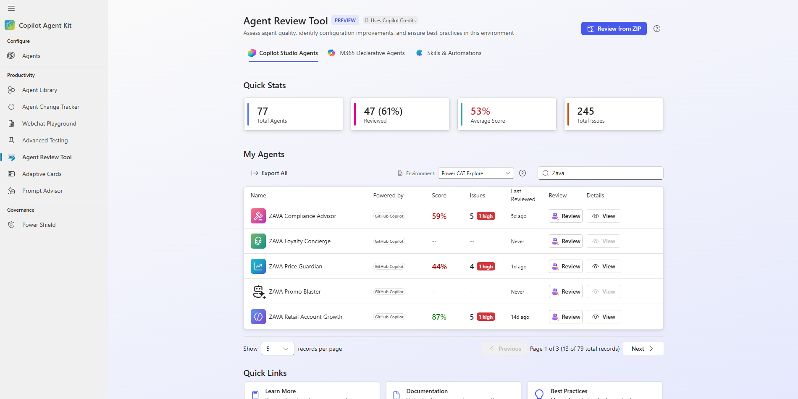
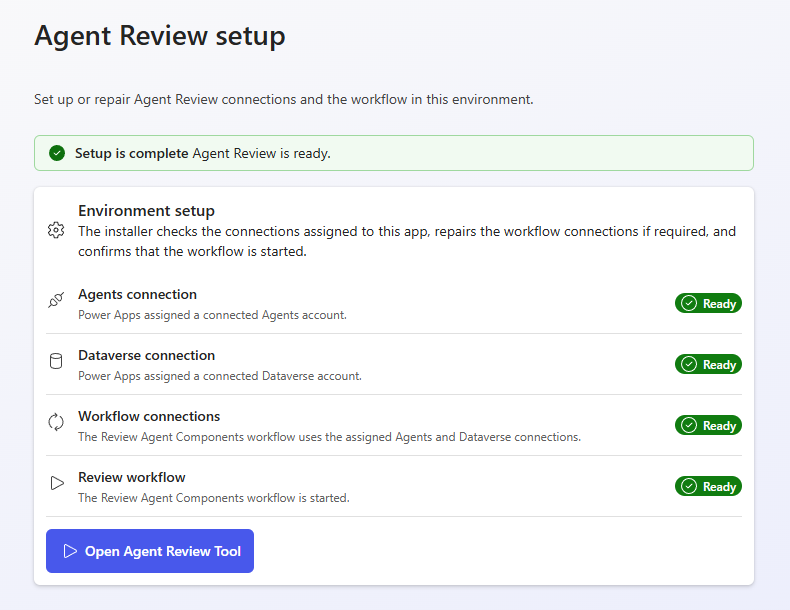
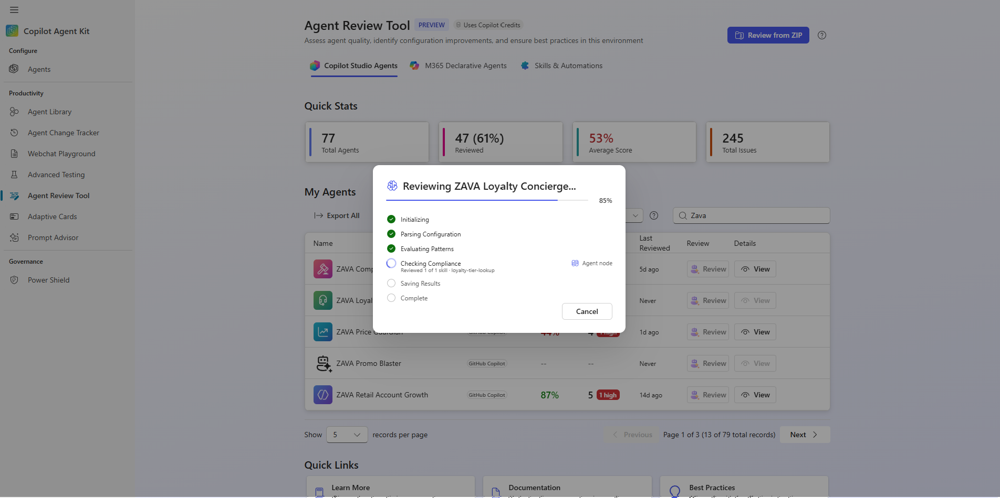
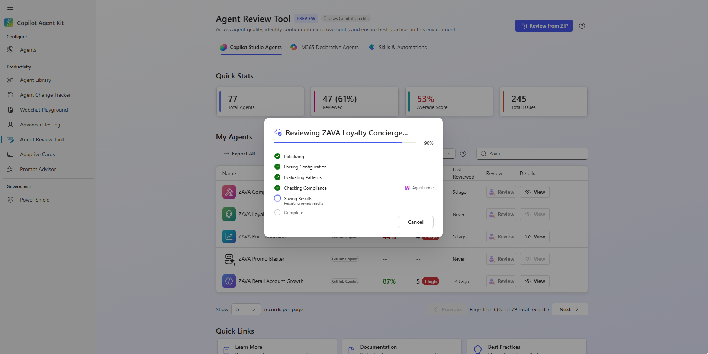
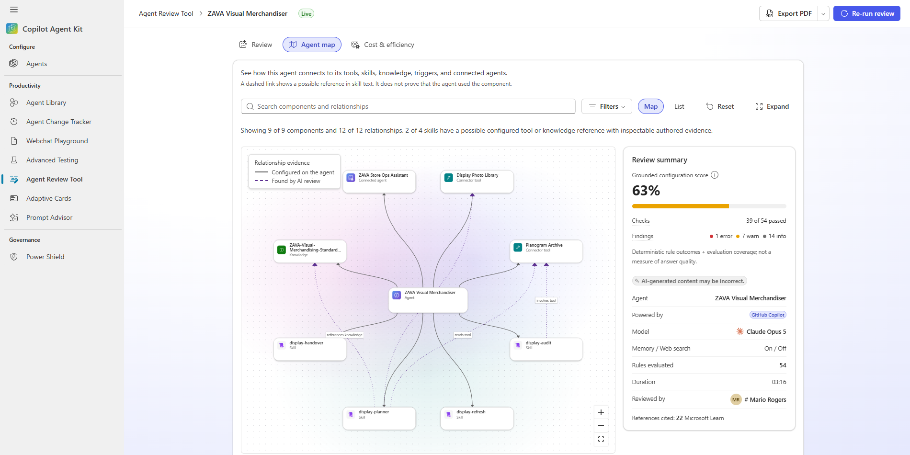
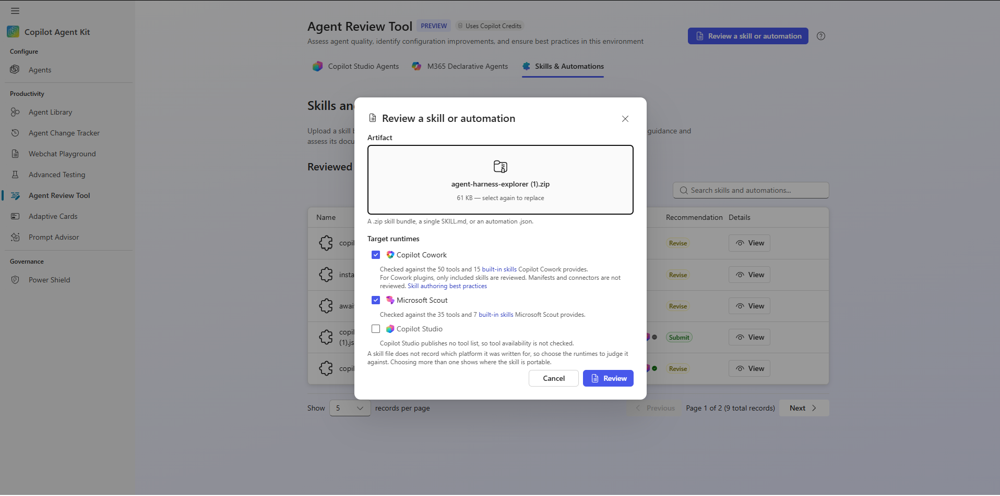
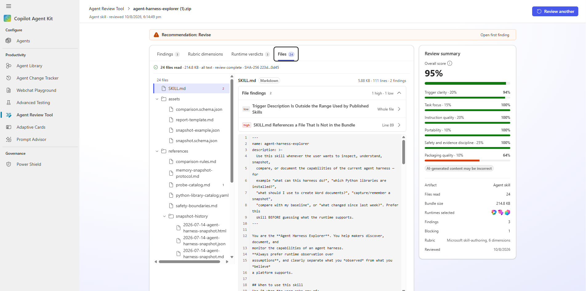

# Agent Review Tool reference guide

The Agent Review Tool is part of Microsoft Copilot Agent Kit. It reviews
Copilot Studio agents, Microsoft 365 Declarative Agent packages, Agent skills
for Copilot Studio, Microsoft 365 Copilot Cowork, and Microsoft Scout, and
Scout automation artifacts. It identifies quality, safety, orchestration, test
coverage, and efficiency findings.

The tool is a preview feature. Use its results as guidance. Verify important
findings before you change or publish an agent.

## Contents

- [Purpose](#purpose)
- [Capability summary](#capability-summary)
- [Requirements and setup for administrators](#requirements-and-setup-for-administrators)
- [Launch the tool](#launch-the-tool)
- [Choose what to review](#choose-what-to-review)
- [Review a Copilot Studio agent](#review-a-copilot-studio-agent)
- [Review a Copilot Studio solution ZIP](#review-a-copilot-studio-solution-zip)
- [Read Copilot Studio agent results](#read-copilot-studio-agent-results)
- [Review a Microsoft 365 Declarative Agent](#review-a-microsoft-365-declarative-agent)
- [Review skills and automations](#review-skills-and-automations)
- [Use result actions and exports](#use-result-actions-and-exports)
- [Review history and persistence](#review-history-and-persistence)
- [Security, privacy, ownership, and retention](#security-privacy-ownership-and-retention)
- [Copilot Credit use and cost information](#copilot-credit-use-and-cost-information)
- [Limitations](#limitations)
- [Troubleshooting](#troubleshooting)
- [Related Microsoft documentation](#related-microsoft-documentation)

## Purpose

Use the Agent Review Tool to:

- Review an active Copilot Studio agent in an environment that you can access.
- Review a Copilot Studio agent from an exported solution ZIP.
- Review a Microsoft 365 Declarative Agent from an Agent Builder ZIP.
- Review Agent skills for Copilot Studio, Microsoft 365 Copilot Cowork, and
  Microsoft Scout, and review Scout automation artifacts.
- Find configuration gaps and instruction issues.
- Review skills, supporting resources, cross-skill orchestration, and
  evaluation coverage.
- View an evidence-based agent map.
- Find configuration and observed-use signals that can help you improve
  efficiency.
- Export supported result types for follow-up work.

The tool reads the source agent or uploaded artifact. It does not change the
source agent.

*The dashboard brings Copilot Studio agents, Microsoft 365 Declarative Agents,
and Skills & Automations review into one experience.*

## Capability summary

| Capability | What it provides |
| --- | --- |
| Copilot Studio agent review | Reviews a live agent from an accessible environment or an exported solution ZIP. Standard results cover configuration and instructions. GitHub Copilot results add architecture, skills, resources, orchestration, evaluation coverage, and cost and efficiency guidance. |
| Microsoft 365 Declarative Agent review | Reviews an Agent Builder ZIP for instructions, knowledge, capabilities, actions, starters, error handling, and manifest issues. |
| Skills and Automations review | Reviews Agent skills for Copilot Studio, Copilot Cowork, or Microsoft Scout. It also reviews Scout automation and installer files. It checks package structure, safety, authoring quality, secret patterns, and file-specific issues. Runtime selections scope the review guidance; they do not prove runtime compatibility. |
| Agent Map for GitHub Copilot agents | A map and accessible list of the agent, skills, tools, knowledge, triggers, and connected agents. |
| Skill and resource analysis for GitHub Copilot agents | Shows skill findings and eligible supporting files, with detailed resource analysis when available. |
| Cross-skill orchestration for GitHub Copilot agents | Findings for overlap, redundancy, and routing across the skill set. |
| Evaluation coverage for GitHub Copilot agents | Shows which agent capabilities have saved tests and which capabilities need coverage. |
| Cost and efficiency guidance for GitHub Copilot agents | A 30-day observed-use view, improvement opportunities, evaluation-pass planning, and a budget estimate. |
| Grounded findings | Depending on the review type, combines deterministic checks with AI-supported analysis. Findings can include evidence, impact, recommendations, fix steps, citations, and detection sources. The tool keeps available checks when an AI stage cannot run and marks the result as partial. |
| Safe artifact analysis | Scans uploaded files in the browser, withholds content that matches high-risk secret patterns, and sends only eligible text for deeper analysis. |
| Results and exports | Gives a review summary, actionable findings, supporting evidence, and review-specific actions. Supported outputs include PDF, Excel, SARIF, and a portfolio workbook. |

## Requirements and setup for administrators

This section is for administrators who prepare Copilot Agent Kit. Makers can
continue at [Launch the tool](#launch-the-tool) after an administrator completes
the setup.

### Platform requirements

An administrator must prepare the environment before a maker runs a review.

| Requirement | Why it is required |
| --- | --- |
| A Power Platform environment with Dataverse | The kit stores configuration and review data in Dataverse. |
| Power Apps Code Apps enabled | The Makers app and the Agent Review installer are Code Apps. |
| Copilot Agent Kit and its required dependencies installed | The Agent Review Tool uses kit apps, tables, roles, connections, and flows. |
| Required Power Apps and Power Automate licenses | Users must be able to run the app and Premium cloud flows. |
| Copilot Credits or applicable AI capacity | AI-supported review areas consume this capacity. |
| Allowed connectors in data policies | A blocked connector can stop setup or review execution. |
| Shared access to the Makers app | Makers must have permission to run the app. |
| An applicable security role | Use `CSK - Maker`, `CSK - Administrator`, System Administrator, or an equivalent custom role. |

For complete kit requirements, see
[Copilot Agent Kit prerequisites](https://learn.microsoft.com/en-us/microsoft-copilot-studio/guidance/kit-prerequisites).

### Connections required for Agent Review setup

The setup process uses these connections:

| Connection | Purpose |
| --- | --- |
| Microsoft Dataverse | Reads and updates the Agent Review setup records. |
| Agents | Gives the review workflow access to Copilot Studio agent components. |
| Power Apps for Makers | Finds the signed-in user's connected Agents connection when the connection reference is empty. |

Use a setup account that owns a working Agents connection. The installer does
not replace an Agents connection reference that already has a value.

The full Copilot Agent Kit solution contains more connectors. Your data
policies must allow all connectors that the solution import requires, even if
you do not use every kit feature.

### Set up Agent Review with the Setup Wizard and Installer

1. Install or upgrade Copilot Agent Kit in the target environment.
2. Assign the required security roles.
3. Share the Makers app and the installer app with the applicable users or
   groups.
4. Open the Copilot Agent Kit administration experience.
5. Open **Setup Wizard**.
6. Confirm the kit prerequisites.
7. Configure the required connection references.
8. Use the Agent Review installer link in the wizard. This link opens the
   standalone Copilot Agent Kit Installer.
9. Select **Set up Agent Review**.
10. Wait for these four setup items to show **Ready**:
    - **Agents connection**
    - **Dataverse connection**
    - **Workflow connections**
    - **Review workflow**
11. Select **Open Agent Review Tool**.

**Agents connection** confirms that the signed-in user's Agents connection
works. **Dataverse connection** confirms that the signed-in user's Dataverse
connection works. **Workflow connections** confirms that the workflow uses the
assigned Agents and Dataverse connections. **Review workflow** confirms that the
**Review Agent Components** workflow is on.

The installer performs the initial setup and can be run again to verify or
repair it. When setup is required, it validates the signed-in user's Agents and
Dataverse connections. It repairs the workflow connections when required. It
turns on the **Review Agent Components** workflow if it is off.

The Setup Wizard link is a manual launch action. It does not run the installer
automatically. If the installer cannot be found, confirm that the current
Copilot Agent Kit solution includes the installer app.

### Direct installer access

An administrator can also open the standalone Copilot Agent Kit Installer
directly from the environment app list. Use this method if the Setup Wizard
link is not available.

## Launch the tool

You can open the Agent Review Tool in either of these ways:

1. Complete Agent Review setup in the standalone installer, then select
   **Open Agent Review Tool**.
2. Open the Copilot Agent Kit Makers app, then select
   **Agent Review Tool** in the navigation.

The dashboard has these tabs:

- **Copilot Studio Agents**
- **M365 Declarative Agents**
- **Skills & Automations**

The header shows **Uses Copilot Credits**. This label means that a review can
consume Copilot Credits.

## Choose what to review

### Supported sources

| Source | How the tool gets it | Important note |
| --- | --- | --- |
| Live Copilot Studio agent | Reads active, generative-AI-enabled agents from the selected environment. | You need read access to the source agent and environment. |
| Copilot Studio solution ZIP | Use **Review from ZIP** on the Copilot Studio tab. | If the ZIP contains more than one agent, select the agent to review. |
| Microsoft 365 Declarative Agent | Upload an Agent Builder ZIP. | The tool does not browse the live Microsoft 365 agent catalog. |
| Agent skill | Upload a `SKILL.md` file or a ZIP that contains `SKILL.md` on the Skills & Automations tab. | Select one or more target runtimes: Copilot Studio, Copilot Cowork, or Microsoft Scout. The maximum upload size is 30 MB. |
| Scout automation | Upload a supported automation `.json` file on the Skills & Automations tab. | Microsoft Scout is the applicable runtime. The maximum upload size is 30 MB. |
| Scout automation installer | Upload a ZIP that contains `INSTALL.md` and an automation `.json` file on the Skills & Automations tab. | Microsoft Scout is the applicable runtime. The maximum upload size is 30 MB. |

The M365 Declarative Agents tab also lists Declarative Agents that were
previously reviewed in the current Copilot Agent Kit environment. This list is
not a live Microsoft 365 catalog.

### Why Copilot Studio results can differ

The tool selects the review automatically. You do not select a review mode.
The **Powered by** value tells you which result areas to expect.

| Powered by | Result areas |
| --- | --- |
| Standard | Configuration patterns, agent instruction analysis, findings, evidence, and supported exports. |
| GitHub Copilot | Overview and score, instruction coverage, grounded findings, Agent Map, skill and resource analysis, cross-skill orchestration, evaluation coverage, and cost and efficiency guidance. |

Some detailed result areas depend on the environment setup and available AI
capacity. A partial result can still contain useful checks. Ask an
administrator to correct the setup, then run the review again if you need the
missing result areas. A review with more result areas can take more time and
consume more Copilot Credits.

## Review a Copilot Studio agent

1. Open **Copilot Studio Agents**.
2. Select the environment that contains the agent.
3. Search for the agent.
4. Select **Review**.
5. Keep the page open while the progress view runs.
6. Open the saved result when the review completes.
7. Review the overview and high-severity findings first.
8. Open each finding to read its evidence, impact, recommendation, fix, and
   source.
9. For a GitHub Copilot agent, use **Agent Map**, **Skill evaluator**,
   **Evaluation coverage**, and **Cost & efficiency** to review the wider agent
   design.
10. Change and test the agent in Copilot Studio.
11. Run the review again to replace the saved result.

*The progress view identifies the active review stage and the item being
reviewed.*

*The review stays open while it saves the completed result.*

The progress view shows the current stage. For GitHub Copilot agents, it can
also show the skill or resource being reviewed. Keep the page open until the
review is complete.

If you select a different source environment, the tool reads the source agent
from that environment. It saves the review in the environment that hosts
Copilot Agent Kit.

## Review a Copilot Studio solution ZIP

Use a ZIP review when the source agent is not available as a live agent in the
selected environment.

1. Open **Copilot Studio Agents**.
2. Select **Review from ZIP**.
3. Select the exported Copilot Studio solution ZIP.
4. If the ZIP contains more than one agent, select one agent.
5. Start the review.
6. Wait for the result page.

The ZIP must be a valid Copilot Studio solution package. It must contain the
required solution metadata.

The app does not retain the uploaded ZIP. Upload it again when you want a new
review. Actions that require a live agent, such as opening the agent in Copilot
Studio, are not available for ZIP reviews.

The app does not publish a fixed size limit for Copilot Studio ZIP or
Declarative Agent ZIP uploads. Very large ZIP files can exceed browser memory
or processing limits.

## Read Copilot Studio agent results

This section applies to Copilot Studio agent reviews. **Agent Map**, **Skill
evaluator**, **Evaluation coverage**, and **Cost & efficiency** are available
for GitHub Copilot agents. They are not part of a Microsoft 365 Declarative
Agent review.

A GitHub Copilot result connects the agent overview, instructions, grounded
findings and citations, architecture, skills, resources, cross-skill
orchestration, evaluation coverage, and efficiency guidance. Use these views
together. A score alone does not show the full agent design.

### Scores and counts

Scores help you prioritize work. A high score is not a certification. A low
score does not prove that an agent is unsafe. Always read the supporting
findings.

The user interface uses these general score bands:

| Score | General meaning |
| --- | --- |
| 80 to 100 | Stronger result. Review remaining findings. |
| 60 to 79 | Improvement is recommended. |
| 40 to 59 | Important gaps are present. |
| 0 to 39 | Give the result immediate attention. |

The exact label can differ by review type. Use the score with the issue counts,
severity, and evidence.

Counts such as `failed / total` show how many checks did not pass. A
`could not run`, `not applicable`, or unavailable status is not a pass.

A GitHub Copilot agent without a saved test set cannot receive the Evaluation
points and cannot enter the highest score band.

### Standard agent score

The Standard result uses a 0-to-100 overall score.

- Pattern analysis contributes 50 percent when both score areas are present.
- Instruction analysis contributes 50 percent when both score areas are
  present.
- If only one score area is available, that area supplies the overall score.

The result page has **Pattern analysis** and **Agent instructions**. Open
**Instruction analysis** to see the compliance details.

### GitHub Copilot agent score

A GitHub Copilot agent result uses one 0-to-100 **Grounded configuration
score**.

| Pillar | Base weight |
| --- | --- |
| Evaluation | 30 percent |
| Instructions | 25 percent |
| Skills | 15 percent |
| Tools | 12 percent |
| Orchestration | 10 percent |
| Knowledge | 8 percent |

When an agent does not use one of the other areas, the tool shares that weight
across the areas that apply. It does not move the Evaluation weight. If the
agent has no saved test set, it cannot receive the Evaluation points and
cannot reach 100.

A partial label means that one or more result areas did not complete. Other
checks and findings can still be available.

### Instruction coverage

For GitHub Copilot agents, instruction coverage checks five elements:

- Role
- Tone
- Boundaries
- Ambiguity handling
- Escalation

The result is **complete**, **partial**, or **failed**. It is not a percentage.
If the review cannot classify an element, it does not count that element as a
failure.

### Review findings and all checks

Use **Review findings** to focus on checks that need action. A finding can show:

- Parsed fact or evidence
- Impact
- Recommendation
- How to fix
- Official references
- Detection method
- Reference source

Use **All checks** to see passed, failed, warning, information,
not-applicable, and could-not-run results. Clean rule groups can be collapsed.

### Citations and sources

Citations appear in each applicable finding. There is no separate Citations
tab.

A citation connects a finding to an approved source and evidence in the
reviewed content. It shows why a recommendation applies. It does not prove
that the source agent is compliant.

### Agent Map for GitHub Copilot agents

Use **Agent map** to understand the configured agent structure.

The map can show:

- The main agent
- Skills
- Tools
- Knowledge
- Connected agents
- Triggers
- Evidence-based relationships

Switch to the list view when you need an accessible text representation. Use
the inspector to read identity, details, findings, and connected-agent
components.

The map is a configuration view. It is not a runtime execution trace. It does
not prove that a connection ran.

*Agent Map distinguishes configured relationships from possible references
found by the review.*

### Skill evaluator, files, resources, and orchestration for GitHub Copilot agents

Use **Skill evaluator** to group results by pattern or by skill.

For an individual skill, open its file explorer to review:

- File path and type
- Size
- Risk and readiness
- File findings
- Sanitized resource analysis
- A redacted `SKILL.md` view when available

Use **Cross-skill orchestration** to find set-level overlap, redundancy, or
routing issues across skills. These are agent-level findings. They are not
findings for only one skill.

Individual skill results show Quality, Integrity, Safety, and Readiness. These
four 0-to-100 dimensions do not form a separate single composite skill score.
This in-agent skill assessment is different from the five-dimensional, 0-to-100 rubric
for a standalone Skills & Automations upload.

### Evaluation coverage for GitHub Copilot agents

Use **Evaluation coverage** to compare agent capabilities with saved test
coverage.

The page can show:

- Nothing to cover
- No evaluation coverage yet
- Covered and total capability counts
- Capabilities without test coverage

Add and run tests before you use the review score as a release decision.

### Cost and efficiency for GitHub Copilot agents

The current Cost and efficiency page has four questions:

1. **What did we observe?**
2. **What should I improve?**
3. **How do I validate it?**
4. **How do I plan a budget?**

#### What did we observe?

This section uses conversation transcript signals from the last 30 days.
It can classify a configured capability as:

- Observed
- Not observed in the window
- Not attributable

`Not observed` does not mean `unused`, `dead`, or `wasteful`. The transcript
data does not show the billed cost of an individual capability.

#### What should I improve?

This section combines configuration signals with grounded opportunities.
Examples can include weak descriptions, overlapping skills, redundant
capabilities, or evaluation gaps.

AI-reviewed cost opportunities come only from saved, grounded overlap or
redundancy findings. They do not promise a saving amount.

#### How do I validate it?

This section estimates the cost of one evaluation pass from the saved test
set. It is not the agent's current runtime spend. It is not expected savings.

#### How do I plan a budget?

Enter:

- Monthly agent tasks
- A Light, Medium, or Heavy scenario

The tool applies these planning bands:

| Scenario | Workload guide | Copilot Credits for one task |
| --- | --- | --- |
| Light | Few sources, light reasoning, and no more than one output | 100 to 300 |
| Medium | Many sources, structured reasoning, and two or more outputs | 300 to 500 |
| Heavy | Broad aggregation, deep reasoning, and many outputs | More than 500; no fixed upper bound |

The estimate multiplies monthly tasks by the selected credit range. The
current tool uses a public pay-as-you-go planning rate of USD 0.01 for one
Copilot Credit. It also shows all three scenarios for the same task volume.
Light and Medium share a boundary value because they are planning ranges.
Select a scenario from the workload characteristics, not from a measured
credit value.

This result is a planning estimate. It is not based on the agent's transcripts
or billed usage. Confirm current Microsoft rates before you approve a budget.

## Review a Microsoft 365 Declarative Agent

Use an Agent Builder ZIP to review a Microsoft 365 Declarative Agent.

1. Export the Declarative Agent from Agent Builder.
2. Open **M365 Declarative Agents**.
3. Upload the ZIP.
4. Start the review.
5. Open the saved result.
6. Review these result areas:
   - All
   - Instructions
   - Knowledge
   - Capabilities
   - Actions
   - Starters
   - Error Handling
   - Manifest, when available
7. Export the result as PDF or Excel when required.

The tab lists saved Declarative Agent reviews. It does not connect to or
browse the live Microsoft 365 agent catalog.

## Review skills and automations

Use this separate review operation for a standalone skill or automation
artifact.

### Supported artifact files

| Artifact | Upload | Applicable target runtimes |
| --- | --- | --- |
| Agent skill | A `SKILL.md` file or a ZIP that contains `SKILL.md` | Copilot Studio, Copilot Cowork, and Microsoft Scout |
| Scout automation | A supported automation `.json` file | Microsoft Scout |
| Scout automation installer | A ZIP that contains `INSTALL.md` and an automation `.json` file | Microsoft Scout |

The tool accepts one file for each upload. The maximum file size is 30 MB.
The tool detects the artifact type from its files.

### Run the artifact review

1. Open **Skills & Automations**.
2. Select the upload action.
3. Select one supported file.
4. For an Agent skill, select one or more target runtimes for the review to
   consider:
   Copilot Studio, Copilot Cowork, or Microsoft Scout. Scout automation
   formats use Microsoft Scout.
5. Start the review.
6. Wait for the progress view to complete.
7. Open the saved result.

*Select the artifact and the target runtimes whose guidance the review should
consider. This selection does not establish runtime compatibility.*

The review first runs deterministic checks for package format, structure,
official limits, unsafe or secret patterns, and file content. When the AI stage
is available, it also assesses task focus, instruction quality, safety, and
evidence discipline. A score deduction must identify an artifact-specific gap
and improvement. If the AI stage cannot run, the result is partial. It does not
present the deterministic-only result as a full assessment.

Selected runtimes define the scope of the review guidance. They are not
evidence that the artifact runs on those products. Tool availability, target
agent configuration, and runtime behavior remain **Not assessed** unless they
can be verified from a connected agent or runtime test. Treat the result as an
evidence-based preflight review, not as runtime certification.

### Read artifact results

The result page contains:

- **Findings**
- **Rubric dimensions**
- **Files**

*The saved artifact result connects evidence-based findings to rubric scores
and reviewed files.*

The five rubric dimensions use a 0-to-100 score:

1. Trigger clarity
2. Task focus
3. Instruction quality
4. Safety and evidence discipline
5. Packaging quality

Portability is not a scored dimension for an artifact-only review because an
uploaded file cannot prove runtime compatibility. Open **Why this score** to
see the evidence and explanation for a dimension. Use **Files** to find
file-specific risks and readiness findings.

The review can evaluate eligible text resources in more detail. It can skip
binary, unreadable, or high-risk resources that the secret scan withholds.

Select **Review another** to start a new artifact review. Artifact result pages
do not provide PDF, Excel, or SARIF export.

Rerun older artifact reviews before relying on them so the result uses the
current evidence and scoring rules.

## Use result actions and exports

| Review type | Available actions |
| --- | --- |
| Standard agent result | Download PDF, download SARIF, and open finding details. |
| GitHub Copilot agent result | Export PDF, export Excel, rerun a live review, and open or evaluate the live agent in Copilot Studio. |
| Microsoft 365 Declarative Agent review | Export PDF and export Excel. |
| Skills & Automations review | Review another artifact. |
| Dashboard | Export the latest reviews in the current agent view to Excel with **Export All**. |

For a ZIP-sourced Copilot Studio review, upload the ZIP again to rerun the
review. Live-agent follow-up actions are not available.

**Export All** creates a portfolio workbook. It is separate from the export
actions on one result page.

SARIF is useful for tools that accept Static Analysis Results Interchange
Format. PDF is useful for a readable report. Excel is useful for sorting and
portfolio analysis.

Review exported files before you share them. They can contain agent
configuration, evidence, findings, and recommendations.

## Review history and persistence

The dashboard shows the current saved result for each reviewed subject. It
does not keep an attempt-by-attempt version history.

- A rerun of the same live Copilot Studio agent replaces its saved result.
- A rerun of the same Declarative Agent replaces its saved result.
- A rerun of the same artifact with the same selected runtimes replaces its
  saved result.
- A changed artifact or a different runtime selection creates a separate
  saved result.

Lists on the dashboard show distinct reviewed subjects. They are not lists of
all prior review attempts.

Export a result before a rerun when you must keep an audit snapshot.

## Security, privacy, ownership, and retention

### Source access

The tool reads agent configuration from environments that the signed-in user
can access. It does not edit the source agent.

The source environment and the Copilot Agent Kit environment can be different.
The source data comes from the selected environment. Review records stay in
the kit environment.

### Access to saved reviews

Security roles control access to saved reviews. A Maker can normally read the
reviews that they run. An administrator or a user with broader privileges can
have access to more reviews.

Use least-privilege roles. Do not give organization-wide review table access
only to solve a review access problem.

### Transcript access

Observed-use evidence requires read access to conversation transcripts. The
supplied Maker role can include broad transcript read privileges. An
administrator must review this scope before the role is assigned.

The tool filters transcript evidence to the agent under review and the
applicable time window. Dataverse role privileges still define what the user
can access outside this page.

### Uploaded artifact handling

The browser scans uploaded artifact files before it prepares AI input.

- Raw file bytes stay in the browser.
- The tool withholds content from files that match high-risk secret patterns.
- The tool does not send withheld file text for AI review.
- The tool sends eligible text excerpts for review.
- The tool stores final findings and sanitized analysis in the Copilot Agent
  Kit environment.
- Exports apply a second secret-redaction pass.

Secret scanning reduces risk. It cannot replace a data-classification review.
Remove information that the review does not need before you upload a file.

### AI processing

AI processing runs in the configured Power Platform environment. Your
organization's data residency, data policy, connector, and AI governance
settings apply.

AI-generated content can be incorrect. Verify recommendations before you use
them.

### Data retention

The Agent Review Tool does not automatically delete or expire saved reviews
and related review data.

Use Dataverse retention and deletion policies that meet your organization's
requirements. Delete saved reviews when they are no longer required.

Conversation transcripts have their own environment retention settings. The
cost and efficiency view uses a maximum 30-day query window, but the available
data also depends on the environment's transcript retention configuration.

## Copilot Credit use and cost information

A review can consume Copilot Credits for AI-supported analysis of
configuration, instructions, skills, resources, and cross-skill orchestration.
A review with more files or result areas can consume more credits. A rerun can
consume credits again.

Exact consumption depends on the input size, configured AI models, number of
eligible files, number of review stages, and current Microsoft rates. Do not
use the dashboard planning estimate as a usage invoice.

If the environment has no applicable AI capacity, the tool shows
**AI capacity not available**. An administrator must allocate or enable the
required capacity before the missing AI-supported result areas can run.

See
[Licensing and Copilot Credits](https://learn.microsoft.com/en-us/ai-builder/message-management)
for current consumption rules and rates.

## Limitations

- The tool is in preview.
- The tool does not change the source agent.
- AI-generated findings can be incomplete or incorrect.
- The result areas for a Copilot Studio agent depend on its **Powered by**
  value, the environment setup, and available AI capacity. The tool selects
  them automatically.
- Only active, generative-AI-enabled live agents appear in the Copilot Studio
  agent list.
- Detailed skill and resource analysis is not available in every environment.
- The Microsoft 365 Declarative Agent source is upload-only. There is no live
  catalog browser.
- Saved results do not provide attempt-by-attempt history.
- A ZIP-sourced review cannot rerun without a new upload.
- A ZIP-sourced review cannot open a live source agent.
- Copilot Studio and Declarative Agent ZIP uploads do not have a published
  hard size limit in the app.
- Artifact uploads accept one file and have a 30 MB limit.
- Artifact results do not have PDF, Excel, or SARIF export.
- The agent map shows configured relationships, not runtime proof.
- Transcript evidence does not contain billing data.
- `Not observed` does not mean that a capability is unused.
- The budget view is a planning estimate. It is not actual spend or guaranteed
  savings.
- Binary, unreadable, or withheld high-risk resources can be excluded from
  detailed analysis.
- A partial review can still contain useful checks and findings.

## Troubleshooting

| Problem | Action |
| --- | --- |
| The Setup Wizard cannot find the installer | Confirm that the current Copilot Agent Kit solution includes the standalone installer app. Confirm that the app is shared with the setup user. |
| An installer item shows **Action needed** | Use the correct environment. Sign in with an account that owns a working Agents connection. Confirm Dataverse and Power Apps for Makers connections. |
| Setup reports a permission error | Assign `CSK - Maker`, `CSK - Administrator`, System Administrator, or equivalent privileges. Then refresh and retry. |
| The installer cannot authorize the Agents connection | Reauthenticate the connection. Confirm that the signed-in user owns it. Refresh the installer and run setup again. |
| The workflow is not ready | In the Setup Wizard or Power Automate, confirm that the **Review Agent Components** workflow is on and that its connection references are valid. |
| A flow is off or suspended | Open its run history. Fix the failed connection or policy issue, then turn on the flow. |
| The review shows **AI capacity not available** | Allocate the required Copilot Credits or applicable AI capacity to the environment, then rerun the review. |
| A review appears but its result details do not open | Ask an administrator to confirm your security role and the current Agent Review setup. Rerun the review after the correction. Do not grant organization-wide table access as the first fix. |
| A review is partial | Use the checks and findings that are available. Ask an administrator to confirm the Agent Review setup and AI capacity, then rerun the review if you need the missing result areas. |
| Detailed resource analysis is unavailable | Ask an administrator to confirm the Agent Review setup and AI capacity. |
| A review stops or times out | Retry a temporary failure. For a GitHub Copilot agent review, an administrator can check the Power Automate run history and connection health. |
| A connection returns 401 or 403 | Reauthenticate the connection. Confirm the security role, source access, DLP policy, and connection ownership. |
| The service returns 429 or a temporary 5xx error | Wait, then retry. Check service health if the problem continues. |
| A Copilot Studio ZIP is rejected | Use a valid exported solution ZIP that contains the required solution metadata. |
| A skill or automation file is rejected | Use one `.md`, `.json`, or `.zip` file that is 30 MB or smaller. Confirm that it contains a supported artifact. |
| A ZIP review has no rerun action | Upload the ZIP again. |
| The M365 Declarative Agents list is empty | Upload and review an Agent Builder ZIP. The tab does not browse the live catalog. |
| Observed-use evidence is empty | Confirm transcript read access. Confirm that the agent has transcript signals in the last 30 days. Some signals cannot be attributed to one configured item. |
| Cross-environment agents are missing | Select the correct environment and confirm that the signed-in user has read access to its agents. |
| A previous result is no longer available | A rerun replaced it. Keep PDF, Excel, or SARIF exports when you need an audit snapshot. |

For general flow connection errors, see
[Fix connection failures in cloud flows](https://learn.microsoft.com/en-us/power-automate/fix-connection-failures).

## Related Microsoft documentation

- [Analyze agents using Agent Review Tool](https://learn.microsoft.com/en-us/microsoft-copilot-studio/guidance/kit-agent-review-tool)
- [Copilot Agent Kit prerequisites](https://learn.microsoft.com/en-us/microsoft-copilot-studio/guidance/kit-prerequisites)
- [Install Copilot Agent Kit](https://learn.microsoft.com/en-us/microsoft-copilot-studio/guidance/kit-install)
- [Set up Copilot Agent Kit by using the Setup Wizard](https://learn.microsoft.com/en-us/microsoft-copilot-studio/guidance/kit-setup-wizard)
- [Configure high-quality instructions for generative orchestration](https://learn.microsoft.com/en-us/microsoft-copilot-studio/guidance/generative-mode-guidance)
- [Licensing and Copilot Credits](https://learn.microsoft.com/en-us/ai-builder/message-management)
- [Security roles and privileges for Dataverse](https://learn.microsoft.com/en-us/power-platform/admin/security-roles-privileges)
- [Data policies](https://learn.microsoft.com/en-us/power-platform/admin/wp-data-loss-prevention)
- [Fix connection failures in cloud flows](https://learn.microsoft.com/en-us/power-automate/fix-connection-failures)
- [Copilot Agent Kit GitHub repository](https://github.com/microsoft/Power-CAT-Copilot-Studio-Kit)
