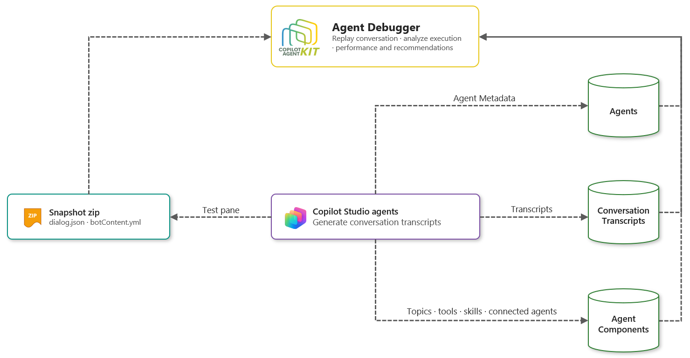
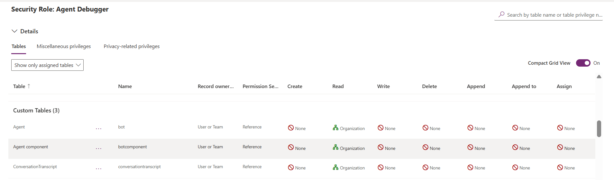
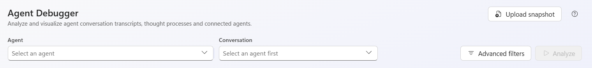

# Agent Debugger

The **Agent Debugger** is a diagnostic tool in the **Copilot Agent Kit Admin** app. Use it to load a recorded conversation and inspect every decision the agent made, step by step. For each step you can see timing, token usage, knowledge sources, arguments, and observations.

---

## Table of Contents

1. [Overview](#overview)
2. [Architecture](#architecture)
3. [Prerequisites](#prerequisites)
   - [Kit access](#1-kit-access)
   - [Signed-in user permissions in the target environment](#2-signed-in-user-permissions-in-the-target-environment)
   - [Optional: custom "Agent Debugger" security role](#3-optional-custom-agent-debugger-security-role)
4. [Getting Started — Command Bar](#getting-started--command-bar)
   - [Agent](#agent)
   - [Conversation](#conversation)
   - [Session](#session)
   - [Advanced Filters](#advanced-filters)
   - [Upload Snapshot Mode](#upload-snapshot-mode)
   - [Deep Links](#deep-links)
5. [Analysis View](#analysis-view)
   - [Performance Timeline](#performance-timeline)
   - [Execution Flow](#execution-flow)
   - [Conversation & Activities](#conversation--activities)
   - [Agent Insights](#agent-insights)
   - [Recommendations](#recommendations)
   - [Raw JSON](#raw-json)
6. [Troubleshooting](#troubleshooting)

---

## Overview

The Agent Debugger supports two data sources:

- **Conversation Transcript (Dataverse)**: When a conversation takes place in Copilot Studio, the platform records a detailed activity log as a Conversation Transcript in Dataverse. The Agent Debugger reads those records **directly from each environment, using the signed-in user's identity**. Any agent you can read that has transcript data shows up right away.
- **Copilot Studio Snapshot (ZIP)**: The Copilot Studio **test pane** has a **Download snapshot** button. It exports the current test conversation as a ZIP file that contains `dialog.json` and `botContent.yml`. Upload that ZIP to the Agent Debugger to get the full analysis view without a Dataverse connection. Snapshots are useful when you need to:
  - Debug conversations before an agent goes to production.
  - Reproduce issues offline.
  - Share a failing session with a colleague.

Both data sources lead to the same analysis interface.

**What it shows:**

| Area | What you learn |
|---|---|
| Performance timeline | How long each step took in each turn and session. Use it to spot slow steps, idle time, and latency bottlenecks. |
| Execution flow | Which topics, actions, knowledge searches, code steps, and connected agents ran, and in what order. Shown as a visual flow canvas for each turn. |
| Conversation & activities | The full chat exchange next to a step canvas for the selected turn. Includes step-level detail: thought, inputs, outputs, tokens, knowledge sources, and errors. |
| Agent insights | Summary metrics (sessions, turns, outcome, duration, start time, channel), agent configuration, recommendations, session runtime, time by step type, tools used, and user feedback. |
| Raw JSON | The full raw transcript activities as searchable, syntax-highlighted JSON. |

**Key capabilities:**

- **Multi-session conversations.** A conversation is split into sessions when the user goes idle and reconnects. You can focus the analysis on a single session.
- **Advanced filters.** Filter by time range, channel, session outcome, session type, locale, step types, errors, slow steps, and number of turns.
- **Multi-agent conversations.** Connected and child agents are detected automatically, and their transcripts are loaded.
- **Step arguments and observations.** See exactly what inputs went to every action, tool, or knowledge source, and what each one returned.
- **Knowledge sources.** See what was searched, what was returned, and what was cited.
- **AI reasoning.** See the orchestrator's thought process before each step.
- **Flow run links.** Jump from a flow step to the matching Power Automate run.
- **Test-pane conversations offline.** Upload a Copilot Studio snapshot ZIP.
- **Support tickets.** Copy or download any JSON to attach to a support ticket or bug report.

---

## Architecture

---

## Prerequisites

> **Agent Inventory is no longer required.** Earlier versions of the Agent Debugger listed agents from the Agent Inventory and needed the **Is Transcript Available** flag to be set by an inventory sync. The Agent Debugger now discovers agents and transcripts directly from Dataverse, using the signed-in user's identity. What you see depends entirely on your own Dataverse permissions.

### 1. Kit access

To open Agent Debugger in the Copilot Agent Kit Admin app, the user must have the **CAK - Administrator** or **System Administrator** security role in the environment where the kit is installed.

### 2. Signed-in user permissions in the target environment

The Agent Debugger uses the **signed-in user's** identity to query each environment. There's no shared service account or connection. The user must have **Read** access to the following tables in every environment that contains agents they want to debug:

| Table (display name) | Logical name | Used for |
|---|---|---|
| **Agent** (Bot) | `bot` | Listing agents, agent configuration, languages |
| **Agent component** (Bot Component) | `botcomponent` | Topic, tool, knowledge, and child-agent names and configuration |
| **ConversationTranscript** | `conversationtranscript` | Loading conversations and connected-agent transcripts |
| **Flow Run** *(optional)* | `flowrun` | **Open flow run** links on flow steps |

The **access level** (scope) of these privileges decides **which agents** you see:

| Role setup | What the user sees |
|---|---|
| **Bot Viewer** + **Bot Transcript Viewer** (out-of-the-box roles) | Agents the user **owns** and agents **shared with** the user, plus the conversation transcripts they have access to |
| Custom role with **Organization**-level **Read** on Agent, Agent component, and ConversationTranscript | **All agents** in that environment that have transcripts |

> Only agents that have **at least one conversation transcript** appear in the Agent picker.

### 3. Optional: custom "Agent Debugger" security role

The kit **doesn't ship** a custom security role. If a user needs to debug **all** agents in an environment, not just their own and the ones shared with them, an administrator can create a custom security role in the **target environment**. For example, name it **Agent Debugger** and give it these privileges:

| Table | Create | Read | Write | Delete | Append | Append To | Assign | Share |
|---|---|---|---|---|---|---|---|---|
| **Agent** (Bot) | None | **Organization** | None | None | None | None | None | None |
| **Agent component** (Bot Component) | None | **Organization** | None | None | None | None | None | None |
| **ConversationTranscript** | None | **Organization** | None | None | None | None | None | None |
| **Flow Run** *(optional)* | None | **Organization** | None | None | None | None | None | None |

To create the role:

1. Open the [Power Platform admin center](https://admin.powerplatform.microsoft.com/), then select **Manage** > **Environments** > *your target environment* > **Settings** > **Users + permissions** > **Security roles**.
2. Select **+ New role**, enter a name (for example, **Agent Debugger**), and pick a business unit.
3. Search for each table in the list above and set **Read** to **Organization**.
4. Save the role, and then assign it to the users who need to debug agents in that environment.

For more information, see [Create or edit a security role](https://learn.microsoft.com/power-platform/admin/create-edit-security-role).

> **Cross-environment access:** Agents are discovered from every environment the signed-in user can access. Permissions are evaluated **separately in each environment**. You need the read access described above in each environment where you want to debug agents.

---

## Getting Started — Command Bar

When you open Agent Debugger, the command bar shows the pickers that identify what to analyze. Every other filter is in the **Advanced filters** drawer.

The **Session** picker appears next to **Conversation** after analysis, when the conversation has more than one session. Applied filters appear below the command bar as removable chips.

### Agent

There's no separate Environment dropdown. The **Agent** picker lists agents **grouped by environment**, and picking an agent also selects its environment.

- Agents from the **current environment**, where the kit is installed, load first. That group is labeled **(current)**.
- To load agents from other environments you can access, scroll to the end of the list, select **Load agents from other environments**, or start typing. The debugger then discovers the other environments in the background.
- Type in the search box to filter by **agent name**, **environment name**, or **environment URL**.
- Only agents that are **active** and have **at least one conversation transcript** are listed.
- If an environment can't be read, for example because access is denied, it's skipped. Agents from the other environments still load.

Picking an agent resets the conversation and any analysis that's in progress.

### Conversation

- **Default:** Shows the **50 most recent** unique conversations for the selected agent, within the active time range. Each entry shows the conversation ID and start date.
- **Typing in the box:** Searches Dataverse for conversation IDs that contain your text, across all of the agent's transcripts within the active time range.
- Select the **✕** next to the field to clear the selected conversation.

After you pick a conversation, select **Analyze** to open the analysis view.

### Session

A single conversation can be saved as **several sessions**, for example when the user goes idle and later reconnects. The **Session** picker appears **only after analysis**, and only when the conversation has **more than one session**. The count badge shows how many sessions there are.

- **All sessions** (default): Analyzes the whole conversation. It shows the time span from the first session to the last.
- **Session N**: Focuses the analysis on one session. Each entry shows its start time, session type (for example, Engaged or Unengaged), outcome, and number of turns. If the user was idle before the session started, an **idle {duration}** badge is shown.

Changing the session updates the analysis in place. You don't need to select **Analyze** again.

### Advanced Filters

Select **Advanced filters** to open the filter drawer. Changes are only applied when you select **Apply**. **Reset** clears the drawer back to its defaults, and **Cancel** discards your changes. The button shows a badge with the number of active filters. Applied filters also appear as removable chips below the command bar, along with an option to clear all of them.

Applying filters clears the selected conversation, so you can choose again from the filtered list.

| Section | Options |
|---|---|
| **Time range** | All · Last 30 minutes · Last 1 hour · Last 4 hours · Last 24 hours · Last 7 days · Custom range… (**From** / **To** date and time) |
| **Channel** | All channels · Teams · Web Chat · Direct Line · Test Panel · Autonomous · Published Engine · Copilot Evaluation · M365 Copilot · SharePoint · Mobile · WhatsApp · Unknown |
| **Session outcome** | All outcomes · Resolved · Escalated · Abandoned · No outcome recorded |
| **Session type** | All session types · Engaged · Unengaged |
| **Locale** | All locales, plus the languages configured on the selected agent |
| **Step types** | Only list conversations that contain **all** the selected step types (for example, Topic, Knowledge, Tool, Flow, Connector Action, MCP server, Code, Connected agent) |
| **Conversations** | **At least 2 user turns** · **Error conversations** (contains at least one error) · **Has slow steps (>=10s)** |

For a custom range, you need at least a **From** or **To** date, and **From** must be earlier than **To**.

> **Performance note:** **Time range** is applied on the server. All other filters need the debugger to read and parse transcript content in the browser. To keep that fast, a content scan is limited to about **1,000 transcript records** or **25 seconds**, whichever comes first. If the limit is reached, a **Results are incomplete** warning is shown. Narrow the time range to make sure you see every match.

### Upload Snapshot Mode

Select **Upload snapshot** in the header to analyze a conversation without Dataverse access. Instead of picking a live conversation, you upload a snapshot ZIP file that you downloaded from **Copilot Studio's test pane**. Select **Use transcript** to switch back.

**How to get a snapshot from Copilot Studio:**

1. Open your agent in **Copilot Studio** and go to the **Test** pane.
2. Run a conversation in the test pane, or review an existing one.
3. Select **Download snapshot** on the test pane toolbar.
4. Copilot Studio downloads a `.zip` file that contains:
   - `dialog.json`: All Bot Framework activities for the conversation. **Required.**
   - `botContent.yml`: The agent's component and flow definitions, used to show friendly step names. Optional. If it's missing, raw schema names are shown.

**When to use:**

- Debugging a conversation that happened in the **test pane** before the agent was published.
- Analyzing a conversation from an environment you can't access.
- Reproducing issues offline, or sharing a failing session with a colleague without giving them Dataverse access.

**How to upload:**

1. Select **Upload snapshot** in the Agent Debugger header.
2. Drag the `.zip` file onto the drop zone, or select it to browse for the file.
3. The debugger checks the ZIP, extracts `dialog.json` and `botContent.yml`, and opens the full analysis view.

You don't need to pick an agent, a conversation, or a session. Snapshot analysis doesn't include flow run links or connected-agent transcript loading, because both need live Dataverse data.

### Deep Links

Agent Debugger can be opened with a conversation already loaded by passing these query parameters: `conversationId`, `environmentUrl`, and `agentId` (the `botid`). If a parameter is missing, or no agent you can access matches the link, a message explains what went wrong. You can then pick the agent and conversation yourself.

---

## Analysis View

The analysis view opens after you select **Analyze** or upload a snapshot. It has four tabs: **Performance timeline**, **Execution flow**, **Conversation & activities**, and **Agent insights**.

### Performance Timeline

A **waterfall chart** of step execution times, grouped by conversation turn.

- **Expand all** and **Collapse all** open or close every turn at once. Each turn can also be expanded on its own.
- A **Slowest step** callout shows the slowest step in the conversation, with a **Go to slowest step** button.
- Each turn row shows the user's message, the turn duration, and a count of failed steps. The row's **Execution flow** and **Conversation** buttons take you to that turn in the other tabs.
- Step bars are scaled to the turn's total duration, and the **Failed** and **Slowest** steps are labeled. Connected-agent rows can be expanded to show their child steps. **Idle time** is shown for each turn.
- For multi-session conversations, turns are grouped into **Session N** bands that show the date, outcome, number of turns, and duration. A separator between sessions shows how long the user was idle before reconnecting. Select **Focus** on a band to show only that session, and **Show all sessions** to go back.

### Execution Flow

A read-only **flow canvas** that shows the order in which steps ran, turn by turn.

- Summary statistics: **Steps**, **Agent handoffs** (when there are any), and **Failed** (when there are any). A legend maps colors to step types.
- Each turn header shows the user's message, the turn duration, and an error badge if something failed. **Raw JSON** opens that turn's activities. **Inspect** opens that turn on the **Conversation & activities** tab.
- Connected-agent nodes are expanded to show the child steps they ran.

### Conversation & Activities

This tab has three panes:

1. **Conversation preview**: The full exchange as the user saw it. It includes adaptive cards, attachments, suggested actions, sources, and feedback (likes and dislikes, comments, and ratings). "Turn N" markers show how long each turn took. Select a **user message** to inspect that turn.
2. **Step canvas**: The steps that ran in the selected turn. The first step is selected automatically. Select any step to see its details.
3. **Step details**: Details for the selected step:
   - **Overview**: Type, State (Completed, Running, Failed, Blocked, Cancelled), Duration, Triggered, Finished, and Task dialog ID.
   - **Thought**: The orchestrator's reasoning before it invoked the step.
   - **Inputs / Outputs**: Arguments and observations, shown as expandable JSON with **Copy** and **Expand** actions.
   - **Token Usage**: Prompt, completion, and total tokens.
   - **Knowledge**: Referenced sources, search results, verified results, completion and answer state, and content moderation.
   - **Code**: The Python source and its result.
   - **Intent recognition**: Intent type, score, and normalized utterance.
   - **Error**: Error code, sub code, source, and message. For Responsible AI blocks, the block reason.
   - **Flow run links**: For flow steps, **Open flow run** goes straight to the matching Power Automate run. If several runs match, all of them are listed. **Open flow history** is available too. This needs read access to the `flowrun` table.
   - **Connected agent**: Select **Fetch child transcript**, or **Retry child transcript** if loading failed.

**Step types** include Topic, Knowledge, Tool, Connected agent, Child agent, Custom Prompt, Flow, Connector Action, Skill, MCP server, MCP tool, Code, Deep reasoning, Generative answers, Intent Recognition, Condition branch, Variable assignment, and Error.

### Agent Insights

- **Header**: The agent name, model, orchestration mode, language, and **Open in Copilot Studio**, which opens the agent in the Copilot Studio portal.
- **Metric tiles**:

  | Tile | Description |
  |---|---|
  | **Sessions** | Number of conversation sessions in the selected scope |
  | **Turns** | Total number of message turns |
  | **Outcome** | Final outcome recorded for the conversation (for example, Resolved, Escalated, Abandoned) |
  | **Duration** | Time from the start of the conversation to its recorded end |
  | **Start time** | When the conversation started |
  | **Channel** | Channel the conversation came through |
  | **Failed** | Number of failed steps |
  | **Authentication / Semantic Search / Memory** | Agent settings, shown when available |

- **Recommendations**: See [Recommendations](#recommendations).
- **Sessions & runtime**: One row per session, showing type, implied success, number of turns, and start and end times (UTC). The rows follow the **Session** picker.
- **Time by step type**: Total time and share of time for each step type.
- **Tools & actions used**: How many times each tool ran, and how long it took.
- **User feedback**: Thumbs up and thumbs down with comments, shown next to the user message and the agent's response. Only shown when the conversation has feedback.

### Recommendations

The debugger finds issues in the conversation automatically and shows them as cards on the **Agent insights** tab. Each card has a severity, a category, a description, a **Suggested fix**, and a **Go to turn N** link.

| Severity | Examples |
|---|---|
| **High** | Failed step, tool, or connector error · Content filtered by Responsible AI · No response from the agent after a turn · Conversation escalated · Conversation abandoned · Fallback topic triggered · Connected agent returned an error · Negative user feedback |
| **Medium** | Step slower than 10 seconds · Connected agent slower than 10 seconds · Conversation longer than 5 minutes (or 10 minutes) · Low intent confidence (< 70%) · Knowledge searched but nothing cited · More than 4,000 tokens in one turn · Conversation needed several sessions · More than 8 turns without resolution |
| **Low** | More than 10,000 tokens across the whole conversation · Child agent transcript not loaded |

When no issues are found, the panel shows **No issues detected in this conversation.**

### Raw JSON

- **Raw JSON** in the Conversation preview header opens the full transcript. You can search it (**Search JSON…**), copy it, or **Download** it.
- **Raw JSON** on a turn in Execution flow opens only that turn's activities. You can download it as `execution-flow-turn-N.json`.
- Each inline JSON block has **Copy** and **Expand** actions. **Expand** opens the block in a larger dialog that you can search.

---

## Troubleshooting

### Agent does not appear in the Agent picker

**Cause:** The signed-in user can't read the agent or its transcripts, the environment hasn't been loaded yet, or the agent has no conversation transcripts.

**Resolution:**
1. If the agent is in another environment, select **Load agents from other environments**, or type the agent or environment name. By default, only the current environment is loaded.
2. Make sure the agent has at least one conversation transcript. Agents without transcripts, and inactive agents, aren't listed.
3. Check that the signed-in user has **Read** access to the `bot`, `botcomponent`, and `conversationtranscript` tables in that environment. See [Signed-in user permissions](#2-signed-in-user-permissions-in-the-target-environment).
4. With **Bot Viewer** + **Bot Transcript Viewer**, you only see agents you own or that are shared with you. To see every agent in the environment, ask an administrator for a role with **Organization**-level read on those tables. See the [custom "Agent Debugger" role](#3-optional-custom-agent-debugger-security-role).
5. Make sure you're a user in the target environment. Environments you can't access aren't discovered.

> Agent Inventory sync and the **Is Transcript Available** flag no longer affect which agents are listed.

### "Access denied. Your account cannot read agents or transcripts in this environment."

**Cause:** The signed-in user doesn't have read privileges on the `bot` or `conversationtranscript` tables in that environment.

**Resolution:** Assign **Bot Viewer** + **Bot Transcript Viewer**, or a custom role with read access, in the target environment. Agents from other environments still load, so only the environment that denied access is affected.

### Conversation ID not found in the list

**Cause:** The list only shows the **50 most recent** conversations within the active time range. The conversation might also be excluded by an advanced filter, or its transcript might not have been written yet.

**Resolution:**
1. Type part of the conversation ID in the **Conversation** field. This searches all of the agent's transcripts within the active time range.
2. Widen the **Time range** in **Advanced filters**, or set it to **All**.
3. Remove any advanced filter chips that might be excluding the conversation.
4. If the conversation just ended, wait 35–40 minutes for the transcript to be written to Dataverse, and then try again.

### "Results are incomplete" or "Couldn't scan conversations for the applied filters"

**Cause:** The content filters (channel, outcome, session type, locale, step types, errors, slow steps, turns) scan transcript content, and the scan stops at a record limit or time limit.

**Resolution:** Narrow the **Time range** so fewer transcripts need to be scanned, and then apply the filters again.

### Session picker is not visible

**Cause:** The Session picker only appears after you select **Analyze**, and only when the conversation has **more than one session**.

**Resolution:** This is expected for single-session conversations. The whole conversation is already being analyzed.

### "Analyze" loads but shows no steps

**Cause:** The transcript has only message activities, with no diagnostic trace events. This can happen with some custom channels or older schema versions.

**Resolution:**
1. Select **Raw JSON** in the Conversation preview to check that activities are present.
2. Look for `type: "trace"` or `type: "event"` entries. If there aren't any, the channel doesn't emit trace data.

### "Access denied" or blank page on load

**Cause:** The user doesn't have the required role in the kit environment.

**Resolution:** In the **kit environment**, the user needs the **CAK - Administrator** or **System Administrator** role to open Agent Debugger.

### Transcripts appear incomplete (missing early messages)

**Cause:** Long conversations are split across several Dataverse records. If some of those records were deleted by a retention policy, the merged transcript has gaps.

**Resolution:**
1. By default, Dataverse deletes conversation transcripts older than 30 days. To change the retention period, update the bulk delete job in **Power Apps → Settings → Advanced settings → Data Management → Bulk Record Deletion**.
2. If retention isn't the cause, check that all of the conversation's transcript records exist in the `conversationtranscript` table.

### Steps show raw schema names instead of readable topic names

**Cause:** The `botcomponent` lookup failed, or the component was deleted.

**Resolution:**
1. Check that the signed-in user has read access to the `botcomponent` table in the target environment.
2. If the component was deleted from Copilot Studio, the debugger shows the raw schema name instead (for example, `cr123_mytopic`). This is expected.

### "Agent configuration could not be loaded"

**Cause:** The signed-in user can't read the `bot` or `botcomponent` tables in the target environment, or the agent was deleted after the conversation was recorded.

**Resolution:**
1. Check the user's read access to the `bot` and `botcomponent` tables.
2. If the agent was deleted, the transcript and step panels still work. Only the agent configuration details aren't available.

### Flow run link is unavailable or shows "Access denied"

**Cause:** Flow run links need read access to the `flowrun` table and a flow ID that can be resolved. They aren't available for snapshots.

**Resolution:**
1. Give the user read access to the **Flow Run** table in the target environment.
2. If several runs match, pick the right one from the list, or select **Open flow history**.

### Recommendations show no issues but the conversation failed

**Cause:** Recommendations come from patterns in the transcript's trace events. If the transcript has no trace data, or the failure happened outside the conversation, no recommendation is generated.

**Resolution:**
1. Open **Raw JSON** and look for raw error payloads.
2. In **Execution flow** and **Performance timeline**, look for steps marked as failed.
