# Agent Inventory V2 (Preview)

Agent Inventory gives administrators tenant-wide visibility into custom and declarative agents across Power Platform environments. It combines lifecycle and ownership metadata with configuration, capability adoption, governance signals, and usage metrics.

Agent Inventory V2 is the default experience. It is a responsive Power Apps code app with a dashboard, advanced agents grid, per-agent details, governance actions, and centralized synchronization settings. For the legacy experience, see [Agent Inventory V1](./AGENT_INVENTORY_V1.md).

> [!NOTE]
> This feature is currently in **Preview** and may change in the future. Please review it carefully to ensure it meets your organization's support, security, compliance, and production requirements before using it in a live environment.

## Contents

- [Use the legacy Agent Inventory experience](#use-the-legacy-agent-inventory-experience)
- [Overview](#overview)
- [Dashboard](#dashboard)
- [Synchronize or refresh inventory data](#synchronize-or-refresh-inventory-data)
- [Browse all agents](#browse-all-agents)
- [Filter, sort, group, and customize the grid](#filter-sort-group-and-customize-the-grid)
- [Agent details](#agent-details)
- [Governance actions](#governance-actions)
- [Configure Agent Inventory](#configure-agent-inventory)
- [Usage metrics](#usage-metrics)
- [Data collection modes](#data-collection-modes)
- [Permissions and connector requirements](#permissions-and-connector-requirements)
- [Operational guidance](#operational-guidance)
- [Agent Inventory V1](#agent-inventory-v1)
- [Data source reference](#data-source-reference)

## Use the legacy Agent Inventory experience

Agent Inventory navigation is controlled by the Dataverse environment variable **Enable Agent Inventory V2**.

The Copilot Agent Kit solution is configured to show Agent Inventory V2 by default.

| Environment variable value | Agent Inventory destination |
| --- | --- |
| **Yes** | Opens the Agent Inventory V2 code-app experience documented below. This is the default solution configuration. |
| **No** | Opens the legacy Agent Inventory V1 custom-page experience. |

The Admin app resolves this setting once per app session. If the value changes while the app is open, reload the app before selecting **Agent Inventory**.

For guidance on the legacy custom-page experience, see [Agent Inventory V1](./AGENT_INVENTORY_V1.md).

## Overview

Agent Inventory V2 provides a tenant-wide view of:

- Custom and declarative agents discovered across Power Platform environments.
- Agent lifecycle status, ownership, authentication, and environment metadata.
- Adoption of capabilities such as generative AI, autonomous triggers, knowledge sources, tools, prompts, and other agent components.
- Agent usage and Copilot credit consumption when usage collection is enabled.
- Governance signals that help administrators identify agents requiring attention.

V2 improves on the earlier Agent Inventory experience with:

- A responsive dashboard organized around governance and adoption.
- Direct drill-through from dashboard metrics and charts into filtered grid views.
- A searchable, sortable, groupable, and configurable agents grid.
- Dedicated **Overview**, **Components**, **Usage**, and **Metadata** tabs for each agent.
- Bulk governance actions from the grid and individual actions from agent details.
- A dashboard refresh action that reloads existing data without starting an Agent Sync.
- In-app configuration for inventory scope, environment groups, collection mode, usage metrics, and the daily synchronization schedule.

## Dashboard

The V2 dashboard summarizes the current inventory and provides drill-through navigation.

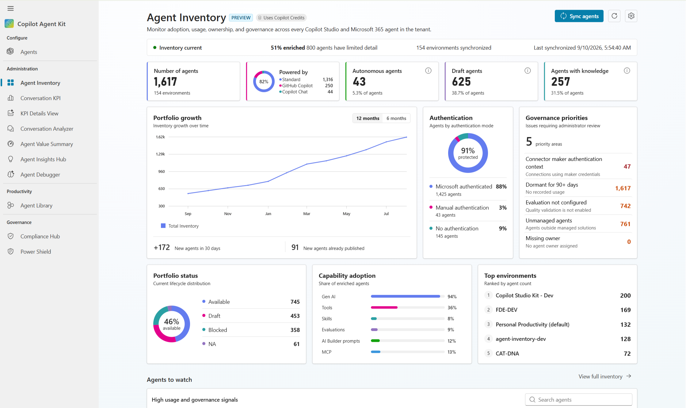

### Inventory context

The status row shows:

- **Inventory current**, **Inventory empty**, or **Sync in-progress**.
- The percentage of records enriched with detailed configuration.
- The number of agents with limited details.
- The number of synchronized environments.
- The last successful synchronization time, when available.

### Portfolio metrics

The top metric tiles provide direct access to important inventory segments:

- **Number of agents**
- **Powered by**
- **Autonomous agents**
- **Draft agents**
- **Agents with knowledge**

Select a tile to open all agents or a filtered subset. The **Powered by** tile groups agents into categories such as **Standard**, **GitHub Copilot**, and **Copilot Chat**.

### Analytics and governance

The dashboard also includes:

- **Portfolio growth** with 6-month and 12-month ranges.
- **Authentication** distribution.
- **Governance priorities** requiring administrator review.
- **Portfolio status** distribution.
- **Capability adoption** across enriched agents.
- **Top environments** ranked by agent count.
- **Agents to watch** for records requiring attention.

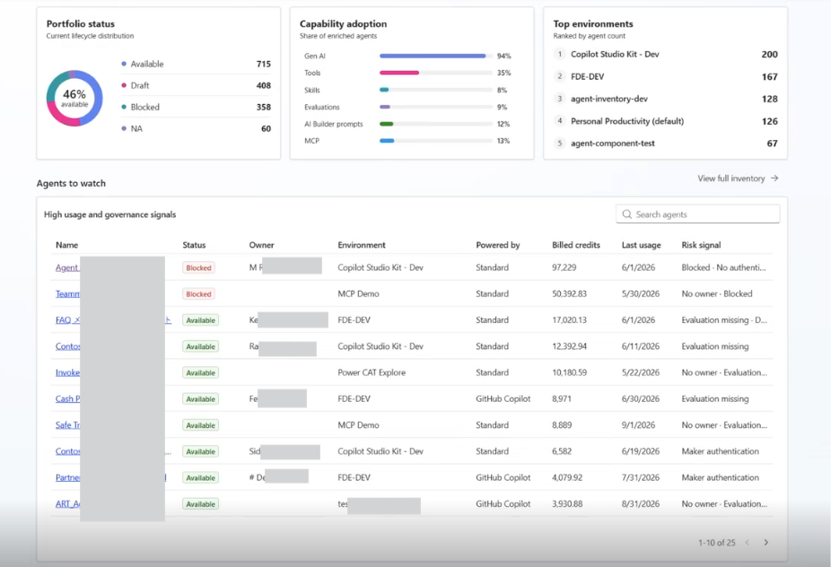

Percentages depend on the environments for which the configured connection identities can retrieve agent data and detailed configuration.

## Synchronize or refresh inventory data

Agent Inventory V2 separates synchronization from dashboard refresh.

### Sync agents

Select **Sync agents** when the tenant inventory needs to be collected again. The sync follows the filters, environment groups, data collection mode, usage setting, and schedule configuration saved on the settings page.

While a sync is running:

- The inventory status changes to **Sync in-progress**.
- **Sync agents** is disabled to prevent duplicate operations.
- Settings that could change the active sync configuration are unavailable.
- The dashboard reloads Agent Details, usage history, sync status, and last-synchronized information after the sync settles.

### Refresh dashboard data

Select **Refresh dashboard data** to reload data already stored in the Agent Details and Agent Usage History tables.

Refresh:

- Does not start an Agent Sync.
- Does not rediscover environments or agents.
- Is useful after a sync has completed or when the dashboard is showing stale cached data.
- Shows a success, informational, or error notification when the operation finishes.

> [!IMPORTANT]
> Agent synchronization does not use Copilot Credits. Credits are used only when AI-generated descriptions are enabled and an eligible GitHub Copilot agent details page is visited.

## Browse all agents

Select **View full inventory** from the dashboard to open the agents grid.

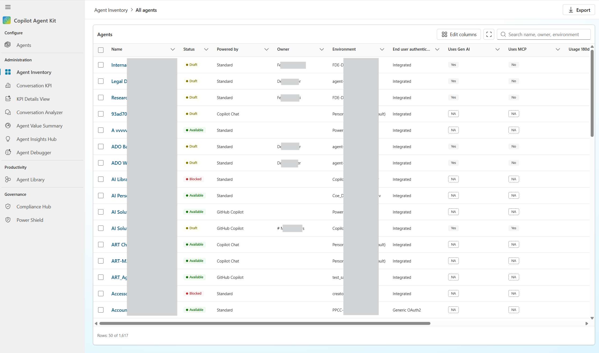

### Filter, sort, group, and customize the grid

Use the grid to find the information you need by filtering, sorting, grouping, and adding columns.

You can also export the inventory data.

## Agent details

Select an agent name from the grid to open the Agent Details experience.

The header shows the agent identity, environment context, lifecycle status, ownership, and available actions. An information banner explains whether the record has full Dataverse enrichment or limited configuration details.

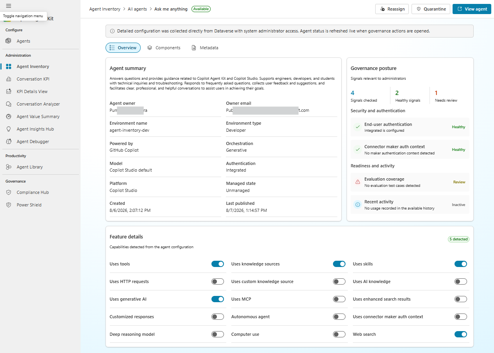

### Overview

The **Overview** tab provides:

- Agent summary and environment information.
- Governance posture and signals.
- An AI-generated description for an eligible GitHub Copilot agent when the setting is enabled.
- A usage snapshot when usage history exists.

### Components

The **Components** tab is shown only when component data exists. Use it to:

- Explore the agent architecture in **Component map** view.
- Browse categorized content in **Component group** view.
- Expand one populated component group at a time.
- Turn on **Raw** mode to inspect JSON.
- Copy component JSON for investigation or support.

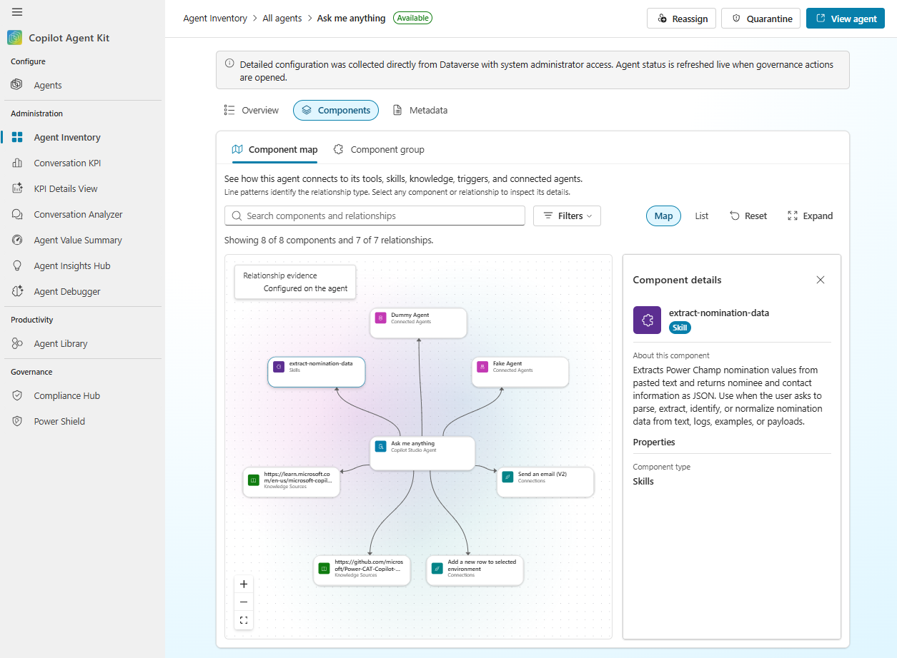

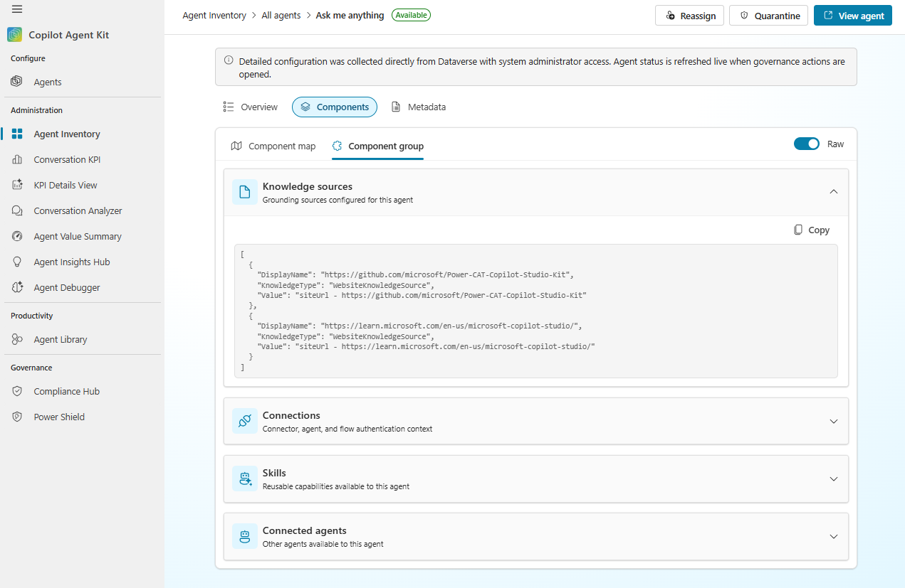

### Usage

The **Usage** tab is shown only when usage records exist. It includes:

- Month-to-date, the two preceding calendar months, last-three-months, and last-six-months ranges. **Last six months** is selected by default.
- Total Copilot credits and average credits per active week.
- Reported users and primary usage feature.
- Weekly credit trends.
- Usage highlights.
- Credits by feature and channel.
- Recent usage records.
- Agent-specific Excel export.

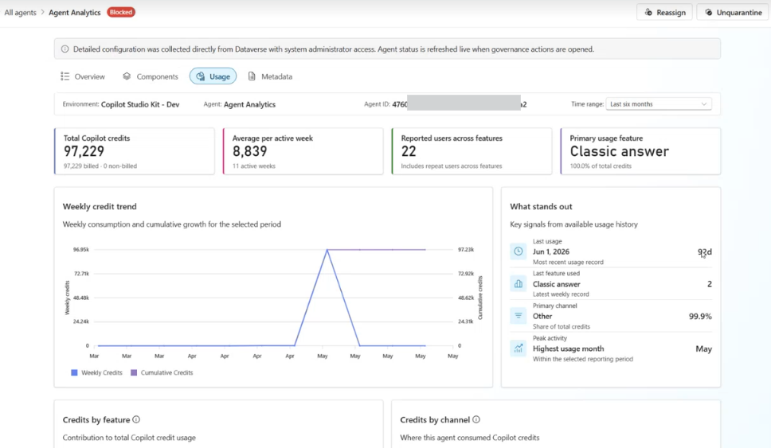

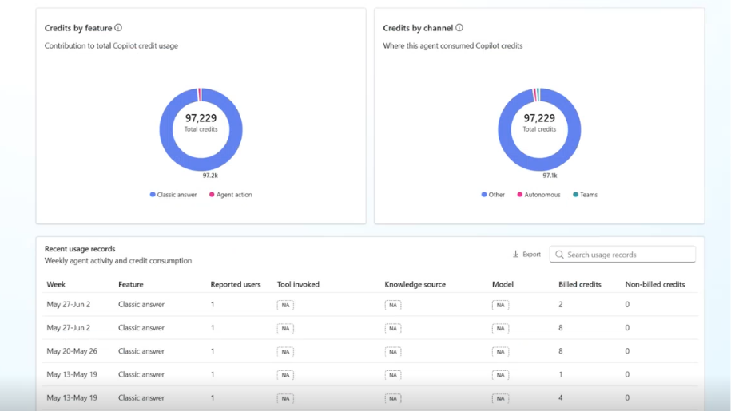

### Metadata

The **Metadata** tab is always available. Use it to inspect technical values such as:

- Agent ID and schema name.
- Environment ID and URL.
- Location and source identifiers.
- Raw inventory fields used for diagnostics and integration.

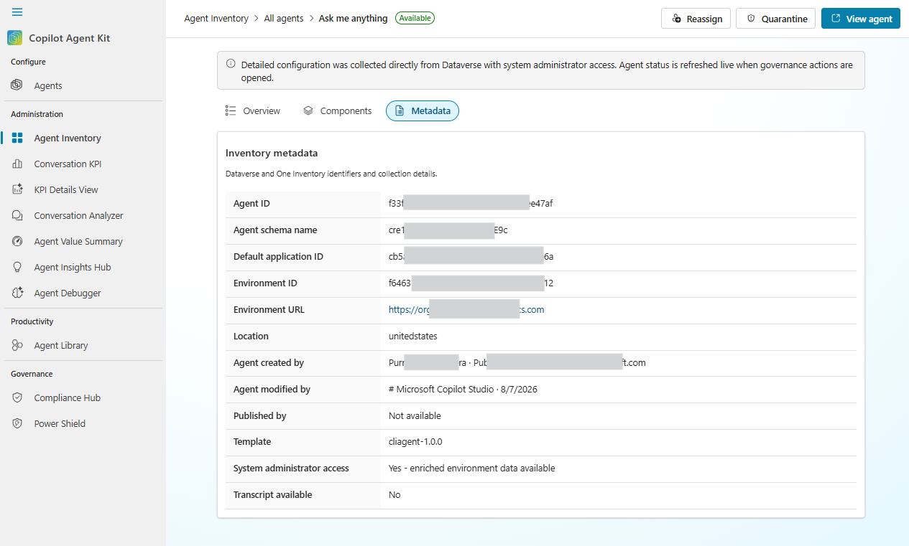

## Governance actions

Agent Inventory supports **Reassign**, **Quarantine**, and **Unquarantine**. Actions appear only when every selected agent is eligible.

| Action | Availability |
| --- | --- |
| **Reassign** | One or more eligible agents are selected, up to 50. |
| **Quarantine** | All selected agents are eligible and have Draft or Available status, up to 50. |
| **Unquarantine** | All selected agents are eligible and have Blocked status, up to 50. |

If any selected record is incompatible with an operation, that operation is hidden. Records whose Power Platform admin-center context does not match the inventory environment are not offered unsupported governance actions.

The grid uses the status captured during the latest inventory sync. On the Agent Details page, quarantine and unquarantine availability is based on the agent's live status.

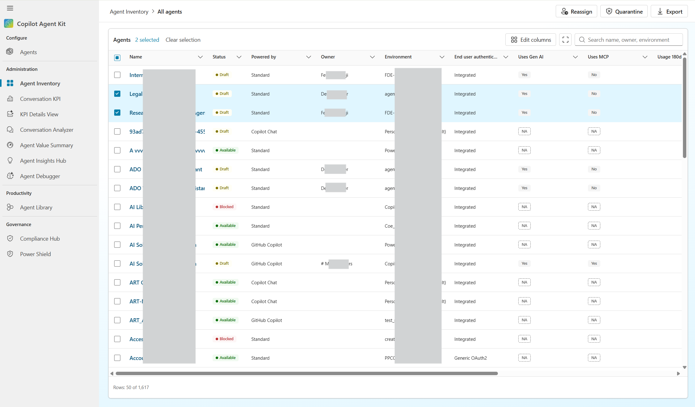

### Reassign

Some organizations require agents to have owners for compliance purposes. The owner can edit the agent, publish updates, delete it, or share it with teammates according to their permissions.

Select **Reassign** and choose a user who has a Microsoft 365 Copilot license. For bulk reassignment, the dialog displays the selected environments, agents, current owners, and operation status.

After reassignment completes, the reassignment status is shown as complete for each successfully processed agent.

### Quarantine and unquarantine

**Quarantine** blocks an eligible agent. **Unquarantine** restores an eligible blocked agent. Confirmation dialogs identify the affected agents, environments, and statuses before an operation is submitted.

Bulk actions support up to **50 agents** per operation and are available only when every selected record is eligible.

## Configure Agent Inventory

Select **Settings** from the V2 dashboard header to open **Agent sync configuration**.

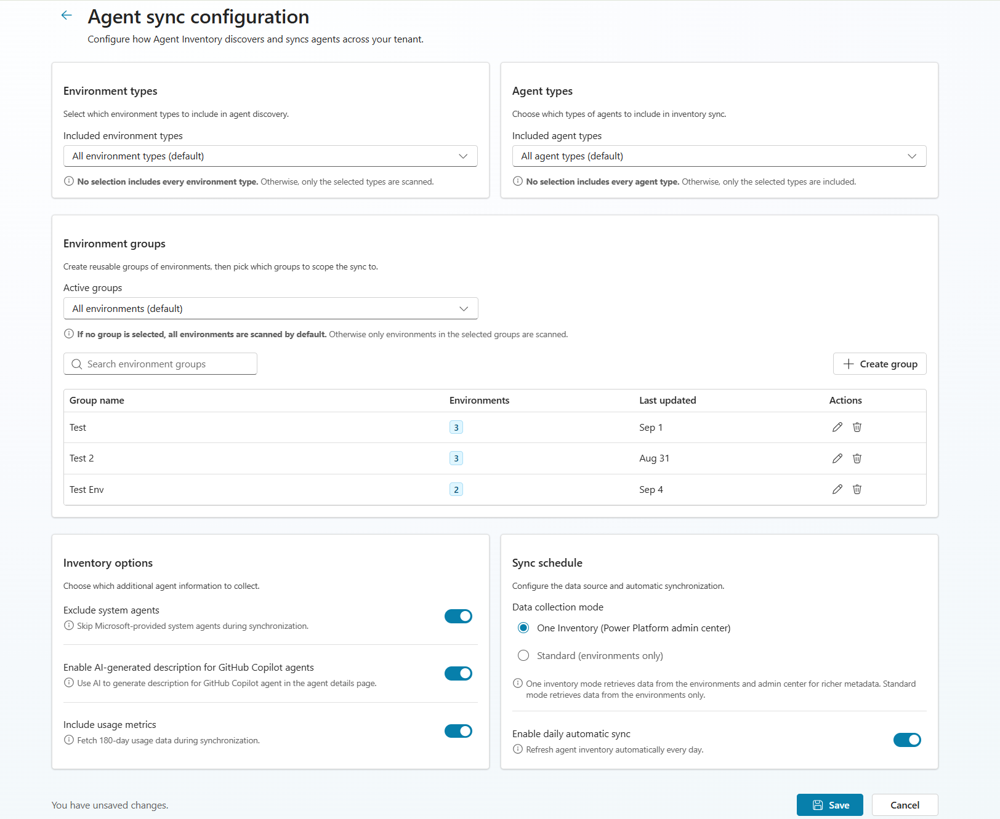

### Environment types

Choose which environment types are scanned:

- Developer
- Default
- Sandbox
- Production
- Trial
- Teams

If no environment type is selected, all environment types are included.

### Agent types

Choose whether the inventory includes:

- Custom agents
- Declarative agents

If no agent type is selected, all agent types are included.

### Environment groups

Environment groups provide reusable sync scopes. Administrators can:

- Create and edit a group.
- Select member environments using environment-type and region filters.
- Enable or disable the group.
- Delete a group that is no longer needed.

If no group is enabled, all environments allowed by the other settings are included.

### Inventory options

- **Exclude system agents** - skips Microsoft-provided system agents during synchronization.
- **Enable AI-generated description for GitHub Copilot agents** - allows description generation when an eligible agent details page is visited.
- **Include usage metrics** - collects the retained 180-day usage window during synchronization.

### Sync schedule and collection mode

- **One Inventory (Power Platform admin center)** - combines admin-center inventory with environment data for broader discovery and richer metadata.
- **Standard (environments only)** - retrieves inventory directly from accessible environments.
- **Enable daily automatic sync** - runs Agent Inventory on the configured daily schedule.

Select **Save** to persist changes. The button is disabled while no setting has changed, while a save is in progress, or while settings are unavailable during an active sync.

## Usage metrics

Usage metrics are included in the Copilot Agent Kit main solution. Agent Inventory can retain and display up to **180 days** of agent usage data.

To make usage analytics available:

1. Ensure the required solution connections are configured and permitted by data loss prevention policies.
2. Open **Agent sync configuration**.
3. Turn on **Include usage metrics**.
4. Save the configuration.
5. Select **Sync agents** or wait for the daily automatic sync.

Usage data are stored in the **Agent Details** and **Agent Usage History** tables. An agent's **Usage** tab appears only when matching usage-history records are available.

### HTTP connection configuration

The **HTTP with Microsoft Entra ID (preauthorized)** connection values depend on the tenant cloud.

| Cloud | Base Resource URL | Microsoft Entra ID Resource URI |
| --- | --- | --- |
| **Commercial** | `https://licensing.powerplatform.microsoft.com/` | `https://licensing.powerplatform.microsoft.com/` |
| **GCC** | `https://gov.licensing.powerplatform.microsoft.us/` | `https://gov.licensing.powerplatform.microsoft.us/` |
| **GCC High** | `https://high.licensing.powerplatform.microsoft.us/` | `https://high.licensing.powerplatform.microsoft.us/` |

## Data collection modes

The **Data collection mode** setting determines how agent records are discovered and collected.

### One Inventory mode

One Inventory mode:

1. Agent data is retrieved from One Inventory through the Power Platform Admin Center.
2. Environments are listed using the **Copilot Agent Kit - Power Platform for Admins V2** connector.
3. The One Inventory agent data is combined with the environments list to construct environment details.
4. For each environment, agent details are loaded into Agent Inventory by merging agents fetched from the environment with the corresponding One Inventory data.

Use this mode when broader tenant discovery and richer Power Platform admin-center metadata are required. Agents discovered through PPAC but inaccessible in their environment are still added with limited details.

### Standard mode

Standard mode:

1. All environments are listed using the **Copilot Agent Kit - Power Platform for Admins V1** connector.
2. Agents are fetched for each environment.
3. Agent data is loaded into Agent Inventory.

Use this mode when collection should rely only on accessible environments.

In both modes, the **Copilot Agent Kit - Dataverse** connector connects to each environment to gather detailed agent information (metadata, feature usage, configuration) — but only where the configured account has **system admin access**.

For full tenant-wide visibility, the connection references must be configured with an account that has the **Power Platform admin role** and to view all the features need to have **system admin level permission** to all environments. Other accounts can be used, but the inventory will be limited to the environments the user has system admin access to.

## Permissions and connector requirements

### Recommended permissions

- Power Platform administrator access for broad environment and inventory discovery.
- System administrator access in each environment that requires full agent-configuration enrichment.
- Appropriate Dataverse privileges for Agent Inventory settings, environment groups, action auditing, and usage-history data.

For full tenant-wide visibility, configure the connection references with an account that has the **Power Platform administrator** role. To retrieve all feature-level details, that account also needs **system administrator** access to the relevant environments.

### Connectors

All required connectors must be allowed by the data loss prevention policies applied to the environment, and connections must be populated during solution import.

| Connector |
| --- |
| Microsoft Dataverse |
| Power Platform for Admins |
| Power Platform for Admins V2 |
| HTTP with Microsoft Entra ID (preauthorized) |

See [Prerequisites - Connector requirements](./PREREQUISITES.md#connector-requirements) for the full list across the Kit.

### Core Dataverse tables

| Table | Purpose |
| --- | --- |
| `cat_agentdetails` | Discovered agents, metadata, capabilities, ownership, and synchronized status. |
| `cat_agentusagehistory` | Retained usage dimensions and Copilot credit values. |
| `cat_agentinventorysettings` | Inventory filters, mode, and feature settings. |
| `cat_environmentgroups` | Reusable environment scopes. |
| `cat_agentinventoryactionaudit` | Governance action tracking. |
| `cat_copilotstudiokitlogs` | Feature and operation logging. |

## Operational guidance

- Use **Refresh dashboard data** after a completed sync when the dashboard needs to reload existing table data.
- Use **Sync agents** only when inventory collection must run again.
- Keep environment and agent filters as narrow as practical in very large tenants.
- Disable usage collection when 180-day usage analytics are not required.
- Use grid filters before exporting large inventories.
- Treat limited-detail and enrichment indicators as permission or environment-coverage signals.
- Confirm action eligibility and selected-record count before submitting a bulk operation.
- Review connection ownership and data loss prevention policies after importing or upgrading the solution.

## Data source reference

For the authoritative Agent Details and Agent Usage History schemas, logical column names, source mappings, and feature-detection rules, see [Agent Inventory - Data Source](./AGENT_INVENTORY_DATA_SOURCE.md).

Back to the [landing page](./README.md#power-cat-copilot-studio-kit).
