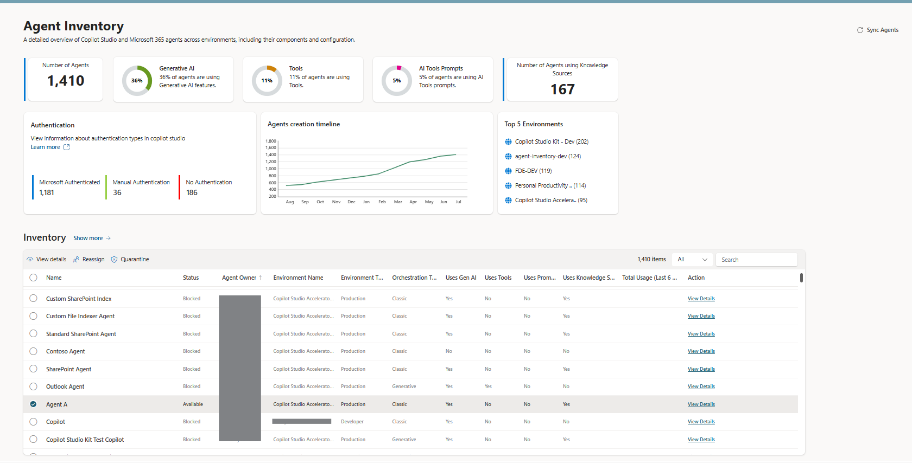
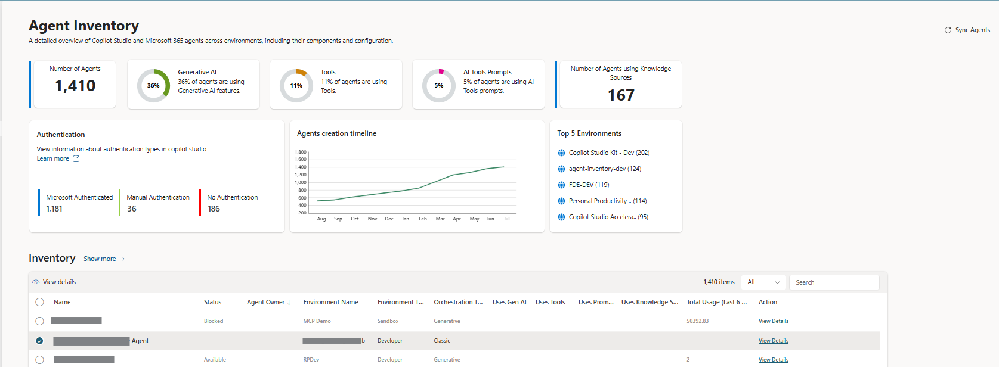
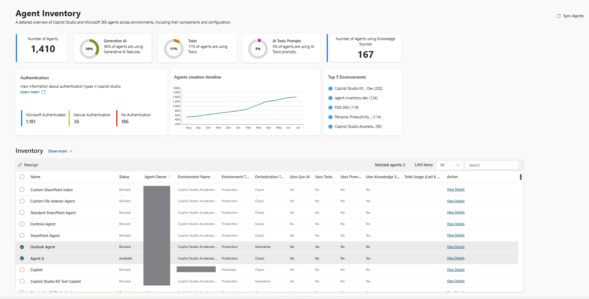
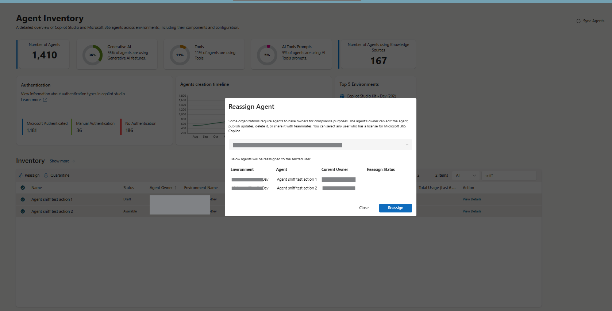
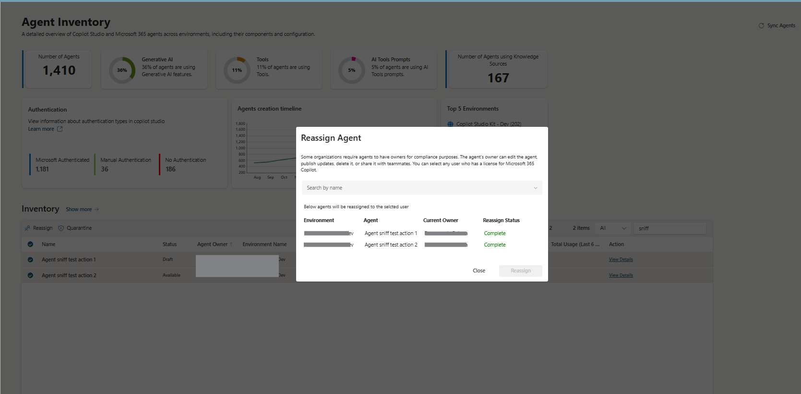
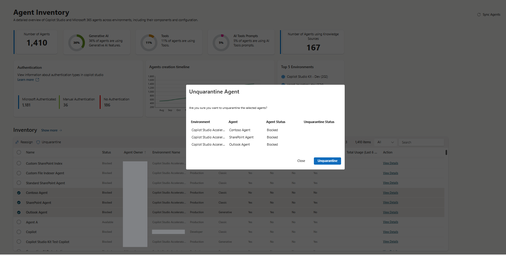

# Agent Inventory

## Agent Inventory overview

Copilot Agent Kit Agent Inventory feature can be used to easily get a tenant-wide visibility to all the **custom agents** and **declarative agents** in the organization, across environments. Agent inventory data includes basic metadata like creation times, publish status and authentication mode, as well as information on the feature usage like knowledge sources used, usage of prompts, orchestration type and more.

## Dashboard

Agent Inventory feature ships with a dashboard that provides an overview on agents, growth and AI adoption. Detailed data is available for each agent and can be exported for use in other applications.

## Detailed view

From the Agent Inventory dashboard, users can see the total amount of agents in the tenant, usage % of generative AI features, actions and AI builder prompts
and how many agents are leveraging knowledge sources. Also visible are authentication mechanism used by the custom agents, agent creation timeline
visualizing the growth, and a list of top 5 environments by agent count.

Selecting an agent and pressing *View details* brings up a detailed view of the selected agent, including basic metadata on the custom agent,
the environment, creation time and creator, and detailed information the usage of different features such as actions, generative AI, skills, prompts,
knowledge sources and more.

> **Disclaimer:** The usage percentages shown here depend on the environments for which the user has System Administrator access.

## List view

And finally, pressing *Show more* from the dashboard view, brings up a list view where users can find the information they are looking for by filtering, sorting and adding additional columns.

## Actions (New Feature)

Agent Inventory lets administrators act on agents directly from the grid. The available actions are **View Details**, **Reassign**, **Quarantine**, and **Unquarantine**. The actions appear on the command bar based on the number and status of the agents selected in the grid.

### Action availability

The **Status** column in the grid is populated during the Agent Inventory sync and reflects the value coming from PPAC (One Inventory data). Which actions are shown depends on how many records are selected and their status:

| Action | Selection rule | Hidden when |
| :-- | :-- | :-- |
| **View Details** | Shown only when exactly **one** record is selected. | Zero or more than one record is selected. |
| **Reassign** | One or many records (up to a **maximum of 50**) can be selected. | Any selected agent is not eligible for reassign. |
| **Quarantine** | One or many records in **Draft** or **Available** status (up to a **maximum of 50**) can be selected. | Any selected agent is **Blocked** or not eligible for quarantine. |
| **Unquarantine** | One or many records in **Blocked** status (up to a **maximum of 50**) can be selected. | Any selected agent is **Draft**, **Available**, or not eligible for unquarantine. |

When the selection includes an agent that does not meet the criteria for an action, that action is hidden from the command bar.

The action is hidden when any selected agent's status is incompatible with the operation (for example, Quarantine is hidden if a **Blocked** agent is selected).

### Reassign

Some organizations require agents to have owners for compliance purposes. The agent's owner can edit the agent, publish updates, delete it, or share it with teammates. Selecting **Reassign** opens a dialog where you can choose any user who has a license for Microsoft 365 Copilot. All selected agents will be reassigned to the chosen user.

Once the reassignment completes, the **Reassign Status** column shows **Complete** for each agent.

### Quarantine and Unquarantine

**Quarantine** blocks an agent, and **Unquarantine**  unblocks an agent. Selecting the action opens a confirmation dialog listing the environment, agent, and current agent status. Confirm the operation to apply the change to the selected agents.

### Actions on the Agent Details screen

The same actions are available on the **Agent Details** screen for the individual agent. On this screen the quarantine/unquarantine status shown is based on the **live status** of the agent, rather than the synced status displayed in the grid.

## Connectors used

Agent Inventory (including Usage Metrics) uses the following connectors. All must be allowed by the DLP policies applied to the environment, and connections must be populated at solution import time.

| Connector |
| :-- |
| Microsoft Dataverse |
| Power Platform for Admins |
| Power Platform for Admins V2 |
| HTTP with Microsoft Entra ID (preauthorized) |

See [Prerequisites → Connector requirements](./PREREQUISITES.md#connector-requirements) for the full list across the Kit.

## Using Usage Metrics in Agent Inventory 
You can view usage details for your agent over the past 180 days in **Agent Inventory**. Usage Metrics is now included in the **Copilot Agent Kit main solution**, so no separate solution import is required.

### Prerequisites 

Before using the usage metrics feature:

1. **Install** the **Copilot Agent Kit main solution**.
2. **Ensure** that the connector **HTTP with Microsoft Entra ID (preauthorized)** is allowed in your environment.

### Connection Creation 

The **HTTP with Microsoft Entra ID (preauthorized)** connection values depend on the cloud your tenant runs in (Commercial, GCC, GCC High, or DoD). Use the **Base Resource URL** and **Microsoft Entra ID Resource URI** that match your cloud when creating the connection:

| Cloud | Base Resource URL | Microsoft Entra ID Resource URI |
| :-- | :-- | :-- |
| **Commercial** | `https://licensing.powerplatform.microsoft.com/` | `https://licensing.powerplatform.microsoft.com/` |
| **GCC** | `https://gov.licensing.powerplatform.microsoft.us/` | `https://gov.licensing.powerplatform.microsoft.us/` |
| **GCC High** | `https://high.licensing.powerplatform.microsoft.us/` | `https://high.licensing.powerplatform.microsoft.us/` |

### How Usage Metrics Are Updated 

Usage data in the **Agent Details** table is refreshed in two ways:

1. **Automatically** when the Agent inventory runs on a daily schedule.  
2. **Manually** when you perform an **Agent Sync** operation.

### Where to View Usage Metrics 

In the **Agent Inventory Dashboard**, review the **Agents** grid. 
If the **Total Usage/Month** field contains a value, the **Usage Metrics** section will be displayed on the **Agent Details** page.

> [!NOTE]
> The visibility to agents is *limited* and *controlled* by the connection references in the solution. 

## Data Collection Modes

The data collection process is controlled by the **Enable One Inventory** environment variable, which determines how agent data is retrieved and loaded into Agent Inventory.

### Enable One Inventory = "Yes" (One Inventory mode)

When **Enable One Inventory** is set to **Yes**, the process uses One Inventory data:

1. Agent data is retrieved from One Inventory through the Power Platform Admin Center.
2. Environments are listed using the **Copilot Agent Kit - Power Platform for Admins V2** connector.
3. The One Inventory agent data is combined with the environments list to construct environment details.
4. For each environment, agent details are loaded into Agent Inventory by merging agents fetched from the environment with the corresponding One Inventory data.

### Enable One Inventory = "No" (Standard mode)

When **Enable One Inventory** is set to **No**, the process follows the standard data collection approach:

1. All environments are listed using the **Copilot Agent Kit - Power Platform for Admins V1** connector.
2. Agents are fetched for each environment.
3. Agent data is loaded into Agent Inventory.

In both modes, the **Copilot Agent Kit - Dataverse** connector connects to each environment to gather detailed agent information (metadata, feature usage, configuration) — but only where the configured account has **system admin access**.

For full tenant-wide visibility, the connection references must be configured with an account that has the **Power Platform admin role** and to view all the features need to have **system admin level permission** to all environments. Other accounts can be used, but the inventory will be limited to the environments the user has system admin access to.

Back to the [landing page](./README.md#power-cat-copilot-studio-kit)