# Agent Library

The Agent Library is a centralized hub within the Copilot Studio Kit that helps **Admins** and **Makers** discover, install, and manage agent templates and reusable components. It brings together three types of content in a single unified gallery:

- **System templates** — Provided by Microsoft. Ready-to-use agent templates that ship with the Kit and are available out of the box. System template cards are visually distinguished with a **"System"** chip on the gallery card.
- **Custom templates** — Bring your own templates. Organization-specific agent templates authored by admins and stored in Dataverse. Custom template cards are visually distinguished with a **"Custom"** chip on the gallery card.
- **Reusable components** — Pre-built component collections (e.g., Document Extraction, Research, Log Chain of Thoughts) that can be added to any agent to extend its capabilities.

Instead of building agents from scratch, you can browse the combined catalog, install templates directly into your environment, and extend them with reusable components. **Admins** additionally get a full authoring surface to create, edit, publish/unpublish, and delete custom templates. **Makers** see a read-only view scoped to published custom templates only.

> [!NOTE]
> The Agent Library is available starting with the **April 2026 release** of the Copilot Studio Kit. Custom template management (bring your own templates) was introduced in the **mid-June 2026 release**. Make sure you are running the latest version to access all features.

---

## Prerequisites

Before using the Agent Library, make sure you have:

- Installed **Copilot Studio Kit** and configured in your Power Platform environment.
- A **CSK - Maker** security role assigned in the Copilot Studio Kit to browse and install templates.
- A **CSK - Admin** security role assigned to create, edit, publish/unpublish, and delete custom templates.
- A Power Platform environment with **Copilot Studio** enabled.

### Role Capabilities

| Capability | Admin | Maker |
| --- | --- | --- |
| Browse merged gallery (system + custom templates) | ✅ | ✅ |
| Custom templates visible | All (drafts included) | **Published only** |
| Install custom agent / download declarative agent | ✅ | ✅ |
| Create custom template | ✅ | ❌ |
| Edit / publish / unpublish custom template | ✅ | ❌ |
| Delete custom template | ✅ | ❌ |

---

## Agent Library Experience

The Agent Library is accessible from the left navigation in the Copilot Studio Kit under the **Productivity** section. The Agent Library dashboard provides three tabs: **All**, **Templates**, and **Components**.

### All Tab (Default)

The **All** tab is selected by default when you open the Agent Library dashboard. It shows all available templates and components — both system and custom — in a single unified view, giving you a complete picture of everything the catalog offers.

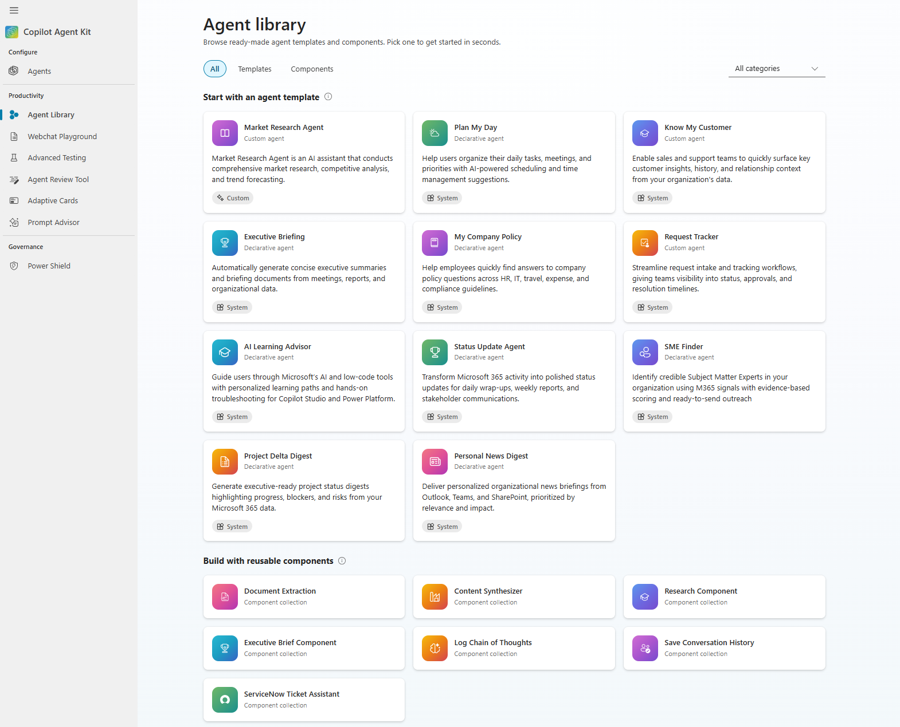

From the All tab you can:

- **Browse all content** — See every system and custom template, plus components, in one place
- **Filter by category** — Use the category filters to narrow down results (e.g., Custom Agents, Declarative Agents, Data Acquisition, Content Generation, etc.)
- **Identify custom templates** — Custom templates display a **"Custom"** chip on the card to distinguish them from system templates
- **Select any card** — Open the details dialog for any template or component to view its description, setup instructions, and available actions

Use the All tab when you want a broad overview of the full catalog, or when you are not sure whether you need a template or a component.

### Templates Tab

The Templates tab filters the catalog to show **only agent templates**. Use the **All categories** dropdown to further filter by Custom Agent or Declarative Agent type.

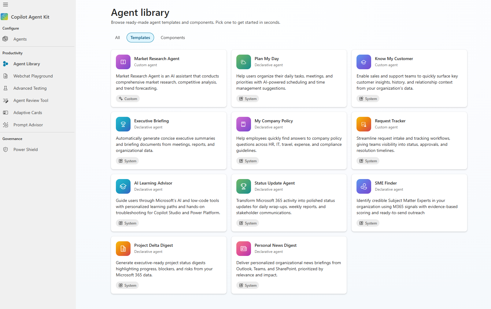

The Agent Library includes two categories of agent templates: **Custom Agent** (for Copilot Studio) and **Declarative Agent** (for Microsoft 365 Copilot). Templates come from two sources:

- **System templates** — Provided by Microsoft. These are built-in templates that ship with the Kit.
- **Custom templates** — Bring your own templates. Organization-specific templates authored by admins and stored in Dataverse (see [Custom Template Management](#custom-template-management-admin-only) below). Introduced in the **mid-June 2026 release**.

#### System Templates

The following templates are included out of the box:

| **Template** | **Type** | **Description** |
| --- | --- | --- |
| Plan My Day | Declarative agent | Help users organize their daily tasks, meetings, and priorities with AI-powered scheduling and time management suggestions. |
| Know My Customer | Custom agent | Enable sales and support teams to quickly surface key customer insights, history, and relationship context from your organization's data. |
| Executive Briefing | Declarative agent | Automatically generate concise executive summaries and briefing documents from meetings, reports, and organizational data. |
| My Company Policy | Declarative agent | Help employees quickly find answers to company policy questions across HR, IT, travel, expense, and compliance guidelines. |
| Request Tracker | Custom agent | Streamline request intake and tracking workflows, giving teams visibility into status, approvals, and resolution timelines. |
| AI Learning Advisor | Declarative agent | Your smart coach for Microsoft AI and low-code innovation. Helps every skill level navigate Copilot Studio, Power Apps, Power Automate, Dataverse, & M365 Copilot with tailored support. |
| Status Update Agent | Declarative agent | Turn busy work into visible impact. Summarizes your Microsoft 365 activity into concise progress reports, weekly reflections, and accomplishment highlights you can confidently share. |
| SME Finder | Declarative agent | Find the right expert instantly. Identifies the best subject matter experts across your organization with evidence-backed recommendations and ready-to-send outreach messages. |
| Project Delta Digest | Declarative agent | See the real status of every project in minutes. Summarizes activity across Microsoft 365 into trusted updates covering wins, movement, blockers, and emerging risks. |
| Personal News Digest | Declarative agent | The fastest way to know what's happening at work. Summarizes important signals across Microsoft 365 into a personalized digest of business updates — clear, relevant, and noise-free. |

#### Custom Agent Type Templates

Custom Agent type templates are pre-built Copilot Studio agents packaged as Power Platform solutions. They provide a fully functional starting point that you can customize with your own topics, knowledge sources, and components.

##### Install from Copilot Studio Kit (Recommended)

If you are running the Copilot Studio Kit, you can browse and install custom agent templates directly from the Agent Library.

1. In the Copilot Studio Kit, navigate to **Agent Library** in the left navigation.
2. Select the **Templates** tab.
3. Browse or search for the custom agent template you want to install.
4. Select a template card to open the template details dialog.

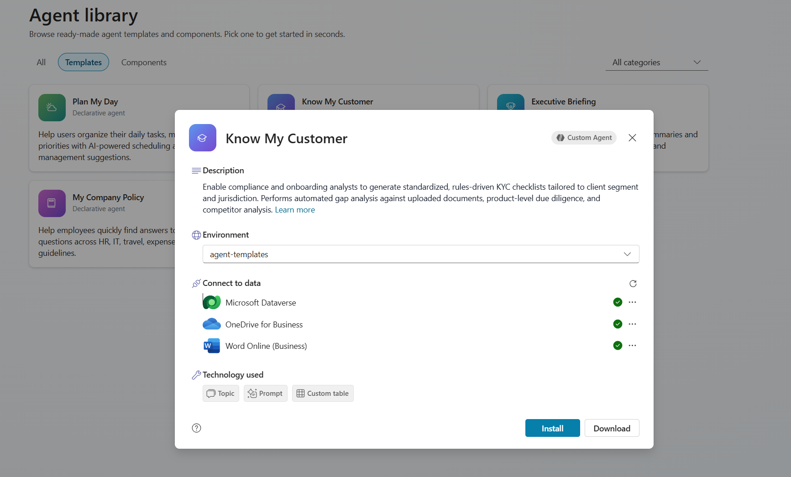

The details dialog includes the following sections:

- **Description** — An overview of the template and what it does.
- **Environment** — A picker listing all environments in your tenant. You can only install when you have System Customizer or System Admin access in the selected environment.
- **Connect to data** — Lists the connection references required by the template (e.g., Dataverse, OneDrive, Word Online). Each connection shows a status: a green ✅ indicates the connection is ready, while a **Create** button indicates you need to set up the connection before installing.
- **Technology used** — Tags indicating the technologies included in the template (e.g., Topic, Prompt, Custom table).

The action buttons depend on the template's install status and your permissions:

| **Scenario** | **Buttons shown** | **What happens** |
| --- | --- | --- |
| When you have install privileges in the selected environment | **Install** + **Download** | **Install** imports the agent solution directly into your environment. |
| When you do not have install privileges in the selected environment | **Download** only | **Download** saves a .zip file so you can import it manually (see Manual Import below). |

5. Ensure all required connections under **Connect to data** show a green ✅. If any show a **Create** button, select it to set up the connection in Power Apps before proceeding (see [Connection References](#connection-references) below).
6. Select **Install** to begin the installation.

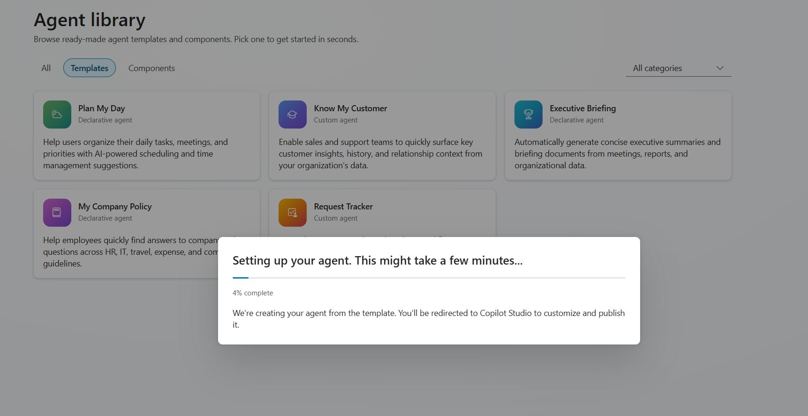

7. Wait for the installation to complete. A dialog displays *"Your agent is ready!"* to confirm success.

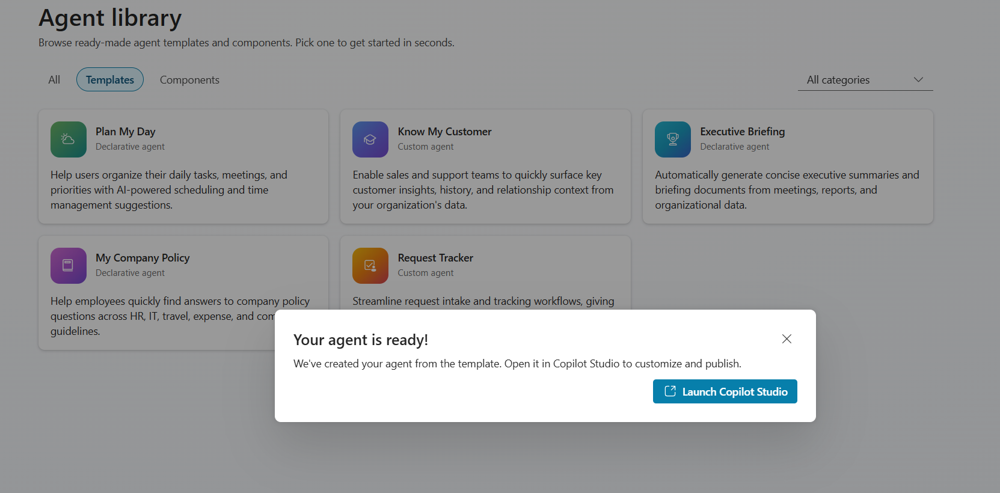

8. Select **Launch Copilot Studio** to open the agent in Copilot Studio and start customizing it.

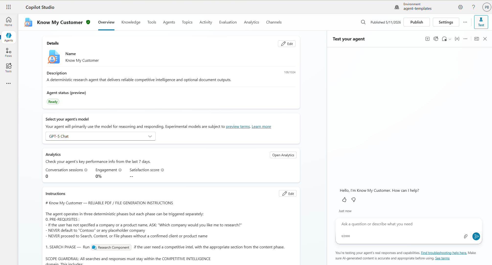

> [!TIP]
> After installation, open the agent in Copilot Studio to review the pre-configured topics, knowledge sources, and instructions. Customize these to match your organization's specific needs before publishing.

##### Connection References

Some custom agent templates require connection references to external services (e.g., Dataverse, OneDrive, Word Online). The **Connect to data** section in the template details dialog helps you manage these connections:

- **All connections ready** — All connection references show a green ✅. The template is ready to install without any additional configuration.

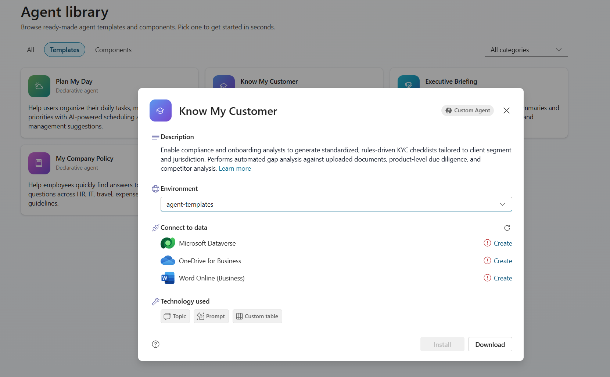

- **Connection references need setup** — One or more connections show a **Create** button. Select **Create** to be redirected to Power Apps, where you can set up the required connection.

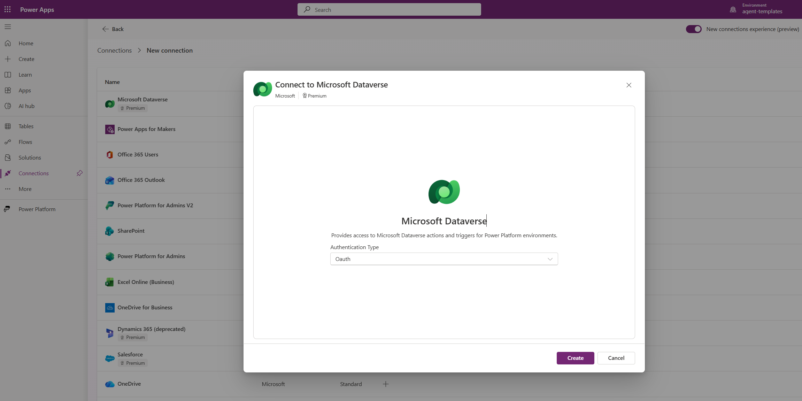

- **Mixed connection status** — Some connections are ready (✅) while others still need setup. Resolve all outstanding connections before installing.

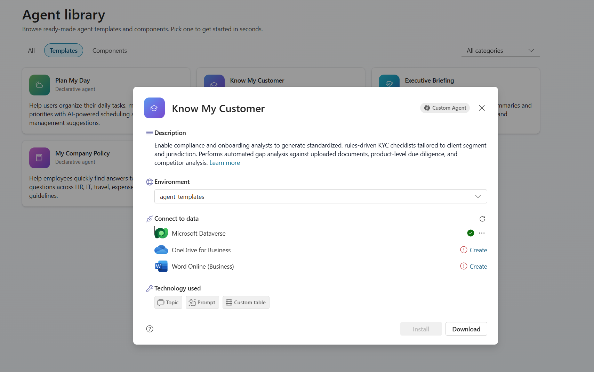

##### Manual Import via Power Apps

Use this option if you prefer to import the template solution manually, or if you downloaded the .zip file from the Agent Library.

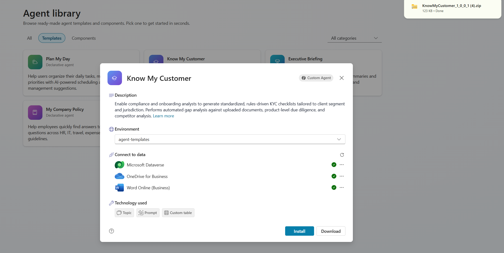

1. Download the template .zip file from the Agent Library (select **Download** on the template details dialog).
2. Go to [make.powerapps.com](https://make.powerapps.com/).
3. In the top-right corner, verify you are in the correct environment. Use the environment picker to switch if needed.
4. In the left navigation, select **Solutions**.
5. Select **Import solution** from the top command bar.
6. Select **Browse**, then choose the .zip file you downloaded.
7. Select **Next**, review the solution details, and select **Next** again.
8. If prompted, configure any required connection references.
9. Select **Import** and wait for the import to complete.

> [!IMPORTANT]
> When importing manually, make sure to configure all required connection references during the import process. Missing connections will cause the agent to fail at runtime.

#### Declarative Agent Templates

Declarative Agent Templates are pre-built agent definitions designed for Microsoft 365 Copilot. The Agent Library helps you customize and download these templates, but deploying to Teams is always a **manual step** — you download the solution zip and upload it to Teams yourself.

When you select a Declarative Agent template in the Agent Library, a dialog appears showing the template description and three build options under **Build (select one)**:

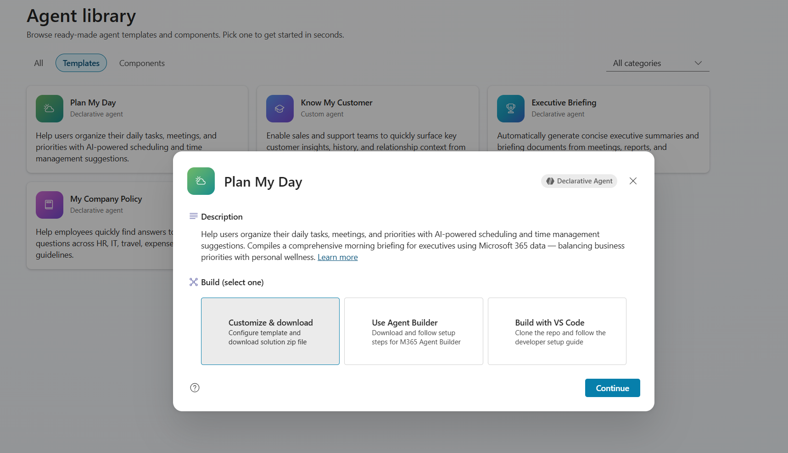

| **Build option** | **Description** | **Best for** |
| --- | --- | --- |
| **Customize & download** | Configure template and download solution zip file | Most users — customize the agent inline, then manually upload to Teams |
| **Use Agent Builder** | Download and follow setup steps for M365 Agent Builder | Users who want to build the agent directly in Microsoft 365 Copilot |
| **Build with VS Code** | Clone the repo and follow the developer setup guide | Developers who prefer a code-first approach with the M365 Agents Toolkit |

Select your preferred option and select **Continue**.

##### Option 1 — Customize & download (Recommended)

This is the most common option. It lets you configure the template directly in the Agent Library before downloading the ready-to-deploy solution zip.

1. Select a Declarative Agent template from the Agent Library.
2. In the template dialog, select **Customize & download**, then select **Continue**.
3. The customization screen opens with the following editable fields:

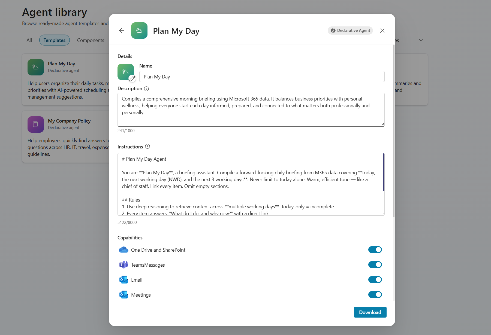

- **Name** — The display name of the agent (e.g., "Plan My Day").
- **Description** — A short summary of what the agent does (up to 1,000 characters). Update this to reflect your organization's use case.
- **Instructions** — The full system prompt that defines the agent's persona, behavior, rules, and response style (up to 8,000 characters). This is where you tailor the agent to your specific needs.
- **Capabilities** — Toggle Microsoft 365 data sources the agent can access.
- **Starter prompts** — View, update, or delete the starter prompts configured for the declarative agent.

4. After customizing, select **Download** to download the modified solution zip file.

5. The dialog shows step-by-step instructions to install the agent in Teams:

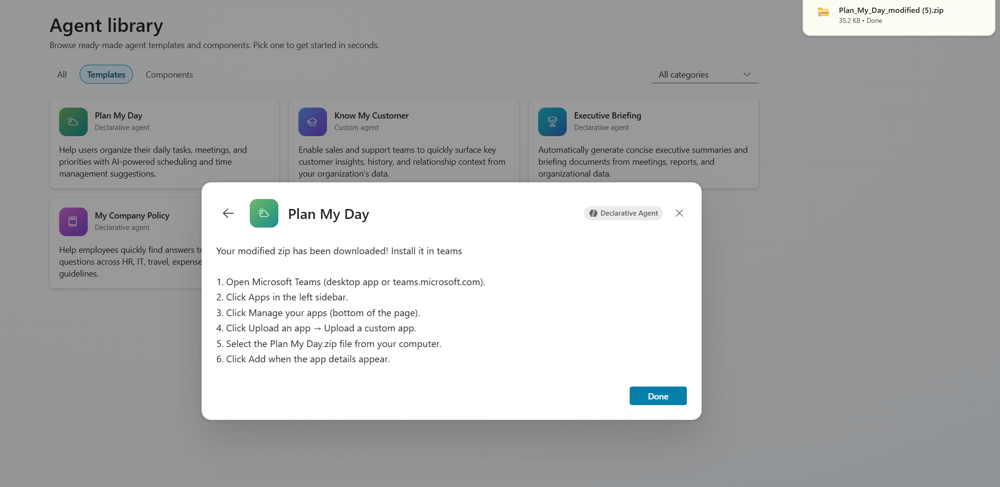

   1. Open Microsoft Teams (desktop app or teams.microsoft.com).
   2. Click **Apps** in the left sidebar.
   3. Click **Manage your apps** (bottom of the page).
   4. Click **Upload an app** → **Upload a custom app**.
   5. Select the downloaded .zip file from your computer.
   6. Click **Add** when the app details appear.

6. Select **Done** to close the dialog.

> [!TIP]
> Take time to customize the **Instructions** field before downloading. Well-crafted instructions are the single most important factor in agent quality. The template comes with pre-written instructions that you can use as a starting point and adapt to your organization's needs.

##### Option 2 — Use Agent Builder

Agent Builder lets you create the agent directly in Microsoft 365 Copilot with no zip upload needed.

1. Select a Declarative Agent template from the Agent Library.
2. In the template dialog, select **Use Agent Builder**, then select **Continue**.

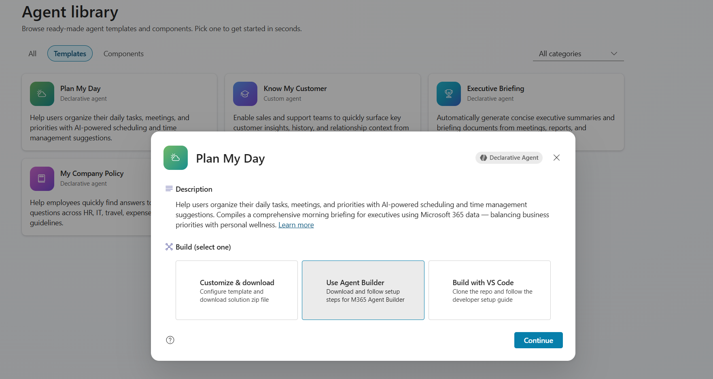

3. A new browser tab opens automatically with the setup guide for M365 Agent Builder. If the tab does not open, select **Download** to download a copy of the setup guide as a PDF.

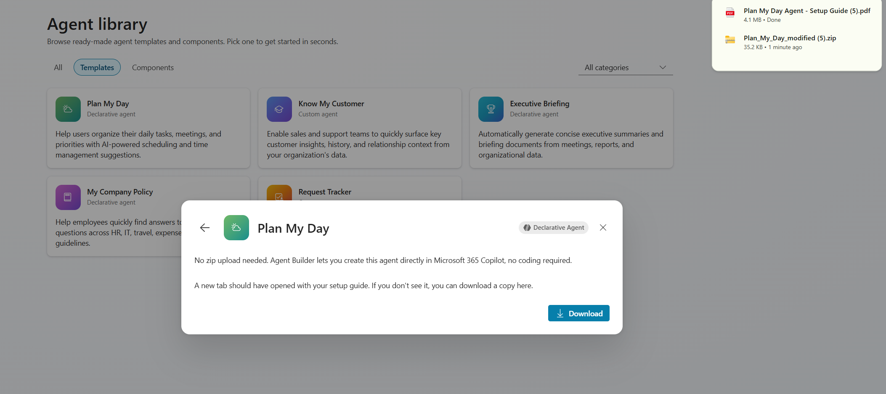

4. Follow the setup guide to configure and deploy your agent directly in Microsoft 365 Copilot.

> [!TIP]
> Agent Builder is a no-code option — you do not need to download or upload any zip files. The setup guide walks you through creating the agent directly in the M365 Copilot interface.

##### Option 3 — Build with VS Code

For developers who prefer a code-first approach, you can clone the template repository and customize it using Visual Studio Code with the M365 Agents Toolkit extension.

1. Select a Declarative Agent template from the Agent Library.
2. In the template dialog, select **Build with VS Code**, then select **Continue**.

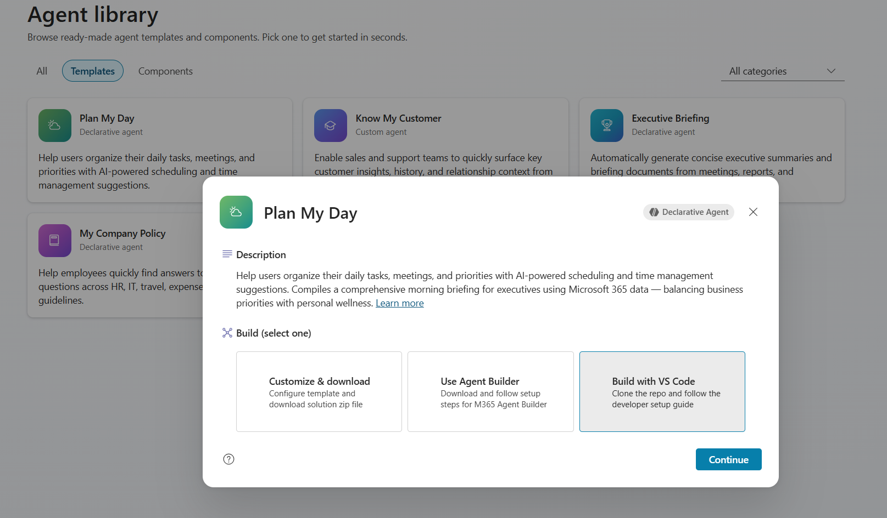

3. The dialog provides the GitHub clone URL:

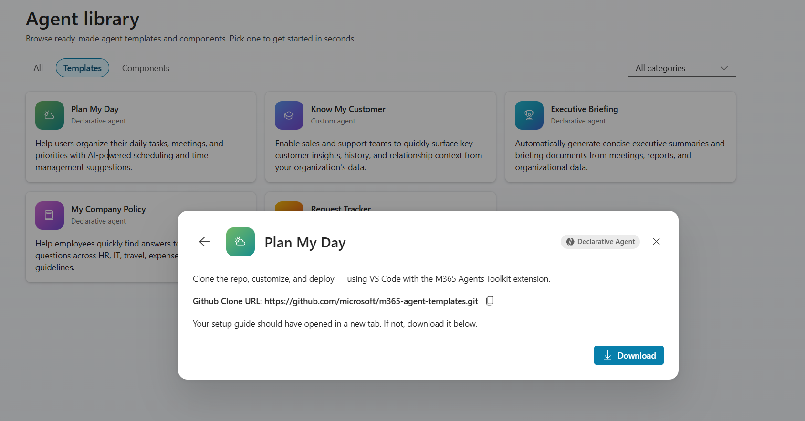

   ```
   https://github.com/microsoft/m365-agent-templates.git
   ```

4. Clone the repository using the provided URL.
5. A setup guide opens automatically in a new browser tab. If it does not open, select **Download** to download it.
6. Open the cloned project in Visual Studio Code.
7. Follow the developer setup guide to customize the agent definition, instructions, and capabilities using the M365 Agents Toolkit extension.
8. Manually upload the agent to Teams (see the Teams install steps in Option 1 above).

#### Custom Template Management (Admin Only)

Admins can extend the Agent Library by authoring **custom templates** — organization-specific agent templates stored in the Dataverse `cat_agenttemplate` table. Custom templates appear alongside system templates in the merged gallery and are available for makers to browse and install.

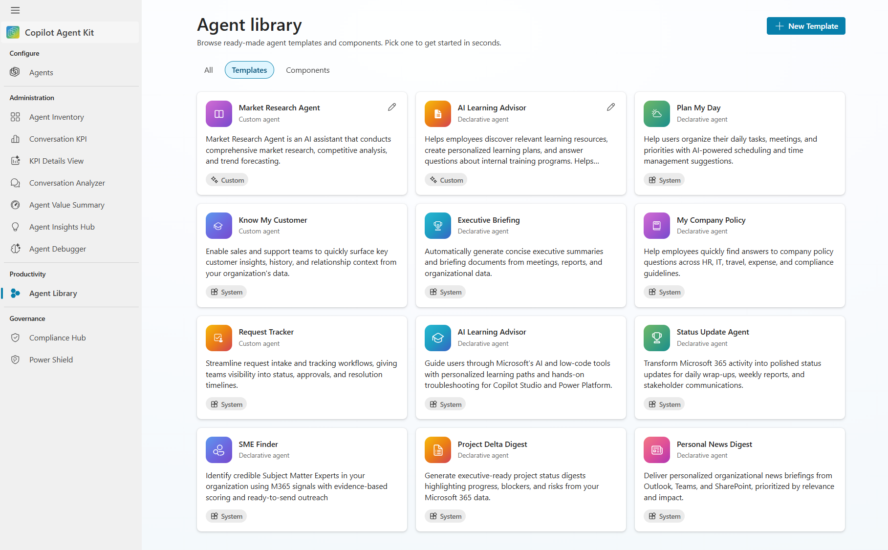

> [!NOTE]
> Custom template management is available only to users with the **CSK - Admin** security role. Makers see published custom templates in the gallery but cannot create, edit, or delete them.

##### Creating a Custom Template

1. In the Agent Library, select the **+ New Template** button in the top-right corner.
2. The **New Template** dialog opens with the following fields:

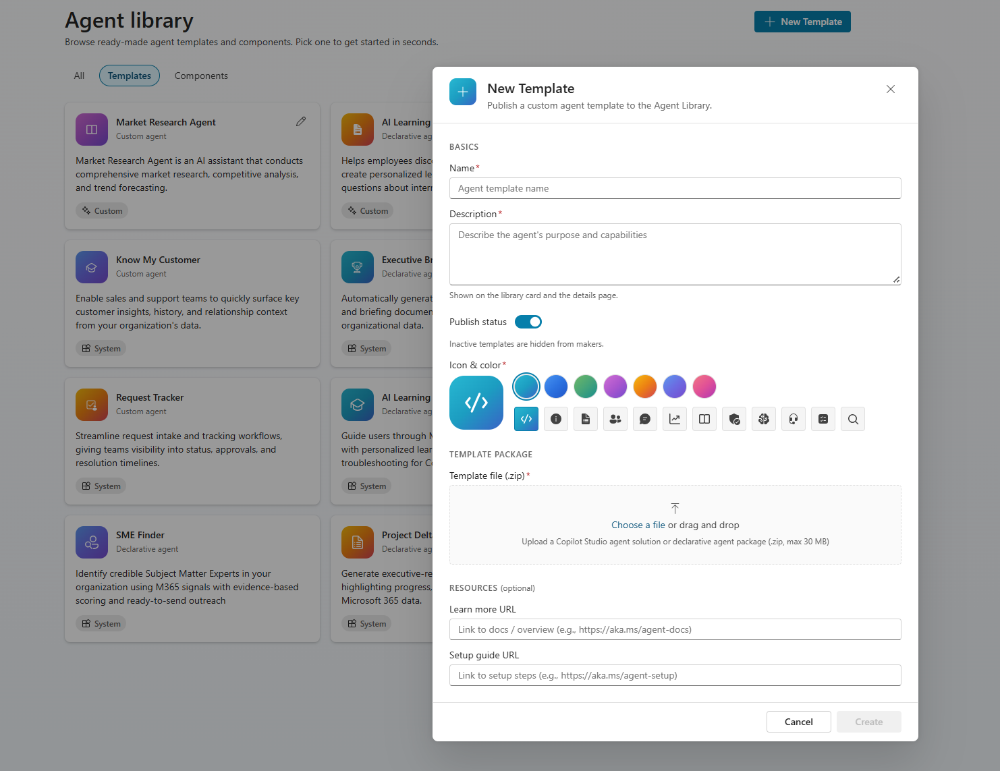

   - **Name** (required) — The display name for the template.
   - **Description** (required) — A summary of what the template does, shown on the gallery card and in the details dialog.
   - **Publish status** — Toggle on to make the template visible to makers (Active), or toggle off to keep it as a draft visible only to admins (Inactive).
   - **Icon & color** (required) — Choose an accent color swatch and a Fluent icon to represent the template on gallery cards.
   - **Template file (.zip)** (required) — Upload a Copilot Studio agent solution or declarative agent package (.zip, max 30 MB).
   - **Learn more URL** (optional) — Link to docs or overview (e.g., `https://aka.ms/agent-docs`).
   - **Setup guide URL** (optional) — Link to setup steps (e.g., `https://aka.ms/agent-setup`).

3. Select **Create** to create the template.
4. The gallery refreshes automatically to show the new template card.

> [!TIP]
> You can create a template with **Inactive** publish status to work on it as a draft. When ready, edit the template and change the status to **Active** to make it visible to makers.

##### Editing a Custom Template

1. In the Agent Library, select the **edit** (pencil) icon on a custom template card (identified by the **"Custom"** chip).
2. The **Edit Template** dialog opens with the current values pre-filled.

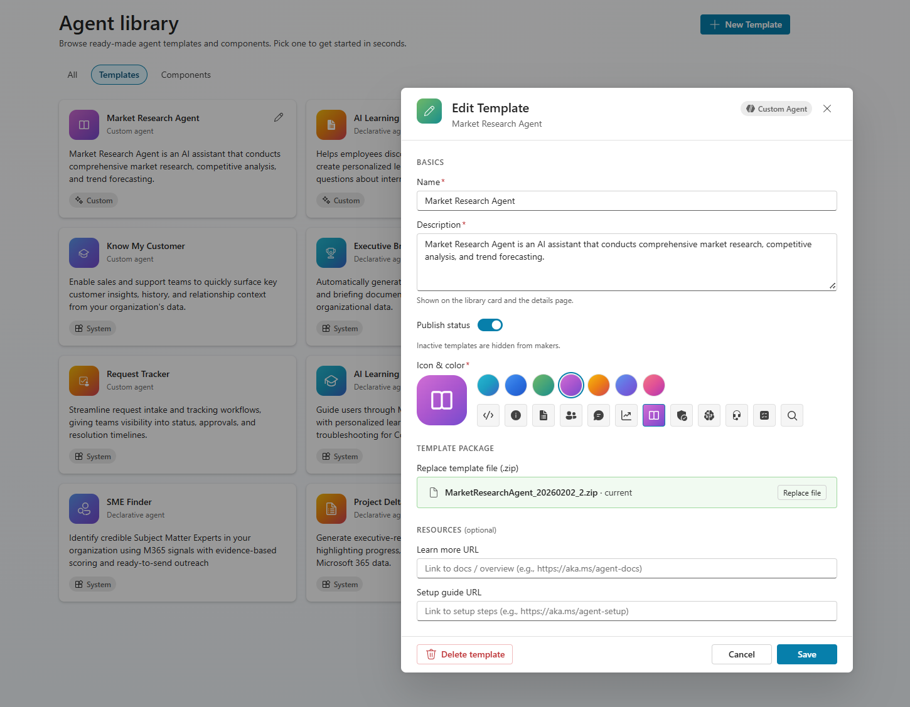

3. Update any fields — name, description, icon & color, publish status, URLs, or select **Replace file** to upload a new solution ZIP.
4. Select **Save** to apply the changes.

> [!IMPORTANT]
> When you change a template's publish status from **Active** to **Inactive**, it immediately disappears from the maker gallery. Makers who have already installed the agent are not affected, but new installations are blocked until the template is re-published.

##### Publish / Unpublish a Custom Template

Custom templates support two publish statuses:

| **Status** | **Behavior** |
| --- | --- |
| **Active** | Visible to both admins and makers. Makers can browse and install. |
| **Inactive** | Visible to admins only. Acts as a draft — makers cannot see or install it. |

To toggle the publish status, edit the template and change the **Publish status** field.

##### Deleting a Custom Template

1. In the Agent Library, select the **edit** (pencil) icon on a custom template card to open the Edit Template dialog.
2. At the bottom-left of the dialog, select **Delete template**.
3. Confirm the deletion in the confirmation dialog.
4. The template row and its attached solution ZIP are permanently removed from Dataverse.
5. A success toast confirms the deletion and the gallery refreshes automatically.

> [!IMPORTANT]
> Deleting a custom template is a **permanent** action — there is no undo or recycle bin. The Dataverse row and its attached solution file are removed immediately. Agents that were previously installed from this template are **not** affected — only the template entry in the library is removed.

##### Theming: Icons and Accent Colors

When authoring a custom template, the **Icon & color** picker lets you choose both the icon and accent color that are rendered on the gallery card:

- **Accent color** — The top row of the picker shows color swatches. The selected color defines the card's gradient background. If an unknown key is stored, the card falls back to the default accent.
- **Icon** — The bottom row shows available Fluent icons (e.g., code, document, people, chat, bot). The selected icon is displayed within the accent-colored circle on the gallery card.

Both values are stored as free-text strings in Dataverse, so new icon and accent options introduced in future Kit updates work automatically without any code changes.

---

### Components Tab

The Components tab filters the catalog to show **only reusable components** that can be added to your agents. Each component is packaged as its own [component collection](https://learn.microsoft.com/microsoft-copilot-studio/authoring-export-import-copilot-components), so you can install only the components you need. Use the **All categories** dropdown to filter by component category.

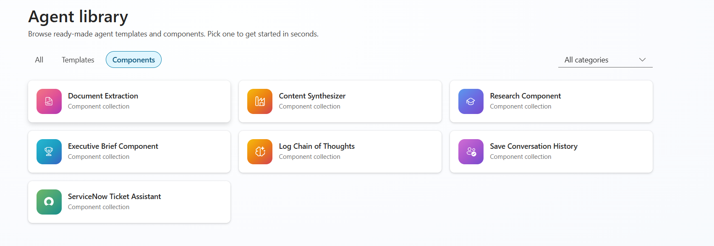

#### Available Components

| **Component** | **Type** | **Description** | **Connections** |
| --- | --- | --- | --- |
| Document Extraction | Component collection | Transforms uploaded documents into structured data using AI Builder | Dataverse |
| Content Synthesizer | Component collection | Shared AI Builder prompt that synthesizes research content into evidence-based sections with citations | Dataverse |
| Research Component | Component collection | 3-stage AI pipeline that synthesizes web sources into a comprehensive research report | Dataverse |
| Executive Brief Component | Component collection | 3-stage AI pipeline that produces decision-oriented executive summaries | Dataverse |
| Log Chain of Thoughts | Component collection | Captures and logs the agent's reasoning chain for debugging and transparency | Dataverse |
| Save Conversation History | Component collection | Persists conversation transcripts for auditing, review, and analytics | Dataverse |
| ServiceNow Ticket Assistant | Component collection | End-to-end ServiceNow incident management via adaptive cards | Dataverse, ServiceNow |

#### Phase 1: Install Components

There are two ways to install components.

##### Option A — Install from the Copilot Studio Kit (Recommended)

1. In the Copilot Studio Kit, navigate to the **Agent Library** and select the **Components** tab.
2. Select a component card to open the component details dialog.

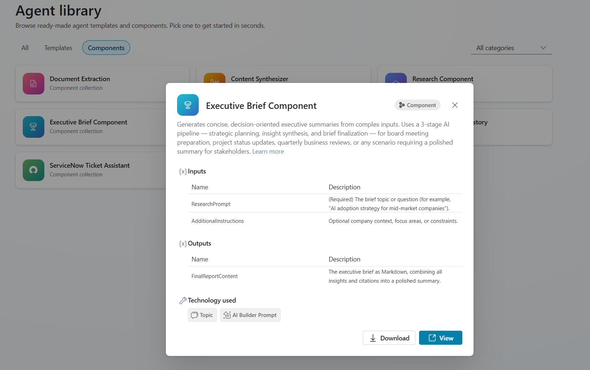

3. Review the component description, inputs, outputs, and technology used.
4. Select **Install** to import the component solution directly into your environment, or select **Download** to save the .zip file for manual import.

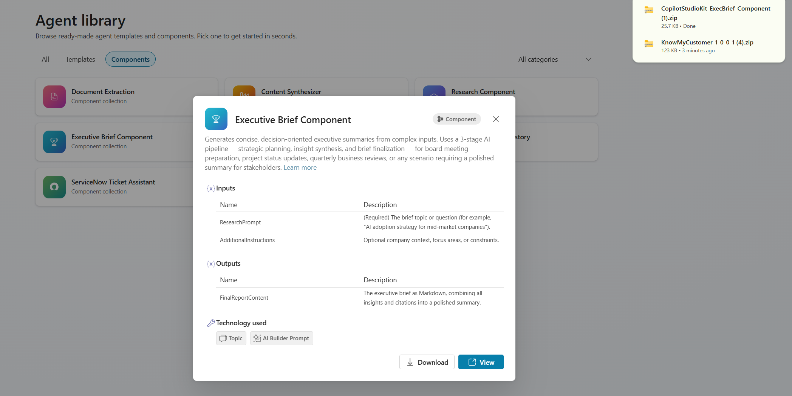

| **Scenario** | **Buttons shown** | **What happens** |
| --- | --- | --- |
| Component is not installed and you have install privileges | **Install** + **Download** | **Install** imports the component solution directly into your environment. |
| Component is not installed and you do not have install privileges | **Download** only | **Download** saves a .zip file that contains the component solution. |
| Component is already installed | **View** + **Download** | **View** deep-links to the component collection in the Copilot Studio portal. |

##### Option B — Manual Import via Power Apps

Use this option to import the component in other environment where Copilot Studio Kit is not installed, or if you downloaded the `.zip` file and need to import it manually.

1. Download the `.zip` file that contains the component solution:
   - **From the Agent Library** — Open the component details dialog and select **Download**.

   


2. Go to [make.powerapps.com](https://make.powerapps.com/). In the top-right corner, verify you are in the correct environment. Use the environment picker to switch if needed.
3. In the left navigation, select **Solutions**.
4. Select **Import solution** from the top command bar.
5. Select **Browse**, then choose the downloaded `.zip` file.
6. If the solution requires connection references (e.g., Dataverse), configure them when prompted during the import wizard.
7. Select **Import** and wait for the import to complete.

> [!IMPORTANT]
> Import the **Content Synthesizer** solution first — the Research Component and Executive Brief Component depend on it. Only import the ServiceNow Ticket Assistant solution if you have a ServiceNow instance.

#### Phase 2: Use Components

After installing components, you need to connect them to your agent.

##### Add Components to Your Agent

1. In the Agent Library, select a component that is already installed. The **View** button appears.

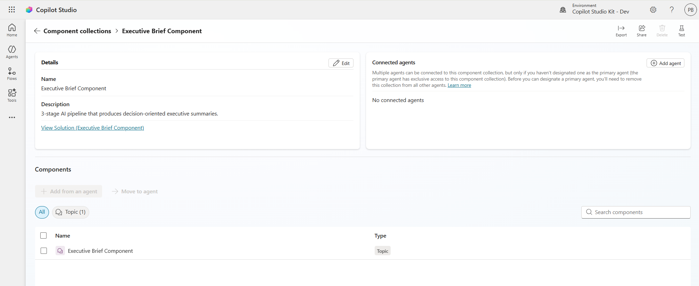

2. Select **View** to open the component collection in Copilot Studio.

3. From the component collection page, connect it to your agent.

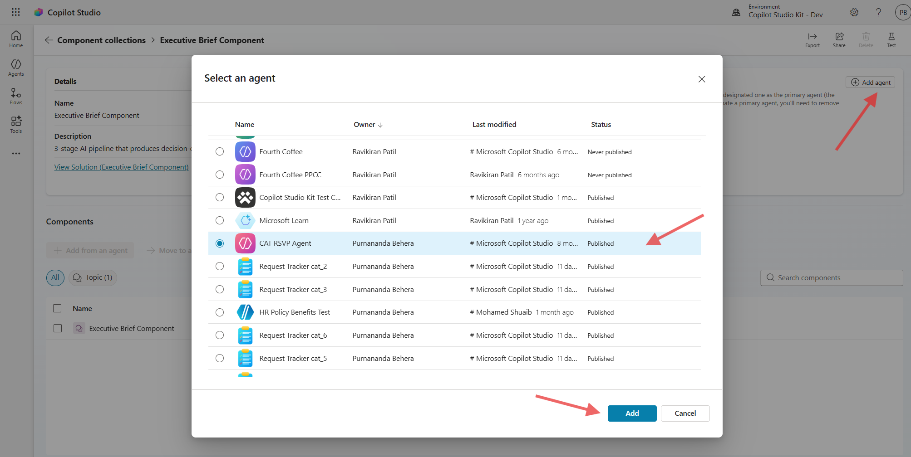

4. Verify the component is connected to your agent.

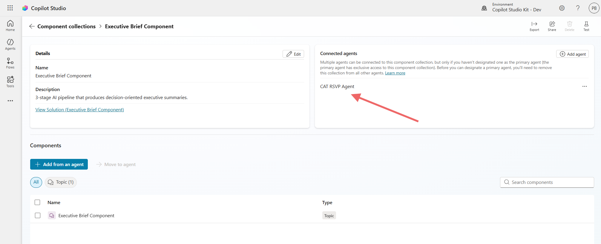

Alternatively, you can add component collections from within any agent in Copilot Studio:

1. Open your agent in [Copilot Studio](https://copilotstudio.microsoft.com/).
2. Select **Settings** (gear icon) in the top bar.
3. In the left menu, select **Component collections**.
4. Find the component collection, select the three dots (**…**), then select **Add to agent**.

Once connected, the component's topics and tools are available inside your agent.

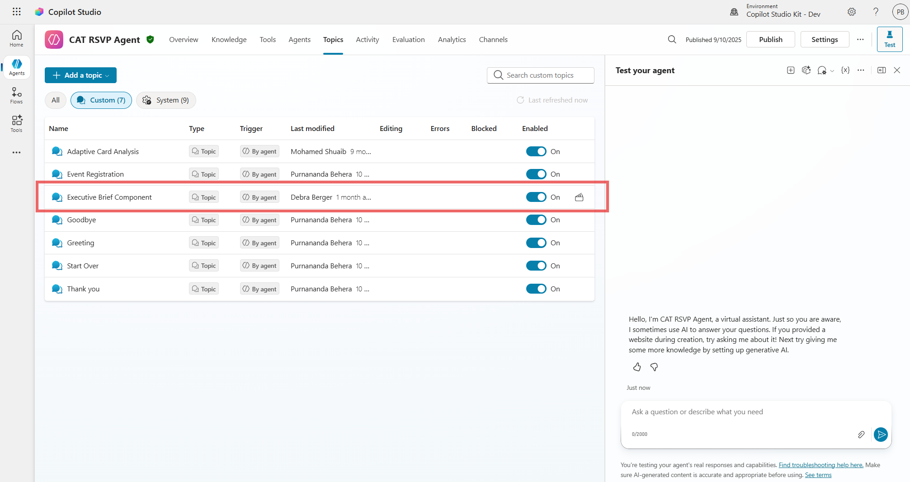

> [!TIP]
> You can control how components are used through your agent's **Instructions** field. Use natural-language instructions to define when each component is invoked, what data to pass, and how results are presented.

---

## End-to-End Usage Guide

This section walks you through the complete workflow of discovering a template, installing it, configuring the agent, and extending it with components.

### Step 1: Discover a Template

1. Open the Copilot Studio Kit and navigate to the **Agent Library**.
2. Use the **All** tab to see what templates and components are available.
3. Switch to the **Templates** tab to browse the catalog.
4. Use search and category filters to find a template that matches your scenario.
5. Select a template card to read the full description, included features, and setup instructions.

### Step 2: Install / Import

**For Custom Agent type templates (system or custom source):**

1. Select **Install** on the template details dialog (recommended) — this imports the solution directly.
2. If you don't have install privileges, select **Download** and follow the manual import steps via Power Apps.
3. Configure any required connection references during installation.

> [!TIP]
> Templates authored by your organization's admins follow the same install workflow as system templates. Look for the **"Custom"** chip on the card to identify organization-specific templates.

**For Declarative Agent type templates:**

1. Choose your preferred path: **Customize & download** (recommended), **Agent Builder** (guided), or **VS Code** (code-first).
2. Download the template package and follow the setup guide.
3. Manually upload the downloaded zip to Teams (see [Declarative Agent Templates](#declarative-agent-templates) for upload steps).

### Step 3: Configure the Agent

1. Open the installed agent in Copilot Studio (for custom agents) or your chosen authoring tool (for declarative agents).
2. Review and customize the agent's **Instructions** — define persona, tone, behavior, and escalation paths.
3. Update **knowledge sources** — connect to your organization's SharePoint sites, Dataverse tables, or external data.
4. Adjust **topics and triggers** — modify conversation flows and trigger phrases to match your users' language.
5. Configure **authentication** if the agent needs to access user-specific data.

### Step 4: Extend with Components

1. Return to the Agent Library and browse the available **Components**.
2. Install the components you need (see [Available Components](#available-components)).
3. Add the component collections to your agent via the Component Library or Copilot Studio settings.
4. Use agent **Instructions** to orchestrate when and how components are invoked.
5. Test each component in the Copilot Studio test pane before publishing.

### Step 5: Test and Publish

1. In Copilot Studio, select **Test your agent** and verify all topics, components, and connections work correctly.
2. Select **Publish** from the top command bar.
3. Verify end-to-end behavior in your target channel (Teams, webchat, etc.).

---

## Best Practices & Notes

### Getting the Most from Templates

- **Start with a template, then customize** — Templates give you a working baseline. Customize instructions, topics, and knowledge sources to match your organization's needs rather than building from scratch.
- **Review all pre-configured topics** — Before publishing, walk through each topic to understand the conversation flow and make adjustments.
- **Test with realistic scenarios** — Use real-world prompts when testing to ensure the agent handles your users' actual language and intent.

### Working with Components

- **Install only what you need** — Each component is packaged independently. Adding unnecessary components increases complexity without adding value.
- **Use managed solutions** — Import the managed solution unless you specifically need to edit component internals. Managed solutions prevent accidental modifications to shared components.
- **Leverage agent instructions** — Your agent's Instructions field is the primary way to control component behavior without editing the component itself. Define when, how, and in what order components should be used.

### Connection Management

- **Set up connections before publishing** — Missing or expired connections are the most common cause of runtime failures.
- **Use service accounts for shared agents** — When an agent is used by multiple people, configure connections with a service account rather than personal credentials.
- **Monitor connection health** — Periodically check the Agent Library for connection reference warnings and refresh as needed.

### Environment Considerations

- **One instance per environment** — Components are shared across all agents in an environment. Changes to a component affect every agent that uses it.
- **Test in a development environment first** — Install and validate templates in a non-production environment before promoting to production.
- **Keep solutions up to date** — Check the [Copilot Studio Kit releases](https://github.com/microsoft/Power-CAT-Copilot-Studio-Kit/releases) for new templates, components, and improvements.

### Custom Template Management (Admin)

- **Start with Inactive status** — Author and refine templates as drafts before publishing to makers. This prevents incomplete templates from appearing in the maker gallery.
- **Use descriptive icons and accents** — A well-themed template card helps makers quickly identify the right agent. Choose icons and accent colors that visually communicate the template's purpose.
- **Provide learn-more and setup-guide URLs** — Link to documentation or setup guides to help makers understand the template before installing.
- **Delete with caution** — Deleting a custom template is permanent with no undo. Previously installed agents are not affected, but the template can no longer be discovered or reinstalled from the library.
- **Keep solution ZIPs up to date** — When you update an agent solution, edit the custom template and replace the attached ZIP so makers always install the latest version.

---

## Related Content

- [Copilot Studio Kit overview](https://learn.microsoft.com/microsoft-copilot-studio/guidance/kit-overview)
- [Install Copilot Studio Kit](https://learn.microsoft.com/microsoft-copilot-studio/guidance/kit-install)
- [Component Library documentation](https://github.com/microsoft/Power-CAT-Copilot-Studio-Kit/blob/main/COMPONENT_LIBRARY.md)
- [Create and share reusable component collections](https://learn.microsoft.com/microsoft-copilot-studio/authoring-export-import-copilot-components)
- [Create and manage solutions in Copilot Studio](https://learn.microsoft.com/microsoft-copilot-studio/authoring-solutions-overview)
- [Export and import agents using solutions](https://learn.microsoft.com/microsoft-copilot-studio/authoring-solutions-import-export)
