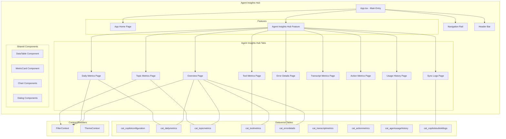
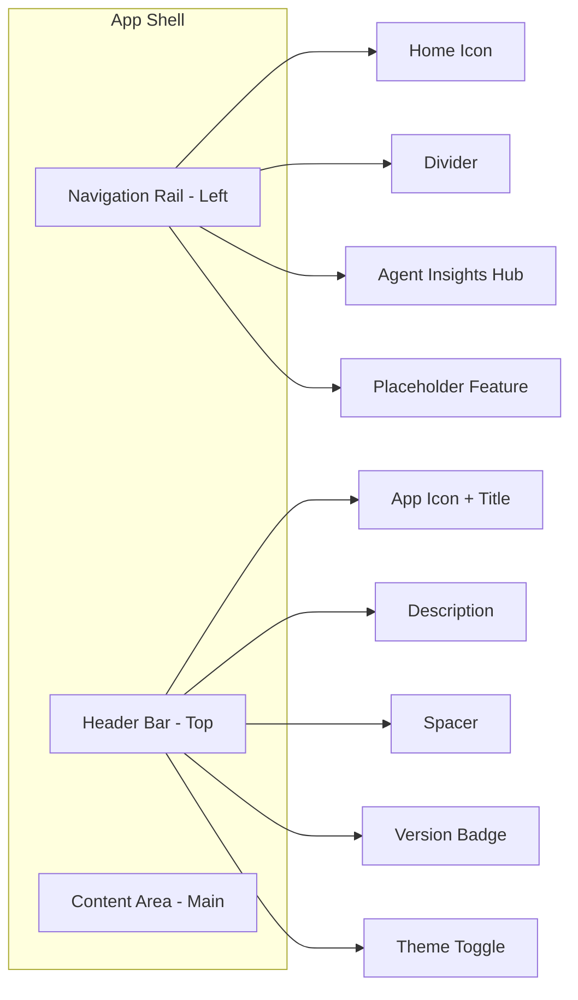
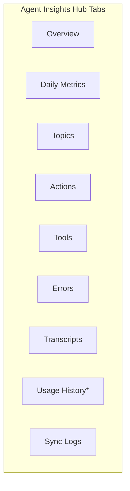
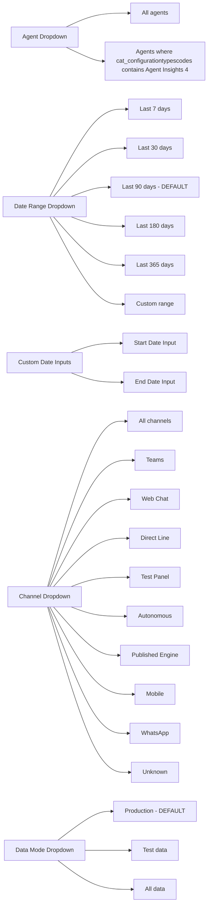

# Agent Insights Hub - Feature Requirements Document (FRD)

## 1. Executive Summary

### 1.1 Application Name

**Agent Insights Hub**

### 1.2 Description

Agent Insights Hub is a comprehensive analytics and monitoring dashboard for Microsoft Copilot Studio agents. It provides real-time visibility into agent performance, conversation metrics, topic analytics, tool execution, and error tracking. Built as a Power Apps Code Apps using React and Fluent UI, it connects directly to Dataverse to display aggregated telemetry data imported from Azure Application Insights, Conversation Transcripts and Agent Usage data.

### 1.3 Problem Statement

Organizations deploying Copilot Studio agents lack a centralized, user-friendly dashboard to:

- Monitor agent performance across multiple dimensions (conversations, users, response times)
- Analyze topic and tool effectiveness
- Track and troubleshoot errors
- Compare metrics across different time periods
- Export data for further analysis
- Manage agent configurations

### 1.4 Target Users

- Copilot Studio administrators
- Agent developers
- Business analysts
- IT operations teams

---

## 2. Application Architecture

### 2.1 Technology Stack

| Component   | Technology                           |
| ----------- | ------------------------------------ |
| Framework   | React 18.2                           |
| UI Library  | Fluent UI React Components 9.54.0    |
| Charts      | @fluentui/react-charts 9.3.8         |
| Build Tool  | Vite 5.4.21                          |
| Language    | TypeScript                           |
| Data Source | Microsoft Dataverse                  |
| Deployment  | Power Apps Code Apps (pac code push) |
| Export      | ExcelJS, XLSX                        |

### 2.2 High-Level Architecture Diagram



---

## 3. Dataverse Schema

### 3.1 Agent Configuration Table (cat_copilotconfiguration)

| Column Name                             | Type          | Required | Description                                                                                            |
| --------------------------------------- | ------------- | -------- | ------------------------------------------------------------------------------------------------------ |
| cat_copilotconfigurationid              | GUID          | Yes      | Primary key                                                                                            |
| cat_name                                | NVARCHAR(100) | Yes      | Configuration name (display name)                                                                      |
| cat_agentname                           | NVARCHAR(200) | No       | Agent display name                                                                                     |
| cat_copilotid                           | NVARCHAR(36)  | Yes      | Copilot/Agent Id                                                                                       |
| cat_dataverseurl                        | URL           | Yes      | Dataverse instance URL                                                                                 |
| cat_agents                              | LOOKUP        | No       | Related to cat_agentdetails                                                                            |
| cat_configurationtypescodes             | CHOICE        | Yes      | Multi-select: Test Automation (1), Conversation KPIs (2), File Synchronization (3), Agent Insights (4) |
| cat_azureappinsightsapplicationid       | NVARCHAR(100) | No       | App Insights Application ID                                                                            |
| cat_azureappinsightstenantid            | NVARCHAR(100) | No       | App Insights Tenant ID                                                                                 |
| cat_azureappinsightsclientid            | NVARCHAR(100) | No       | App Insights Client ID                                                                                 |
| cat_azureappinsightssecretlocationcode  | CHOICE        | No       | Dataverse (1), Key Vault (2)                                                                           |
| cat_azureappinsightssecret              | NVARCHAR(200) | No       | App Insights Secret                                                                                    |
| cat_azureappinsightsenvironmentvariable | NVARCHAR(200) | No       | Environment variable name for secret                                                                   |
| statecode                               | STATE         | No       | Active (0), Inactive (1)                                                                               |

### 3.2 Daily Metrics Table (cat_dailymetrics)

| Column Name                      | Type           | Required | Description                                 |
| -------------------------------- | -------------- | -------- | ------------------------------------------- |
| cat_dailymetricsid               | GUID           | Yes      | Primary key                                 |
| cat_dailymetricsname             | NVARCHAR(850)  | Yes      | Record name                                 |
| cat_agentconfiguration           | LOOKUP         | No       | Related to cat_copilotconfiguration         |
| cat_agentname                    | NVARCHAR(200)  | Yes      | Agent name for display                      |
| cat_metricdate                   | DATE ONLY      | Yes      | Date of metrics                             |
| cat_channelid                    | NVARCHAR(100)  | Yes      | Channel identifier (msteams, webchat, etc.) |
| cat_datasourcecode               | CHOICE         | Yes      | Production (1), Test Data (2)               |
| cat_dailyconversationcount       | INT            | No       | Number of conversations                     |
| cat_dailyuniqueusers             | INT            | No       | Unique users count                          |
| cat_dailyuniquetools             | INT            | No       | Unique tools used                           |
| cat_dailyuniquetopics            | INT            | No       | Unique topics triggered                     |
| cat_totalusermessages            | INT            | No       | Total user messages                         |
| cat_totalresponses               | INT            | No       | Total agent responses                       |
| cat_totalresponsetimems          | DECIMAL        | No       | Sum of response times (ms)                  |
| cat_minresponsetimems            | DECIMAL        | No       | Minimum response time (ms)                  |
| cat_maxresponsetimems            | DECIMAL        | No       | Maximum response time (ms)                  |
| cat_p10responsetimems            | DECIMAL        | No       | 10th percentile response time               |
| cat_p50responsetimems            | DECIMAL        | No       | 50th percentile (median) response time      |
| cat_p90responsetimems            | DECIMAL        | No       | 90th percentile response time               |
| cat_p95responsetimems            | DECIMAL        | No       | 95th percentile response time               |
| cat_p99responsetimems            | DECIMAL        | No       | 99th percentile response time               |
| cat_stddevresponsetimems         | DECIMAL        | No       | Standard deviation of response time         |
| cat_slowresponses16s             | INT            | No       | Count of responses > 16 seconds             |
| cat_totaldurationms              | DECIMAL        | No       | Total conversation duration (ms)            |
| cat_conversationcountforduration | INT            | No       | Conversations with duration data            |
| cat_mediandurationms             | DECIMAL        | No       | Median duration (ms)                        |
| cat_p95durationms                | DECIMAL        | No       | 95th percentile duration                    |
| cat_singleturnconversations      | INT            | No       | Single-turn conversation count              |
| cat_multiturnconversations       | INT            | No       | Multi-turn conversation count               |
| cat_shortconversations           | INT            | No       | Short conversations (<1 min)                |
| cat_mediumconversations          | INT            | No       | Medium conversations (1-10 min)             |
| cat_longconversations            | INT            | No       | Long conversations (>10 min)                |
| cat_errorcount                   | INT            | No       | Error count                                 |
| cat_toolcallcount                | INT            | No       | Total tool calls                            |
| cat_toolsuccesscount             | INT            | No       | Successful tool calls                       |
| cat_toolfailurecount             | INT            | No       | Failed tool calls                           |
| cat_totaltoolresponsetimems      | DECIMAL        | No       | Total tool response time                    |
| cat_maxtoolresponsetimems        | DECIMAL        | No       | Max tool response time                      |
| cat_p50toolresponsetimems        | DECIMAL        | No       | P50 tool response time                      |
| cat_p95toolresponsetimems        | DECIMAL        | No       | P95 tool response time                      |
| cat_topusersdisplay              | MULTILINE TEXT | No       | JSON array of top users                     |

### 3.3 Topic Metrics Table (cat_topicmetrics)

| Column Name                  | Type          | Required | Description                         |
| ---------------------------- | ------------- | -------- | ----------------------------------- |
| cat_topicmetricsid           | GUID          | Yes      | Primary key                         |
| cat_topicmetricsname         | NVARCHAR(850) | Yes      | Record name                         |
| cat_agentconfiguration       | LOOKUP        | No       | Related to cat_copilotconfiguration |
| cat_agentname                | NVARCHAR(200) | Yes      | Agent name                          |
| cat_topicname                | NVARCHAR(500) | Yes      | Topic name                          |
| cat_metricdate               | DATE ONLY     | Yes      | Metric date                         |
| cat_channelid                | NVARCHAR(100) | Yes      | Channel identifier                  |
| cat_datasourcecode           | CHOICE        | Yes      | Production (1), Test Data (2)       |
| cat_triggercount             | INT           | No       | Times topic was triggered           |
| cat_completioncount          | INT           | No       | Successful completions              |
| cat_completionrate           | DECIMAL       | No       | Completion percentage               |
| cat_abandonmentcount         | INT           | No       | Abandonments                        |
| cat_abandonmentrate          | DECIMAL       | No       | Abandonment percentage              |
| cat_redirectcount            | INT           | No       | Redirects to other topics           |
| cat_errorcount               | INT           | No       | Errors in topic                     |
| cat_errorrate                | DECIMAL       | No       | Error percentage                    |
| cat_dailyuniqueconversations | INT           | No       | Unique conversations                |
| cat_dailyuniqueusers         | INT           | No       | Unique users                        |
| cat_totaldurationms          | INT           | No       | Total duration                      |
| cat_durationcount            | INT           | No       | Duration sample count               |
| cat_mediandurationms         | INT           | No       | Median duration                     |
| cat_mindurationms            | INT           | No       | Minimum duration                    |
| cat_maxdurationms            | INT           | No       | Maximum duration                    |
| cat_p95durationms            | INT           | No       | 95th percentile duration            |
| cat_messagecount             | INT           | No       | Total messages                      |
| cat_messagesin               | INT           | No       | User messages                       |
| cat_messagesout              | INT           | No       | Agent messages                      |
| cat_actioncount              | INT           | No       | Actions executed                    |
| cat_totalactionelapsedms     | INT           | No       | Total action time                   |
| cat_maxactionelapsedms       | INT           | No       | Max action time                     |
| cat_p90actionelapsedms       | INT           | No       | P90 action time                     |
| cat_nodekindsdisplay         | NVARCHAR(200) | No       | Node types used                     |

### 3.4 Action Metrics Table (cat_actionmetrics)

| Column Name                | Type          | Required | Description                         |
| -------------------------- | ------------- | -------- | ----------------------------------- |
| cat_actionmetricsid        | GUID          | Yes      | Primary key                         |
| cat_actionmetricsname      | NVARCHAR(850) | Yes      | Record name                         |
| cat_agentconfiguration     | LOOKUP        | No       | Related to cat_copilotconfiguration |
| cat_agentname              | NVARCHAR(200) | Yes      | Agent name                          |
| cat_nodekind               | NVARCHAR(100) | Yes      | Action node type                    |
| cat_actionid               | NVARCHAR(200) | No       | Action identifier                   |
| cat_topicid                | NVARCHAR(200) | No       | Parent topic ID                     |
| cat_metricdate             | DATE ONLY     | Yes      | Metric date                         |
| cat_channelid              | NVARCHAR(100) | Yes      | Channel identifier                  |
| cat_datasourcecode         | CHOICE        | Yes      | Production (1), Test Data (2)       |
| cat_executioncount         | INT           | No       | Execution count                     |
| cat_dailyconversationcount | INT           | No       | Conversations using action          |
| cat_totalelapsedms         | DECIMAL       | No       | Total elapsed time                  |
| cat_avgelapsedms           | DECIMAL       | No       | Average elapsed time                |
| cat_minelapsedms           | DECIMAL       | No       | Minimum elapsed time                |
| cat_maxelapsedms           | DECIMAL       | No       | Maximum elapsed time                |
| cat_p10elapsedms           | DECIMAL       | No       | P10 elapsed time                    |
| cat_p50elapsedms           | DECIMAL       | No       | P50 elapsed time                    |
| cat_p90elapsedms           | DECIMAL       | No       | P90 elapsed time                    |
| cat_p95elapsedms           | DECIMAL       | No       | P95 elapsed time                    |
| cat_p99elapsedms           | DECIMAL       | No       | P99 elapsed time                    |
| cat_stddevelapsedms        | DECIMAL       | No       | Standard deviation                  |

### 3.5 Tool Metrics Table (cat_toolmetrics)

| Column Name              | Type           | Required | Description                         |
| ------------------------ | -------------- | -------- | ----------------------------------- |
| cat_toolmetricsid        | GUID           | Yes      | Primary key                         |
| cat_toolmetricsname      | NVARCHAR(850)  | Yes      | Record name                         |
| cat_agentconfiguration   | LOOKUP         | No       | Related to cat_copilotconfiguration |
| cat_agentname            | NVARCHAR(200)  | Yes      | Agent name                          |
| cat_toolname             | NVARCHAR(500)  | Yes      | Tool/connector name                 |
| cat_tooltype             | NVARCHAR(100)  | Yes      | Tool type (Action, Connector, etc.) |
| cat_metricdate           | DATE ONLY      | Yes      | Metric date                         |
| cat_channelid            | NVARCHAR(100)  | No       | Channel identifier                  |
| cat_datasourcecode       | CHOICE         | Yes      | Production (1), Test Data (2)       |
| cat_callcount            | INT            | No       | Total tool calls                    |
| cat_successcount         | INT            | No       | Successful calls                    |
| cat_successrate          | DECIMAL        | No       | Success percentage                  |
| cat_failurecount         | INT            | No       | Failed calls                        |
| cat_failurerate          | DECIMAL        | No       | Failure percentage                  |
| cat_avgresponsetimems    | DECIMAL        | No       | Average response time               |
| cat_minresponsetimems    | DECIMAL        | No       | Minimum response time               |
| cat_maxresponsetimems    | DECIMAL        | No       | Maximum response time               |
| cat_medianresponsetimems | DECIMAL        | No       | Median response time                |
| cat_p90responsetimems    | DECIMAL        | No       | P90 response time                   |
| cat_p95responsetimems    | DECIMAL        | No       | P95 response time                   |
| cat_p99responsetimems    | DECIMAL        | No       | P99 response time                   |
| cat_stddevresponsetimems | DECIMAL        | No       | Standard deviation                  |
| cat_uniqueconversations  | INT            | No       | Unique conversations                |
| cat_firstcall            | DATETIME       | No       | First call timestamp                |
| cat_lastcall             | DATETIME       | No       | Last call timestamp                 |
| cat_errorcodes           | NVARCHAR(2000) | No       | Error codes encountered             |
| cat_resultcodes          | NVARCHAR(100)  | No       | Result codes                        |

### 3.6 Error Details Table (cat_errordetails)

| Column Name                    | Type           | Required | Description                         |
| ------------------------------ | -------------- | -------- | ----------------------------------- |
| cat_errordetailsid             | GUID           | Yes      | Primary key                         |
| cat_errordetailsname           | NVARCHAR(850)  | Yes      | Record name                         |
| cat_agentconfiguration         | LOOKUP         | No       | Related to cat_copilotconfiguration |
| cat_agentname                  | NVARCHAR(200)  | Yes      | Agent name                          |
| cat_errorcode                  | NVARCHAR(200)  | Yes      | Error code                          |
| cat_metricdate                 | DATE ONLY      | Yes      | Error date                          |
| cat_channelid                  | NVARCHAR(100)  | No       | Channel identifier                  |
| cat_datasourcecode             | CHOICE         | Yes      | Production (1), Test Data (2)       |
| cat_errorcount                 | INT            | No       | Error occurrence count              |
| cat_dailyaffectedconversations | INT            | No       | Affected conversations              |
| cat_dailyaffectedusers         | INT            | No       | Affected users                      |
| cat_totalsessionsforday        | INT            | No       | Total sessions that day             |
| cat_affectedtopics             | NVARCHAR(4000) | No       | Topics with errors                  |
| cat_sampleerrormessages        | NVARCHAR(4000) | No       | Sample error messages               |
| cat_firstoccurence             | DATETIME       | No       | First occurrence                    |
| cat_lastoccurence              | DATETIME       | No       | Last occurrence                     |
| cat_sessionid                  | NVARCHAR(200)  | No       | Sample session ID                   |

### 3.7 Transcript Metrics Table (cat_transcriptmetrics)

| Column Name                | Type           | Required | Description                                |
| -------------------------- | -------------- | -------- | ------------------------------------------ |
| cat_transcriptmetricsid    | GUID           | Yes      | Primary key                                |
| cat_transcriptmetricname   | NVARCHAR(850)  | Yes      | Record name                                |
| cat_agentconfigurationid   | LOOKUP         | No       | Related to cat_copilotconfiguration        |
| cat_agentconfigurationname | NVARCHAR(100)  | No       | Agent configuration display name           |
| cat_agentid                | NVARCHAR(100)  | Yes      | Agent identifier                           |
| cat_conversationdate       | DATE ONLY      | Yes      | Conversation date                          |
| cat_channelid              | NVARCHAR(100)  | Yes      | Channel identifier                         |
| cat_datasourcecode         | CHOICE         | No       | Production (1), Test Data (2)              |
| cat_totalconversations     | INT            | No       | Total conversations                        |
| cat_sessioncount           | INT            | No       | Total sessions (multiple per conversation) |
| cat_engagedcount           | INT            | No       | Engaged session count                      |
| cat_unengagedcount         | INT            | No       | Unengaged session count                    |
| cat_resolvedcount          | INT            | No       | Resolved session count                     |
| cat_escalatedcount         | INT            | No       | Escalated session count (default: 0)       |
| cat_abandonedcount         | INT            | No       | Abandoned session count                    |
| cat_totalturns             | INT            | No       | Total conversation turns                   |
| cat_csatcount              | INT            | No       | CSAT survey response count                 |
| cat_csatscore              | INT            | No       | CSAT score (1-5 scale)                     |
| cat_feedbacklikecount      | INT            | No       | Thumbs up count                            |
| cat_feedbackdislikecount   | INT            | No       | Thumbs down count                          |
| cat_feedbacktextcount      | INT            | No       | Text feedback count                        |
| cat_feedbackdetails        | MULTILINE TEXT | No       | JSON array of feedback details             |
| cat_isdesignmodecode       | CHOICE         | No       | No (0), Yes (1)                            |

### 3.8 Agent Usage History Table (cat_agentusagehistory)

| Column Name                 | Type          | Required | Description                     |
| --------------------------- | ------------- | -------- | ------------------------------- |
| cat_agentusagehistoryid     | GUID          | Yes      | Primary key                     |
| cat_name                    | NVARCHAR(850) | Yes      | Record name (alternate key)     |
| cat_agent                   | LOOKUP        | No       | Related to cat_agentdetails     |
| cat_agentid                 | NVARCHAR(100) | No       | Agent identifier                |
| cat_environmentid           | NVARCHAR(100) | No       | Environment identifier          |
| cat_featurename             | NVARCHAR(200) | No       | Name of the feature used        |
| cat_usagedate               | DATE ONLY     | No       | Date of usage                   |
| cat_billedcopilotcredits    | DECIMAL       | No       | Billed Copilot credits consumed |
| cat_nonbilledcopilotcredits | DECIMAL       | No       | Non-billed Copilot credits      |

### 3.89 Copilot Studio Kit Logs Table (cat_copilotstudiokitlogs)

| Column Name                | Type           | Required | Description                                                          |
| -------------------------- | -------------- | -------- | -------------------------------------------------------------------- |
| cat_copilotstudiokitlogsid | GUID           | Yes      | Primary key                                                          |
| cat_name                   | NVARCHAR(100)  | No       | Record name                                                          |
| createdon                  | DATE & TIME    | No       | Created On                                                           |
| cat_executionstatuscode    | CHOICE         | Yes      | Not Started (1), Running (2), Complete (3), Error (4), Cancelled (5) |
| cat_cloudflowname          | NVARCHAR(200)  | No       | Name of the Cloud Flow                                               |
| cat_cloudflowinstanceurl   | URL            | No       | Link to Cloud Flow run instance                                      |
| cat_copilotconfigurationid | LOOKUP         | No       | Related to cat_copilotconfiguration                                  |
| cat_startdate              | DATE ONLY      | No       | Sync start date                                                      |
| cat_enddate                | DATE ONLY      | No       | Sync end date                                                        |
| cat_errormessage           | MULTILINE TEXT | No       | Error message if failed                                              |

---

## 4. UI Layout and Navigation

### 4.1 Application Shell



### 4.2 Navigation Rail Specifications

| Element         | Collapsed State            | Expanded State      |
| --------------- | -------------------------- | ------------------- |
| Width           | 48px                       | 220px               |
| Toggle Button   | Navigation24Regular icon   | Same, toggles state |
| Home Item       | Icon only with tooltip     | Icon + "Home" label |
| Feature Items   | Icon only with tooltip     | Icon + feature name |
| Mobile (<768px) | Hidden by default, overlay | Full width overlay  |

### 4.3 Header Bar Specifications

| Element       | Description                                      |
| ------------- | ------------------------------------------------ |
| App Icon      | Circular badge with "C" letter, brand background |
| App Name      | Dynamic based on active feature                  |
| Description   | Feature description (hidden on mobile)           |
| Version Label | "v{APP_VERSION}" badge                           |
| Theme Toggle  | Sun/Moon icons for light/dark theme              |

---

## 5. Agent Insights Hub Feature

### 5.1 Tab Navigation



\*Note: Usage History tab only visible when `cat_agentusagehistory` table has data.

### 5.2 Global Filters Bar

The filter bar appears below tabs on all pages except Sync Logs and Usage History.

**Agent Dropdown Filtering Rules:**

- **All pages except Usage History**: Show agents from `cat_copilotconfiguration` where `cat_configurationtypescodes` contains Agent Insights (4)
- **Usage History page**: Show all agents for which usage history data exists in `cat_agentusagehistory` table (has its own agent lookup)



#### Filter Data Sources

| Filter     | Source                           | Logic                                                                                                     |
| ---------- | -------------------------------- | --------------------------------------------------------------------------------------------------------- |
| Agent      | `cat_copilotconfiguration` table | Fetch active records where `cat_configurationtypescodes` contains Agent Insights (4), sort by `cat_name`  |
| Date Range | Hardcoded options                | Calculate `startDate` and `endDate` based on selection                                                    |
| Channel    | Hardcoded array                  | Values: Teams, Web Chat, Direct Line, Test Panel, Autonomous, Published Engine, Mobile, WhatsApp, Unknown |
| Data Mode  | Hardcoded options                | Filter by `cat_datasourcecode`: 1=Production, 2=Test                                                      |

> **Note:** Usage History page uses a different agent filter - it shows agents for which usage history data exists in `cat_agentusagehistory` table, regardless of configuration type.

#### Channel Display Name Mapping

```typescript
const displayNames: Record<string, string> = {
  msteams: "Teams",
  webchat: "Web Chat",
  directline: "Direct Line",
  "pva-studio": "Test Panel",
  "pva-autonomous": "Autonomous",
  "pva-published-engine-direct": "Published Engine",
  mobile: "Mobile",
  whatsapp: "WhatsApp",
  unknown: "Unknown",
};
```

---

## 6. Page Specifications

### 6.1 Overview Page (Home Tab)

**Purpose:** Central dashboard providing at-a-glance KPIs, usage trends, error monitoring, and performance insights for all configured agents.

#### 6.1.1 Layout

```
┌─────────────────────────────────────────────────────────────────────────────┐
│ GLOBAL FILTER BAR                                                           │
│ [Agent ▼] [Date Range ▼] [Start Date] [End Date] [Channel ▼] [Data Mode ▼]  │
├─────────────────────────────────────────────────────────────────────────────┤
│ ACTION BUTTONS ROW                                                          │
│ [Sync now] [Add agent] [Bulk import] [Show agents]                          │
├─────────────────────────────────────────────────────────────────────────────┤
│ METRIC CARDS ROW (7 cards)                                                  │
│ [Total Conversations] [Daily Active Users] [Responses] [Avg Response]       │
│ [Duration] [Errors] [Tool Success %]                                        │
├─────────────────────────────────────────────────────────────────────────────┤
│ USAGE OVERVIEW Section                                                      │
│ ┌─────────────────────────────────┐ ┌─────────────────────────────────┐     │
│ │ Top topics                      │ │ Conversations by channel        │     │
│ │ (Horizontal Bar - Top 5)        │ │ (Donut Chart)                   │     │
│ └─────────────────────────────────┘ └─────────────────────────────────┘     │
├─────────────────────────────────────────────────────────────────────────────┤
│ SESSION ANALYSIS Section                                                    │
│ ┌─────────────────────────────────┐ ┌─────────────────────────────────┐     │
│ │ Single vs Multi-turn sessions   │ │ Session duration distribution   │     │
│ │ (Donut Chart)                   │ │ (Donut Chart)                   │     │
│ └─────────────────────────────────┘ └─────────────────────────────────┘     │
├─────────────────────────────────────────────────────────────────────────────┤
│ HEALTH & ERRORS Section                                                     │
│ ┌─────────────────────────────────┐ ┌─────────────────────────────────┐     │
│ │ Error distribution by type      │ │ Tool success rate (%)           │     │
│ │ (Donut Chart)                   │ │ (Horizontal Bar - Top 3)        │     │
│ └─────────────────────────────────┘ └─────────────────────────────────┘     │
├─────────────────────────────────────────────────────────────────────────────┤
│ RESPONSE PERFORMANCE Section (2x2 Grid)                                     │
│ ┌─────────────────────────────────┐ ┌─────────────────────────────────┐     │
│ │ Avg response time (seconds)     │ │ P90 response time (seconds)     │     │
│ │ (Bar Chart)                     │ │ (Bar Chart)                     │     │
│ └─────────────────────────────────┘ └─────────────────────────────────┘     │
│ ┌─────────────────────────────────┐ ┌─────────────────────────────────┐     │
│ │ Response time percentiles (s)   │ │ Slow responses over time (>16s) │     │
│ │ (Grouped Vertical Bar)          │ │ (Bar Chart)                     │     │
│ └─────────────────────────────────┘ └─────────────────────────────────┘     │
├─────────────────────────────────────────────────────────────────────────────┤
│ SLOWEST EXECUTION (TOP 10) Section                                          │
│ ┌─────────────────────────────────┐ ┌─────────────────────────────────┐     │
│ │ Tool execution (Top 10 slowest) │ │ Topic execution (Top 10 slowest)│     │
│ │ (Horizontal Bar)                │ │ (Horizontal Bar)                │     │
│ └─────────────────────────────────┘ └─────────────────────────────────┘     │
├─────────────────────────────────────────────────────────────────────────────┤
│ ACTIVE USERS Section                                                        │
│ [Interactive Tags for unique users from cat_topusersdisplay] [Copy all btn] │
└─────────────────────────────────────────────────────────────────────────────┘
```

#### 6.1.2 Action Buttons

| Button      | Icon                 | Style   | Dialog                | Description                    |
| ----------- | -------------------- | ------- | --------------------- | ------------------------------ |
| Sync now    | ArrowSync24Regular   | Outline | GenerateMetricsDialog | Trigger historical backfill    |
| Add agent   | Add24Regular         | Primary | AddAgentDialog        | Add new agent configuration    |
| Bulk import | ArrowUpload24Regular | Outline | BulkImportDialog      | Bulk import configurations     |
| Show agents | Eye24Regular         | Outline | ShowAgentsDialog      | View/manage all configurations |

#### 6.1.3 Metric Cards (7 cards)

| Metric              | Label                 | Source                                                                          | Aggregation    | Trend Calculation                                        |
| ------------------- | --------------------- | ------------------------------------------------------------------------------- | -------------- | -------------------------------------------------------- |
| Total Conversations | "Total Conversations" | cat_dailymetrics.cat_dailyconversationcount                                     | SUM            | Compare current period vs previous period of same length |
| Daily Active Users  | "Daily Active Users"  | cat_dailymetrics.cat_dailyuniqueusers                                           | SUM            | % change from previous period                            |
| Responses           | "Responses"           | cat_dailymetrics.cat_totalresponses                                             | SUM            | % change                                                 |
| Avg Response        | "Avg Response"        | cat_dailymetrics.cat_totalresponsetimems / cat_totalresponses                   | Weighted AVG   | % change                                                 |
| Duration            | "Duration"            | cat_dailymetrics.cat_totaldurationms / cat_conversationcountforduration / 60000 | AVG in minutes | % change                                                 |
| Errors              | "Errors"              | cat_dailymetrics.cat_errorcount                                                 | SUM            | % change (lower is better)                               |
| Tool Success        | "Tool Success"        | (cat_toolsuccesscount / cat_toolcallcount) \* 100                               | Percentage     | % change                                                 |

#### 6.1.4 Charts on Overview Page

The Overview page is organized into sections with charts:

**USAGE OVERVIEW Section:**

| Chart                    | Type                        | Data Source      | Description                                           |
| ------------------------ | --------------------------- | ---------------- | ----------------------------------------------------- |
| Top topics               | Horizontal Bar (TopicsList) | cat_topicmetrics | Top 5 topics by invoked conversations (trigger count) |
| Conversations by channel | Donut Chart                 | cat_dailymetrics | Distribution by channel with center total             |

**SESSION ANALYSIS Section:**

| Chart                         | Type        | Data Source      | Description                                               |
| ----------------------------- | ----------- | ---------------- | --------------------------------------------------------- |
| Single vs Multi-turn sessions | Donut Chart | cat_dailymetrics | cat_singleturnconversations vs cat_multiturnconversations |
| Session duration distribution | Donut Chart | cat_dailymetrics | Short (<1min), Medium (1-10min), Long (>10min)            |

**HEALTH & ERRORS Section:**

| Chart                      | Type           | Data Source      | Description                        |
| -------------------------- | -------------- | ---------------- | ---------------------------------- |
| Error distribution by type | Donut Chart    | cat_errordetails | Error types (SystemError, etc.)    |
| Tool success rate (%)      | Horizontal Bar | cat_toolmetrics  | Top 5 tools with success % (0-100) |

**RESPONSE PERFORMANCE Section:**

| Chart                               | Type         | Data Source      | Description                           |
| ----------------------------------- | ------------ | ---------------- | ------------------------------------- |
| Average response time (seconds)     | Bar Chart    | cat_dailymetrics | Daily average response time trend     |
| P90 response time (seconds)         | Bar Chart    | cat_dailymetrics | Daily P90 response time trend         |
| Response time percentiles (seconds) | Vertical Bar | cat_dailymetrics | Grouped P50, P90, P95, P99 comparison |
| Slow responses over time (>16s)     | Bar Chart    | cat_dailymetrics | Daily count of slow responses (>16s)  |

**SLOWEST EXECUTION (TOP 10) Section:**

| Chart                            | Type           | Data Source      | Description                           |
| -------------------------------- | -------------- | ---------------- | ------------------------------------- |
| Tool execution (Top 10 slowest)  | Horizontal Bar | cat_toolmetrics  | Top 10 slowest tools by avg exec time |
| Topic execution (Top 10 slowest) | Horizontal Bar | cat_topicmetrics | Top 10 slowest topics by median time  |

#### 6.1.5 Active Users Section

- Extract unique users from `cat_dailymetrics.cat_topusersdisplay` (JSON array)
- Display as interactive tags (InteractionTag component)
- Add Copy all users button

#### 6.1.6 Empty State (First-time User Experience)

When users first open the app without any agent configurations or metrics data, the Overview page displays a centered empty state instead of the normal dashboard.

**Two Empty State Scenarios:**

**Scenario 1: No Agent Configurations Exist**

```
┌─────────────────────────────────────────────────────────────────────────────┐
│                                                                             │
│                         ┌──────────────────┐                                │
│                         │   📁 (Folder)    │   80x80px circular bg          │
│                         └──────────────────┘                                │
│                                                                             │
│                         No insights yet                                     │
│                                                                             │
│             Add agents to start seeing insights about your                  │
│             Agent performance and user engagement.                          │
│                                                                             │
│        Learn more(https://github.com/microsoft/Power-CAT-Copilot-Studio-Kit)│
│                                                                             │
│           [+ Add agent]  [↑ Bulk import]  [⟳ Sync now]                     │
│                                                                             │
└─────────────────────────────────────────────────────────────────────────────┘
```

**Scenario 2: Configurations Exist but No Metrics Data**

```
┌─────────────────────────────────────────────────────────────────────────────┐
│                                                                             │
│                         ┌──────────────────┐                                │
│                         │   📁 (Folder)    │   80x80px circular bg          │
│                         └──────────────────┘                                │
│                                                                             │
│                         No insights yet                                     │
│                                                                             │
│             You have {n} agent configuration(s). Sync to                    │
│             start collecting metrics data.                                  │
│                                                                             │
│                            Learn more                                       │
│                                                                             │
│           [+ Add agent]  [↑ Bulk import]  [⟳ Sync now]                      │
│                                                                             │
└─────────────────────────────────────────────────────────────────────────────┘
```

**Empty State Styling:**

| Element           | Style                                                                     |
| ----------------- | ------------------------------------------------------------------------- |
| Container         | Centered, min-height: calc(100vh - 240px), rounded corners, subtle border |
| Icon Wrapper      | 80x80px circular, colorNeutralBackground3 background                      |
| Icon              | Folder24Regular, fontSizeHero900, colorNeutralForeground3                 |
| Title             | "No insights yet", fontSizeBase500, fontWeightSemibold                    |
| Message           | fontSizeBase300, colorNeutralForeground3, centered, max-width 360px       |
| Learn More Link   | fontSizeBase200, colorBrandForeground1, cursor pointer                    |
| Actions Container | Horizontal flex with gap, marginTop spacingVerticalS                      |

**Action Buttons:**

| Button      | Icon                 | Appearance | Action                      |
| ----------- | -------------------- | ---------- | --------------------------- |
| Add agent   | Add24Regular         | Primary    | Opens AddAgentDialog        |
| Bulk import | ArrowUpload24Regular | Secondary  | Opens BulkImportDialog      |
| Sync now    | ArrowSync24Regular   | Secondary  | Opens GenerateMetricsDialog |

**Conditional Logic:**

```typescript
const hasMetrics = dailyMetrics.length > 0;
const hasConfigs = configurations.length > 0;

// Loading state
if (loading) {
  return <Spinner size="large" label="Loading dashboard..." />;
}

// Empty state: No configurations
if (!hasConfigs) {
  return <EmptyStateNoConfigs />;
}

// Empty state: Configurations exist but no metrics
if (!hasMetrics) {
  return <EmptyStateNoMetrics configCount={configurations.length} />;
}

// Normal dashboard view
return <DashboardContent />;
```

### 6.2 Daily Metrics Page

**Purpose:** View daily aggregated metrics including conversation volumes, user activity, messages.

#### 6.2.1 Layout

```
┌─────────────────────────────────────────────────────────────────────────────┐
│ GLOBAL FILTER BAR                                                           │
│ [Agent ▼] [Date Range ▼] [Start Date] [End Date] [Channel ▼] [Data Mode ▼]  │
├─────────────────────────────────────────────────────────────────────────────┤
│ DAILY CONVERSATION VOLUME (Full Width Area Chart)                           │
│ Shows daily conversation count trend with 30-day range                      │
│ Color: DataVizPalette.color1 (blue)                                         │
├─────────────────────────────────────────────────────────────────────────────┤
│ DAILY ACTIVE USERS (Full Width Area Chart)                                  │
│ Shows daily unique users trend with 30-day range                            │
│ Color: DataVizPalette.color2 (purple)                                       │
├─────────────────────────────────────────────────────────────────────────────┤
│ DAILY MESSAGES (Full Width Area Chart)                                      │
│ Shows daily user messages trend with 30-day range                           │
│ Color: DataVizPalette.color4 (teal)                                         │
├─────────────────────────────────────────────────────────────────────────────┤
│ DATATABLE SECTION                                                           │
│ [Daily Metrics Title]                                    [Download Button]  │
│ ┌─────────────────────────────────────────────────────────────────────────┐ │
│ │ DataTable with all columns from cat_dailymetrics, searchable,           │ │
│ │ sortable, paginated                                                     │ │
│ └─────────────────────────────────────────────────────────────────────────┘ │
└─────────────────────────────────────────────────────────────────────────────┘
```

#### 6.2.2 Charts

| Chart                     | Type       | Description                             | Data Column                | Height | Color                 |
| ------------------------- | ---------- | --------------------------------------- | -------------------------- | ------ | --------------------- |
| Daily Conversation Volume | Area Chart | Daily conversation count trend (30 day) | cat_dailyconversationcount | 250px  | DataVizPalette.color1 |
| Daily Active Users        | Area Chart | Unique users per day (30 day)           | cat_dailyuniqueusers       | 250px  | DataVizPalette.color2 |
| Daily Messages            | Area Chart | User messages per day (30 day)          | cat_totalusermessages      | 250px  | DataVizPalette.color4 |

**Chart Data Processing:**

- Uses `fillMissingDays()` helper to ensure 30-day range with zeros for missing dates
- X-axis labels: DD/MM format
- Aggregates data by day (sum of values for same date)

#### 6.2.3 DataTable Action Buttons

| Button   | Icon                   | Style     | Action                              |
| -------- | ---------------------- | --------- | ----------------------------------- |
| Download | ArrowDownload24Regular | Secondary | Export filtered daily metrics Excel |

#### 6.2.4 DataTable Columns

| Column                    | Width | Format                                     | Sortable | Alignment |
| ------------------------- | ----- | ------------------------------------------ | -------- | --------- |
| Date                      | 100px | cat_metricdate as locale date              | Yes      | Start     |
| Agent                     | 180px | cat_agentname text                         | Yes      | Start     |
| Channel                   | 100px | cat_channelid text                         | Yes      | Start     |
| Data Source               | 110px | Badge (green=Production, yellow=Test Data) | Yes      | Start     |
| Daily Conversation Count  | 160px | Number formatted                           | Yes      | End       |
| Daily Unique Users        | 130px | Number formatted                           | Yes      | End       |
| Total User Messages       | 140px | Number formatted                           | Yes      | End       |
| Daily Unique Topics       | 130px | Number formatted                           | Yes      | End       |
| Daily Unique Tools        | 130px | Number formatted                           | Yes      | End       |
| Single Turn Conversations | 160px | Number formatted                           | Yes      | End       |
| Multi Turn Conversations  | 160px | Number formatted                           | Yes      | End       |
| Short Conversations       | 140px | Number formatted                           | Yes      | End       |
| Medium Conversations      | 150px | Number formatted                           | Yes      | End       |
| Long Conversations        | 140px | Number formatted                           | Yes      | End       |
| Median Duration (ms)      | 130px | Number formatted                           | Yes      | End       |
| P95 Duration (ms)         | 120px | Number formatted                           | Yes      | End       |
| P50 Response Time (ms)    | 140px | Number formatted                           | Yes      | End       |
| P95 Response Time (ms)    | 140px | Number formatted                           | Yes      | End       |
| P99 Response Time (ms)    | 140px | Number formatted                           | Yes      | End       |
| Slow Responses (16s)      | 130px | Number formatted                           | Yes      | End       |
| Tool Call Count           | 120px | Number formatted                           | Yes      | End       |
| Tool Success Count        | 140px | Number formatted                           | Yes      | End       |
| Tool Failure Count        | 140px | Number formatted                           | Yes      | End       |
| Error Count               | 100px | Number formatted                           | Yes      | End       |

**Data Source Badge Colors:**

- **Production** (cat_datasourcecode !== 2): Green badge with "success" appearance
- **Test Data** (cat_datasourcecode === 2): Yellow badge with "warning" appearance

**DataTable Features:**

- Searchable with placeholder "Search by date, agent..."
- Default pagination
- Empty message: "No daily metrics found"
- Row key: cat_dailymetricsid

### 6.3 Topic Metrics Page

**Purpose:** Analyze topic performance including triggers, completions, abandonments, and message flow.

#### 6.3.1 Layout

```
┌─────────────────────────────────────────────────────────────────────────────┐
│ GLOBAL FILTER BAR                                                           │
│ [Agent ▼] [Date Range ▼] [Start Date] [End Date] [Channel ▼] [Data Mode ▼]  │
├─────────────────────────────────────────────────────────────────────────────┤
│ METRIC CARDS ROW (6 cards)                                                  │
│ [Total Triggers] [Completed] [Abandoned] [Avg Duration] [Errors] [Messages] │
├─────────────────────────────────────────────────────────────────────────────┤
│ TOPIC TRIGGERS OVER TIME (Full Width Bar Chart)                             │
├─────────────────────────────────────────────────────────────────────────────┤
│ CHARTS ROW 1                                                                │
│ ┌─────────────────────────────────┐ ┌─────────────────────────────────┐     │
│ │ Top Topics by Triggers          │ │ Completion Status               │     │
│ │ (Horizontal Bar)                │ │ (Donut Chart)                   │     │
│ └─────────────────────────────────┘ └─────────────────────────────────┘     │
├─────────────────────────────────────────────────────────────────────────────┤
│ CHARTS ROW 2 (conditional)                                                  │
│ ┌─────────────────────────────────┐ ┌─────────────────────────────────┐     │
│ │ Topics with Most Errors         │ │ Messages In vs Out              │     │
│ │ (Horizontal Bar - Red)          │ │ (Donut Chart)                   │     │
│ └─────────────────────────────────┘ └─────────────────────────────────┘     │
├─────────────────────────────────────────────────────────────────────────────┤
│ DATATABLE                                                                   │
│ [Topic Metrics Title]                                    [Download Button]  │
│ ┌─────────────────────────────────────────────────────────────────────────┐ │
│ │ DataTable with all columns from cat_topicmetrics with search, sorting,  │ │
│ │ pagination                                                              │ │
│ └─────────────────────────────────────────────────────────────────────────┘ │
└─────────────────────────────────────────────────────────────────────────────┘
```

#### 6.3.2 Metric Cards

| #   | Label          | Icon                 | Description                                                                | Calculation                                              |
| --- | -------------- | -------------------- | -------------------------------------------------------------------------- | -------------------------------------------------------- |
| 1   | Total Triggers | Play24Regular        | Total number of times topics were triggered during conversations           | SUM(cat_triggercount)                                    |
| 2   | Completed      | Checkmark24Regular   | Topics that successfully ran to completion without being interrupted       | SUM(cat_completioncount)                                 |
| 3   | Abandoned      | Dismiss24Regular     | Topics where the user left the conversation before the topic completed     | SUM(cat_abandonmentcount)                                |
| 4   | Avg Duration   | Timer24Regular       | Average time users spend on topics from trigger to completion (in seconds) | SUM(cat_totaldurationms) / SUM(cat_durationcount) / 1000 |
| 5   | Errors         | ErrorCircle24Regular | Total errors encountered while executing topics                            | SUM(cat_errorcount)                                      |
| 6   | Messages       | Chat24Regular        | Total messages exchanged within topic conversations                        | SUM(cat_messagecount)                                    |

#### 6.3.3 Charts

| Chart                    | Type           | Description                                                                     | Data Source                                 |
| ------------------------ | -------------- | ------------------------------------------------------------------------------- | ------------------------------------------- |
| Topic Triggers Over Time | Bar Chart      | Daily trend of topic triggers showing how often users activate topics           | cat_triggercount grouped by cat_metricdate  |
| Top Topics by Triggers   | Horizontal Bar | Most frequently triggered topics (Top 10). Helps identify popular content       | cat_triggercount grouped by cat_topicname   |
| Completion Status        | Donut Chart    | Breakdown of topic outcomes showing completed vs abandoned                      | totalCompleted vs totalAbandoned            |
| Topics with Most Errors  | Horizontal Bar | Topics with most errors (Top 10, Red color #E74856). Only shows if errors exist | cat_errorcount > 0 grouped by cat_topicname |
| Messages In vs Out       | Donut Chart    | Distribution of incoming user messages vs outgoing agent responses              | SUM(cat_messagesin) vs SUM(cat_messagesout) |

**Chart Conditional Rendering:**

- "Topics with Most Errors" only renders when `topErrorTopicsData.length > 0`
- "Messages In vs Out" only renders when `messagesDistributionData.length > 0`

#### 6.3.4 DataTable Action Buttons

| Button   | Icon                   | Style     | Action                                 |
| -------- | ---------------------- | --------- | -------------------------------------- |
| Download | ArrowDownload24Regular | Secondary | Export filtered topic metrics to Excel |

#### 6.3.5 DataTable Columns

| Column                     | Width | Format                                               | Sortable |
| -------------------------- | ----- | ---------------------------------------------------- | -------- |
| Topic                      | 200px | cat_topicname text                                   | Yes      |
| Date                       | 100px | cat_metricdate as MM/DD/YYYY                         | Yes      |
| Agent                      | 150px | cat_agentname text                                   | Yes      |
| Channel                    | 100px | cat_channelid text                                   | Yes      |
| Data Source                | 110px | Badge (green=Production, yellow=Test Data)           | Yes      |
| Trigger Count              | 110px | Number formatted                                     | Yes      |
| Completion Count           | 130px | Number formatted                                     | Yes      |
| Completion Rate            | 120px | Badge with color: ≥80% green, ≥50% warning, <50% red | Yes      |
| Redirect Count             | 115px | Number formatted                                     | Yes      |
| Abandonment Count          | 145px | Number formatted                                     | Yes      |
| Abandonment Rate           | 140px | Percentage (e.g., "25%")                             | Yes      |
| Error Count                | 100px | Number formatted                                     | Yes      |
| Error Rate                 | 100px | Percentage (e.g., "5%")                              | Yes      |
| Daily Unique Conversations | 175px | Number formatted                                     | Yes      |
| Daily Unique Users         | 135px | Number formatted                                     | Yes      |
| Median Duration (ms)       | 145px | Number formatted                                     | Yes      |
| P95 Duration (ms)          | 135px | Number formatted                                     | Yes      |
| Min Duration (ms)          | 135px | Number formatted                                     | Yes      |
| Max Duration (ms)          | 140px | Number formatted                                     | Yes      |
| Message Count              | 120px | Number formatted                                     | Yes      |
| Messages In                | 110px | Number formatted                                     | Yes      |
| Messages Out               | 115px | Number formatted                                     | Yes      |
| Action Count               | 110px | Number formatted                                     | Yes      |
| Max Action Elapsed (ms)    | 165px | Number formatted                                     | Yes      |
| P90 Action Elapsed (ms)    | 165px | Number formatted                                     | Yes      |
| Node Kinds Display         | 200px | cat_nodekindsdisplay text                            | Yes      |

**DataTable Features:**

- Searchable with placeholder "Search topics..."
- Default sort: cat_metricdate desc, cat_triggercount desc
- Page size: Default pagination
- Empty message: "No topic metrics found"

### 6.4 Action Metrics Page

**Purpose:** Track action/node executions including flow invocations, connector calls, and HTTP requests with performance metrics.

#### 6.4.1 Layout

```
┌─────────────────────────────────────────────────────────────────────────────┐
│ GLOBAL FILTER BAR                                                           │
│ [Agent ▼] [Date Range ▼] [Start Date] [End Date] [Channel ▼] [Data Mode ▼]  │
├─────────────────────────────────────────────────────────────────────────────┤
│ METRIC CARDS ROW (4 cards)                                                  │
│ [Total Executions] [Avg Elapsed Time] [Unique Node Kinds]                   │
├─────────────────────────────────────────────────────────────────────────────┤
│ CHARTS ROW 1                                                                │
│ ┌─────────────────────────────────┐ ┌─────────────────────────────────┐     │
│ │ Execution Trend                 │ │ Top Actions by Executions       │     │
│ │ (Line Chart)                    │ │ (Horizontal Bar)                │     │
│ └─────────────────────────────────┘ └─────────────────────────────────┘     │
├─────────────────────────────────────────────────────────────────────────────┤
│ CHARTS ROW 2                                                                │
│ ┌───────────────────────────────────────────────────────────────────┐       │
│ │ Executions by Node Kind (Vertical Bar Chart)                      │       │
│ └───────────────────────────────────────────────────────────────────┘       │
├─────────────────────────────────────────────────────────────────────────────┤
│ DATATABLE                                                                   │
│ [Action Metrics Title]                                   [Download Button]  │
│ ┌─────────────────────────────────────────────────────────────────────────┐ │
│ │ DataTable with all columns from cat_actionmetrics with search, sorting, │ │
│ │ pagination                                                              │ │
│ └─────────────────────────────────────────────────────────────────────────┘ │
└─────────────────────────────────────────────────────────────────────────────┘
```

#### 6.4.2 Metric Cards

| #   | Label             | Icon           | Description                                                            | Calculation                                       |
| --- | ----------------- | -------------- | ---------------------------------------------------------------------- | ------------------------------------------------- |
| 1   | Total Executions  | Timer24Regular | Total number of action executions during the selected time period      | SUM(cat_executioncount)                           |
| 2   | Avg Elapsed Time  | Timer24Regular | Average time taken to complete actions. Lower is better. Shows ms or s | SUM(cat_totalelapsedms) / SUM(cat_executioncount) |
| 3   | Unique Node Kinds | Timer24Regular | Number of distinct action types executed (HTTP, Flow, Connector, etc.) | COUNT DISTINCT(cat_nodekind)                      |

**Avg Elapsed Time Display Logic:**

```typescript
summary.avgElapsedMs < 1000
  ? `${Math.round(summary.avgElapsedMs)}ms` // Show as milliseconds
  : `${(summary.avgElapsedMs / 1000).toFixed(2)}s`; // Show as seconds
```

#### 6.4.3 Charts

| Chart                     | Type           | Description                                                             | Data Source                                                |
| ------------------------- | -------------- | ----------------------------------------------------------------------- | ---------------------------------------------------------- |
| Execution Trend           | Line Chart     | Daily count of action executions over time. Shows action usage patterns | cat_executioncount grouped by cat_metricdate               |
| Top Actions by Executions | Horizontal Bar | Top 10 most frequently executed actions                                 | cat_executioncount grouped by cat_actionid or cat_nodekind |
| Executions by Node Kind   | Vertical Bar   | Breakdown of actions by type (HTTP, Flow, etc.). Shows most used types  | cat_executioncount grouped by cat_nodekind                 |

#### 6.4.4 Node Kind Badge Colors

| Node Kind                 | Badge Color        |
| ------------------------- | ------------------ |
| InvokeFlowAction          | brand (blue)       |
| InvokeConnectorAction     | important (red)    |
| SearchAndSummarizeContent | informative (teal) |
| HttpRequest               | warning (yellow)   |
| SendActivity              | success (green)    |
| SetVariable               | subtle (gray)      |
| Other/Unknown             | informative (teal) |

#### 6.4.5 DataTable Action Buttons

| Button   | Icon                   | Style     | Action                                  |
| -------- | ---------------------- | --------- | --------------------------------------- |
| Download | ArrowDownload24Regular | Secondary | Export filtered action metrics to Excel |

#### 6.4.6 DataTable Columns

| Column                   | Width | Format                                              | Sortable |
| ------------------------ | ----- | --------------------------------------------------- | -------- |
| Metric Date              | 110px | cat_metricdate as MM/DD/YYYY                        | Yes      |
| Node Kind                | 180px | Badge with color based on node kind (see 6.4.4)     | Yes      |
| Action ID                | 150px | Text with ellipsis overflow, tooltip for full value | Yes      |
| Agent                    | 120px | cat_agentname text                                  | Yes      |
| Channel                  | 100px | cat_channelid text                                  | Yes      |
| Data Source              | 110px | Badge (green=Production, yellow=Test Data)          | Yes      |
| Execution Count          | 125px | Number formatted                                    | Yes      |
| Avg Elapsed (ms)         | 130px | Number formatted                                    | Yes      |
| P50 Elapsed (ms)         | 130px | Number formatted                                    | Yes      |
| P90 Elapsed (ms)         | 130px | Number formatted                                    | Yes      |
| P95 Elapsed (ms)         | 130px | Number formatted                                    | Yes      |
| P99 Elapsed (ms)         | 130px | Number formatted                                    | Yes      |
| Min Elapsed (ms)         | 130px | Number formatted                                    | Yes      |
| Max Elapsed (ms)         | 130px | Number formatted                                    | Yes      |
| Total Elapsed (ms)       | 140px | Number formatted                                    | Yes      |
| Std Dev Elapsed (ms)     | 150px | Number formatted                                    | Yes      |
| Daily Conversation Count | 175px | Number formatted                                    | Yes      |
| Topic ID                 | 150px | Text with ellipsis overflow, tooltip for full value | Yes      |

**DataTable Features:**

- Searchable with placeholder "Search by action, node kind..."
- Default sort: cat_metricdate desc, cat_avgelapsedms desc
- Page size: Default pagination
- Empty message: "No action metrics found"

### 6.5 Tool Metrics Page

**Purpose:** Monitor tool/connector performance including call counts, success rates, response times, and failure trends.

#### 6.5.1 Layout

```
┌─────────────────────────────────────────────────────────────────────────────┐
│ GLOBAL FILTER BAR                                                           │
│ [Agent ▼] [Date Range ▼] [Start Date] [End Date] [Channel ▼] [Data Mode ▼]  │
├─────────────────────────────────────────────────────────────────────────────┤
│ SECTION: Tool Performance Overview                                          │
│ ┌─────────────────────────────────────────────────────────────────────────┐ │
│ │ METRIC CARDS (6 cards in grid)                                          │ │
│ │ [Total Calls] [Unique Tools] [Success Rate] [Total Failures]            │ │
│ │ [Avg Response Time] [P90 Response Time]                                 │ │
│ └─────────────────────────────────────────────────────────────────────────┘ │
├─────────────────────────────────────────────────────────────────────────────┤
│ SECTION: Tool Types & Trends                                                │
│ ┌─────────────────────────────────┐ ┌─────────────────────────────────┐     │
│ │ Calls by Tool Type              │ │ Tool Calls Over Time            │     │
│ │ (Donut Chart)                   │ │ (Bar Chart)                     │     │
│ └─────────────────────────────────┘ └─────────────────────────────────┘     │
├─────────────────────────────────────────────────────────────────────────────┤
│ SECTION: Performance Analysis                                               │
│ ┌─────────────────────────────────┐ ┌─────────────────────────────────┐     │
│ │ P90 Response Time by Tool       │ │ Tool Failures Over Time         │     │
│ │ (Horizontal Bar)                │ │ (Bar Chart)                     │     │
│ └─────────────────────────────────┘ └─────────────────────────────────┘     │
├─────────────────────────────────────────────────────────────────────────────┤
│ SECTION: Tool Metrics (DataTable)                                           │
│ [Section Title]                                          [Download Button]  │
│ ┌─────────────────────────────────────────────────────────────────────────┐ │
│ │ DataTable with all columns from cat_toolmetrics with search, sorting,   │ │
│ │ pagination                                                              │ │
│ └─────────────────────────────────────────────────────────────────────────┘ │
└─────────────────────────────────────────────────────────────────────────────┘
```

#### 6.5.2 Metric Cards

| #   | Label             | Icon                     | Unit | Description                                                            | Calculation                                         |
| --- | ----------------- | ------------------------ | ---- | ---------------------------------------------------------------------- | --------------------------------------------------- |
| 1   | Total Calls       | Wrench24Regular          | -    | Total number of tool invocations across all agents                     | SUM(cat_callcount)                                  |
| 2   | Unique Tools      | Wrench24Regular          | -    | Number of distinct tools that were called by agents                    | COUNT DISTINCT(cat_toolname)                        |
| 3   | Success Rate      | CheckmarkCircle24Regular | %    | Percentage of tool calls that completed successfully                   | (SUM(cat_successcount) / SUM(cat_callcount)) \* 100 |
| 4   | Total Failures    | DismissCircle24Regular   | -    | Number of tool calls that failed or returned errors                    | SUM(cat_failurecount)                               |
| 5   | Avg Response Time | Timer24Regular           | s    | Average time taken for tools to respond (converted from ms to seconds) | Weighted AVG(cat_avgresponsetimems) / 1000          |
| 6   | P90 Response Time | Timer24Regular           | s    | 90th percentile response time (converted from ms to seconds)           | Weighted AVG(cat_p90responsetimems) / 1000          |

#### 6.5.3 Charts

**Section: Tool Types & Trends**

| Chart                | Type        | Description                                                         | Data Source                             |
| -------------------- | ----------- | ------------------------------------------------------------------- | --------------------------------------- |
| Calls by Tool Type   | Donut Chart | Distribution of tool calls by tool type (Actions, Connectors, etc.) | cat_callcount grouped by cat_tooltype   |
| Tool Calls Over Time | Bar Chart   | Daily trend of tool invocations over the selected time period       | cat_callcount grouped by cat_metricdate |

**Section: Performance Analysis**

| Chart                     | Type           | Description                                                      | Data Source                                 |
| ------------------------- | -------------- | ---------------------------------------------------------------- | ------------------------------------------- |
| P90 Response Time by Tool | Horizontal Bar | Top 15 tools by P90 response time (longest response times first) | Weighted AVG(cat_p90responsetimems) by tool |
| Tool Failures Over Time   | Bar Chart      | Daily trend of tool failures to identify reliability issues      | cat_failurecount grouped by cat_metricdate  |

#### 6.5.4 Empty State

When no data matches filters, display centered empty state:

- Icon: Wrench24Regular (extra large, gray)
- Title: "No Tool Metrics Found"
- Message: "No tool metrics available for the selected filters. Try adjusting your date range or agent selection."

#### 6.5.5 DataTable Action Buttons

| Button   | Icon                   | Style     | Action                                |
| -------- | ---------------------- | --------- | ------------------------------------- |
| Download | ArrowDownload24Regular | Secondary | Export filtered tool metrics to Excel |

#### 6.5.6 DataTable Columns

| Column                    | Width | Format                                               | Sortable |
| ------------------------- | ----- | ---------------------------------------------------- | -------- |
| Tool Name                 | 200px | Bold text (semibold weight)                          | Yes      |
| Date                      | 100px | cat_metricdate as MM/DD/YYYY                         | Yes      |
| Agent                     | 150px | cat_agentname text                                   | Yes      |
| Tool Type                 | 120px | Badge with tint appearance, brand color              | Yes      |
| Channel                   | 100px | cat_channelid text                                   | Yes      |
| Data Source               | 110px | Badge (green=Production, yellow=Test Data)           | Yes      |
| Call Count                | 100px | Number formatted                                     | Yes      |
| Success Count             | 115px | Number formatted                                     | Yes      |
| Failure Count             | 110px | Number formatted                                     | Yes      |
| Success Rate              | 110px | Badge with color: ≥95% green, ≥80% warning, <80% red | Yes      |
| Failure Rate              | 105px | Percentage (e.g., "5%")                              | Yes      |
| Unique Conversations      | 155px | Number formatted                                     | Yes      |
| Avg Response Time (ms)    | 160px | Number formatted                                     | Yes      |
| Median Response Time (ms) | 180px | Number formatted                                     | Yes      |
| P90 Response Time (ms)    | 165px | Number formatted                                     | Yes      |
| P95 Response Time (ms)    | 165px | Number formatted                                     | Yes      |
| P99 Response Time (ms)    | 165px | Number formatted                                     | Yes      |
| Min Response Time (ms)    | 165px | Number formatted                                     | Yes      |
| Max Response Time (ms)    | 165px | Number formatted                                     | Yes      |
| Error Codes               | 150px | cat_errorcodes text or "-"                           | Yes      |
| Result Codes              | 150px | cat_resultcodes text or "-"                          | Yes      |
| First Call                | 150px | DateTime formatted with toLocaleString()             | Yes      |
| Last Call                 | 150px | DateTime formatted with toLocaleString()             | Yes      |

**DataTable Features:**

- Searchable with placeholder "Search tools..."
- Default sort: cat_metricdate desc
- Page size: Default pagination
- Empty message: "No tool metrics found"

### 6.6 Error Details Page

**Purpose:** Track and analyze errors encountered by agents including error codes, affected conversations, users, and trends.

#### 6.6.1 Layout

```
┌─────────────────────────────────────────────────────────────────────────────┐
│ GLOBAL FILTER BAR                                                           │
│ [Agent ▼] [Date Range ▼] [Start Date] [End Date] [Channel ▼] [Data Mode ▼]  │
├─────────────────────────────────────────────────────────────────────────────┤
│ METRIC CARDS ROW (4 cards)                                                  │
│ [Total Errors] [Unique Error Codes] [Affected Conversations] [Affected Users]│
├─────────────────────────────────────────────────────────────────────────────┤
│ CHARTS ROW 1                                                                │
│ ┌─────────────────────────────────┐ ┌─────────────────────────────────┐     │
│ │ Error Trend                     │ │ Top Error Codes                 │     │
│ │ (Line Chart)                    │ │ (Horizontal Bar)                │     │
│ └─────────────────────────────────┘ └─────────────────────────────────┘     │
├─────────────────────────────────────────────────────────────────────────────┤
│ CHARTS ROW 2                                                                │
│ ┌─────────────────────────────────┐ ┌─────────────────────────────────┐     │
│ │ Errors by Channel               │ │ Affected Users Over Time        │     │
│ │ (Donut Chart)                   │ │ (Bar Chart)                     │     │
│ └─────────────────────────────────┘ └─────────────────────────────────┘     │
├─────────────────────────────────────────────────────────────────────────────┤
│ DATATABLE                                                                   │
│ [Error Details Title]                                    [Download Button]  │
│ ┌─────────────────────────────────────────────────────────────────────────┐ │
│ │ DataTable with all columns from cat_errordetails with search, sorting,  │ │
│ │ pagination                                                              │ │
│ └─────────────────────────────────────────────────────────────────────────┘ │
└─────────────────────────────────────────────────────────────────────────────┘
```

#### 6.6.2 Metric Cards

| #   | Label                  | Icon                 | Description                                                                        | Calculation                         |
| --- | ---------------------- | -------------------- | ---------------------------------------------------------------------------------- | ----------------------------------- |
| 1   | Total Errors           | ErrorCircle24Regular | Total count of errors recorded during the selected time period                     | SUM(cat_errorcount)                 |
| 2   | Unique Error Codes     | ErrorCircle24Regular | Number of distinct error codes encountered. More codes may indicate diverse issues | COUNT DISTINCT(cat_errorcode)       |
| 3   | Affected Conversations | ErrorCircle24Regular | Number of conversations that experienced at least one error                        | SUM(cat_dailyaffectedconversations) |
| 4   | Affected Users         | ErrorCircle24Regular | Unique users who encountered errors. High numbers may indicate widespread issues   | SUM(cat_dailyaffectedusers)         |

#### 6.6.3 Charts

| Chart                    | Type           | Description                                                                | Data Source                                      |
| ------------------------ | -------------- | -------------------------------------------------------------------------- | ------------------------------------------------ |
| Error Trend              | Line Chart     | Daily error counts over time. Spikes may indicate system issues            | cat_errorcount grouped by cat_metricdate         |
| Top Error Codes          | Horizontal Bar | Top 10 most frequently occurring error codes. Focus debugging efforts here | cat_errorcount grouped by cat_errorcode          |
| Errors by Channel        | Donut Chart    | Distribution of errors across different communication channels             | cat_errorcount grouped by cat_channelid          |
| Affected Users Over Time | Bar Chart      | Trend of unique users impacted by errors each day                          | cat_dailyaffectedusers grouped by cat_metricdate |

#### 6.6.4 DataTable Action Buttons

| Button   | Icon                   | Style     | Action                                 |
| -------- | ---------------------- | --------- | -------------------------------------- |
| Download | ArrowDownload24Regular | Secondary | Export filtered error details to Excel |

#### 6.6.5 DataTable Columns

| Column                       | Width | Format                                              | Sortable |
| ---------------------------- | ----- | --------------------------------------------------- | -------- |
| Metric Date                  | 110px | cat_metricdate as MM/DD/YYYY                        | Yes      |
| Error Code                   | 150px | Badge with danger color (red background)            | Yes      |
| Agent                        | 150px | cat_agentname text                                  | Yes      |
| Channel                      | 100px | cat_channelid text                                  | Yes      |
| Data Source                  | 110px | Badge (green=Production, yellow=Test Data)          | Yes      |
| Error Count                  | 100px | Number formatted                                    | Yes      |
| Daily Affected Conversations | 190px | Number formatted                                    | Yes      |
| Daily Affected Users         | 150px | Number formatted                                    | Yes      |
| Total Sessions For Day       | 160px | Number formatted                                    | Yes      |
| First Occurrence             | 150px | DateTime formatted with toLocaleString()            | Yes      |
| Last Occurrence              | 150px | DateTime formatted with toLocaleString()            | Yes      |
| Session ID                   | 150px | Text with ellipsis overflow, tooltip for full value | Yes      |
| Affected Topics              | 200px | Text with ellipsis overflow, tooltip for full value | No       |
| Affected Dialogs             | 200px | Text with ellipsis overflow, tooltip for full value | No       |
| Affected User Names          | 200px | Text with ellipsis overflow, tooltip for full value | No       |
| Sample Error Message         | 250px | Text with ellipsis overflow, tooltip for full value | No       |

**DataTable Features:**

- Searchable with placeholder "Search by error code, agent..."
- Default sort: cat_metricdate desc
- Page size: Default pagination
- Empty message: "No error details found"

### 6.7 Transcript Metrics Page

**Purpose:** Analyze conversation outcomes, engagement rates, user feedback, and customer satisfaction scores.

#### 6.7.1 Layout

```
┌─────────────────────────────────────────────────────────────────────────────┐
│ GLOBAL FILTER BAR                                                           │
│ [Agent ▼] [Date Range ▼] [Start Date] [End Date] [Channel ▼] [Data Mode ▼]  │
├─────────────────────────────────────────────────────────────────────────────┤
│ METRIC CARDS ROW (8 cards)                                                  │
│ [Total Conversations] [Engaged] [Resolved] [Escalated] [Abandoned]          │
│ [Avg Turns] [Feedback] [Satisfaction Score]                                 │
├─────────────────────────────────────────────────────────────────────────────┤
│ CONVERSATION OUTCOMES (Full Width)   outcomes for last one month            │
│ Toggle: [Area Icon] [Bar Icon]    Stacked chart showing outcomes by date    │
│ Colors: Resolved(blue) Escalated(pink) Abandoned(cyan) Unengaged(gray)      │
├─────────────────────────────────────────────────────────────────────────────┤
│ CHARTS ROW                                                                  │
│ ┌─────────────────────────────────┐ ┌─────────────────────────────────┐     │
│ │ Engagement Breakdown            │ │ Session Outcomes                │     │
│ │ (Pie Chart)                     │ │ (Donut Chart)                   │     │
│ │ Engaged vs Unengaged            │ │                                 │
│ └─────────────────────────────────┘ └─────────────────────────────────┘     │
├─────────────────────────────────────────────────────────────────────────────┤
│ CSAT SECTION (Conditional - only when csatCount > 0)                        │
│ ┌─────────────────────────────────┐ ┌─────────────────────────────────┐     │
│ │ Survey satisfaction score       │ │ Satisfaction score trend        │     │
│ │ (Card with Score + Bar)         │ │ (Area Chart - 45 day trend)     │     │
│ │ Dissatisfied/Neutral/Satisfied  │ │                                 │     │
│ └─────────────────────────────────┘ └─────────────────────────────────┘     │
├─────────────────────────────────────────────────────────────────────────────┤
│ DATATABLE SECTION                                                           │
│ [Transcript Metrics Title]          [All Feedbacks] [Download Button]       │
│ ┌─────────────────────────────────────────────────────────────────────────┐ │
│ │ DataTable with all columns from cat_transcriptmetrics, searchable,      │ │
│ │ sortable, paginated                                                     │ │
│ └─────────────────────────────────────────────────────────────────────────┘ │
└─────────────────────────────────────────────────────────────────────────────┘
```

#### 6.7.2 Metric Cards (8 cards)

| Metric              | Label                 | Source Column                                    | Display Format          | Icon                   | Trend Calculation                          | Description                                                                |
| ------------------- | --------------------- | ------------------------------------------------ | ----------------------- | ---------------------- | ------------------------------------------ | -------------------------------------------------------------------------- |
| Total Conversations | "Total Conversations" | cat_totalconversations                           | SUM                     | Chat24Regular          | % change from previous period              | Total number of conversations in the selected period                       |
| Engaged             | "Engaged"             | cat_engagedcount                                 | SUM + (percentage%)     | Eye24Regular           | % change from previous period              | Sessions where user sent at least one message after agent greeting         |
| Resolved            | "Resolved"            | cat_resolvedcount                                | SUM + (percentage%)     | Checkmark24Regular     | % change from previous period              | Sessions that were marked as resolved                                      |
| Escalated           | "Escalated"           | cat_escalatedcount                               | SUM + (percentage%)     | ArrowRouting24Regular  | % change (invertTrend: higher is worse)    | Sessions escalated to human agent                                          |
| Abandoned           | "Abandoned"           | cat_abandonedcount                               | SUM + (percentage%)     | PersonWalking24Regular | % change (invertTrend: higher is worse)    | Sessions where user left without resolution                                |
| Avg Turns           | "Avg Turns"           | cat_totalturns / cat_sessioncount                | Average with 1 decimal  | Channel24Regular       | % change from previous period              | Average conversation turns per session                                     |
| Feedback            | "Feedback"            | cat_feedbacklikecount + cat_feedbackdislikecount | Total + 👍count 👎count | ThumbLike24Regular     | % change from previous period              | Total user feedback reactions with like/dislike breakdown                  |
| Satisfaction Score  | "Satisfaction Score"  | cat_csatscore / cat_csatcount                    | Average + "/5.0" unit   | Star24Regular          | % change from previous period weighted avg | Average customer satisfaction score (1-5 scale) weighted by response count |

**Trend Calculation Logic:**

```typescript
// Calculate previous period (same duration, immediately before current period)
const periodLengthMs = endDate.getTime() - startDate.getTime();
const previousStartDate = new Date(startDate.getTime() - periodLengthMs);
const previousEndDate = new Date(startDate.getTime() - 1);

// Trend percentage formula
const calculateTrend = (
  current: number,
  previous: number,
  hasPreviousData: boolean,
) => {
  if (!hasPreviousData || previous === 0) return undefined;
  return Math.round(((current - previous) / previous) * 100 * 10) / 10;
};
```

**Rate Calculations:**

- Engagement Rate = (engagedCount / cat_sessioncount) × 100
- Resolution Rate = (resolvedCount / cat_sessioncount) × 100
- Escalation Rate = (escalatedCount / cat_sessioncount) × 100
- Abandonment Rate = (abandonedCount / cat_sessioncount) × 100

#### 6.7.3 Charts

**Conversation Outcomes (Full Width):**

| Chart                 | Type                      | Description                                                                                                                             |
| --------------------- | ------------------------- | --------------------------------------------------------------------------------------------------------------------------------------- |
| Conversation Outcomes | ConversationOutcomesChart | Both Stacked area & bar chart with toggle icons showing Resolved/Escalated/Abandoned/Unengaged by date for last 1 month based on filter |

Colors:

- Resolved: #0078d4 (Blue)
- Escalated: #e3008c (Pink/Magenta)
- Abandoned: #00b7c3 (Cyan/Teal)
- Unengaged: #8a8886 (Gray)

**Charts Row (2 columns):**

| Chart                | Type      | Description                                     |
| -------------------- | --------- | ----------------------------------------------- |
| Engagement Breakdown | Pie Chart | Engaged (blue) vs Unengaged (gray) distribution |
| Session Outcomes     | Pie Chart | Resolved/Escalated/Abandoned/Unengaged donut    |

**CSAT Section (conditional - only shown when csatCount > 0):**

| Chart                     | Type       | Description                                                                        |
| ------------------------- | ---------- | ---------------------------------------------------------------------------------- |
| Survey satisfaction score | Card       | Large score display + Satisfaction by session bar (Dissatisfied/Neutral/Satisfied) |
| Satisfaction score trend  | Area Chart | Daily average CSAT score trend (last 45 days)                                      |

Satisfaction by session breakdown:

- Dissatisfied (scores 1-2): Red #d13438
- Neutral (score 3): Gray #8a8886
- Satisfied (scores 4-5): Green #107c10

#### 6.7.4 DataTable Action Buttons

| Button        | Icon                   | Style     | Action                                      |
| ------------- | ---------------------- | --------- | ------------------------------------------- |
| All Feedbacks | Comment24Regular       | Secondary | Opens Reactions dialog with all feedback    |
| Download      | ArrowDownload24Regular | Secondary | Export filtered transcript records to Excel |

**Note:** "All Feedbacks" button only appears when feedback data exists.

#### 6.7.5 Feedback Dialog (Reactions Dialog)

**Purpose:** View and filter user feedback reactions.

**Dialog Properties:**

- Title: "Reactions"
- Max width: 800px
- Max height: 85vh
- Scrollable content area

**Filter Tabs (ToggleButtons):**

1. All
2. Thumbs up (with ThumbLike24Regular icon)
3. Thumbs down (with ThumbDislike24Regular icon)

**Count Display:** "{n} reactions" (gray text)

**Feedback Card Structure (in order):**

| Field           | Display                                                                    |
| --------------- | -------------------------------------------------------------------------- |
| Reaction Header | Icon (green 👍 or orange 👎) + "Thumbs up" or "Thumbs down" label          |
| Agent           | Agent name (if available)                                                  |
| Conversation ID | Monospace font, word-break for long IDs                                    |
| Agent Response  | The agent message that received feedback (blue left border, max 500 chars) |
| User Feedback   | User's text feedback comment (if provided)                                 |

**Dialog Actions:**
| Button | Icon | Appearance | Action |
| ------------------ | ---------------------- | ---------- | ------------------------------------- |
| Download Feedbacks | ArrowDownload24Regular | Secondary | Export filtered feedback to file |
| Close | - | Primary | Close dialog |

#### 6.7.6 DataTable Columns

| Column                 | Width | Format                                     |
| ---------------------- | ----- | ------------------------------------------ |
| Date                   | 90px  | MM/DD/YYYY                                 |
| Agent                  | 200px | Agent ID text                              |
| Channel                | 100px | Channel ID                                 |
| Data Source            | 90px  | Badge (green=Production, yellow=Test Data) |
| Total Conversations    | 145px | Number formatted                           |
| Session Count          | 110px | Number formatted                           |
| Engaged Count          | 115px | Number formatted                           |
| Resolved Count         | 115px | Number formatted                           |
| Escalated Count        | 120px | Number formatted                           |
| Abandoned Count        | 130px | Number formatted                           |
| Unengaged Count        | 125px | Number formatted                           |
| Total Turns            | 95px  | Number formatted                           |
| Feedback Like Count    | 145px | Number formatted                           |
| Feedback Dislike Count | 160px | Number formatted                           |
| Feedback Details       | 125px | "View" button (opens dialog)               |
| CSAT Score             | 80px  | Number formatted                           |
| CSAT Count             | 80px  | Number formatted                           |

### 6.8 Usage History Page

**Purpose:** Track Copilot Studio credit consumption including billed and non-billed credits by environment, agent, and feature.

**Note:** This page has its **own filter bar** (not the global filter bar) and loads data from different tables (cat_agentusagehistory + cat_agentdetails).

#### 6.8.1 Layout

```
┌─────────────────────────────────────────────────────────────────────────────┐
│ PAGE-SPECIFIC FILTER BAR                                                    │
│ [Environment ▼] [Agent ▼] [Date ▼] [Feature ▼]                              │
├─────────────────────────────────────────────────────────────────────────────┤
│ METRIC CARDS ROW (2 cards)                                                  │
│ [Billed Credits]                    [Non-Billed Credits]                    │
├─────────────────────────────────────────────────────────────────────────────┤
│ CREDITS CONSUMPTION TREND (Full Width Area Chart)                           │
│ Shows Billed Credits (blue) and Non-Billed Credits (green) over time        │
├─────────────────────────────────────────────────────────────────────────────┤
│ CHARTS ROW                                                                  │
│ ┌─────────────────────────────────┐ ┌─────────────────────────────────┐     │
│ │ Copilot Credits usage by env    │ │ Credits by Feature              │     │
│ │ (Horizontal Bar - Top 5 Env)    │ │ (Donut Chart)                   │     │
│ └─────────────────────────────────┘ └─────────────────────────────────┘     │
├─────────────────────────────────────────────────────────────────────────────┤
│ DATATABLE SECTION                                                           │
│ [Message consumption details Title]                      [Download Button]  │
│ ┌─────────────────────────────────────────────────────────────────────────┐ │
│ │ DataTable with sorting, pagination                                      │ │
│ └─────────────────────────────────────────────────────────────────────────┘ │
└─────────────────────────────────────────────────────────────────────────────┘
```

#### 6.8.2 Page-Specific Filter Bar

**Important:** This page does NOT use the global filter bar. It has its own independent filters.

| Filter      | Component | Options                                                                              | Default          |
| ----------- | --------- | ------------------------------------------------------------------------------------ | ---------------- |
| Environment | Combobox  | "All environments" + Unique Environment list from cat_agentusagehistory (searchable) | All environments |
| Agent       | Combobox  | "All agents" + Unique Agent list from cat_agentusagehistory (searchable)             | All agents       |
| Date        | Select    | Month to date, Previous Month, Previous to Previous Month, Last 6 months             | Month to date    |
| Feature     | Select    | "All features" + unique cat_featurename values from data                             | All features     |

**Date Range Options:**

- **Month to date**: From 1st of current month to today
- **Previous Month**: Full previous calendar month (displays actual month name, e.g., "May 2025")
- **Previous to Previous Month**: Two months ago (displays actual month name, e.g., "April 2025")
- **Last 6 months**: Rolling 6 months from today

**Combobox Features:**

- Searchable with freeform text input
- Filter options as user types
- Placeholder text: "Search environments..." / "Search agents..."

#### 6.8.3 Data Sources

| Table                 | Purpose                                                      |
| --------------------- | ------------------------------------------------------------ |
| cat_agentusagehistory | Main usage history data with credits consumption             |
| cat_agentdetails      | Agent information for lookups (agent name, environment name) |

**Agent Details Lookup:** Uses `agentDetailsMap` to enrich usage data with agent names and environment names.

#### 6.8.4 Metric Cards

| #   | Label              | Icon                | Description                                                                                     | Calculation                      |
| --- | ------------------ | ------------------- | ----------------------------------------------------------------------------------------------- | -------------------------------- |
| 1   | Billed Credits     | Wallet24Regular     | Credits consumed that count towards your billing quota. Charged based on Copilot Studio license | SUM(cat_billedcopilotcredits)    |
| 2   | Non-Billed Credits | Calculator24Regular | Credits consumed that do not count towards billing. Includes test sessions and admin operations | SUM(cat_nonbilledcopilotcredits) |

#### 6.8.5 Charts

| Chart                                | Type           | Description                                                                                                        | Data Source                                                                     |
| ------------------------------------ | -------------- | ------------------------------------------------------------------------------------------------------------------ | ------------------------------------------------------------------------------- |
| Credits consumption trend            | Area Chart     | Daily breakdown of billed (blue #0078d4) and non-billed (green #107c10) credits for last one month based on filter | cat_billedcopilotcredits + cat_nonbilledcopilotcredits grouped by cat_usagedate |
| Copilot Credits usage by environment | Horizontal Bar | Top 5 environments by cat_billedcopilotcredits consumption                                                         | cat_billedcopilotcredits grouped by cat_environmentname (Top 5)                 |
| Credits by Feature                   | Donut Chart    | Distribution of credits consumed by different Copilot Studio features                                              | Total credits grouped by cat_featurename                                        |

**Area Chart Configuration:**

```typescript
{
  lineChartData: [
    { legend: "Billed Credits", data: [...], color: "#0078d4" },
    { legend: "Non-Billed Credits", data: [...], color: "#107c10" }
  ],
  height: 280,
  enablePerfOptimization: true,
  xAxisTickCount: Math.min(dataLength, 8),
  dateLocalizeOptions: { day: "2-digit", month: "2-digit" }
}
```

#### 6.8.6 DataTable Section Title

The DataTable section has title: **"Message consumption details"**

#### 6.8.7 DataTable Action Buttons

| Button   | Icon                   | Style     | Action                                 |
| -------- | ---------------------- | --------- | -------------------------------------- |
| Download | ArrowDownload24Regular | Secondary | Export filtered usage history to Excel |

#### 6.8.8 DataTable Columns

| Column                     | Width | Format                                                      | Sortable |
| -------------------------- | ----- | ----------------------------------------------------------- | -------- |
| Agent Name                 | 180px | Lookup from agentDetailsMap (cat_name) or cat_agentid       | Yes      |
| Environment Name           | 180px | Lookup from agentDetailsMap (cat_environmentname)           | Yes      |
| Usage Date                 | 120px | cat_usagedate as MM/DD/YYYY                                 | Yes      |
| Feature Name               | 180px | cat_featurename text                                        | Yes      |
| Billed Copilot Credits     | 150px | Number formatted with blue color (#0078d4), semibold weight | Yes      |
| Non-Billed Copilot Credits | 170px | Number formatted with neutral gray color                    | Yes      |

**DataTable Features:**

- Sortable columns
- Default sort: cat_usagedate desc
- Page size: 25 records per page
- No search (data is already filtered by page filters)
- Empty message: "No agent usage history found"

#### 6.8.9 Excel Export Columns

| Excel Column               | Source                                       |
| -------------------------- | -------------------------------------------- |
| Agent Name                 | agentDetailsMap lookup or cat_agentid        |
| Environment Name           | agentDetailsMap lookup (cat_environmentname) |
| Usage Date                 | cat_usagedate formatted as locale date       |
| Feature Name               | cat_featurename                              |
| Billed Copilot Credits     | cat_billedcopilotcredits as number           |
| Non-Billed Copilot Credits | cat_nonbilledcopilotcredits as number        |

### 6.9 Sync Logs Page

**Purpose:** View synchronization logs for data import operations, including execution status, flow run details, and error messages.

**Note:** This page does **NOT** have a global filter bar.

#### 6.9.1 Layout

```
┌─────────────────────────────────────────────────────────────────────────────┐
│ DATATABLE SECTION                                                           │
│ [Sync Logs Title]                                        [Refresh Button]   │
│ ┌─────────────────────────────────────────────────────────────────────────┐ │
│ │ DataTable with sorting, pagination                                      │ │
│ └─────────────────────────────────────────────────────────────────────────┘ │
└─────────────────────────────────────────────────────────────────────────────┘
```

#### 6.9.2 DataTable Action Buttons

| Button  | Icon               | Style     | Action                |
| ------- | ------------------ | --------- | --------------------- |
| Refresh | ArrowSync24Regular | Secondary | Reload sync logs data |

#### 6.9.4 DataTable Columns

| Column                  | Width | Format                                                     | Sortable |
| ----------------------- | ----- | ---------------------------------------------------------- | -------- |
| Name                    | 200px | cat_name text                                              | Yes      |
| Created On              | 150px | createdon as locale datetime, default sorting              | Yes      |
| Execution Status        | 120px | Badge with status color (see 6.9.5)                        | Yes      |
| Cloud Flow Name         | 180px | cat_cloudflowname text                                     | Yes      |
| Cloud Flow Instance URL | 150px | Link to cat_cloudflowinstanceurl (opens in new tab)        | No       |
| Agent Configuration     | 150px | Agent Configuration Name                                   | Yes      |
| Start Date              | 120px | cat_startdate as MM/DD/YYYY                                | Yes      |
| End Date                | 120px | cat_enddate as MM/DD/YYYY                                  | Yes      |
| Error Message           | 300px | cat_errormessage text with ellipsis, tooltip for full text | No       |

#### 6.9.5 Status Badge Colors

| Status Code | Label       | Badge Color      |
| ----------- | ----------- | ---------------- |
| 1           | Not Started | subtle (gray)    |
| 2           | Running     | brand (blue)     |
| 3           | Complete    | success (green)  |
| 4           | Error       | danger (red)     |
| 5           | Cancelled   | warning (yellow) |

#### 6.9.6 Data Source

- **Table:** cat_copilotstudiokitlogs
- **Filter:** Cloud Flow Name = Agent Insights | Pull Agent Metrics (Child)
- **Default Sort:** createdon desc
- **Page Size:** 25 records per page

**DataTable Features:**

- Sortable columns
- Default sort: createdon desc
- Page size: 25 records per page
- Empty message: "No sync logs found"

---

## 7. Dialog Specifications

### 7.1 Add Agent Dialog

**Purpose**: Add or edit agent configuration records.

**Dialog Properties:**

- Title: "{Edit|Add} Agent Configuration"
- Icon: Bot24Regular
- Max Width: 500px
- Close button: X button in top-right

#### 7.1.1 Layout

```
┌────────────────────────────────────────────────────────────┐
│ 🤖 Add Agent Configuration                             ✕  │
├────────────────────────────────────────────────────────────┤
│                                                            │
│  Agent *                    (Create mode only)             │
│  ┌─────────────────────────────────────────────────────┐   │
│  │ Type to search agents...                        ▼   │   │
│  └─────────────────────────────────────────────────────┘   │
|                                                            |
│  Name *                                                    │
│  ┌─────────────────────────────────────────────────────┐   │
│  │ [Auto-populated from Agent selection]               │   │
│  └─────────────────────────────────────────────────────┘   │
│                                                            │
│  App Insights Application ID *                             │
│  ┌─────────────────────────────────────────────────────┐   │
│  │ [GUID]                                              │   │
│  └─────────────────────────────────────────────────────┘   │
│                                                            │
│  App Insights Tenant ID *                                  │
│  ┌─────────────────────────────────────────────────────┐   │
│  │ [GUID]                                              │   │
│  └─────────────────────────────────────────────────────┘   │
│                                                            │
│  App Insights Client ID *                                  │
│  ┌─────────────────────────────────────────────────────┐   │
│  │ [GUID]                                              │   │
│  └─────────────────────────────────────────────────────┘   │
│                                                            │
│  App Insights Secret Location *                            │
│  ┌─────────────────────────────────────────────────────┐   │
│  │ Dataverse                                       ▼   │   │
│  └─────────────────────────────────────────────────────┘   │
│                                                            │
│  App Insights Secret        (if Location = Dataverse)      │
│  ┌─────────────────────────────────────────────────────┐   │
│  │ [Secret value]                                      │   │
│  └─────────────────────────────────────────────────────┘   │
│                                                            │
│  Environment Variable       (if Location = KeyVault)       │
│  ┌─────────────────────────────────────────────────────┐   │
│  │ [Environment variable name]                         │   │
│  └─────────────────────────────────────────────────────┘   │
│                                                            │
├────────────────────────────────────────────────────────────┤
│                                    [Cancel]     [Save]     │
└────────────────────────────────────────────────────────────┘
```

#### 7.1.2 Form Fields

| Field                        | Type     | Required    | Mode   | Source/Behavior                                    |
| ---------------------------- | -------- | ----------- | ------ | -------------------------------------------------- |
| Agent                        | Combobox | Yes         | Create | Lookup to cat_agentdetails, searchable, freeform   |
| Name                         | Input    | Yes         | Both   | Auto-populated from Agent selection in create mode |
| App Insights Application ID  | Input    | Yes         | Both   | Manual GUID entry                                  |
| App Insights Tenant ID       | Input    | Yes         | Both   | Manual GUID entry                                  |
| App Insights Client ID       | Input    | Yes         | Both   | Manual GUID entry                                  |
| App Insights Secret Location | Select   | Yes         | Both   | Dataverse (1), KeyVault (2)                        |
| App Insights Secret          | Input    | Conditional | Both   | Shown/required if Location = Dataverse (1)         |
| Environment Variable         | Input    | Conditional | Both   | Shown/required if Location = KeyVault (2)          |

#### 7.1.3 Agent Combobox Behavior (Create Mode)

- Loads agents from `cat_agentdetails` table on dialog open
- Fields: cat_agentdetailsid, cat_name, cat_environmentname, cat_agentid, cat_environmenturl
- Displays: `{cat_name} ({cat_environmentname})`
- Searchable with freeform text input
- On selection:
  - Sets `selectedAgentId` = cat_agentdetailsid
  - Sets `agentName` (cat_agentname) = cat_name
  - Auto-populates `name` (cat_name) = cat_name
  - Sets `copilotId` (cat_copilotid) = cat_agentid
  - Sets `dataverseurl` (cat_dataverseurl) = cat_environmenturl

#### 7.1.4 Save Action

Creates/updates `cat_copilotconfiguration` record with:

| Dataverse Field                         | Source                                              |
| --------------------------------------- | --------------------------------------------------- |
| cat_name                                | formData.name                                       |
| cat_agentname                           | formData.agentName                                  |
| cat_copilotid                           | formData.copilotId (from cat_agentdetailsid)        |
| cat_dataverseurl                        | formData.dataverseurl (from cat_agentdetailsid)     |
| cat_azureappinsightsapplicationid       | formData.appInsightsAppId                           |
| cat_azureappinsightstenantid            | formData.appInsightsTenantId                        |
| cat_azureappinsightsclientid            | formData.appInsightsClientId                        |
| cat_azureappinsightssecretlocationcode  | formData.appInsightsSecretLocation (1 or 2)         |
| cat_azureappinsightssecret              | formData.appInsightsSecret (if location = 1)        |
| cat_azureappinsightsenvironmentvariable | formData.appInsightsEnvVariable (if location = 2)   |
| cat_configurationtypescodes             | "4" (Agent Insights)                                |
| \_cat_agents_value                      | formData.selectedAgentId (create mode only, lookup) |

#### 7.1.5 Dialog Actions

| Button | Style     | Action                          | Disabled When |
| ------ | --------- | ------------------------------- | ------------- |
| Cancel | Secondary | Close dialog without saving     | Never         |
| Save   | Primary   | Save configuration to Dataverse | While saving  |

### 7.2 Show Agents Dialog

**Purpose**: View and manage all agent configurations.

**Dialog Properties:**

- Title: "Agent Configurations"
- Max Width: 95vw (1400px)
- Max Height: 85vh
- Close button: X button in top-right

#### 7.2.1 Layout

```
┌─────────────────────────────────────────────────────────────────────────────┐
│ Agent Configurations                                                     ✕  │
├─────────────────────────────────────────────────────────────────────────────┤
│ 🔍 [Search agents...                            ]    5 of 10 agents         │
├─────────────────────────────────────────────────────────────────────────────┤
│ TABLE (scrollable, max-height: 500px)                                       │
│ ┌───────────────────────────────────────────────────────────────────────────┤
│ │ Name    │ Agent   │ App Insights │ Client ID │ Tenant ID │ Secret  │ ... │
│ │         │ Name    │ App ID       │           │           │ Location│     │
│ ├─────────┼─────────┼──────────────┼───────────┼───────────┼─────────┼─────│
│ │ Config1 │ Agent A │ abc-123...   │ def-456...│ ghi-789...│Dataverse│ ⚙ 📋│
│ │ Config2 │ Agent B │ xyz-321...   │ uvw-654...│ rst-987...│KeyVault │ ⚙ 📋│
│ │ ...     │         │              │           │           │         │     │
│ └───────────────────────────────────────────────────────────────────────────┤
├─────────────────────────────────────────────────────────────────────────────┤
│                                           [Close]         [+ Add Agent]     │
└─────────────────────────────────────────────────────────────────────────────┘
```

#### 7.2.2 Table Columns

| Column                      | Width | Truncation              | Tooltip |
| --------------------------- | ----- | ----------------------- | ------- |
| Name                        | 160px | No                      | No      |
| Agent Name                  | 180px | Yes                     | Yes     |
| App Insights Application ID | 180px | Yes                     | Yes     |
| App Insights Client ID      | 180px | Yes                     | Yes     |
| App Insights Tenant ID      | 180px | Yes                     | Yes     |
| Secret Location             | auto  | No                      | No      |
| App Insights Secret         | 180px | Shows "••••••••" if set | No      |
| Environment Variable        | 180px | Yes                     | Yes     |
| Actions                     | 80px  | No                      | Yes     |

**Secret Location Values:** Dataverse (1), KeyVault (2)

#### 7.2.3 Row Actions

| Button | Icon              | Tooltip | Action                                         |
| ------ | ----------------- | ------- | ---------------------------------------------- |
| Edit   | Settings24Regular | "Edit"  | Opens AddAgentDialog in edit mode with config  |
| Clone  | Copy20Regular     | "Clone" | Clones config and opens AddAgentDialog to edit |

#### 7.2.4 Empty State

When no configurations exist or search returns no results:

- Icon: Bot24Regular (large, gray)
- Text: "No agents match your search" (if searching) OR "No agent configurations found"
- Button: "Add First Agent" (only when no search query, primary style)

#### 7.2.5 Dialog Actions

| Button    | Icon         | Style     | Action                              |
| --------- | ------------ | --------- | ----------------------------------- |
| Close     | -            | Secondary | Close dialog                        |
| Add Agent | Add24Regular | Primary   | Opens AddAgentDialog in create mode |

### 7.3 Sync Now Dialog (Historical Backfill)

**Purpose**: Trigger historical KPI import from Application Insights & Conversation Transcripts.

**Dialog Properties:**

- Title: "Generate Metrics - Historical Backfill"
- Max Width: 500px
- Close button: X button in top-right (disabled during import)

#### 7.3.1 Layout

```
┌─────────────────────────────────────────────────────────────┐
│ Generate Metrics - Historical Backfill                 ✕   │
├─────────────────────────────────────────────────────────────┤
│                                                             │
│  Extract historical metrics for the selected configuration. │
│                                                             │
│  ┌───────────────────────────────────────────────────────┐  │
│  │ CONFIGURATION                                         │  │
│  │                                                       │  │
│  │ Select Agent Configuration *                          │  │
│  │ ┌─────────────────────────────────────────────────┐   │  │
│  │ │ Select an agent configuration...            ▼   │   │  │
│  │ └─────────────────────────────────────────────────┘   │  │
│  └───────────────────────────────────────────────────────┘  │
│                                                             │
│  ┌───────────────────────────────────────────────────────┐  │
│  │ DATE RANGE                                            │  │
│  │                                                       │  │
│  │ Start Date *              End Date *                  │  │
│  │ ┌──────────────────┐     ┌──────────────────┐        │  │
│  │ │ [YYYY-MM-DD]     │     │ [YYYY-MM-DD]     │        │  │
│  │ └──────────────────┘     └──────────────────┘        │  │
│  │                                                       │  │
│  │ ⚠️ Maximum range is 365 days. (if invalid)            │  │
│  └───────────────────────────────────────────────────────┘  │
│                                                             │
│  ┌───────────────────────────────────────────────────────┐  │
│  │ Processing...                                   50%   │  │
│  │ ████████████████░░░░░░░░░░░░░░░░░░                    │  │
│  └───────────────────────────────────────────────────────┘  │
│                                                             │
│  ✅ Success! Historical backfill has been triggered...      │
│                                                             │
│  ℹ️ This will trigger the Historical Backfill flow in       │
│     background.                                             │
│     Estimated time: ~{n} minutes (depending on data volume) │
│                                                             │
├─────────────────────────────────────────────────────────────┤
│                                    [Cancel]      [Run]      │
└─────────────────────────────────────────────────────────────┘
```

#### 7.3.2 Configuration Section

| Field                | Type   | Required | Options                                                                                |
| -------------------- | ------ | -------- | -------------------------------------------------------------------------------------- |
| Select Configuration | Select | Yes      | "Select an agent configuration...", "All Agents", + list from cat_copilotconfiguration |

**Configuration Options Filter:** Only shows configurations where `cat_configurationtypescodes` contains Agent Insights (4).

#### 7.3.3 Date Range Section

| Field      | Type       | Required | Default                | Validation           |
| ---------- | ---------- | -------- | ---------------------- | -------------------- |
| Start Date | Date Input | Yes      | 1 month ago from today | Must be ≤ End Date   |
| End Date   | Date Input | Yes      | Today                  | Must be ≥ Start Date |

**Date Range Validation:**

- Maximum range: 365 days
- Minimum range: 0 days (same date allowed)
- Warning shown if range exceeds 365 days

```typescript
const validateDates = () => {
  const start = new Date(startDate);
  const end = new Date(endDate);
  const diffDays = Math.ceil(
    (end.getTime() - start.getTime()) / (1000 * 60 * 60 * 24),
  );
  return diffDays <= 365;
};
```

#### 7.3.4 Progress Display

During import execution:

- Progress bar with percentage (0-100%)
- Text: "Processing..."
- Progress updates: 50% → 2s delay → 80% → 1s delay → 100%

#### 7.3.5 Message States

| State   | Intent  | Title      | Message                                                                                       |
| ------- | ------- | ---------- | --------------------------------------------------------------------------------------------- |
| Success | success | "Success!" | "Historical backfill has been triggered successfully. The flow is running in the background." |
| Error   | error   | "Error"    | {error.message}                                                                               |

#### 7.3.6 Info Text

When not running and no success/error:

- Icon: Info24Regular
- Text: "This will trigger the Historical Backfill flow in background."
- Estimated time: `~{Math.ceil(daysDiff / 10)} minutes (depending on data volume)`

#### 7.3.7 API Call

**Implementation Note:** Since Dataverse custom actions cannot be called directly from Power Apps Code Apps, the sync is triggered by updating the `cat_actionparameters` field on the `cat_copilotconfiguration` record. A Power Automate flow with "When a row is modified" trigger detects this change and executes the actual `cat_PullAgentInsights` action.

**Run Button Action:** Updates `cat_actionparameters` field on `cat_copilotconfiguration` record via `Cat_copilotconfigurationsService.update()`.

**Record Selection Logic:**

| Configuration Selection | Record to Update (cat_UpdateRecordId) | recordId in JSON Payload |
| ----------------------- | ------------------------------------- | ------------------------ |
| "All Agents"            | First configuration's GUID            | "AllAgents" (keyword)    |
| Specific Agent          | Selected configuration's GUID         | Same GUID                |

**JSON Payload (cat_actionparameters):**

```json
{
  "timestamp": "2026-01-19T20:03:59.716Z",
  "recordId": "96352c55-c5f2-f011-8406-000d3a3818ad",
  "startDate": "2025-12-19T00:00:00.000Z",
  "endDate": "2026-01-19T00:00:00.000Z"
}
```

| JSON Field | Source                                               |
| ---------- | ---------------------------------------------------- |
| timestamp  | Current timestamp (`new Date().toISOString()`)       |
| recordId   | "AllAgents" keyword OR selected config GUID          |
| startDate  | Start date from form (`cat_StartDate.toISOString()`) |
| endDate    | End date from form (`cat_EndDate.toISOString()`)     |

#### 7.3.8 Dialog Actions

| Button | Style     | Action                            | Disabled When                                  |
| ------ | --------- | --------------------------------- | ---------------------------------------------- |
| Cancel | Secondary | Close dialog, reset state         | While running                                  |
| Run    | Primary   | Start historical backfill process | No config selected OR invalid dates OR running |

**Run Button Content:** Shows Spinner (tiny) while running, otherwise text "Run".

**Auto-close:** Dialog automatically closes 2 seconds after successful completion.

### 7.4 Bulk Import Dialog

**Purpose**: Import multiple agent configurations via Excel paste or manual grid entry.

**Dialog Properties:**

- Title: "Bulk Import Agent Configurations"
- Icon: DocumentBulletList24Regular
- Max Width: 95vw (1400px)
- Max Height: 90vh
- Close button: X button in top-right (disabled during import)

#### 7.4.1 Layout

```
┌─────────────────────────────────────────────────────────────────────────────┐
│ 📋 Bulk Import Agent Configurations                                     ✕  │
├─────────────────────────────────────────────────────────────────────────────┤
│ Copy data from Excel and paste directly into the grid below. You can also   │
│ type directly into cells.                                                   │
├─────────────────────────────────────────────────────────────────────────────┤
│ [Progress Bar - shown during import]                                        │
├─────────────────────────────────────────────────────────────────────────────┤
│ [MessageBar - shown after import complete]                                  │
├─────────────────────────────────────────────────────────────────────────────┤
│ TOOLBAR                                                                     │
│ [+ Add Row] [+10 Rows] [↓ Template] [Clear All]    💡 Tip: Select a cell..  │
├─────────────────────────────────────────────────────────────────────────────┤
│ SUMMARY BAR                                                                 │
│ Rows with data: (0)    Valid: (0)    Imported: (0)    [Errors: (0)]         │
├─────────────────────────────────────────────────────────────────────────────┤
│ EXCEL-LIKE GRID (scrollable)                                                │
│ ┌───┬────────┬───────────┬─────────────────┬──────────┬──────────┬──────────│
│ │ # │ Name*  │ Agent     │ App Insights    │ Tenant   │ Client   │ Secret   │
│ │   │        │ Name*     │ App ID*         │ ID*      │ ID*      │ Location │
│ ├───┼────────┼───────────┼─────────────────┼──────────┼──────────┼──────────│
│ │ 1 │        │           │                 │          │          │ Dataverse│
│ │ 2 │        │           │                 │          │          │ Dataverse│
│ │...│        │           │                 │          │          │          │
│ │10 │        │           │                 │          │          │ Dataverse│
│ └───┴────────┴───────────┴─────────────────┴──────────┴──────────┴──────────│
├─────────────────────────────────────────────────────────────────────────────┤
│                                          [Close]  [Import 0 Configurations] │
└─────────────────────────────────────────────────────────────────────────────┘
```

#### 7.4.2 Toolbar Buttons

| Button    | Icon                   | Style  | Action                                 | Disabled When           |
| --------- | ---------------------- | ------ | -------------------------------------- | ----------------------- |
| Add Row   | Add24Regular           | Subtle | Add 1 empty row to grid                | Importing OR rows ≥ 100 |
| +10 Rows  | -                      | Subtle | Add 10 empty rows to grid              | Importing OR rows ≥ 100 |
| Template  | ArrowDownload24Regular | Subtle | Download Excel template with dropdowns | Importing               |
| Clear All | -                      | Subtle | Reset grid to 10 empty rows            | Importing               |

**Tip Text:** "💡 Tip: Select a cell and paste (Ctrl+V) directly from Excel" (displayed on right side of toolbar, italic, brand color)

#### 7.4.3 Summary Bar

| Counter        | Badge Style   | Description                                                      |
| -------------- | ------------- | ---------------------------------------------------------------- |
| Rows with data | Outline       | Count of rows with any non-empty field                           |
| Valid          | Filled, green | Count of valid rows (all required fields filled, pending status) |
| Imported       | Filled, green | Count of successfully imported rows                              |
| Errors         | Filled, red   | Count of failed imports (only shown if > 0)                      |

#### 7.4.4 Grid Columns

| Column              | Width | Type   | Required    | Description                              |
| ------------------- | ----- | ------ | ----------- | ---------------------------------------- |
| #                   | 40px  | -      | -           | Row number (read-only, gray background)  |
| Name                | 140px | Input  | Yes\*       | Configuration name                       |
| Agent Name          | 140px | Input  | Yes\*       | Agent name identifier                    |
| Agent Id            | 140px | Input  | Yes\*       | Agent identifier                         |
| Dataverse Url       | 140px | Input  | Yes\*       | Environment Url                          |
| App Insights App ID | 280px | Input  | Yes\*       | Azure App Insights Application ID (GUID) |
| Tenant ID           | 280px | Input  | Yes\*       | Azure AD Tenant ID (GUID)                |
| Client ID           | 280px | Input  | Yes\*       | Azure AD Client ID (GUID)                |
| Secret Location     | 120px | Select | Yes\*       | Dropdown: Dataverse (1) or KeyVault (2)  |
| Secret              | 160px | Input  | Conditional | Required if Secret Location = Dataverse  |
| Env Variable        | 160px | Input  | Conditional | Required if Secret Location = KeyVault   |
| Actions (⋮)         | 50px  | -      | -           | Delete row button (trash icon)           |

**Default Secret Location:** Dataverse

#### 7.4.5 Validation Rules

| Field               | Validation                                    |
| ------------------- | --------------------------------------------- |
| Name                | Required, non-empty after trim                |
| Agent Name          | Required, non-empty after trim                |
| Agent Id            | Required, non-empty after trim                |
| Dataverse Url       | Required, non-empty after trim                |
| App Insights App ID | Required, non-empty after trim                |
| Tenant ID           | Required, non-empty after trim                |
| Client ID           | Required, non-empty after trim                |
| Secret              | Required if Secret Location = "1" (Dataverse) |
| Env Variable        | Required if Secret Location = "2" (KeyVault)  |

#### 7.4.6 Row Status Indicators

| Status     | Visual                                          | Description               |
| ---------- | ----------------------------------------------- | ------------------------- |
| pending    | No indicator                                    | Ready to import           |
| processing | Spinner (tiny)                                  | Currently being imported  |
| success    | Green checkmark, green row background           | Successfully imported     |
| error      | Red error icon with tooltip, red row background | Failed with error message |

#### 7.4.7 Excel Paste Behavior

- Supports multi-line paste from Excel (tab-separated values)
- Automatically detects and skips header row if present (checks for "name" and "agent" in first row)
- Parses Secret Location values: "2", "keyvault", "key vault" → KeyVault; otherwise → Dataverse
- Strips quotes from values
- If grid is empty: replaces with pasted data + empty rows (min 10 total)
- If grid has data: appends pasted data to existing rows

#### 7.4.8 Template Download

Downloads Excel file (`agent_configuration_template.xlsx`) with:

- Pre-styled header row (bold, gray background)
- 20 empty data rows
- Data validation dropdown for Secret Location column (F2:F21) with options: "Dataverse", "KeyVault"

**Template Columns:**
| Excel Column | Key |
| ------------ | ------------ |
| Name | name |
| Agent Name | agentName |
| Agent Id | agentId |
| Dataverse Url | dataverseUrl |
| App Insights App ID | appId |
| Tenant ID | tenantId |
| Client ID | clientId |
| Secret Location | secretLocation |
| Secret | secret |
| Environment Variable | envVar |

#### 7.4.9 Import Process

1. Filters rows with data that are valid and have "pending" status
2. Sets `isImporting = true`, shows progress bar
3. For each valid row:
   - Sets row status to "processing" (shows spinner)
   - Creates `cat_copilotconfiguration` record with:
     - `cat_name`: row.name
     - `cat_agentname`: row.agentName
     - `cat_agentid`: row.agentId
     - `cat_dataverseurl`: row.dataverseUrl
     - `cat_azureappinsightsapplicationid`: row.appInsightsAppId
     - `cat_azureappinsightstenantid`: row.appInsightsTenantId
     - `cat_azureappinsightsclientid`: row.appInsightsClientId
     - `cat_azureappinsightssecretlocationcode`: parseInt(row.secretLocation)
     - `cat_azureappinsightssecret`: (if location = 1)
     - `cat_azureappinsightsenvironmentvariable`: (if location = 2)
     - `cat_configurationtypescodes`: "4" (Agent Insights)
   - Updates row status to "success" or "error"
   - Updates progress bar
4. Shows completion MessageBar (success or warning if errors)
5. Calls `onComplete()` if any imports succeeded

#### 7.4.10 Dialog Actions

| Button                    | Style     | Action                    | Disabled When              |
| ------------------------- | --------- | ------------------------- | -------------------------- |
| Close                     | Secondary | Close dialog, reset state | During import              |
| Import {n} Configurations | Primary   | Start import process      | No valid rows OR importing |

**Import Button Label:** Dynamically shows count of valid rows (e.g., "Import 5 Configurations")

#### 7.4.11 Constants

- `MAX_ROWS`: 100 (maximum rows allowed in grid)
- Initial rows: 10 empty rows on open

---

## 8. Components Specification

### 8.1 MetricCard Component

**Location**: `src/components/MetricCard/MetricCard.tsx`

**Props**:

```typescript
interface MetricCardProps {
  label: string; // Display label
  value: number | string; // Main value
  trend?: number; // Percentage change (positive = up, negative = down)
  trendLabel?: string; // Label for trend (e.g., "vs last period")
  unit?: string; // Unit suffix (e.g., "ms", "%")
  icon?: React.ReactNode; // Optional icon displayed in header
  invertTrend?: boolean; // For metrics where decrease is good (e.g., errors)
  className?: string; // Additional CSS class
  description?: string; // Tooltip description for the metric
}
```

**Features**:

- Compact card design with min-width: 150px, max-width: 200px
- Info icon with tooltip when `description` provided (uses `Info16Regular` icon)
- Trend indicator badge with arrow (up = green, down = red)
- `invertTrend` prop inverts trend colors (decrease shows as positive green)
- Auto-formats large numbers: 1,000+ → "1.0K", 1,000,000+ → "1.0M"
- Hover effect with box-shadow transition
- Responsive design for mobile (smaller font sizes on screens ≤768px)

### 8.2 MetricTile Component

**Location**: `src/components/MetricTile/MetricTile.tsx`

**Props**:

```typescript
interface MetricTileProps {
  title: string; // Display title
  value: number | string; // Main value
  unit?: string; // Unit suffix (e.g., "min", "%")
  change?: number; // Percentage change from previous period
  changeDescription?: string; // Description text shown after change
  invertChangeColor?: boolean; // For metrics where decrease is good (e.g., errors)
  loading?: boolean; // Show loading state
  formatValue?: (value: number) => string; // Custom value formatter
}
```

**Features**:

- Card layout with title, large value, and change indicator
- Auto-formats large numbers: 1,000+ → "1.0K", 1,000,000+ → "1.0M"
- Change row with trend icon (`ArrowTrending24Regular` / `ArrowTrendingDown24Regular`)
- Change colors: positive (green), negative (red), neutral (gray)
- `invertChangeColor` swaps positive/negative colors for "lower is better" metrics
- Loading state displays "--" for value

### 8.3 DurationTile Component

**Location**: `src/components/MetricTile/MetricTile.tsx`

**Props**:

```typescript
interface DurationTileProps extends Omit<
  MetricTileProps,
  "value" | "formatValue"
> {
  valueMs?: number; // Value in milliseconds
  valueMinutes?: number; // Value in minutes
}
```

**Features**:

- Specialized MetricTile for duration display
- Auto-converts milliseconds to appropriate unit:
  - ≥60,000ms → displays in minutes (e.g., "1.5 min")
  - ≥1,000ms → displays in seconds (e.g., "2.3 sec")
  - <1,000ms → displays in milliseconds (e.g., "500 ms")

### 8.4 DataTable Component

**Location**: `src/components/DataTable/DataTable.tsx`

**Props**:

```typescript
interface Column<T> {
  key: keyof T | string;
  label: string;
  sortable?: boolean;
  width?: string;
  render?: (item: T, index: number) => React.ReactNode;
  align?: "start" | "center" | "end";
}

interface DataTableProps<T> {
  columns: Column<T>[];
  data: T[];
  loading?: boolean;
  searchable?: boolean; // Default: true
  searchPlaceholder?: string; // Default: "Search..."
  pageSizes?: number[]; // Default: [10, 25, 50, 100]
  defaultPageSize?: number; // Default: 10
  onRowClick?: (item: T, index: number) => void;
  emptyMessage?: string; // Default: "No data available"
  title?: string;
  actions?: React.ReactNode; // Toolbar actions (e.g., Export button)
  getRowKey?: (item: T, index: number) => string;
  className?: string; // Additional CSS class
}
```

**Features**:

- **Search**: Filter all columns by text (case-insensitive)
- **Sorting**: Click column header to sort (asc → desc → none cycle)
- **Pagination**: Page size selector, prev/next buttons, page info
- **Resizable Columns**: Drag column borders to resize (min width: 50px)
- **Loading State**: Shows Spinner with "Loading data..." label
- **Empty State**: Displays `emptyMessage` when no data
- **Export**: Parent provides export button in `actions` prop

### 8.5 Export Functionality

**Location**: `src/utils/exportUtils.ts`

Each page implements Excel export using XLSX library:

```typescript
import * as XLSX from "xlsx";

export interface ExportColumn {
  key: string;
  label: string;
}

// Column configurations per table
export const DAILY_METRICS_COLUMNS: ExportColumn[] = [
  { key: "cat_metricdate", label: "Metric Date" },
  { key: "cat_agentname", label: "Agent Name" },
  // ... all custom columns
];

// Export function
export function exportToExcel<T extends Record<string, unknown>>(
  data: T[],
  columns: ExportColumn[],
  fileName: string,
  sheetName: string = "Data",
): void {
  if (!data || data.length === 0) {
    alert("No data to export");
    return;
  }

  // Transform data using column configuration
  const exportData = data.map((record) => {
    const row: Record<string, unknown> = {};
    columns.forEach((col) => {
      let value = record[col.key];
      // Handle data source code, dates, etc.
      row[col.label] = value ?? "";
    });
    return row;
  });

  // Create workbook and worksheet
  const wb = XLSX.utils.book_new();
  const ws = XLSX.utils.json_to_sheet(exportData);
  XLSX.utils.book_append_sheet(wb, ws, sheetName);

  // Generate filename with date
  const dateStr = new Date().toISOString().split("T")[0];
  const fullFileName = `${fileName}_${dateStr}.xlsx`;

  // Download file
  XLSX.writeFile(wb, fullFileName);
}
```

### 8.6 Chart Components

**Location**: `src/components/Charts/`

All charts use `@fluentui/react-charts` library.

#### 8.6.1 FluentLineChart

**Props**:

```typescript
interface FluentLineChartProps {
  title: string;
  description?: string; // Info tooltip content
  data: Array<{
    label: string;
    value: number;
    date?: Date; // Optional date object for x-axis
    value2?: number; // Secondary line data
  }>;
  color?: string; // Primary line color
  color2?: string; // Secondary line color
  height?: number; // Default: 250
  legendLabel?: string; // Legend for primary line
  legendLabel2?: string; // Legend for secondary line (default: "Previous Period")
  showLegend?: boolean; // Default: true
}
```

**Features**: Uses AreaChart with line fill, supports dual-line comparison.

#### 8.6.2 FluentAreaChart

**Props**:

```typescript
interface FluentAreaChartProps {
  title: string;
  description?: string;
  data: Array<{
    label: string;
    value: number;
    date?: string; // ISO date string for accurate date parsing
  }>;
  color?: string;
  height?: number; // Default: 250
}
```

**Features**: Area chart with proper date handling and responsive width.

#### 8.6.3 FluentPieChart (DonutChart)

**Props**:

```typescript
interface FluentPieChartProps {
  title: string;
  description?: string;
  data: Array<{
    label: string;
    value: number;
    color?: string;
  }>;
  showLegend?: boolean; // Default: true
  showDonut?: boolean; // Default: true (donut vs filled pie)
  showCenterTotal?: boolean; // Default: true
  centerLabel?: string; // Default: "Total"
  height?: number;
}
```

**Features**: Donut chart with center total display and configurable legend.

#### 8.6.4 FluentBarChart (VerticalBarChart)

**Props**:

```typescript
interface FluentBarChartProps {
  title: string;
  description?: string;
  data: Array<{
    label: string;
    value: number;
    date?: string; // ISO date string
  }>;
  color?: string;
  height?: number; // Default: 250
  width?: number;
}
```

**Features**: Vertical bar chart with date sorting support.

#### 8.6.5 FluentVerticalBarChart

**Props**:

```typescript
interface FluentVerticalBarChartProps {
  title: string;
  description?: string;
  data: Array<{
    label: string;
    value: number;
    color?: string;
  }>;
  height?: number; // Default: 250
  yAxisTitle?: string;
  useSingleColor?: boolean; // Default: true
}
```

**Features**: Vertical bars with optional per-bar colors or single color mode.

#### 8.6.6 FluentHorizontalBarChart

**Props**:

```typescript
interface FluentHorizontalBarChartProps {
  title: string;
  description?: string;
  data: Array<{
    label: string;
    value: number;
    billed?: number;
    nonBilled?: number;
    color?: string;
  }>;
  showPercentage?: boolean; // Default: false
  height?: number;
  xAxisTitle?: string;
  labelWidth?: number; // Default: 200
  showBilledSplit?: boolean; // Default: false (for billed/non-billed credits)
}
```

**Features**: Horizontal bars with optional billed/non-billed split display.

#### 8.6.7 FluentTopicsList

**Props**:

```typescript
interface FluentTopicsListProps {
  title: string;
  description?: string;
  data: Array<{
    name: string;
    count: number;
  }>;
  maxItems?: number; // Default: 5
  onShowMore?: () => void;
}
```

**Features**: Custom list component with progress bars showing relative counts.

#### 8.6.8 ConversationOutcomesChart

**Props**:

```typescript
interface OutcomeDataPoint {
  date: string;
  resolved: number;
  escalated: number;
  abandoned: number;
  unengaged: number;
  total: number;
}

interface ConversationOutcomesChartProps {
  data: OutcomeDataPoint[];
  height?: number; // Default: 280
  onSeeDetails?: () => void;
}
```

**Features**:

- Toggle between Stacked Area Chart and Vertical Stacked Bar Chart
- Interactive legend to show/hide outcome categories
- Custom tooltip with full date and percentages
- Limited to last 45 days for optimal display
- Outcome colors: Resolved (#0078d4 blue), Escalated (#e3008c pink), Abandoned (#00b7c3 cyan), Unengaged (#8a8886 gray)

#### Chart Component Table

| Component                 | Fluent Component                    | Usage                          |
| ------------------------- | ----------------------------------- | ------------------------------ |
| FluentLineChart           | AreaChart                           | Time series with area fill     |
| FluentAreaChart           | AreaChart                           | Trend visualization            |
| FluentPieChart            | DonutChart                          | Distribution charts            |
| FluentBarChart            | VerticalBarChart                    | Date-based vertical bars       |
| FluentVerticalBarChart    | VerticalBarChart                    | Percentile/category display    |
| FluentHorizontalBarChart  | HorizontalBarChartWithAxis          | Top N rankings, credits by env |
| FluentTopicsList          | Custom                              | Topic list with progress bars  |
| ConversationOutcomesChart | AreaChart / VerticalStackedBarChart | Conversation outcomes by date  |

### 8.7 Info Tooltip Pattern

**Note**: There is no separate InfoTooltip component. Info tooltips are embedded directly in MetricCard and Chart components using Fluent UI's Tooltip.

```typescript
// Pattern used in MetricCard and Chart headers
{description && (
  <Tooltip content={description} relationship="description" withArrow>
    <span className={styles.infoIcon}>
      <Info16Regular />
    </span>
  </Tooltip>
)}
```

**Icon**: `Info16Regular` from `@fluentui/react-icons`
**Tooltip Props**: `relationship="description"`, `withArrow`

---

## 9. Static Strings and Constants

### 9.1 Metric Descriptions (metricDescriptions.ts)

```typescript
// HOME PAGE
export const HOME_METRICS = {
  totalConversations:
    "Total number of conversations initiated across all agents in the selected time period.",
  dailyActiveUsers:
    "Unique users who interacted with your agents during the selected period.",
  responses: "Total agent responses generated across all conversations.",
  avgResponse:
    "Average time for your agent to respond to user messages. Lower is better.",
  duration: "Average conversation duration from start to finish.",
  errors:
    "Total errors encountered. Lower is better. Click to see error details.",
};

export const HOME_CHARTS = {
  topTopics: "Topics ranked by number of invoked conversations.",
  conversationsByChannel:
    "Distribution of conversations across different channels (Teams, Web, etc.).",
  singleVsMultiTurn:
    "Comparison of single-turn (one exchange) vs multi-turn (multiple exchanges) conversations.",
  sessionDurationDistribution:
    "Breakdown of conversations by duration: Short (<1 min), Medium (1-10 min), Long (>10 min).",
  errorDistribution:
    "Breakdown of errors by error code. Helps identify the most common failure types.",
  toolSuccessRate:
    "Percentage of successful tool executions. Higher is better.",
  avgResponseTime:
    "Daily trend of average agent response time. Lower values indicate better performance.",
  p90ResponseTime:
    "90th percentile response time - 90% of responses are faster than this value.",
  responseTimePercentiles:
    "Distribution of response times at various percentiles (P50, P90, P95, P99).",
  slowResponses:
    "Daily count of responses taking more than 16 seconds. Target is zero.",
  toolExecutionSlowest:
    "Tools with the highest average execution time. Consider optimizing these for better performance.",
  topicExecutionSlowest:
    "Topics with the longest median execution time. May indicate complex or inefficient topic designs.",
};

// DAILY METRICS PAGE
export const DAILY_METRICS_CHARTS = {
  conversationVolume:
    "Total number of conversations initiated each day. Shows overall engagement trends and helps identify peak usage periods.",
  dailyActiveUsers:
    "Unique users who interacted with your agent each day. Helps track user adoption and engagement patterns.",
  dailyMessages:
    "Total messages exchanged between users and your agent per day. Higher message counts may indicate engaged conversations or complex queries.",
};

// TRANSCRIPT METRICS PAGE
export const TRANSCRIPT_METRICS = {
  totalConversations:
    "The total number of conversation sessions with your agent during the selected time period.",
  engaged:
    "Sessions where users actively interacted with the agent. The total includes engaged and unengaged sessions.",
  resolved:
    "Sessions where the agent successfully answered user questions without escalation.",
  escalated:
    "Sessions that were transferred to a human agent or external system.",
  abandoned: "Sessions where users left without resolution or escalation.",
  avgTurns: "Average number of message exchanges per conversation.",
  feedbackResponses:
    "User feedback reactions (thumbs up/down) received during conversations.",
  satisfactionScore:
    "Average customer satisfaction rating from post-conversation surveys.",
};

// ... Additional constants for other pages
```

### 9.2 Date Range Options

```typescript
const dateRangeOptions = [
  { value: "last7days", label: "Last 7 days", daysBack: 7 },
  { value: "last30days", label: "Last 30 days", daysBack: 30 },
  { value: "last90days", label: "Last 90 days", daysBack: 90 },
  { value: "last180days", label: "Last 180 days", daysBack: 180 },
  { value: "last365days", label: "Last 365 days", daysBack: 365 },
  { value: "custom", label: "Custom range", daysBack: null },
];
```

### 9.3 App Branding

```typescript
const APP_VERSION = "1.0.0";
const APP_NAME = "Copilot Studio Kit";
const APP_DESCRIPTION =
  "Your comprehensive toolkit for managing Copilot Studio agents";
const APP_ICON_LETTER = "C";
```

---

## 10. Data Flow and Filtering Logic

### 10.1 Filter Context Provider

```typescript
interface FilterContextType {
  // Agent filter
  selectedConfigId: string;
  setSelectedConfigId: (id: string) => void;
  configurations: Cat_copilotconfigurations[]; // Filtered by Agent Insights (4) config type
  loadingConfigurations: boolean;
  refreshConfigurations: () => Promise<void>;

  // Date filter
  dateRange: string;
  setDateRange: (range: string) => void;
  customStartDate: string;
  setCustomStartDate: (date: string) => void;
  customEndDate: string;
  setCustomEndDate: (date: string) => void;

  // Channel filter
  selectedChannel: string;
  setSelectedChannel: (channel: string) => void;
  availableChannels: string[];

  // Data mode filter
  dataMode: "production" | "test" | "both";
  setDataMode: (mode: "production" | "test" | "both") => void;

  // Computed date range
  getDateFilter: () => { startDate: Date; endDate: Date };

  // User role
  isAdmin: boolean;
  setIsAdmin: (isAdmin: boolean) => void;
}
```

**Configuration Loading Logic:**

```typescript
// Load agents where configuration type includes Agent Insights (4)
// cat_configurationtypescodes is a comma-separated string of choice values
// Agent Insights = 4
const loadConfigurations = async () => {
  const configs = await dataverseService.retrieveMultiple(
    "cat_copilotconfigurations",
    {
      filter: "statecode eq 0 and contains(cat_configurationtypescodes, '4')",
      orderBy: "cat_name asc",
    },
  );
  return configs;
};
```

### 10.2 Filtering Algorithm

Each page applies filters in this order:

1. **Date Filter**: Compare `cat_metricdate` against `startDate` and `endDate`
2. **Agent Filter**: Match `cat_agentname` against selected configuration's `cat_name`
3. **Channel Filter**: Match `cat_channelid` against selected channel
4. **Data Mode Filter**:
   - Production: `cat_datasourcecode !== 2`
   - Test: `cat_datasourcecode === 2`
   - Both: No filter

```typescript
const filteredMetrics = useMemo(() => {
  const { startDate, endDate } = getDateFilter();

  return metrics.filter((m) => {
    // Date check
    const metricDate = new Date(m.cat_metricdate);
    if (metricDate < startDate || metricDate > endDate) return false;

    // Channel check
    if (selectedChannel !== "all") {
      const metricChannel = (m.cat_channelid || "unknown").toLowerCase();
      if (metricChannel !== selectedChannel.toLowerCase()) return false;
    }

    // Data mode check
    if (dataMode === "test" && m.cat_datasourcecode !== 2) return false;
    if (dataMode === "production" && m.cat_datasourcecode === 2) return false;

    // Agent check
    if (selectedConfigId !== "all") {
      const selectedConfig = configurations.find(
        (c) => c.cat_copilotconfigurationid === selectedConfigId,
      );
      if (
        m.cat_agentname?.toLowerCase() !==
        selectedConfig?.cat_name?.toLowerCase()
      ) {
        return false;
      }
    }

    return true;
  });
}, [
  metrics,
  selectedConfigId,
  configurations,
  getDateFilter,
  selectedChannel,
  dataMode,
]);
```

### 10.3 Trend Calculation

Trends compare current period to the previous period of the same length:

```typescript
function calculateTrend(
  current: number,
  previous: number,
  hasPreviousData: boolean,
): number | undefined {
  if (!hasPreviousData) return undefined; // No trend indicator
  if (previous === 0 && current === 0) return 0;
  if (previous === 0) return current > 0 ? 100 : 0;
  return Math.round(((current - previous) / previous) * 100 * 10) / 10;
}
```

---

## 11. Theme Support

### 11.1 Theme Configuration

```typescript
const [isDarkTheme, setIsDarkTheme] = useState(() => {
  const savedTheme = localStorage.getItem("copilot_studio_kit_theme");
  return savedTheme === "dark";
});

// Theme provider
<FluentProvider theme={isDarkTheme ? webDarkTheme : webLightTheme}>
  <AppContent />
</FluentProvider>
```

### 11.2 Theme Persistence

Theme preference stored in `localStorage` with key `copilot_studio_kit_theme`:

- Value: `"dark"` or `"light"`

---

## 12. Responsive Design

### 12.1 Breakpoints

| Breakpoint   | Width          | Adjustments                                           |
| ------------ | -------------- | ----------------------------------------------------- |
| Desktop      | > 1024px       | Full layout, all columns visible                      |
| Tablet       | 768px - 1024px | Reduced grid columns, collapsible nav                 |
| Mobile       | < 768px        | Single column, overlay navigation, hidden description |
| Small Mobile | < 480px        | Compact cards, simplified charts                      |

### 12.2 Navigation Behavior

- Desktop: Fixed navigation rail (collapsed 48px, expanded 220px)
- Mobile: Hidden by default, opens as overlay with backdrop

---

## 13. Error Handling

### 13.1 Data Loading Errors

```typescript
try {
  const result = await Service.getAll({ top: 500 });
  setData(result.data || []);
} catch (error) {
  console.error("Failed to load data:", error);
  setData([]); // Graceful fallback
}
```

### 13.2 Empty States

Each page displays empty state when no data available:

- Icon: Folder24Regular
- Title: "No data available"
- Message: Contextual guidance
- Action: Optional "Learn more" link or "Add Agent" button

---

## 14. Build and Deployment

### 14.1 Build Command

```bash
npm run build
```

Output: `dist/` folder with bundled assets

### 14.2 Deployment Command

```bash
pac code push
```

Deploys to Power Platform environment configured in `power.config.json`

### 14.3 Configuration Files

**package.json** key scripts:

```json
{
  "scripts": {
    "dev": "vite",
    "build": "vite build",
    "preview": "vite preview"
  }
}
```

**power.config.json** structure:

```json
{
  "appId": "guid",
  "appDisplayName": "Agent Insights Hub",
  "environmentId": "guid",
  "buildPath": "./dist",
  "buildEntryPoint": "index.html",
  "databaseReferences": {
    "default.cds": {
      "instanceUrl": "",
      "dataSources": { ... }
    }
  }
}
```

---

## Appendix A: File Structure

```
src/
├── App.tsx                    # Main application entry
├── main.tsx                   # React DOM render
├── components/
│   ├── Charts/
│   │   ├── FluentLineChart.tsx
│   │   ├── FluentAreaChart.tsx
│   │   ├── FluentPieChart.tsx
│   │   ├── FluentBarChart.tsx
│   │   ├── FluentHorizontalBarChart.tsx
│   │   ├── FluentVerticalBarChart.tsx
│   │   ├── FluentTopicsList.tsx
│   │   ├── ConversationOutcomesChart.tsx
│   │   └── index.ts
│   ├── DataTable/
│   │   ├── DataTable.tsx
│   │   └── index.ts
│   ├── Dialogs/
│   │   ├── AddAgentDialog.tsx
│   │   ├── BulkImportDialog.tsx
│   │   ├── GenerateMetricsDialog.tsx
│   │   ├── ShowAgentsDialog.tsx
│   │   └── index.ts
│   ├── MetricCard/
│   │   ├── MetricCard.tsx
│   │   └── index.ts
│   ├── MetricTile/
│   │   ├── MetricTile.tsx          # Includes DurationTile
│   │   └── index.ts
│   ├── DataTable/
│   │   ├── DataTable.tsx
│   │   └── index.ts
│   └── index.ts                    # Main components export
├── constants/
│   ├── metricDescriptions.ts
│   └── index.ts
├── context/
│   ├── FilterContext.tsx
│   └── ThemeContext.ts
├── features/
│   ├── monitoring/
│   │   ├── index.tsx
│   │   ├── MonitoringHub.tsx
│   │   ├── context/
│   │   │   └── FilterContext.tsx
│   │   └── pages/
│   └── placeholder/
├── generated/
│   ├── models/
│   └── services/
├── pages/
│   ├── AppHomePage/
│   ├── HomePage/
│   ├── DailyMetricsPage/
│   ├── TopicMetricsPage/
│   ├── ToolMetricsPage/
│   ├── ErrorDetailsPage/
│   ├── ActionMetricsPage/
│   ├── TranscriptMetricsPage/
│   ├── UsageHistoryPage/
│   ├── SyncLogsPage/
│   └── index.ts
├── services/
│   ├── CustomActionService.ts
│   └── index.ts
├── utils/
│   └── exportUtils.ts
└── types/
```

---

## Appendix B: Dataverse Collection Names

| Table Display Name      | Logical Name             | Collection Name (EntitySet) |
| ----------------------- | ------------------------ | --------------------------- |
| Agent Configuration     | cat_copilotconfiguration | cat_copilotconfigurations   |
| Daily Metrics           | cat_dailymetrics         | cat_dailymetricses          |
| Transcript Metrics      | cat_transcriptmetrics    | cat_transcriptmetricses     |
| Topic Metrics           | cat_topicmetrics         | cat_topicmetricses          |
| Tool Metrics            | cat_toolmetrics          | cat_toolmetricses           |
| Error Details           | cat_errordetails         | cat_errordetailses          |
| Action Metrics          | cat_actionmetrics        | cat_actionmetricses         |
| Agent Usage History     | cat_agentusagehistory    | cat_agentusagehistories     |
| Copilot Studio Kit Logs | cat_copilotstudiokitlogs | cat_copilotstudiokitlogses  |

---

_End of Document_
