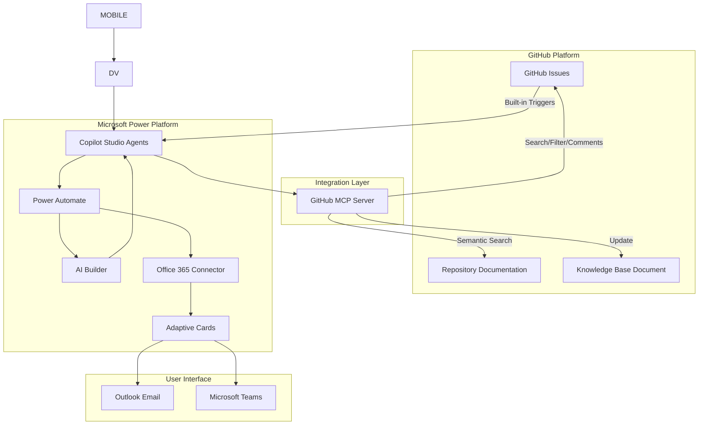
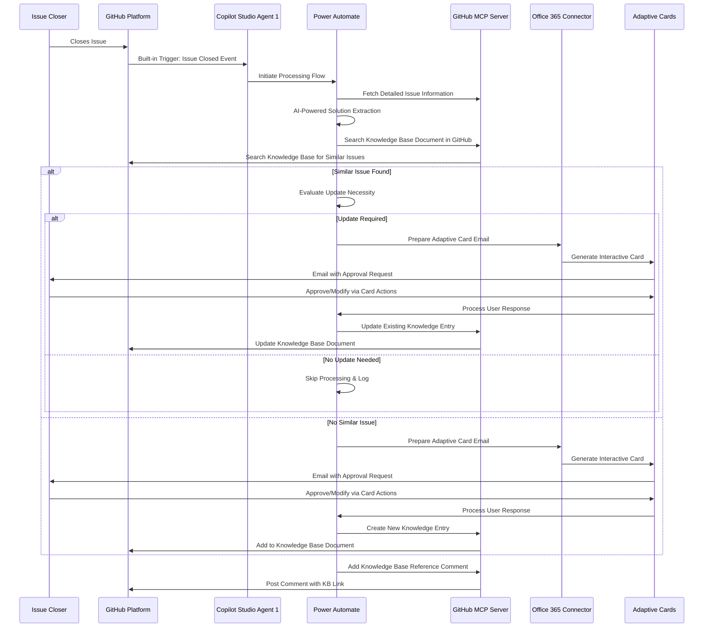
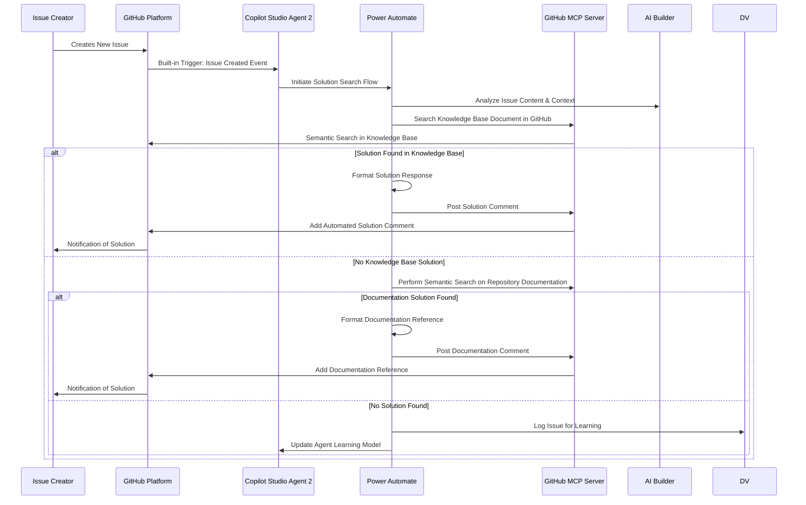

# Autonomous GitHub Issue Management Agents

## Executive Summary

This document outlines the design and implementation strategy for two autonomous agents built using **Microsoft Copilot Studio** that will provide immediate solutions to users based on an existing knowledge source document. These agents will automatically process GitHub issues and **GitHub MCP (Model Context Protocol) servers** for GitHub operations like searching, filtering, adding comments, and performing semantic searches on issues and documentation. The solution leverages **Power Automate**, **Office 365 email connector**, and **Adaptive Cards** for seamless integration and user interaction.

## Prerequisites

### Knowledge Source Document Requirements

Before implementing these autonomous agents, the following prerequisite must be established:

#### 1. **Existing Knowledge Base Document**

A comprehensive knowledge source document must be created and maintained in the GitHub repository containing solution details for all or most of the GitHub issues. This document serves as the foundation for both agents' operations.

**Required Structure**:

```markdown
# Knowledge Base - Issue Solutions

## Issue Category: [Category Name]

### Issue #[Number]: [Issue Title]

**Problem Statement**: Brief description of the problem
**Environment**: Platform/version details where applicable
**Steps to Reproduce**:

1. Step one
2. Step two
3. Step three

**Root Cause**: Technical explanation of why the issue occurred
**Solution Applied**:

- Detailed solution steps
- Code changes (if applicable)
- Configuration updates
- Workarounds

**Related Issues**: Links to similar or related issues
**Tags**: [tag1, tag2, tag3]
**Resolution Date**: YYYY-MM-DD
**Resolved By**: @username
```

## Architecture Overview

### Microsoft Power Platform Components

1. **Copilot Studio**: Main orchestration platform for both autonomous agents
2. **Power Automate**: Workflow automation for data processing and integrations
3. **AI Builder**: Natural language processing and similarity detection
4. **Office 365 Email Connector**: Email notifications and Adaptive Card delivery
5. **GitHub MCP Server**: GitHub integration and API management

### System Components

1. **Copilot Studio Agents**: Two specialized autonomous agents with built-in GitHub event triggers
2. **GitHub MCP Server**: Handles GitHub operations (search, filter, add comments, semantic search)
3. **Issue Processing Engine**: Built within Power Automate flows
4. **Knowledge Base Manager**: GitHub-based markdown document repository
5. **Similarity Engine**: AI Builder-powered duplicate detection
6. **Adaptive Card Service**: Rich email notifications with interactive elements

### Data Flow Architecture



## Agent 1: Knowledge Base Updater Flow (Power Platform)



## Agent 2: Instant Solution Provider Flow (Power Platform)



## Implementation Requirements

### Microsoft Power Platform Stack

- **Copilot Studio**: Premium license for advanced AI capabilities and custom connectors
- **Power Automate**: Premium flows for complex workflows and external connectors
- **AI Builder**: Credits for text analysis and similarity detection
- **Office 365**: E3/E5 license for email connector and Adaptive Cards

### Integration Components

- **GitHub MCP Server**: Model Context Protocol server for GitHub integration
- **Custom Connectors**: Power Platform connectors for GitHub MCP communication
- **Adaptive Cards**: JSON-based card framework for rich email interactions
- **Microsoft Graph**: For enhanced Office 365 integration

### Security & Compliance

- **Azure Active Directory**: Identity and access management
- **Data Loss Prevention (DLP)**: Power Platform DLP policies
- **Microsoft Purview**: Data governance and compliance
- **GitHub App Authentication**: Secure API access with minimal permissions
- **Power Platform Security**: Environment-level security and governance

## Power Platform Configuration

### Copilot Studio Agent Setup

#### Agent 1 Configuration:

```yaml
Agent Name: GitHub Knowledge Updater
Trigger: GitHub Issue Closed (via MCP)
AI Model: GPT-4 with custom prompt engineering
Knowledge Sources:
  - Knowledge base document in GitHub
  - Issue processing templates
  - Solution extraction patterns
Actions:
  - Extract solution details
  - Search for duplicates
  - Send approval requests
  - Update knowledge base document
```

#### Agent 2 Configuration:

```yaml
Agent Name: GitHub Solution Provider
Trigger: GitHub Issue Created (via MCP)
AI Model: GPT-4 with solution-focused prompts
Knowledge Sources:
  - Knowledge base document in GitHub
  - Repository documentation
  - Historical solutions
Actions:
  - Analyze new issues
  - Search knowledge sources
  - Generate solution responses
  - Post GitHub comments
```

### Power Automate Flow Templates

#### Knowledge Base Update Flow:

- **Trigger**: Copilot Studio Agent 1 activation
- **Actions**:
  - Parse GitHub issue data
  - AI Builder text analysis
  - GitHub knowledge base search for duplicates
  - Adaptive Card email generation
  - Knowledge base document update

#### Solution Provider Flow:

- **Trigger**: Copilot Studio Agent 2 activation
- **Actions**:
  - Issue content analysis
  - GitHub knowledge base document search
  - GitHub MCP documentation search
  - Response formatting and posting

### Adaptive Cards Templates

#### Approval Request Card:

```json
{
  "type": "AdaptiveCard",
  "version": "1.4",
  "body": [
    {
      "type": "TextBlock",
      "text": "GitHub Issue Solution Approval",
      "weight": "Bolder",
      "size": "Large"
    },
    {
      "type": "FactSet",
      "facts": [
        { "title": "Issue #", "value": "${issueNumber}" },
        { "title": "Title", "value": "${issueTitle}" },
        { "title": "Closed By", "value": "${closedBy}" }
      ]
    },
    {
      "type": "TextBlock",
      "text": "Auto-Generated Solution:",
      "weight": "Bolder"
    },
    {
      "type": "Input.Text",
      "id": "solutionDetails",
      "value": "${generatedSolution}",
      "isMultiline": true
    }
  ],
  "actions": [
    {
      "type": "Action.Submit",
      "title": "Approve",
      "data": { "action": "approve" }
    },
    {
      "type": "Action.Submit",
      "title": "Modify & Approve",
      "data": { "action": "modify" }
    },
    {
      "type": "Action.Submit",
      "title": "Reject",
      "data": { "action": "reject" }
    }
  ]
}
```

## Success Metrics

### Agent 1 Metrics

- **Knowledge Base Growth Rate**: Number of new entries added per month
- **Duplicate Prevention Rate**: Percentage of duplicate issues successfully identified
- **User Approval Rate**: Percentage of auto-generated solutions approved via Adaptive Cards
- **Response Time**: Time from issue closure to knowledge base update
- **Adaptive Card Engagement**: Click-through and completion rates

### Agent 2 Metrics

- **Solution Hit Rate**: Percentage of new issues receiving automated solutions
- **Solution Accuracy**: User feedback on provided solutions
- **Response Time**: Time from issue creation to solution delivery
- **Knowledge Base Utilization**: Frequency of GitHub knowledge base matches
- **GitHub MCP Performance**: API response times and reliability

### Power Platform Metrics

- **Flow Execution Success Rate**: Percentage of successful Power Automate runs
- **AI Builder Usage**: Credits consumed and accuracy rates
- **Copilot Studio Conversations**: Number of successful agent interactions
- **GitHub Performance**: API response times and knowledge base search efficiency

## Cost Considerations

### Power Platform Licensing

- **Copilot Studio**: $200/month per environment
- **Power Automate Premium**: $15/user/month
- **AI Builder**: $500/month for 1M AI Builder credits

### Usage-Based Costs

- **AI Builder Credits**: Text analysis and processing
- **Power Automate Runs**: Per-execution costs for high-volume scenarios
- **GitHub MCP Server**: Hosting and compute costs
- **Email Delivery**: Office 365 email connector usage

## Future Enhancements

1. **Advanced AI Capabilities**: Integration with Azure OpenAI Service for enhanced processing
2. **Multi-Repository Support**: Extend across multiple GitHub repositories with centralized knowledge base
3. **Teams Integration**: Direct integration with Microsoft Teams for notifications and approvals
4. **Power BI Analytics**: Advanced reporting and insights dashboard
5. **Voice Integration**: Copilot Studio voice capabilities for audio issue reporting
6. **Mobile Experience**: Dedicated Power Apps mobile application for on-the-go management
7. **Integration Expansion**: Support for Azure DevOps, Jira, and other issue tracking systems

## Conclusion

These autonomous agents, powered by Microsoft Power Platform and Copilot Studio, will significantly improve the efficiency of GitHub issue management by:

- Automatically capturing and organizing solution knowledge through AI-powered analysis
- Providing immediate assistance to users with new issues via intelligent search capabilities
- Reducing manual overhead for maintainers through automated workflows
- Ensuring consistency in documentation and responses using standardized templates
- Creating a self-improving knowledge ecosystem with continuous learning capabilities
- Leveraging enterprise-grade security and compliance through Microsoft's trusted platform

The implementation will result in faster issue resolution, better knowledge retention, improved user satisfaction, and reduced workload on project maintainers while maintaining full integration with the Microsoft 365 ecosystem.

### GitHub MCP Server Usage

The GitHub MCP server is utilized for the following operations:

1. **Search Operations**:

   - Semantic search across GitHub issues
   - Filter issues by labels, status, and metadata
   - Search repository documentation and README files
   - Query knowledge base documents

2. **Content Operations**:

   - Add comments to GitHub issues
   - Update knowledge base documents
   - Retrieve issue details and attachments
   - Access repository documentation

3. **Analysis Operations**:
   - Perform similarity analysis between issues
   - Extract relevant code snippets and examples
   - Analyze issue patterns and trends

**Note**: Copilot Studio autonomous agents provide built-in triggers for GitHub events, eliminating the need for separate webhook infrastructure. GitHub MCP servers handle GitHub-specific operations and are used by the Copilot Studio agents to perform GitHub API interactions.
