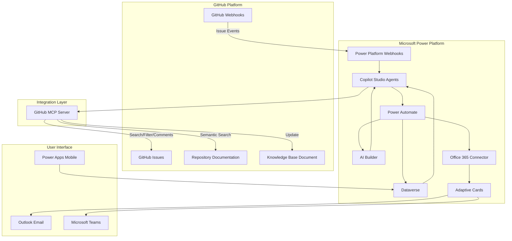
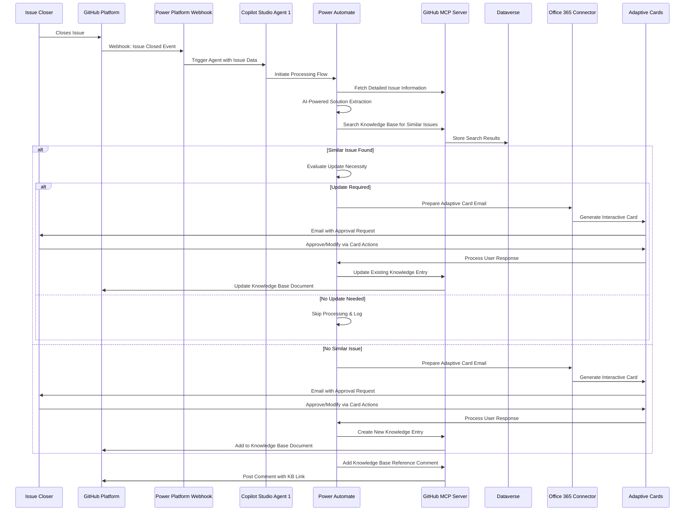
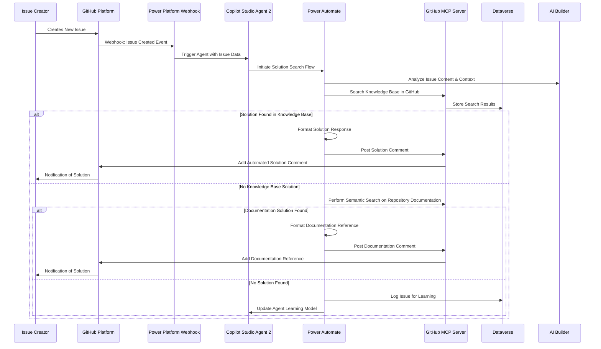

# Autonomous GitHub Issue Management Agents
*Powered by Microsoft Power Platform & Copilot Studio*

## Executive Summary

This document outlines the design and implementation strategy for two autonomous agents built using **Microsoft Copilot Studio** that will provide immediate solutions to users based on an existing knowledge source document. These agents will automatically process GitHub issues using **Power Platform webhooks** as triggers and **GitHub MCP (Model Context Protocol) servers** for GitHub operations like searching, filtering, adding comments, and performing semantic searches on issues and documentation. The solution leverages **Power Platform** components including **Power Automate**, **Office 365 email connector**, and **Adaptive Cards** for seamless integration and user interaction.

## Prerequisites

### Knowledge Source Document Requirements

Before implementing these autonomous agents, the following prerequisite must be established:

#### 1. **Existing Knowledge Base Document**
A comprehensive knowledge source document must be created and maintained in the GitHub repository containing solution details for all or most of the GitHub issues. This document serves as the foundation for both agents' operations.

**Required Structure**:
```markdown
# Knowledge Base - Issue Solutions

## Issue Category: [Category Name]

### Issue #[Number]: [Issue Title]
**Problem Statement**: Brief description of the problem
**Environment**: Platform/version details where applicable
**Steps to Reproduce**: 
1. Step one
2. Step two
3. Step three

**Root Cause**: Technical explanation of why the issue occurred
**Solution Applied**: 
- Detailed solution steps
- Code changes (if applicable)
- Configuration updates
- Workarounds

**Related Issues**: Links to similar or related issues
**Tags**: [tag1, tag2, tag3]
**Resolution Date**: YYYY-MM-DD
**Resolved By**: @username

---
```

#### 2. **Knowledge Base Population Methods**

**Initial Population Options**:

1. **Manual Migration**: 
   - Review existing closed GitHub issues
   - Extract solution details from issue discussions
   - Format and add to knowledge base document
   - Estimated effort: 2-4 weeks depending on repository size

2. **Semi-Automated Extraction**:
   - Use GitHub MCP server to extract closed issues
   - Apply AI analysis to identify solution patterns
   - Generate structured knowledge entries
   - Manual review and refinement required
   - Estimated effort: 1-2 weeks

3. **Gradual Population**:
   - Start with empty or minimal knowledge base
   - Allow Agent 1 to populate as new issues are closed
   - Accept lower initial effectiveness for Agent 2
   - Knowledge base grows organically over time

#### 3. **Knowledge Base Maintenance Standards**

**Quality Requirements**:
- **Completeness**: Each entry must include problem, root cause, and solution
- **Accuracy**: Solutions must be verified and tested
- **Consistency**: Follow standardized formatting and terminology
- **Accessibility**: Use clear, non-technical language where possible
- **Searchability**: Include relevant keywords and tags

**Content Guidelines**:
- Solutions should be step-by-step and actionable
- Include code snippets with proper syntax highlighting
- Reference external documentation when applicable
- Maintain version-specific information where relevant
- Include screenshots or diagrams for complex procedures

#### 4. **Repository Structure Requirements**

**Recommended File Organization**:
```
repository/
??? docs/
?   ??? knowledge-base/
?   ?   ??? README.md (Knowledge Base Index)
?   ?   ??? installation-issues.md
?   ?   ??? configuration-issues.md
?   ?   ??? performance-issues.md
?   ?   ??? integration-issues.md
?   ?   ??? general-issues.md
?   ??? templates/
?       ??? issue-solution-template.md
??? .github/
?   ??? ISSUE_TEMPLATE/
?   ??? workflows/
??? README.md
```

#### 5. **GitHub Repository Configuration**

**Required Permissions**:
- Webhook creation and management
- Issue read/write access
- Repository content modification
- Comment creation and management

**Webhook Setup**:
- Configure webhooks for issue events (opened, closed, labeled)
- Ensure webhook endpoints point to Power Platform
- Implement webhook signature validation

**Labels and Categories**:
- Establish consistent labeling system for issues
- Create categories that align with knowledge base structure
- Use labels to trigger specific agent behaviors

#### 6. **Initial Knowledge Base Examples**

**Sample Entry for Common Issue**:
```markdown
### Issue #123: Application Fails to Start After Update

**Problem Statement**: Users report that the application crashes immediately after updating to version 2.1.0

**Environment**: 
- Windows 10/11
- Application version 2.1.0
- .NET Framework 4.8

**Steps to Reproduce**:
1. Update application from version 2.0.x to 2.1.0
2. Launch application
3. Application crashes with error "System.IO.FileNotFoundException"

**Root Cause**: Missing configuration file migration during update process

**Solution Applied**:
1. Navigate to application installation directory
2. Copy `config.xml` from backup location to `\Config\` folder
3. Run application as administrator for first launch
4. Verify application starts successfully

**Code Fix** (if applicable):
```csharp
// Updated installer to preserve config files
installer.PreserveDuringUpdate("Config/*.xml");
```

**Related Issues**: #124, #125
**Tags**: [installation, update, configuration, windows]
**Resolution Date**: 2024-01-15
**Resolved By**: @maintainer
```

#### 7. **Success Metrics for Knowledge Base**

**Coverage Metrics**:
- **Issue Coverage**: Percentage of historical issues documented
- **Category Distribution**: Balanced coverage across issue types
- **Solution Effectiveness**: Success rate of documented solutions
- **Search Performance**: Ability to find relevant solutions quickly

**Quality Metrics**:
- **Solution Accuracy**: Percentage of solutions that resolve issues
- **Completeness Score**: Average completeness of knowledge entries
- **User Feedback**: Ratings on solution helpfulness
- **Maintenance Currency**: How up-to-date solutions remain

## Business Case & Need

### Why This Solution is Needed

1. **Manual Overhead Reduction**: Currently, knowledge base maintenance requires manual intervention to capture solutions from resolved issues, leading to inconsistent documentation and knowledge loss.

2. **Response Time Improvement**: New issues often require manual research through existing solutions, documentation, and previous issues, resulting in delayed responses to users.

3. **Knowledge Preservation**: Valuable problem-solving insights from resolved issues are often lost if not properly documented, leading to repeated work on similar problems.

4. **Scalability**: As the project grows, manual management of issues and knowledge base becomes increasingly impractical.

5. **Consistency**: Automated agents ensure consistent formatting, categorization, and quality of knowledge base entries.

6. **Enterprise Integration**: Leveraging Power Platform ensures seamless integration with existing Microsoft 365 ecosystem and enterprise security standards.

## Detailed Use Case Description

### Agent 1: Knowledge Base Updater Agent (Copilot Studio)

**Trigger Event**: GitHub issue closure via Power Platform webhook integration

**Primary Function**: Automatically extract solution details from closed issues and update the knowledge base

**Detailed Workflow**:

1. **Issue Detection**: Power Platform webhook receives GitHub issue closure event and triggers Copilot Studio agent
2. **Data Extraction**: Uses GitHub MCP server to retrieve comprehensive issue details including:
   - Issue title and description
   - All comments and discussions
   - Attachments and linked resources
   - Labels and metadata
   - Resolution timeline
3. **Solution Analysis**: Uses Copilot Studio's AI capabilities to process extracted data and identify:
   - Problem statement
   - Steps to reproduce (if applicable)
   - Root cause analysis
   - Applied solution
   - Important technical details
4. **Duplicate Detection**: Uses GitHub MCP server to search existing knowledge base for similar issues using:
   - Copilot Studio's semantic similarity analysis
   - Keyword matching through Power Platform AI Builder
   - Category classification
5. **User Validation**: Sends **Adaptive Card** via **Office 365 email connector** to issue closer with:
   - Auto-generated solution summary
   - Interactive approval buttons
   - Editable text fields for corrections
   - Rich formatting with images and attachments
6. **Knowledge Base Update**: Upon approval through Adaptive Card response, uses GitHub MCP server to update the knowledge base with structured solution data via Power Automate flow

### Agent 2: Instant Solution Provider Agent (Copilot Studio)

**Trigger Event**: New GitHub issue creation via Power Platform webhook integration

**Primary Function**: Provide immediate solutions by searching existing knowledge sources

**Detailed Workflow**:

1. **Issue Analysis**: Power Platform webhook triggers Copilot Studio agent, which uses GitHub MCP to fetch and analyze new issue content:
   - Problem context
   - Error messages or symptoms
   - Environment details
   - User requirements
2. **Knowledge Base Search**: Uses GitHub MCP server to perform intelligent search using Power Platform AI Builder across:
   - Existing knowledge base entries in GitHub
   - Historical issue solutions
   - Solution patterns and categories
3. **Repository Documentation Search**: If no knowledge base match found, uses GitHub MCP to perform semantic search on:
   - README files
   - Documentation directories
   - Code comments and examples
4. **Solution Delivery**: Uses GitHub MCP server to post automated comment with:
   - Relevant solution steps
   - Reference links
   - Additional resources
   - Confidence level indicator
   - Formatted using Markdown templates

## Architecture Overview

### Microsoft Power Platform Components

1. **Copilot Studio**: Main orchestration platform for both autonomous agents
2. **Power Automate**: Workflow automation for data processing and integrations
3. **Power Apps**: Optional admin interface for monitoring and configuration
4. **AI Builder**: Natural language processing and similarity detection
5. **Dataverse**: Structured storage for knowledge base and agent configurations
6. **Office 365 Email Connector**: Email notifications and Adaptive Card delivery
7. **GitHub MCP Server**: GitHub integration and API management

### System Components

1. **Power Platform Webhooks**: Receives GitHub webhook events and triggers Copilot Studio agents
2. **Copilot Studio Agents**: Two specialized agents for issue processing
3. **GitHub MCP Server**: Handles GitHub operations (search, filter, add comments, semantic search)
4. **Issue Processing Engine**: Built within Power Automate flows
5. **Knowledge Base Manager**: Dataverse-based solution repository
6. **Similarity Engine**: AI Builder-powered duplicate detection
7. **Adaptive Card Service**: Rich email notifications with interactive elements

### Data Flow Architecture



## Agent 1: Knowledge Base Updater Flow (Power Platform)



## Agent 2: Instant Solution Provider Flow (Power Platform)



## Implementation Requirements

### Microsoft Power Platform Stack
- **Copilot Studio**: Premium license for advanced AI capabilities and custom connectors
- **Power Automate**: Premium flows for complex workflows and external connectors
- **Power Apps**: For optional administrative interface
- **AI Builder**: Credits for text analysis and similarity detection
- **Dataverse**: Database storage for knowledge base and configurations
- **Office 365**: E3/E5 license for email connector and Adaptive Cards

### Integration Components
- **GitHub MCP Server**: Model Context Protocol server for GitHub integration
- **Custom Connectors**: Power Platform connectors for GitHub MCP communication
- **Adaptive Cards**: JSON-based card framework for rich email interactions
- **Microsoft Graph**: For enhanced Office 365 integration

### Security & Compliance
- **Azure Active Directory**: Identity and access management
- **Data Loss Prevention (DLP)**: Power Platform DLP policies
- **Microsoft Purview**: Data governance and compliance
- **GitHub App Authentication**: Secure API access with minimal permissions
- **Power Platform Security**: Environment-level security and governance

## Power Platform Configuration

### Copilot Studio Agent Setup

#### Agent 1 Configuration:
```yaml
Agent Name: GitHub Knowledge Updater
Trigger: GitHub Issue Closed (via MCP)
AI Model: GPT-4 with custom prompt engineering
Knowledge Sources:
  - Existing knowledge base (Dataverse)
  - Issue processing templates
  - Solution extraction patterns
Actions:
  - Extract solution details
  - Search for duplicates
  - Send approval requests
  - Update knowledge base
```

#### Agent 2 Configuration:
```yaml
Agent Name: GitHub Solution Provider
Trigger: GitHub Issue Created (via MCP)
AI Model: GPT-4 with solution-focused prompts
Knowledge Sources:
  - Knowledge base (Dataverse)
  - Repository documentation
  - Historical solutions
Actions:
  - Analyze new issues
  - Search knowledge sources
  - Generate solution responses
  - Post GitHub comments
```

### Power Automate Flow Templates

#### Knowledge Base Update Flow:
- **Trigger**: Copilot Studio Agent 1 activation
- **Actions**: 
  - Parse GitHub issue data
  - AI Builder text analysis
  - Dataverse duplicate search
  - Adaptive Card email generation
  - Knowledge base update

#### Solution Provider Flow:
- **Trigger**: Copilot Studio Agent 2 activation
- **Actions**:
  - Issue content analysis
  - Dataverse knowledge search
  - GitHub MCP documentation search
  - Response formatting and posting

### Adaptive Cards Templates

#### Approval Request Card:
```json
{
  "type": "AdaptiveCard",
  "version": "1.4",
  "body": [
    {
      "type": "TextBlock",
      "text": "GitHub Issue Solution Approval",
      "weight": "Bolder",
      "size": "Large"
    },
    {
      "type": "FactSet",
      "facts": [
        {"title": "Issue #", "value": "${issueNumber}"},
        {"title": "Title", "value": "${issueTitle}"},
        {"title": "Closed By", "value": "${closedBy}"}
      ]
    },
    {
      "type": "TextBlock",
      "text": "Auto-Generated Solution:",
      "weight": "Bolder"
    },
    {
      "type": "Input.Text",
      "id": "solutionDetails",
      "value": "${generatedSolution}",
      "isMultiline": true
    }
  ],
  "actions": [
    {
      "type": "Action.Submit",
      "title": "Approve",
      "data": {"action": "approve"}
    },
    {
      "type": "Action.Submit", 
      "title": "Modify & Approve",
      "data": {"action": "modify"}
    },
    {
      "type": "Action.Submit",
      "title": "Reject",
      "data": {"action": "reject"}
    }
  ]
}
```

## Success Metrics

### Agent 1 Metrics
- **Knowledge Base Growth Rate**: Number of new entries added per month
- **Duplicate Prevention Rate**: Percentage of duplicate issues successfully identified
- **User Approval Rate**: Percentage of auto-generated solutions approved via Adaptive Cards
- **Response Time**: Time from issue closure to knowledge base update
- **Adaptive Card Engagement**: Click-through and completion rates

### Agent 2 Metrics
- **Solution Hit Rate**: Percentage of new issues receiving automated solutions
- **Solution Accuracy**: User feedback on provided solutions
- **Response Time**: Time from issue creation to solution delivery
- **Knowledge Base Utilization**: Frequency of Dataverse knowledge matches
- **GitHub MCP Performance**: API response times and reliability

### Power Platform Metrics
- **Flow Execution Success Rate**: Percentage of successful Power Automate runs
- **AI Builder Usage**: Credits consumed and accuracy rates
- **Copilot Studio Conversations**: Number of successful agent interactions
- **Dataverse Performance**: Query response times and storage utilization

## Cost Considerations

### Power Platform Licensing
- **Copilot Studio**: $200/month per environment
- **Power Automate Premium**: $15/user/month
- **AI Builder**: $500/month for 1M AI Builder credits
- **Power Apps**: $20/user/month (if admin interface needed)

### Usage-Based Costs
- **AI Builder Credits**: Text analysis and processing
- **Power Automate Runs**: Per-execution costs for high-volume scenarios
- **GitHub MCP Server**: Hosting and compute costs
- **Email Delivery**: Office 365 email connector usage

## Future Enhancements

1. **Advanced AI Capabilities**: Integration with Azure OpenAI Service for enhanced processing
2. **Multi-Repository Support**: Extend across multiple GitHub repositories with centralized knowledge base
3. **Teams Integration**: Direct integration with Microsoft Teams for notifications and approvals
4. **Power BI Analytics**: Advanced reporting and insights dashboard
5. **Voice Integration**: Copilot Studio voice capabilities for audio issue reporting
6. **Mobile Experience**: Dedicated Power Apps mobile application for on-the-go management
7. **Integration Expansion**: Support for Azure DevOps, Jira, and other issue tracking systems

## Conclusion

These autonomous agents, powered by Microsoft Power Platform and Copilot Studio, will significantly improve the efficiency of GitHub issue management by:
- Automatically capturing and organizing solution knowledge through AI-powered analysis
- Providing immediate assistance to users with new issues via intelligent search capabilities
- Reducing manual overhead for maintainers through automated workflows
- Ensuring consistency in documentation and responses using standardized templates
- Creating a self-improving knowledge ecosystem with continuous learning capabilities
- Leveraging enterprise-grade security and compliance through Microsoft's trusted platform

The implementation will result in faster issue resolution, better knowledge retention, improved user satisfaction, and reduced workload on project maintainers while maintaining full integration with the Microsoft 365 ecosystem.

### GitHub MCP Server Usage

The GitHub MCP server is utilized for the following operations:

1. **Search Operations**:
   - Semantic search across GitHub issues
   - Filter issues by labels, status, and metadata
   - Search repository documentation and README files
   - Query knowledge base documents

2. **Content Operations**:
   - Add comments to GitHub issues
   - Update knowledge base documents
   - Retrieve issue details and attachments
   - Access repository documentation

3. **Analysis Operations**:
   - Perform similarity analysis between issues
   - Extract relevant code snippets and examples
   - Analyze issue patterns and trends

**Note**: GitHub MCP servers handle GitHub-specific operations but cannot serve as webhook triggers. Power Platform webhooks receive GitHub webhook events and trigger the Copilot Studio agents, which then use GitHub MCP servers for GitHub operations.
