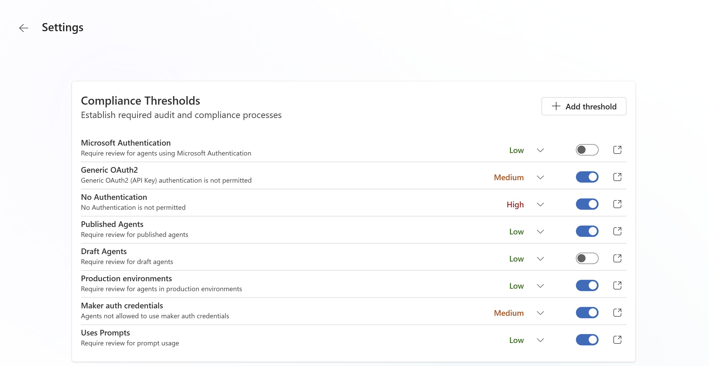
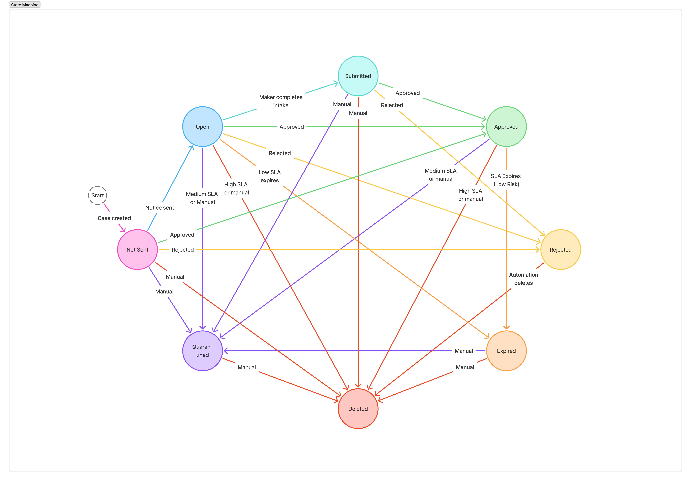

# Define and enforce compliance with Agent Governance Hub

The Agent Governance Hub enables organizations using Copilot Studio to balance innovation with compliance. It provides visibility, automated compliance enforcement, and clear workflows for both administrators and makers. The system implements continuous compliance monitoring — agents are created freely within Power Platform admin center configurations, but compliance is enforced after creation based on configurable risk thresholds. If compliance is not achieved within a defined SLA, automated enforcement actions (such as quarantine or delete) are applied.

## Key concepts
- Continuous compliance monitoring: Agents are created without friction within allowed limits configured by admin center controls; compliance is enforced post-creation if risk thresholds are breached.
- Compliance case: Automatically created when an agent breaches a risk threshold. Tracks remediation, SLA, and enforcement.
- SLA (Service Level Agreement): The time window for makers to remediate compliance issues before enforcement actions are triggered.
- Enforcement actions: Automated actions (Manual review, Quarantine, Delete) applied if compliance is not achieved within SLA.

## Roles and responsibilities

There are two main personas involved in the main agent compliance workstream: agent administrator and maker.

### Administrator

The scope of the agent admin depends on the organization, however, the admin responsibilities for managing compliance commonly falls under the responsibility of either Microsoft tenant admin, Power Platform admin or the Agent/AI Center Of Excellence team.
- Configure compliance thresholds, risk levels, enforcement actions, and SLA timers.
- Monitor agent inventory and compliance posture.
- Review, approve, or reject compliance cases.
- Maintain audit trails and documentation.

### Maker

A maker in the context of compliance hub is anyone who has created a Copilot Studio agent in the Microsoft tenant.

- Receives notifications when compliance thresholds are breached.
- Provides business justification and confirms ownership for non-compliant agents.
- Remediates compliance issues within the SLA.
- Views compliance status and receives reminders.

## Get started

Setup and configure the governance components using the Copilot Studio Kit setup wizard.

1. Install and launch the Copilot Studio Kit. Follow the [Copilot Studio kit setup instructions](LINK) for the essential install steps to instal the base solution and [agent inventory](./AGENT_INVENTORY.md) before setting up the compliance components.

1. Run the **setup wizard**.

1. Update the **compliance hub environment variables**: 

   Below are a list of the environment variables used in the solution. Variables with "requires manual input" = "Yes" means you must provide the value in the setup wizard, otherwise it's recommended to leave the default values as is.

    | Display Name| Description| Requires manual input |
    |--------------------------------------------|-----------------------------------------------------------------------------|------------------------|
    | App ID | Unique identifier for the Copilot Studio Kit application | Yes |
    | Compliance Admin Group ID                  | Group ID for compliance administrators                                     |                   Yes | 
    | Compliance Documentation Link              | URL to compliance documentation                                            |                   Yes (optional) |
    | Compliance Support Contact Alias           | Email alias for compliance support                                         | Yes (optional)                   |
    | Instance Url                               | URL of the environment instance                                            | Yes                   |
    | Maker Team ID                              | Team ID for makers in the organization                                     | Yes                   |

   > **Important:** 
   > - **Require Admin Consent For Notification** - We recommend enabling this variable during initial configuration to avoid excessive notifications or preventing unwanted governance action automation on non-compliant cases (quarantine or delete). This will not send notifications or start any SLA countdowns unless an admin decides to send the notification on the case details screen in compliance hub. Once thresholds are configured, this can be disabled in the Compliance Hub settings page, which will allow notices and policy enforcement to happen automatically.
   >
   > - **Create case for every agent**: Disabled by default. When disabled, cases are only created for agents that violate a compliance threshold. If enabled, a case will be created for all agents, even if there is no violation. 

   The following environment variables do not require additional configuration. The default values are recommended for first time setup. You may update values at your discretion during solution import or in the compliance hub settings page.

   
    | Display Name| Description| Default value |
    |--------------------------------------------|-----------------------------------------------------------------------------|------------------------|
    | Admin Approval Before Maker Notification   | Determines if admin approval is needed before notifying makers | Yes |
    | Case Intake SLA | Service Level Agreement for case intake timing | 3 days |
    | Case Review SLA | SLA for admins to review cases in the compliance process | 5 days  |
    | Case Summary Email Frequency | How often case summary emails are sent |WEEKLY|
    | Require Case For No Risk | Indicates if a case is required even when risk is low | Yes |
    | Send Case Alerts To Maker Via Email | Enables email alerts for makers when cases are triggered | Yes |
    | Send Case Alerts To Maker Via Teams | Enables Teams alerts for makers when cases are triggered | Yes |

1. **Enable the agent inventory and agent compliance cloud flows**

   Enable all flows starting with "Agent Compliance |" and "Agent Inventory |". First enable flows marked as "(Grandchild)", then "(Child)".

## Configure governance policies
Governance policies in compliance hub are configured by:
- Defining compliance 'violations' (by associating an agent configuration with a risk severity).
- Specifying actions taken when volations occur (for each severity: high, medium and low).

The following components can be configured to define and enforce the compliance policies that best define your organization's requirements.

### Compliance thresholds (`Threshold Config` table)
This is how 'violations' are defined in compliance hub. Each row in the `Threshold Config` table must be associated with a specific agent attribute (aka property/column) and a specific value. It is designed to be fully customizable within the scope of the agent components represented in Copilot Studio Kit's `Agent Details` custom table properties.

Screenshot: Default configurations for Threshold Config table.

Each row contains the following fields used to construct a filter on the `Agent Detail` table. If the filter returns true for that agent, it will be flagged as a violation.

- **Filter Column**: (Text) The logical name of the column that is evaluated.
- **Filter Operator**: (Choice) The operator of the filter.
- **Default Value**: (Text) The value of the column that is evaluated.

### Enforcement actions (`Action Policies` table)
Customize actions (Manual, Quarantine, Delete) and SLA timers for each risk level (Low, Medium, High).

#### Example: Enforcement Actions by Risk Level

| Risk Level	| SLA Days	| Enforcement Action	|Description |
|-|-|-|-|
|Low	|10|	Manual|	Admin reviews/reminders|
|Medium	|5|	Quarantine|	Agent disabled if overdue|
|High|	3|	Delete|	Agent deleted if overdue|

### Manage compliance cases and configure settings

- Use the Dashboard to view KPIs (Total Agents, Open Cases, SLA Breaches, etc.).
- Access Inventory for a wholistic list of agents.
- Adjust settings for thresholds, action policies, email templates, and environment variables as needed on the Settings page.

## Compliance review lifecycle

The compliance case lifecycle is a specialized approval process designed to help identify and manage agents that  violate the compliance policies defined in this tool.

The case stages define the current position in the lifecycle and next actions available, and shown below.

### Run compliance scans

The compliance scan is an asynchronous process that finds violations based on data in `Agent Details` table, using the governance policies defined. 

Compliance scans are automatically run after the Agent Inventory scan is completed. The compliance scan can also be manually triggered in the compliance hub landing page.

The compliance scan will create new or update existing `Compliance Case` rows for violations. 

1. Monitor compliance cases
   - Navigate to Compliance Cases in the app.
   - Filter cases by status (Open, SLA Breach, Approved, Expired) and risk level.

2. Review case details. Open a compliance case record to view:
   - Triggered thresholds
   - Maker's intake (business justification, owner confirmation). 
   - Automated scan results (DLP/connectors/knowledge sources)
   - SLA countdown and event timeline
3. Approve or reject cases
   - Use the Approve/Reject command bar to make decisions.
   - Add audit notes for documentation.
   - If intake is incomplete or violations persist past SLA, enforcement actions are triggered automatically.
4. Audit and reporting
   - Use dashboards and charts for trend analysis (e.g., distribution of important case statuses, risk level distribution).
   - Maintain thorough documentation for all compliance cases.
   - Enable auditing in the PPAC environment settings to ensure case level auditing is available.
   - Timeline activities are also posted on cases for historical account.

## Agent maker responsibilities

When a compliance case is opened, you'll receive a Microsoft Teams notification linked to your case.

1. **Complete intake**. The Microsoft Teams notification is an adaptive card that accepts three input fields that can be submitted back to your case.

   Provide required business justification, data classification, and expected number of users, and submit the form.

1. **Remediate issues**. Fix any compliance violations identified in the case that are medium or high risk. Re-evaluation happens daily, and you will be notified if the agent is not compliant yet.

1. **Monitor SLA**. Track the SLA countdown via notifications that are sent daily. You’ll receive reminders as the SLA deadline approaches. Failure to comply within the SLA may result in agent quarantine or deletion.

## Process flow
Below is a high-level process for agents violating compliance thresholds:
 
Summary:
1.	Agent is created or updated.
2.	Automated detection checks for compliance.
3.	If thresholds are breached:
o	Compliance case is opened.
o	Maker is notified and must complete intake.
o	SLA countdown begins.
4.	Admin reviews case and intake.
5.	If compliant, case is approved.
6.	If not compliant within SLA, enforcement action is applied.

Reference: Data model and policies
Key Tables
•	Compliance Case: Tracks workflow, SLA, and enforcement.
•	Role Assignment: Assigns accountability roles to agents.
•	Compliance Rules: Stores threshold metrics and admin settings.
•	Action Policy: Defines enforcement actions per risk level.
•	Email Template: Manages notification templates.

Default compliance rules
Category	Filter Name	Risk Level	Enabled	Mitigation
Auth Mode	Microsoft Authentication	Low	No	Admin review only
Auth Mode	API Key Authentication	High	Yes	
Auth Mode	No Authentication	High	Yes	
Publication Status	Published agents	High	Yes	
Publication Status	Draft agents	Low	Yes	
Environment ring	Production environments	High	Yes	
Sharing Scope	Org wide allowed	High	Yes	

> [!NOTE]
> If a threshold is defined for all possibilities in a certain category (for example, for all auth modes), then a case will be created for every agent.
FAQs and troubleshooting
Q: What happens if I don’t complete intake within the SLA?
A: The system will automatically apply the configured enforcement action (e.g., quarantine or delete the agent).
Q: How do I know which compliance issues to fix?
A: Review the checklist and findings in your compliance case. Automated checks highlight any “Fail” items.
Q: Who do I contact for help?
A: Use the contact information provided in your notification email or reach out to your CoE Admin team.
