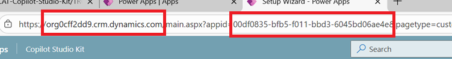
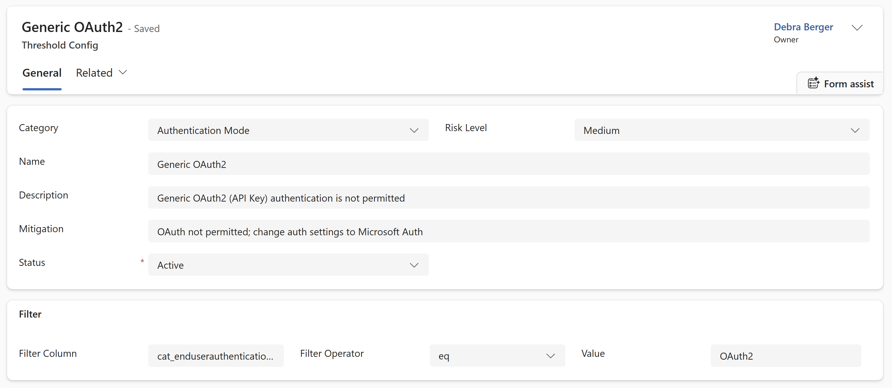
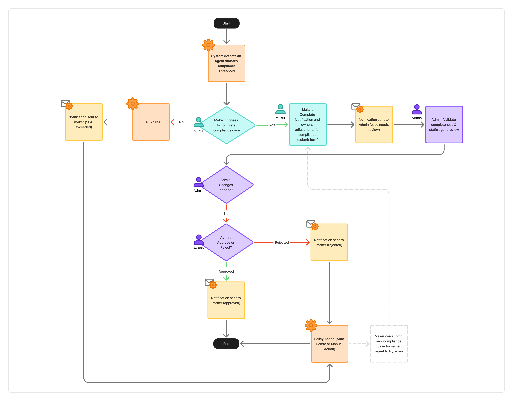
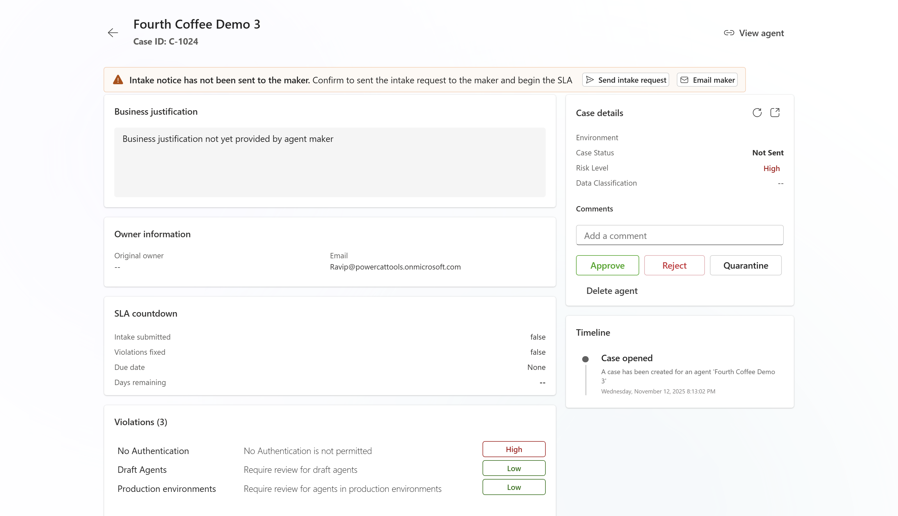

# Define and enforce agent compliance

The Compliance Hub enables organizations using Copilot Studio to balance innovation with compliance. It provides visibility, automated compliance enforcement, and clear workflows for both administrators and makers. The system implements continuous compliance monitoring — agents are created freely within product guardrails configured in Power Platform admin center, but compliance is enforced after creation based on configurable risk thresholds. If compliance is not achieved within a defined SLA, automated enforcement actions (such as quarantine or delete) are applied.

*Figure 1: Compliance Hub dashboard showing agent compliance status, open cases, and key performance indicators*

## Key concepts
- Continuous compliance monitoring: Agents are created without friction within allowed limits configured by admin center controls; compliance is enforced post-creation if risk thresholds are breached.
- Compliance case: Automatically created when an agent breaches a risk threshold. Tracks remediation, SLA, and enforcement.
- SLA (Service Level Agreement): The time window for makers to remediate compliance issues before enforcement actions are triggered.
- Enforcement actions: Automated actions (Manual review, Quarantine, Delete) applied if compliance is not achieved within SLA.
  - **Manual review**: Admin receives notification to review and take action. No automated enforcement.
  - **Quarantine**: Agent is automatically disabled and cannot be invoked by end users. Agent owner retains access to edit and fix compliance issues.
  - **Delete**: Agent is permanently deleted from the environment. This action cannot be undone.

## Prerequisites

Before setting up the Compliance Hub, ensure you have:

- **Copilot Studio Kit prerequisites**: All [prerequisites for the Copilot Studio Kit](PREREQUISITES.md)
- **Permissions (for admin)**: 
  - System Administrator role in the target environment
  - Ability to create and configure cloud flows
  - Microsoft Entra ID (Azure AD) permissions to retrieve group IDs
- **Dependencies**: 
  - [Agent Inventory](./AGENT_INVENTORY.md) must be installed and configured first
  - Microsoft Teams for notification functionality
  - Outlook for additional notification channel
- **Data Loss Prevention policy** must allow the following connectors:
  - Microsoft Dataverse
  - Microsoft Teams
  - Microsoft Standard Approvals
  - Office 365 Outlook
  - Office 365 Users
  - Power Platform for Admins
  - Power Platform for Admins (V2)

## Roles and responsibilities

There are two main personas involved in the main agent compliance workstream: agent administrator and agent maker.

### Administrator

The scope of the agent admin depends on the organization, however, the admin responsibilities for managing compliance commonly falls under the responsibility of either Microsoft tenant admin, Power Platform admin or the Agent/AI Center Of Excellence team.

- Configure compliance thresholds, risk levels, enforcement actions, and SLA timers.
- Monitor agent inventory and compliance posture.
- Review, approve, or reject compliance cases.
- Maintain audit trails and documentation.

### Maker

Any user who has created a Copilot Studio agent in the organization's tenant. This agent creator is identified as the owning maker of the agent.

- Receives notifications when compliance thresholds are breached.
- Provides business justification and confirms ownership for non-compliant agents.
- Remediates compliance issues within the SLA.
- Views compliance status and receives reminders.

> **Note**:
> If the user who created the agent has left the company, the agent ownership is automatically reassigned to the environment system administrator.

## Get started

Setup and configure the governance components using the Copilot Studio Kit setup wizard.

**Estimated time to complete**: 20 minutes (excluding prerequisite installations)

1. Install and launch the Copilot Studio Kit. Follow the [installation instructions](./INSTALLATION_INSTRUCTIONS.md) and [prerequisites](./PREREQUISITES.md) for the essential install steps to install the base solution and [agent inventory](./AGENT_INVENTORY.md) before setting up the compliance components.

1. Run the **setup wizard**.

1. Update the **compliance hub environment variables**: 

   Below is a list of the environment variables used in the solution. Variables are categorized by priority to help you configure essential settings first.

   ### Critical variables (Required)

   These variables must be configured before enabling the cloud flows for the Compliance Hub to function properly:

    | Display Name| Description| Example |
    |--------------------------------------------|-----------------------------------------------------------------------------|------------------------|
    | App ID | Unique identifier for the Copilot Studio Kit application | `12345678-1234-1234-1234-123456789abc` |
    | Compliance Admin Group ID | Microsoft Entra ID (Azure AD) security group ID for compliance administrators | `87654321-4321-4321-4321-cba987654321` | 
    | Instance Url | URL of the environment instance | `https://orgname.crm.dynamics.com` |
    | Maker Team ID | Group ID for makers in the organization | `12345678-1234-1234-1234-123456789abc` |

    > **Note**: Instance URL and App ID can be found in the player URL
    > 
    > 
    > *Finding Instance URL and App ID in the Copilot Studio player URL*

   ### Recommended variables (optional but recommended)

   Configure these for a better user experience:

    | Display Name| Description| Example |
    |--------------------------------------------|-----------------------------------------------------------------------------|------------------------|
    | Compliance Documentation Link | URL to your organization's compliance documentation | `https://docs.contoso.com/compliance` |
    | Compliance Support Contact Alias | Email alias for compliance support | `compliance-support@contoso.com` |

   ### Default Configuration Variables

   The following environment variables do not require additional configuration. The default values are recommended for first time setup. You may update values at your discretion during solution import or in the compliance hub settings page.

   
    | Display Name| Description| Default value |
    |--------------------------------------------|-----------------------------------------------------------------------------|------------------------|
    | Admin Approval Before Maker Notification   | Determines if admin approval is needed before notifying makers | Yes |
    | Case Intake SLA | Service Level Agreement for case intake timing | 3 days |
    | Case Review SLA | SLA for admins to review cases in the compliance process | 5 days  |
    | Case Summary Email Frequency | How often case summary emails are sent |WEEKLY|
    | Require Case For No Risk | Indicates if a case is required even when risk is low | Yes |
    | Send Case Alerts To Maker Via Email | Enables email alerts for makers when cases are triggered | Yes |
    | Send Case Alerts To Maker Via Teams | Enables Teams alerts for makers when cases are triggered | Yes |

   > **Important:** 
   > - **Admin Approval Before Maker Notification** - Recommend keeping this value enabled during initial configuration to avoid excessive notifications and prevent unwanted governance action automation on non-compliant cases (quarantine or delete). When enabled, the system will not immediately send notifications or start any SLA countdowns unless an admin decides to send the individual notification on the case details screen in compliance hub. This allows admins to:
   >   - Configure acceptable compliance thresholds
   >   - Run the compliance scan to review the resulting caseload
   >   - Adjust configurations based on team capacity and resources
   >   - Verify the policies accurately reflect organizational requirements
   >   
   >   Once thresholds are configured and validated, disable this setting so notices and policy enforcement resume automatically. Note: Bulk approval of cases is not currently available.
   >
   > - **Require Case For No Risk**: Disabled by default. When disabled, cases are only created for agents that violate a compliance threshold. If enabled, a case will be created for all agents, even if there is no violation. 

1. **Enable the agent inventory and compliance cloud flows**

   Navigate to Solutions > Copilot Studio Accelerator > Cloud flows in your Power Platform environment.
   
   Enable flows in the following order:
   
   1. First, enable all flows marked as **(Grandchild)**
   2. Then, enable all flows marked as **(Child)**
   3. Finally, enable parent flows
   
   Flows to enable:
   - All flows starting with "Agent Compliance |"
   - All flows starting with "Agent Inventory |"

   > [!TIP]
   > After enabling flows, verify they are running successfully by checking the run history for each flow.

## Configure governance policies
Governance policies in compliance hub are configured by:
- Defining compliance 'violations' (by associating an agent configuration with a risk severity).
- Specifying actions taken when violations occur (for each severity: high, medium and low).

The following components can be configured to define and enforce the compliance policies that best define your organization's requirements.

### Compliance thresholds (`Threshold Config` table)
This is how 'violations' are defined in compliance hub. Each row in the `Threshold Config` table must be associated with a specific agent attribute (aka property/column) and a specific value. It is designed to be fully customizable within the scope of the agent components represented in Copilot Studio Kit's `Agent Details` custom table properties.

*Figure 2: Default configurations for Threshold Config table showing filter columns, operators, and risk levels*

Each row contains the following fields used to construct a filter on the `Agent Detail` table. If the filter returns true for that agent, it will be flagged as a violation.

- **Filter Column**: (Text) The logical name of the column that is evaluated (e.g., `cr6d0_authenticationmode`).
- **Filter Operator**: (Choice) The operator of the filter (e.g., Equals, Not Equals, Contains, Greater Than, Less Than).
- **Default Value**: (Text) The value to compare against. This represents the threshold value that triggers a violation (e.g., `No Authentication`, `true`, `100`).

**Example threshold configuration:**
- Filter Column: `cat_enduserauthenticationtype`
- Filter Operator: `Equals`
- Default Value: `OAuth2`
- Risk Level: `Medium`

This configuration will create a Medium risk case for agents using OAuth2 authentication.

*Figure 4: Threshold configuration example showing OAuth2 authentication as a medium risk violation*

### Enforcement actions (`Action Policies` table)
Customize actions (Manual, Quarantine, Delete) and SLA timers for each risk level (Low, Medium, High).

#### Example: Enforcement Actions by Risk Level

| Risk Level	| SLA Days	| Enforcement Action	|Description |
|-|-|-|-|
|Low	|10|	Manual|	Admin reviews/reminders|
|Medium	|5|	Quarantine|	Agent disabled if overdue|
|High|	3|	Delete|	Agent deleted if overdue|

### Manage compliance cases and configure settings

- Use the Dashboard to view KPIs (Total Agents, Open Cases, SLA Breaches, etc.).
- Access Inventory for a holistic list of agents.
- Adjust settings for thresholds, action policies, email templates, and environment variables as needed on the Settings page.

#### Impact of threshold changes on existing cases

When you modify compliance thresholds:
- **In-flight cases** will be evaluated against the updated standards during the next daily compliance scan
- **SLA deadlines remain unchanged** - the original SLA countdown continues from when the case was created
- **Action required**: Makers must still remediate within the original timeline to avoid enforcement actions
- **Best practice**: Communicate threshold changes to makers with active cases to avoid confusion

## Compliance review lifecycle

The compliance case lifecycle is a specialized approval process designed to help identify and manage agents that violate the compliance policies defined in this tool.

The case stages define the current position in the lifecycle and next actions available, and shown below.

*Figure 3: Compliance case lifecycle showing stages from case creation through resolution or enforcement*

### Compliance enforcement workflow

Below is a high-level process for agents violating compliance thresholds:

1. Agent is created or updated.
2. Daily automated detection checks for compliance.
3. If thresholds are breached:
   - Compliance case is opened.
   - Maker is notified and must complete intake.
   - SLA countdown begins.
4. Admin reviews case and intake.
5. If compliant, case is approved.
6. If not compliant within SLA, enforcement action is applied (delete).

### Run compliance scans

The compliance scan is an asynchronous process that finds violations based on data in the `Agent Details` table, using the governance policies defined. 

Compliance scans are automatically run after the Agent Inventory scan is completed (typically daily). The compliance scan can also be manually triggered from the Compliance Hub dashboard by clicking the **Run Compliance Scan** button.

The compliance scan will create new or update existing `Compliance Case` rows for violations.

#### What the scan evaluates:

- All agent configurations against defined threshold rules
- Risk level assignment based on matched thresholds
- SLA calculation and countdown initiation
- Notification triggers for makers and admins

### Monitor and manage compliance cases

1. **Navigate to compliance cases**
   - Open the Compliance Hub app from your Power Apps environment
   - Navigate to **Compliance Cases** in the left navigation menu
   - Filter cases by status (Open, SLA Breach, Approved, Expired) and risk level (High, Medium, Low)

2. **Review case details**
   
   Open a compliance case record to view:
   - **Triggered thresholds**: Which policies were violated
   - **Maker's intake**: Business justification, owner confirmation, data classification
   - **Automated scan results**: DLP policies, connectors used, knowledge sources
   - **SLA countdown**: Time remaining before enforcement action
   - **Event timeline**: Historical record of all case activities

      
      *Figure 5: Compliance case details showing triggered thresholds, maker intake, and SLA countdown*

3. **Approve or reject cases**
   - Use the **Approve/Reject** buttons in the command bar to make decisions
   - Add audit notes for documentation and future reference
   - If intake is incomplete or violations persist past SLA, enforcement actions are triggered automatically

4. **Audit and reporting**
   - Use dashboards and charts for trend analysis (e.g., distribution of important case statuses, risk level distribution).
   - Export case data for external reporting and compliance documentation.
   - Maintain thorough documentation for all compliance cases. 
   - Enable auditing in the Power Platform Admin Center (PPAC) environment settings to ensure case level auditing is available.
   - Timeline activities are also posted on cases for historical record

## Agent maker responsibilities

When a compliance case is opened, you'll receive a Microsoft Teams notification linked to your case.

### Step-by-step guide for makers

1. **Complete intake form**
   
   The Microsoft Teams notification is an adaptive card that accepts three input fields:
   
   - **Business justification**: Explain the purpose and business value of this agent
   - **Data classification**: Specify what type of data the agent handles (Public, Internal, Confidential, Highly Confidential)
   - **Expected number of users**: Estimate how many people will use this agent
   
   Submit the form directly from Teams to update your case.

2. **Remediate compliance issues**
   
   Fix any compliance violations identified in the case that are medium or high risk:
   
   - Review the specific thresholds that were violated
   - Make necessary changes in Copilot Studio (e.g., enable authentication, restrict sharing, add DLP policies)
   - Publish your changes
   - Re-evaluation happens daily (typically overnight), and you will be notified of the results

3. **Monitor SLA countdown**
   
   - Track the SLA countdown via notifications that are sent daily
   - You'll receive reminders as the SLA deadline approaches (3 days before, 1 day before, day of)
   - Failure to comply within the SLA may result in agent quarantine or deletion
   - Contact your compliance admin if you need an extension

### Example scenarios

**Scenario 1: No authentication configured**
- Violation: Agent has no authentication enabled (High risk)
- Remediation: Enable Microsoft Entra ID authentication in Copilot Studio security settings
- Timeline: 3-day SLA for high-risk violations

**Scenario 2: Published to production without review**
- Violation: Agent published to production environment without admin review (low risk)
- Remediation: Provide detailed business justification and general intake.
- Timeline: Admin review required within 5 days

## Reference: Data model and policies

### Key Tables

- **Compliance Case**: Tracks workflow, SLA, and enforcement.
- **Threshold Config**: Stores threshold settings.
- **Action Policy**: Defines enforcement actions per risk level.
- **Email Template**: Manages notification templates.

> **Note**:
> If a threshold is defined for all possibilities in a certain category (for example, for all auth modes), then a case will be created for every agent.

## FAQs and troubleshooting

### General questions

**Q: What happens if I don't complete intake within the SLA?**

A: The system will automatically apply the configured enforcement action (e.g., quarantine or delete the agent). You'll receive daily reminder notifications as the SLA deadline approaches.

**Q: How do I know which compliance issues to fix as a maker?**

A: Review the checklist and findings in your compliance case. Automated checks highlight any "Fail" items that need to be addressed. Focus on high and medium risk violations first.

**Q: Who do I contact for help as a maker?**

A: Use the contact information provided in your notification email or reach out to your CoE Admin team. The compliance support contact alias is configured in the environment variables.

**Q: Can I request an SLA extension as a maker?**

A: Contact your compliance administrator to discuss SLA extensions. Extensions must be documented in the case audit notes.

**Q: What happens to a quarantined agent?**

A: A quarantined agent is disabled and cannot be accessed by end users. However, you as the owner can still edit the agent to fix compliance issues. Once compliant, request admin review to restore the agent.

### Troubleshooting

**Issue: Compliance scan is not detecting my agent**

- Ensure Agent Inventory scan has completed successfully
- Check that your agent is published and visible in Copilot Studio
- Verify the agent is in an environment being monitored by the solution
- Review cloud flow run history for errors

**Issue: Case status is not updating after remediation**

- Compliance re-evaluation occurs daily (typically runs overnight)
- Manually trigger a compliance scan from the Compliance Hub dashboard
- Verify remediation changes are saved and published in Copilot Studio Kit Inventory
- Check the case timeline for evaluation history

**Issue: Filter operators not working as expected**

- Available filter operators: Equals
- Ensure the "Value" field matches the exact case and formatting of the column being evaluated
- Test your threshold configuration on a small sample size agent configuration before rolling out broadly

### Best practices

- **Start with Manual review enforcement**: Configure low-risk enforcement initially while testing thresholds.
- **Test with non-production agents first**: Validate your compliance policies don't have unintended consequences
- **Document your policies**: Maintain clear documentation of why each threshold exists and how to remediate
- **Regular policy reviews**: Schedule quarterly reviews of compliance thresholds and enforcement actions
- **Monitor SLA metrics**: Track average time to remediation and adjust SLAs if consistently missed

### Additional resources

- [Agent Inventory Documentation](./AGENT_INVENTORY.md)
- [Installation Instructions](./INSTALLATION_INSTRUCTIONS.md)
- [Prerequisites](./PREREQUISITES.md)
- [Troubleshooting Guide](./TROUBLESHOOT.md)
