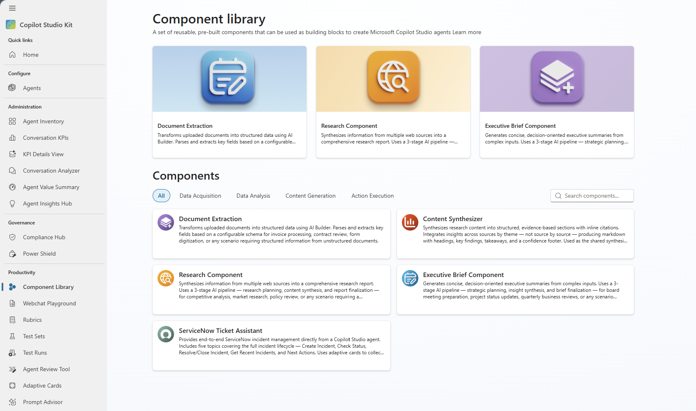
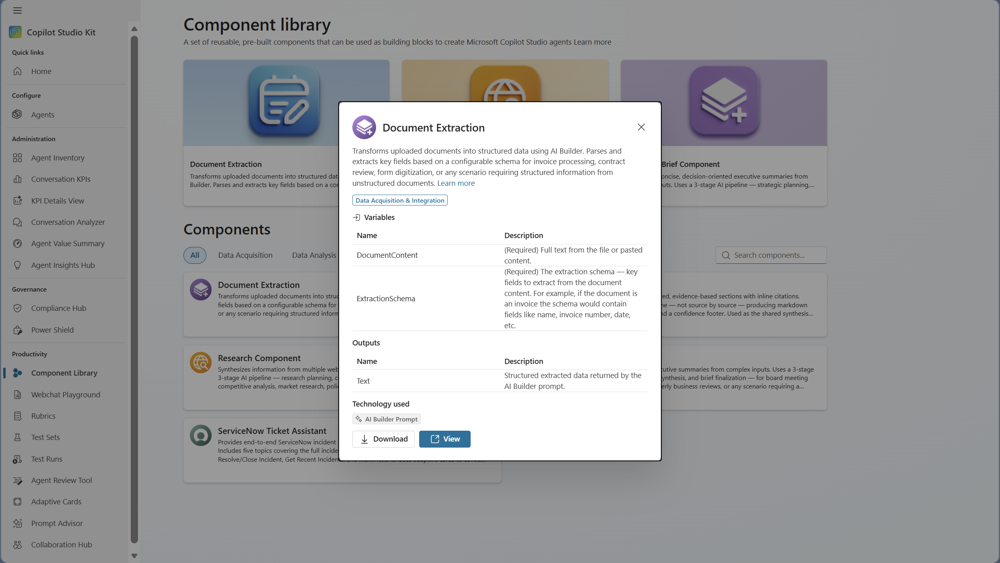

# Copilot Studio Kit Component Library

The Component Library provides a set of reusable, pre-built components for Microsoft Copilot Studio. Each component is packaged as its own [component collection](https://learn.microsoft.com/microsoft-copilot-studio/authoring-export-import-copilot-components), so you can install only the components you need. Import the solution into your environment, add the component collections you want to your agent, and use your agent’s instructions to tell the agent how to use them, or directly reference the prompts and flows to enhance your topic.

> [!NOTE]
> The Component Library is available as both a managed and an unmanaged solution. Use the **managed** solution to [add components to your agents](#using-components-with-a-managed-solution) without modification. Use the **unmanaged** solution only if you need to [edit component internals](#customizing-components-with-an-unmanaged-solution). There is only one instance of each component per environment, so any edit you make to a topic, prompt, or flow inside the Component Library applies to **every agent** that uses that component in the same environment.

## Overview

The Component Library includes five components shipped across three solutions. Components that require no connection references are in the base solution; components that share a common connector are grouped into their own solution. For installation instructions, see [Step-by-step setup](#step-by-step-setup).

| **Collection** | **Description** | **Components** | **Connections** |
| --- | --- | --- | --- |
| [Document Extraction Component](#document-extraction) | Transforms uploaded documents into structured data using AI Builder | 1 prompt | Dataverse |
| [Content Synthesizer Component](#content-synthesizer) | Shared AI Builder prompt that synthesizes research content into evidence-based sections with citations | 1 prompt | Dataverse |
| [Research Component](#research-component) | 3-stage AI pipeline that synthesizes web sources into a comprehensive research report | 1 topic + 3 prompts (Stage 2 → Content Synthesizer Component) | Dataverse |
| [Executive Brief Component](#executive-brief-generator) | 3-stage AI pipeline that produces decision-oriented executive summaries | 1 topic + 3 prompts (Stage 2 → Content Synthesizer Component) | Dataverse |
| [ServiceNow Ticket Component](#servicenow-ticket-assistant) | End-to-end ServiceNow incident management via adaptive cards | 5 topics + 1 connection Ref | Dataverse, ServiceNow |

## Prerequisites

Before you install the Component Library, make sure you have:

*   A Power Platform environment with Copilot Studio enabled
*   AI Builder credits available in your environment (required for prompt-based components)

## Available components

> [!IMPORTANT]  
> Fields marked "No" for Required have built-in defaults and work without configuration. Provide a value only to override the default behavior.

### Document Extraction

| **Type** | AI Builder Prompt (TaskDialog) |
| --- | --- |
| **Category** | Data Acquisition & Integration |
| **Interaction model** | Tool-initiated — the agent orchestrator invokes this tool when the user's intent matches the tool description. |

Transforms uploaded documents into structured data. Uses an AI Builder prompt to parse and extract key fields based on a configurable schema.

**When to use:** Invoice processing, contract review, form digitization, or any scenario that requires pulling structured information from unstructured documents.

#### How it works

1.  The user uploads a document to the agent conversation.
2.  The component processes the document with AI Builder.
3.  Extracted data is returned as structured output that can be stored, displayed, or passed to downstream flows.

#### Inputs

| **Name** | **Display name** | **Required** | **Description** |
| --- | --- | --- | --- |
| DocumentContent | Document Content | Yes | Full text from the file or pasted content |
| ExtractionSchema | Extraction Schema | Yes | The extraction schema — key fields to extract from the document content. For example, if the document is an invoice the schema would contain fields like name, invoice number, date, etc. |

#### Outputs

All AI Builder prompt outputs are returned.

### Content Synthesizer

| **Type** | AI Builder Prompt (TaskDialog) |
| --- | --- |
| **Category** | Content Generation & Transformation |
| **Interaction model** | Module — invoked by a parent pipeline (Research Component or Executive Brief Generator) as the Stage 2 synthesis step. Can also be used standalone as a tool. |

Transforms raw search results into a structured, evidence-based research section with inline citations. This is the shared synthesis engine used by both the [Research Component](#research-component) and [Executive Brief Generator](#executive-brief-generator) pipelines. It can also be added to any agent as a standalone tool for on-demand content synthesis.

**When to use:** Any scenario that requires synthesizing multiple source documents into a cohesive, citation-backed narrative — either as part of a multi-stage pipeline or as a standalone content generation tool.

#### How it works

1.  The parent pipeline (or agent) passes a research prompt, raw search-result content, and optional style instructions.
2.  The prompt integrates insights across all sources by theme — it does not summarize source by source.
3.  Evidence is grounded in the provided content with specific data points (numbers, percentages, dates, named entities).
4.  The output is a JSON object containing the synthesized markdown section and an array of extracted citations.

#### Inputs

| **Name** | **Display name** | **Required** | **Type** | **Description** |
| --- | --- | --- | --- | --- |
| Content | Content | Yes | Automatic | Markdown research output generated from the user's query, used as input for synthesizing content. Expected format includes `**Title:**`, `**Source:**`, and `**Content:**` blocks. |
| ResearchPrompt | Research Prompt | Yes | Automatic | The user's research question or query. All content is framed around this objective. |

#### Outputs

The prompt returns a JSON object with two fields:

| **Field** | **Type** | **Description** |
| --- | --- | --- |
| SectionContentMarkdown | String | Full synthesized section in markdown. Organized by theme with headings, key findings, key takeaways, and a confidence/recency footer. |
| Citations | Array | List of cited sources formatted as `"Title - URL"`. Each entry corresponds to an inline `[n]` marker in the section content. |

#### Output structure

The synthesized section follows this structure:

*   **Opening** — Leads with the most important finding and previews key themes.
*   **Body** — Organized by theme (not by source), with inline attribution and `[n]` citation markers, bold **Key Finding** callouts, and optional `[CHART SUGGESTION]` markers.
*   **Key Takeaways** — 3–5 concise, actionable bullet points.
*   **Footer** — Confidence assessment (High → Low), data recency, and notable gaps.

### Research Component

| Type | Topic + 3 AI Builder Prompts + Web Search |
| --- | --- |
| Category | Data Analysis & Insight |
| Interaction model | Tool-initiated — 3-stage pipeline: research planning → content synthesis → report finalization. |

Synthesizes information from multiple sources into a comprehensive research report. Uses a 3-stage AI pipeline to plan, research, and compile findings.

**When to use:** Competitive analysis, market research, policy review, or any scenario that requires a consolidated view across multiple information sources.

#### How it works

1.  The user provides a research question or topic.
2.  Stage 1 — Research Planner: Creates a structured research plan with sections and queries.
3.  Stage 2 — [Content Synthesizer](#content-synthesizer): Searches web sources for each section and generates content with citations.
4.  Stage 3 — Report Finalizer: Combines all sections and citations into a polished report.
5.  The final report is displayed inline in the conversation.

#### Inputs

| **Name** | **Display name** | **Required** | **Description** |
| --- | --- | --- | --- |
| ResearchPrompt | Research Prompt | Yes | The main topic or subject to research (for example, "Overview of electric vehicle market") |
| AdditionalInstructions | Additional Instructions | No | Optional context such as focus areas or constraints. Defaults to "Begin with clear research objective" if empty. |
| InstructionsForInformationCompiler | Instructions For Information Compiler | No | Controls the style and length of each synthesized section. Defaults to "Simple style, 200 words max" if empty. |
| InstructionsForReportFinalizer | Instructions For Report Finalizer | No | Controls how the final report is assembled. Defaults to synthesizing all sections into a cohesive report. |

#### Outputs

The component displays the report inline in the conversation.

### Executive Brief Generator

| **Type** | Topic + 3 AI Builder Prompts + Internal/Web Search |
| --- | --- |
| **Category** | Content Generation & Transformation |
| **Interaction model** | Tool-initiated — 3-stage pipeline: strategic planning → insight synthesis → brief finalization. |

Generates concise, decision-oriented summaries from complex inputs. Uses a 3-stage AI pipeline to plan, synthesize insights, and compile a polished executive brief.

**When to use:** Board meeting preparation, project status updates, quarterly business reviews, or any scenario that requires a polished summary for stakeholders.

#### How it works

1.  The user provides a brief topic or question.
2.  Stage 1 — Executive Brief Planner: Creates a strategic research plan with research areas.
3.  Stage 2 — Insight Synthesizer ([Content Synthesizer](#content-synthesizer)): Searches internal and web sources for each area, extracts key facts and citations.
4.  Stage 3 — Brief Finalizer: Compiles all insights and citations into a polished executive brief.
5.  The brief is displayed inline in the conversation.

#### Inputs

| **Name** | **Display name** | **Required** | **Description** |
| --- | --- | --- | --- |
| ResearchPrompt | Research Prompt | Yes | The brief topic or question (for example, "AI adoption strategy for mid-market companies") |
| AdditionalInstructions | Additional Instructions | No | Optional company context, focus areas, or constraints |

#### Outputs

The component displays the executive brief inline in the conversation.

### ServiceNow Ticket Assistant

| **Type** | 5 topics + ServiceNow connector + adaptive cards |
| --- | --- |
| **Category** | Action execution and system integration |
| **Interaction model** | Conversation-initiated — the agent routes to the appropriate topic based on user intent. Each topic uses adaptive cards to collect required fields. |

Provides end-to-end ServiceNow incident management directly from a Copilot Studio agent. Includes five topics that cover the full incident lifecycle.

#### Included topics

| **Topic** | **Description** |
| --- | --- |
| Create Incident | Collects short description, detailed description, impact, and urgency via adaptive card, then creates the incident in ServiceNow. |
| Check Status | Accepts an incident number (for example, INC0010002) and returns state, priority, dates, and description. |
| Resolve/Close Incident | Updates an incident's state (Resolved, Closed, Canceled, On Hold, In Progress) with resolution code and notes. |
| Get Recent Incidents | Automatically retrieves up to 10 recent incidents for the signed-in user (no input required). |
| Next Actions | Displays a navigation menu after completing a ServiceNow operation, routing to other ServiceNow topics or general conversation. |

**Note:** ServiceNow topics use adaptive cards to collect user input directly in the conversation. No tool-level inputs are required.

**When to use:** IT help desk, employee self-service, or any scenario that involves ServiceNow incident management.

#### Prerequisites

This component is shipped in its own solution (**CopilotStudioKit_ServiceNow_Components**) because it requires a ServiceNow connection reference during import. Before importing this solution, make sure you have:

*   A ServiceNow instance with REST API access
*   A connection configured in Power Platform for ServiceNow (you are prompted to set this up during solution import)
*   Appropriate ServiceNow user permissions for the operations needed

#### Service principle setup

To set up a ServiceNow Power Platform connection that uses Microsoft Entra ID, follow the steps documented here: [How to set up a ServiceNow Power Platform connection that uses Microsoft Entra ID](https://learn.microsoft.com/connectors/service-now/#how-to-set-up-a-servicenow-power-platform-connection-that-uses-microsoft-entra-id)

#### How it works

1.  The user expresses an intent (for example, "I need to create a ticket" or "What's the status of INC0012345?").
2.  The appropriate topic is triggered and presents an adaptive card to collect the required inputs.
3.  The component calls the ServiceNow API via a connector and returns the result.
4.  After completing the operation, the Next Actions topic presents options for the next step.

#### ServiceNow: Create Incident

| **Type** | Topic + ServiceNow Connector + Adaptive Cards |
| --- | --- |
| **Category** | Action Execution & System Integration |
| **Interaction model** | Conversation-initiated — the agent routes to this topic based on user intent. An Adaptive Card collects the required fields. |

Creates a new ServiceNow incident by collecting details from the user and submitting them to ServiceNow via a connector.

**When to use**: IT help desk, employee self-service, or any scenario where users need to log new incidents directly from conversation.

##### How it works

1.  The user expresses an intent to create an incident (e.g., "I need to create a ticket for a broken laptop").
2.  An Adaptive Card collects the required incident details.
3.  The component calls the ServiceNow API to create the incident and returns a confirmation with the incident number.
4.  A Next Actions menu is presented so the user can continue with another ServiceNow operation.

##### Prerequisites

##### Inputs (via adaptive card)

| **Field** | **Required** | **Description** |
| --- | --- | --- |
| ShortDescription | Yes | Brief summary of the issue |
| Description | No | Detailed description of the problem |
| Impact | Yes | Business impact level (1-High, 2-Medium, 3-Low) |
| Urgency | Yes | Urgency level (1-High, 2-Medium, 3-Low) |

##### Outputs

Confirmation message with the created incident number displayed inline.

#### ServiceNow: Check Incident Status

| **Type** | Topic + ServiceNow Connector + Adaptive Cards |
| --- | --- |
| **Category** | Action Execution & System Integration |
| **Interaction model** | Conversation-initiated — the agent routes to this topic based on user intent. An Adaptive Card collects the incident number. |

Retrieves the latest status and details of an existing ServiceNow incident.

##### How it works

1.  The user asks about an incident (e.g., "What's the status of INC0010002?").
2.  An Adaptive Card collects the incident number.
3.  The component queries ServiceNow and returns the incident details.

##### Prerequisites

##### Inputs (via adaptive card)

| **Field** | **Required** | **Description** |
| --- | --- | --- |
| IncidentNumber | Yes | The incident number to look up (e.g., INC0010002) |

##### Outputs

| **Field** | **Description** |
| --- | --- |
| IncidentNumber | The incident identifier |
| State | Current state of the incident |
| Priority | Priority level |
| CreatedDate | When the incident was created |
| LastUpdatedDate | Incident description |

#### ServiceNow: Resolve/Close Incident

| **Type** | Topic + ServiceNow Connector + Adaptive Cards |
| --- | --- |
| **Category** | Action Execution & System Integration |
| **Interaction model** | Conversation-initiated — the agent routes to this topic based on user intent. An Adaptive Card collects the resolution details. |

Updates an existing ServiceNow incident's state to Resolved, Closed, Canceled, On Hold, or In Progress, along with resolution details.

##### How it works

1.  The user expresses an intent to resolve or close an incident (e.g., "Close ticket INC0010002").
2.  An Adaptive Card collects the incident number, target state, resolution code, and resolution notes.
3.  The component updates the incident in ServiceNow and returns a confirmation.

##### Prerequisites

ServiceNow instance with REST API access and a ServiceNow connection in Power Platform.

##### Inputs (via adaptive card)

| **Field** | **Required** | **Description** |
| --- | --- | --- |
| IncidentNumber | Yes | The incident number to update |
| State | Yes | Target state (Resolved, Closed, Canceled, On Hold, In Progress) |
| ResolutionCode | Yes | Resolution category (Solved Remotely, Solved by Caller, etc.) |
| Resolution Notes | Yes | Description of the resolution |

##### Outputs

Confirmation message with the updated incident state displayed inline.

#### ServiceNow: Get Recent Incidents

| **Type** | Topic + ServiceNow Connector |
| --- | --- |
| **Category** | Action Execution & System Integration |
| **Interaction model** | Conversation-initiated — the agent routes to this topic based on user intent. No user input is required; the component automatically uses the signed-in user's identity. |

Retrieves and displays up to 10 recent ServiceNow incidents for the current user. No input fields are needed — the component uses the signed-in user's email automatically.

##### **When to use:** When users want a quick overview of their recent or open incidents.

**How it works**

1.  The user asks about their incidents (e.g., "Show my recent incidents").
2.  The component queries ServiceNow for up to 10 recent incidents matching the signed-in user's email.
3.  Incident details are displayed inline in the conversation.

##### Prerequisites

##### Inputs

None — automatically uses the signed-in user's email.

##### Outputs

| **Field** | **Description** |
| --- | --- |
| Incident Number | The incident identifier |
| State | Current state of the incident |
| Priority | Priority level |
| ShortDescription | Brief summary of the issue |
| CreatedDate | When the incident was created |
| LastUpdatedDate | When the incident was last modified |

**Note:** All ServiceNow components include a **Next Actions** navigation menu that appears after each operation, allowing the user to quickly move to another ServiceNow action or return to general conversation.

## Step-by-step setup

Setting up a component involves three phases: install or import the component solutions, add the component collections to your agent, and test and publish.

For general guidance on solutions, see [Create and manage solutions in Copilot Studio](https://learn.microsoft.com/microsoft-copilot-studio/authoring-solutions-overview). For component collections, see [Create and share reusable component collections](https://learn.microsoft.com/microsoft-copilot-studio/authoring-export-import-copilot-components).

### Phase 1: Install or import the Component Library solutions

The Component Library is shipped as five separate solutions:

| **Solution** | **What it contains** | **Connection references** |
| --- | --- | --- |
| CopilotStudioKit_DocumentExtraction_Component | Document Extraction | None — no connection references required |
| CopilotStudioKit_ContentSynth_Component | Content Synthesizer (shared synthesis prompt) | None — no connection references required |
| CopilotStudioKit_Research_Component | Research Component | None — no connection references required |
| CopilotStudioKit_ExecBrief_Component | Executive Brief | None — no connection references required |
| CopilotStudioKit_ServiceNow_Components | ServiceNow Ticket Assistant (5 topics) | ServiceNow connector |

Import the **Content Synthesizer** solution first — the Research and Executive Brief components depend on it. Only import the ServiceNow solution if you have a ServiceNow instance and need incident management capabilities.

There are two ways to install components: using the built-in Component Library in the Copilot Studio Kit, or by manually importing solutions.

#### Option A — Install from the Copilot Studio Kit (recommended)

If you are running the Copilot Studio Kit, you can browse and install components directly from the built-in **Component Library** page.

1.  In the Copilot Studio Kit, select **Component Library** in the left navigation under Productivity.
2.  Browse the available components or use the category tabs and search bar to find what you need.
3.  Select a component card to open the component details dialog.

The details dialog shows the component description, category, input/output variables, and technology used. The action buttons at the bottom depend on the component's install status and your permissions:

| **Scenario** | **Buttons shown** | **What happens** |
| --- | --- | --- |
| Component is not installed and you have install privileges | **Install** + **Download** | **Install** imports the component solution directly into your environment. |
| Component is not installed and you do not have install privileges | **Download** only | **Download** downloads a .zip file containing all five component solutions. Extract the .zip first, then import the individual solution files manually (see Option B). |
| Component is already installed | **View** + **Download** | **View** deep-links to the component collection in the Copilot Studio portal, where you can add it to an agent. |

#### Option B — Manual import via Power Apps

Use this option if you do not have the Copilot Studio Kit installed, or if you downloaded the solutions .zip from the Component Library and need to import them manually.

##### Step 1 — Download and extract the solutions

All five component solutions are distributed as a single compressed (.zip) file. You can get this file in one of two ways:

*   **From the Copilot Studio Kit** — select the **Download** button on any component in the Component Library.
*   **From GitHub** — go to the [latest release](https://github.com/microsoft/Power-CAT-Copilot-Studio-Kit/releases/latest) and download the component solutions .zip under Assets.

After downloading:

1.  **Extract** the .zip file to a folder on your local machine. This reveals five individual solution files:
    *   **CopilotStudioKit_DocumentExtraction_Component** — Document Extraction.
    *   **CopilotStudioKit_ContentSynth_Component** — Content Synthesizer (shared synthesis prompt).
    *   **CopilotStudioKit_Research_Component** — Research Component.
    *   **CopilotStudioKit_ExecBrief_Component** — Executive Brief.
    *   **CopilotStudioKit_ServiceNow_Components** — ServiceNow Ticket Assistant (only needed if you have a ServiceNow instance).
2.  Do **not** extract the individual solution .zip files — import them as-is in the next step.

##### Step 2 — Import the solution into your environment

For detailed steps on importing solutions, see [Export and import agents using solutions](https://learn.microsoft.com/microsoft-copilot-studio/authoring-solutions-import-export).

1.  Go to [make.powerapps.com](https://make.powerapps.com/).
2.  In the top-right corner, verify you are in the correct environment where your Copilot Studio agent lives. Use the environment picker to switch if needed.
3.  In the left navigation, select Solutions.
4.  Select Import solution from the top command bar.
5.  Select Browse, then choose the .zip file you downloaded.
6.  Select Next.
7.  Review the solution details (name, publisher, version). Select Next again.

##### Step 3 — Configure connections during import

During import, you may be prompted to set up connections for the components. Most component solutions do not require any connection references and import without additional configuration.

If you are importing the ServiceNow solution (CopilotStudioKit_ServiceNow_Components):

1.  For the ServiceNow connection reference, select Select a connection or New connection. You need your ServiceNow instance URL and credentials with API access.
2.  After configuring the connection, select Import.
3.  Wait for the import to complete. This may take a few minutes. A green banner confirms success.

**Tip:** If the import fails, select Download log file to see what went wrong. The most common cause is a missing connection or insufficient permissions.

##### Step 4 — Enable cloud flows

Some components include Power Automate cloud flows. These must be turned on after import.

1.  In [make.powerapps.com](https://make.powerapps.com/), go to Solutions.
2.  Open the Component Library solution you just imported.
3.  In the left pane, select Cloud flows.
4.  For each flow that shows Status = Off, select the flow name, then select Turn on from the top command bar.

### Phase 2: Add components to your agent

After installing or importing the solutions, the components exist in your environment but are not automatically connected to your agent. Each component is packaged as its own component collection, so you can add only the ones you need.

For more details, see [Add imported component collections to your agent](https://learn.microsoft.com/microsoft-copilot-studio/authoring-export-import-copilot-components#add-imported-component-collections-to-your-agent).

#### Option A — From the Component Library (if installed via the Kit)

If you installed a component using the **Install** button in the Component Library, or the component is already installed:

1.  Open the component in the Component Library and select **View**. This deep-links to the component collection in the Copilot Studio portal.
2.  From the component collection page, you can add an existing agent or create a new one to associate with the collection.

Alternatively, you can add the collection from within any agent:

1.  Open your agent in [Copilot Studio](https://copilotstudio.microsoft.com/).
2.  Select **Settings** (gear icon) in the top bar.
3.  In the left menu, select **Component collections**.
4.  Find the component collection, select the three dots (…), then select **Add to agent**.

#### Option B — From Copilot Studio directly

Repeat these steps for each component you want to use:

1.  Open [Copilot Studio](https://copilotstudio.microsoft.com/).
2.  Select Agents, then open the agent you want to add the component to.
3.  Select Settings (gear icon) in the top bar.
4.  In the left menu, select Component collections.
5.  Find the component collection you want to add (for example, "Document Extraction Component" or "Research Component").
6.  Select the three dots (…) next to the collection name, then select Add to agent.
7.  Confirm by selecting Add to agent in the dialog.
8.  Your agent name now appears under Active for next to the collection.

After you add a collection, the topics and tools for that component are available in your agent.

#### Available component collections

| **Component collection** | **Solution** | **What it adds** | **Connections required** |
| --- | --- | --- | --- |
| Document Extraction Component | CopilotStudioKit_DocumentExtraction_Component | AI Builder prompt | None |
| Content Synthesizer Component | CopilotStudioKit_ContentSynth_Component | AI Builder prompt | None |
| Research Component | CopilotStudioKit_Research_Component | Topic + AI Builder prompt | None |
| Executive Brief Component | CopilotStudioKit_ExecBrief_Component | Topic + AI Builder prompt | None |
| ServiceNow Ticket Component | CopilotStudioKit_ServiceNow_Components | 5 topics + connector | ServiceNow |
### Phase 3: Test and publish

#### Step 1 — Test in the test pane

1.  In Copilot Studio, select Test your agent (in the top-right corner).
2.  Enter a natural-language prompt for each component you added. For example:
    *   _"Extract data from this invoice"_ — triggers Document Extraction
    *   _"Research the latest trends in renewable energy"_ — triggers the Research component
    *   _"Create an executive brief for the Q4 results"_ — triggers Executive Brief Generator
    *   _"Create a ServiceNow ticket for a broken laptop"_ — triggers ServiceNow Create Incident
3.  Verify that the agent routes to the correct topic or tool, that connections work, and that the output is correct.

**Tip:** If the agent doesn't trigger the correct component, open the component's tool configuration and update the Description field. The orchestrator uses this description to determine when to invoke each tool.

#### Step 2 — Publish your agent

1.  In Copilot Studio, select Publish from the top command bar.
2.  Confirm the publish action. All changes go live after publishing.

#### Step 3 — Verify in your target channel

Test the agent in its deployed channel (such as Teams or webchat) to confirm end-to-end behavior, including:

*   Connection authentication (some connectors prompt users for credentials on first use)
*   File uploads (for Document Extraction)

## Using components with a managed solution

The **managed** solution is the recommended option for most users. Components are imported as read-only — you can add them to your agents and use them without risk of accidentally modifying the underlying topics, prompts, or flows.

Even without editing the components themselves, you have two powerful ways to control behavior:

### Agent instructions

Your Copilot Studio agent's **Instructions** field is the primary way to shape how components are used. Through natural-language instructions you can control:

*   **When** a component is invoked — describe the scenarios or user intents that should trigger each tool.
*   **What data is passed** — tell the agent what context, variables, or conversation history to include.
*   **How results are presented** — specify formatting, tone, follow-up actions, or routing after a component returns its output.
*   **Overall orchestration** — define the order of operations when multiple components are involved (for example, "After completing the research, generate an executive brief from the findings").

### Tool input defaults

Components added as tools (for example, AI Builder prompts) expose **input parameters** that you can configure directly in Copilot Studio — even with a managed solution. These inputs let you set defaults that are more specific than what agent instructions alone can achieve. For example:

*   Provide a default `ExtractionSchema` tailored to your business documents (for example, invoice fields like name, invoice number, date).
*   Pre-fill `AdditionalInstructions` with your organization's preferred writing style or compliance requirements.

Input defaults are configured per-agent, so different agents can pass different values to the same shared component.

## Customizing components with an unmanaged solution

If you need to modify the component internals — changing prompt logic, editing topic flows, or rewiring connectors — you must import the **unmanaged** solution. This gives you full edit access to every topic, prompt, and flow in the Component Library.

> [!IMPORTANT]
> Component collections are shared across the environment. There is only one instance of each component per environment, so any edit you make to a topic, prompt, or flow inside the Component Library applies to **every agent** that uses that component in the same environment. Before modifying a component, confirm the change is appropriate for all consumers.

Common customizations include:

*   **Modify prompts** — Adjust AI Builder prompts to match your domain and output format.
*   **Change data sources** — Point components at your own Dataverse tables, SharePoint lists, or external connectors.
*   **Adjust topics** — Update conversation flows to match your organization's terminology and processes.
*   **Update trigger phrases** — Add trigger phrases that reflect how your users naturally ask for things.
*   **Add authentication** — Configure authentication if components need to access user-specific data.

**Tip:** If you need different behavior for different agents, consider creating a copy of the component in a separate solution rather than editing the shared instance.

## Related content

*   [Copilot Studio Kit overview](https://learn.microsoft.com/microsoft-copilot-studio/guidance/kit-overview)
*   [Install Copilot Studio Kit](https://learn.microsoft.com/microsoft-copilot-studio/guidance/kit-install)
*   [Create and share reusable component collections](https://learn.microsoft.com/microsoft-copilot-studio/authoring-export-import-copilot-components)
*   [Create and manage solutions in Copilot Studio](https://learn.microsoft.com/microsoft-copilot-studio/authoring-solutions-overview)
*   [Export and import agents using solutions](https://learn.microsoft.com/microsoft-copilot-studio/authoring-solutions-import-export)
*   [Use shared tools from the Tools page](https://learn.microsoft.com/microsoft-copilot-studio/library-add-actions)
*   [Add an agent flow to an agent as a tool](https://learn.microsoft.com/microsoft-copilot-studio/flow-agent)
*   [Use Power Platform connectors as tools](https://learn.microsoft.com/microsoft-copilot-studio/advanced-connectors)
*   [Use prompts to make your agent perform specific tasks](https://learn.microsoft.com/microsoft-copilot-studio/nlu-prompt-node)
*   [Copilot Studio Kit on GitHub](https://github.com/microsoft/Power-CAT-Copilot-Studio-Kit)
*   [Microsoft Copilot Studio documentation](https://learn.microsoft.com/microsoft-copilot-studio/)
*   [AI Builder documentation](https://learn.microsoft.com/ai-builder/)
