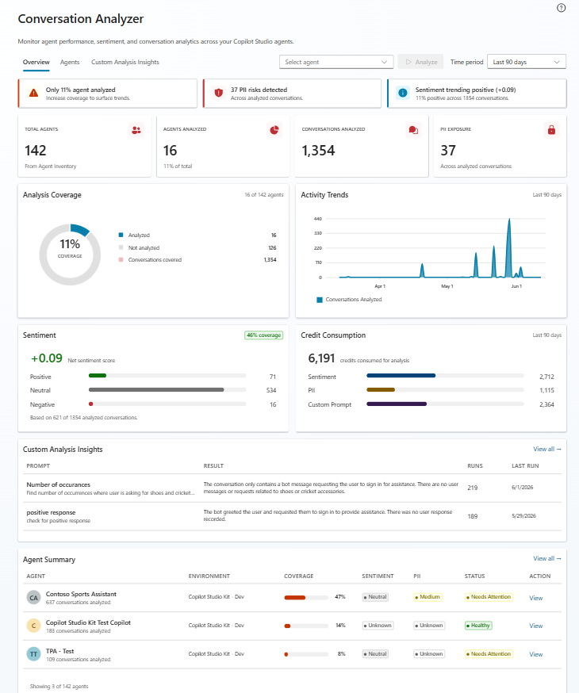
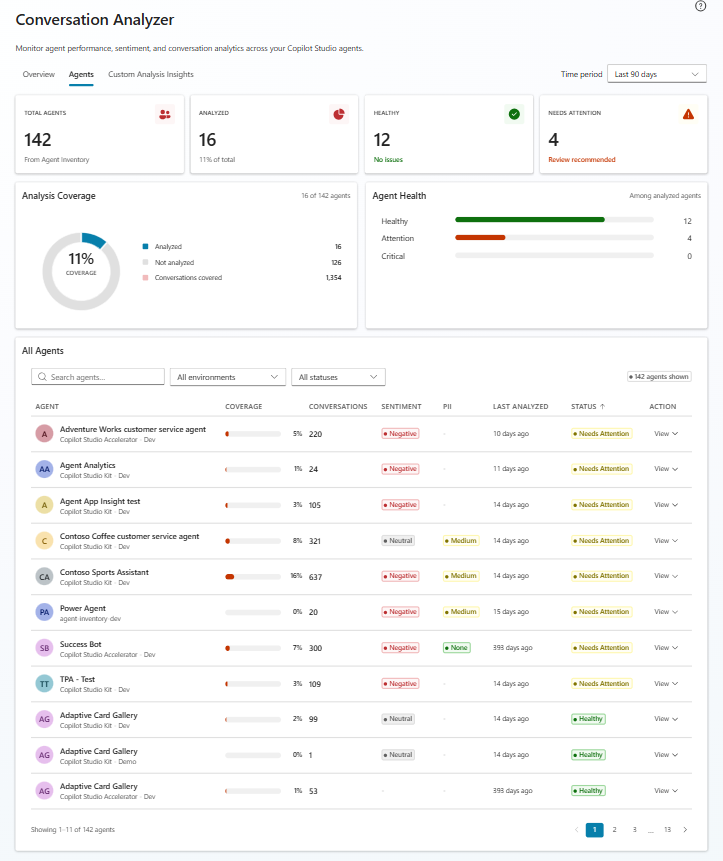
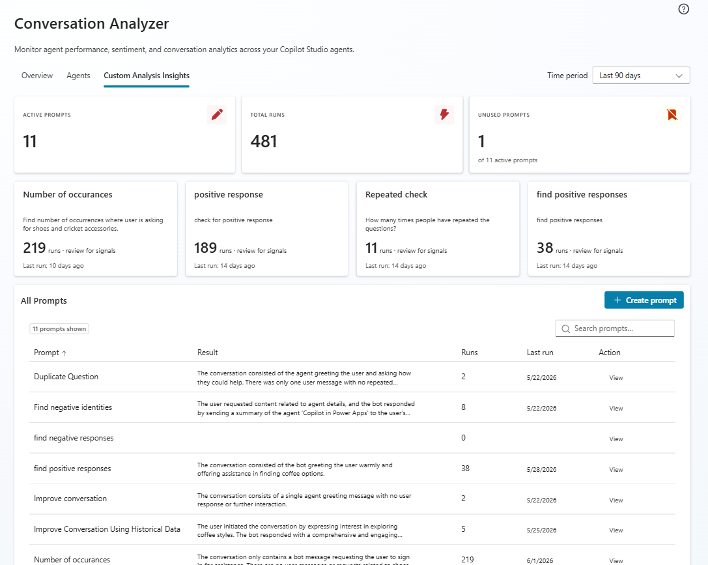
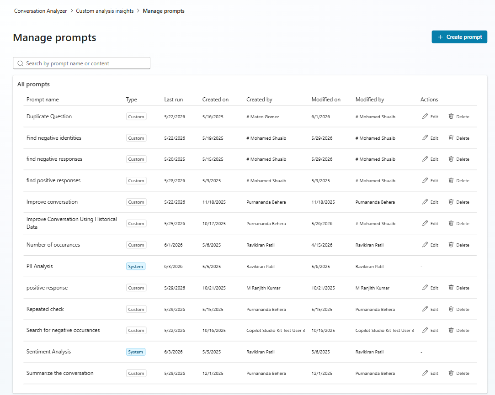
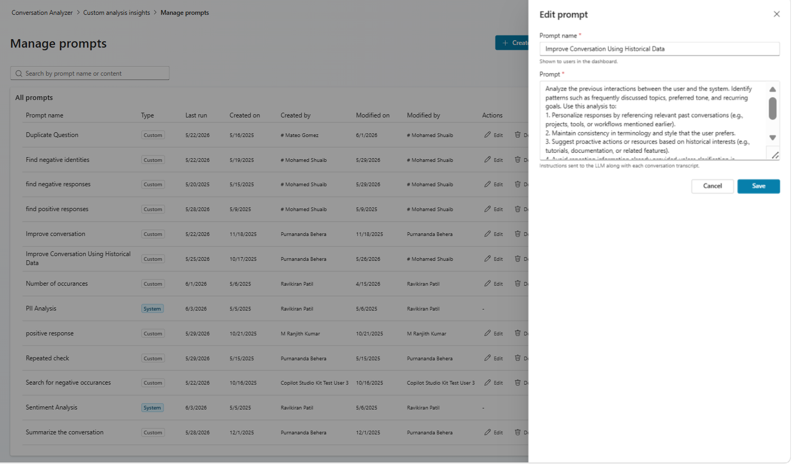
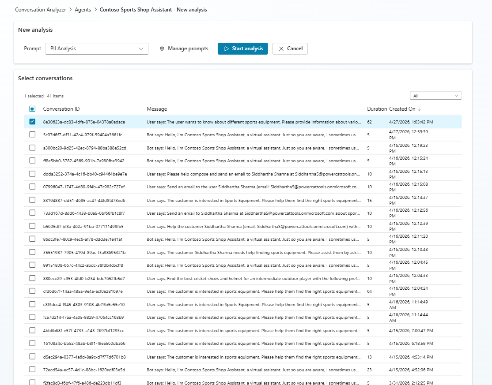
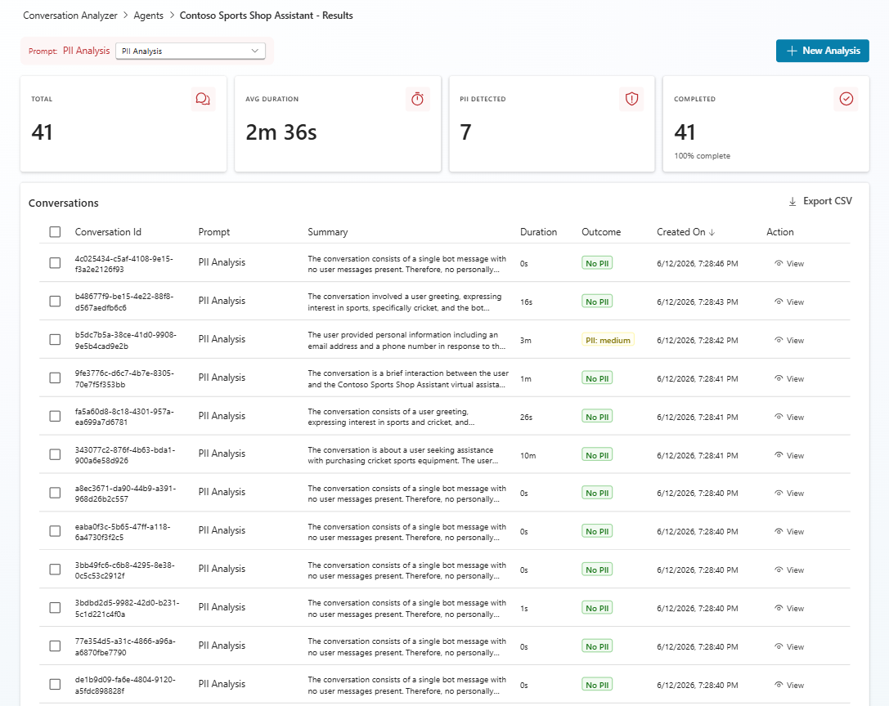
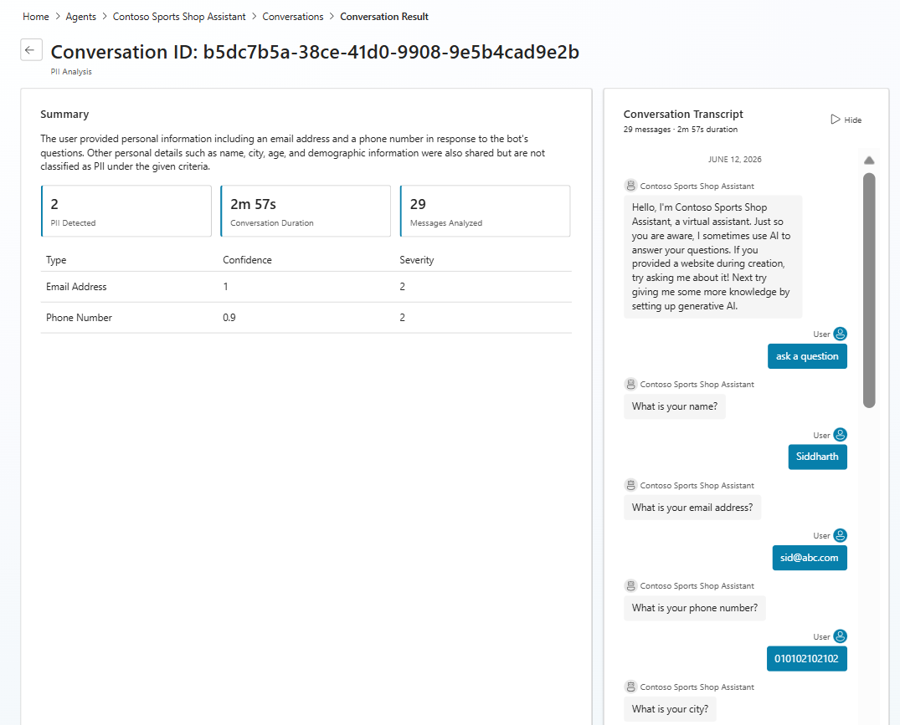

# Conversation Analyzer (Preview)

Conversation Analyzer allows makers to analyze the conversation transcripts of their Copilot Studio custom agents using custom prompts. The feature ships with two pre-canned prompts - **Sentiment Analysis** and **PII Analysis** - and supports custom prompts that can be created, saved, and reused. Using custom prompts to analyze conversations provides insights not available through traditional analytics.

Conversation Analyzer uses the agent data in the Agent Inventory, so it must be populated first before using Conversation Analyzer.

## Overview tab

The Overview tab provides a high-level dashboard of analysis activity across all agents. Key metrics displayed include:

- **Total Agents** - total count of agents from Agent Inventory having `Conversation Transcripts` in their environments.
- **Agents Analyzed** - number (and percentage) of agents that have been analyzed.
- **Conversations Analyzed** - total conversations processed.
- **PII Exposure** - number of PII detections across analyzed conversations.

The dashboard also includes:

- **Analysis Coverage** - donut chart showing analyzed vs. not-analyzed agents and conversations covered.
- **Activity Trends** - time-series chart of conversations analyzed over the selected time period.
- **Sentiment** - net sentiment score with positive/neutral/negative breakdown.
- **Credit Consumption** - credits consumed for analysis, broken down by Sentiment, PII, and Custom Prompt.
- **Custom Analysis Insights** - top custom prompts with their results, run counts, and last run dates.
- **Agent Summary** - per-agent overview showing environment, coverage, sentiment, PII status, health status, and a "View" action.

## Agents tab

The Agents tab lists all agents from the Agent Inventory that have `Conversation Transcripts` available in their environments, along with analysis-related information. It includes summary cards for Total Agents, Analyzed count, Healthy agents, and agents that Need Attention.

An **Agent Health** bar chart categorizes analyzed agents into Healthy, Attention, and Critical statuses.

The **All Agents** list supports filtering by search, environment, and status. Columns include:

- **Agent** - agent name, environment.
- **Coverage** - percentage of conversations analyzed.
- **Conversations** - total conversation count.
- **Sentiment** - sentiment outcome (Positive, Neutral, Negative).
- **PII** - PII detection level (None, Medium, High).
- **Last Analyzed** - date of the most recent analysis.
- **Status** - agent health status (Healthy, Needs Attention).
- **Action** - "View" link to drill into agent results and "Analyze" link to go to New Analysis.

## Custom Analysis Insights tab

The Custom Analysis Insights tab provides a summary of all custom prompt activity. Key metrics include:

- **Active Prompts** - number of custom prompts created.
- **Total Runs** - total analysis runs across all prompts.
- **Unused Prompts** - prompts that have not been run.

Top-performing prompts are shown as cards with run counts, review signals, and last run dates. Below, an **All Prompts** table lists each prompt with columns: Prompt, Result (sample output), Runs, Last run, and Action (View).

A **"+ Create prompt"** button allows creating new custom prompts directly from this tab.

## Managing prompts

To create or edit custom prompts, navigate to **Manage Prompts** (accessible from the Custom Analysis Insights tab or from the new analysis screen).

The Manage Prompts page displays all prompts in a table with columns:

- **Prompt name** - descriptive name for the prompt.
- **Type** - System (pre-canned) or Custom.
- **Last run** - date of most recent execution.
- **Created on** - creation date.
- **Created by** - user who created the prompt.
- **Modified on** - last modification date.
- **Modified by** - user who last modified the prompt.
- **Actions** - Edit and Delete (available for Custom prompts only; System prompts cannot be edited or deleted).

To create a new prompt, click **"+ Create prompt"**, enter a descriptive name in the **Prompt name** field, and add your prompt text in the **Prompt** textbox. To edit an existing prompt, click **Edit** from the Actions column. The prompt text is the instruction sent to the LLM along with each conversation transcript during analysis.

Once saved, the prompt becomes available in the prompt selection dropdown for future analyses.

## Perform new conversation analysis

To start a new analysis, select an agent from the Agents tab and click **"+ New Analysis"** from the results screen, or click **"Analyze"** from the Overview agent summary.

The new analysis screen shows:

1. A **Prompt** dropdown to select which prompt to use (Sentiment Analysis, PII Analysis, or any custom prompt).
2. A **Manage prompts** link to navigate to prompt management.
3. A **Start analysis** button to begin processing.
4. A **Cancel** button to abort.

Below, a **Select conversations** list displays available transcripts with Conversation ID, Message preview, Duration, and Created On date. Conversations can be individually selected or bulk-selected for analysis.

When the analysis is started, it will take a moment to process. After processing is finished, results will be presented.

## Viewing analysis results

After analysis completes (or when navigating to an already-analyzed agent), the results screen is shown. Summary cards at the top display:

- **Total** - number of conversations analyzed.
- **Avg Duration** - average conversation duration.
- **PII Detected** (for PII prompt) or **Sentiment** outcome - key metric for the selected prompt.
- **Completed** - completion status and percentage.

The **Conversations** table lists each analyzed conversation with columns:

- **Conversation Id** - unique identifier.
- **Prompt** - prompt used for analysis.
- **Summary** - AI-generated summary of the conversation.
- **Duration** - conversation length.
- **Outcome** - analysis result (e.g., "No PII", "PII: medium").
- **Created On** - analysis timestamp.
- **Action** - "View" link to see full details.

An **Export CSV** option allows downloading results.

## Conversation analysis details

Selecting "View" from the results list opens the conversation analysis details. This view shows:

**Left panel - Analysis Summary:**
- Conversation analysis details view varies slightly depending on the prompt used. The conversation can be seen on the right side of the screen as it happened, and analysis details are shown in the main view.

**Right panel - Conversation Transcript:**
- The full conversation as it happened, showing bot and user messages with timestamps.
- Message count and duration displayed at the top.
- A "Hide" toggle to collapse the transcript panel.

The details view varies depending on the prompt used. For PII Analysis, it shows detected PII types with confidence and severity scores. For Sentiment Analysis, it shows sentiment categorization. For custom prompts, the output follows the structure defined in the prompt instructions.

This feature is experimental and the team is looking forward to hearing feedback from users.