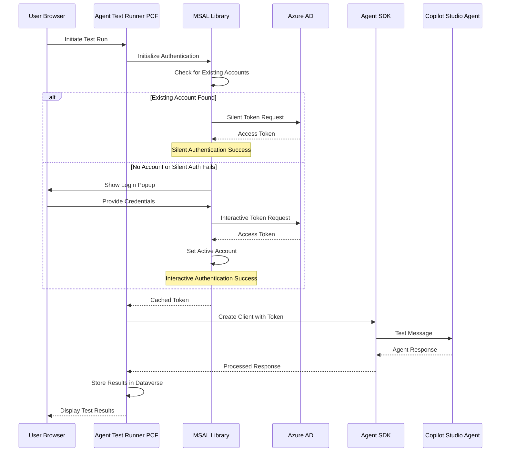
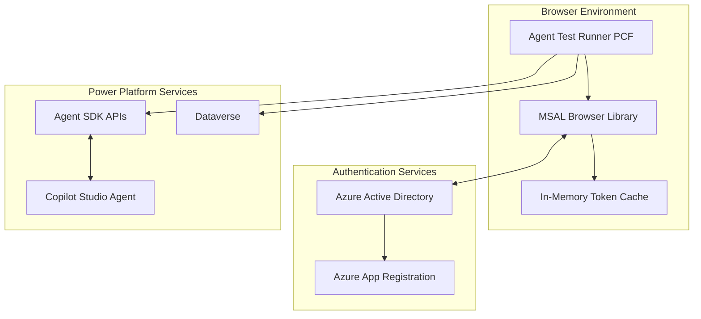

# Agent Test Runner Guide

## 📋 **Table of Contents**

1. [Architecture](#architecture)
2. [Azure App Registration Setup](#azure-app-registration-setup)
3. [Getting Environment ID & Agent Identifier](#getting-environment-id--agent-identifier-schema-name)
4. [Troubleshooting Guide](#troubleshooting-guide)

## Architecture

The Agent Test Runner uses a **direct browser-to-Agent SDK** architecture that is efficient for testing scenarios.

### **Current Flow Architecture**

### **Component Architecture**

## Azure App Registration Setup

### **Step 1: Create Azure App Registration**

Based on the [Microsoft Agents Sample Documentation](https://github.com/microsoft/Agents/tree/main/samples/dotnet/copilotstudio-client#create-an-application-registration-in-entra-id---user-interactive-login), follow these steps:

1. **Navigate to Azure Portal**

   - Open [https://portal.azure.com](https://portal.azure.com)
   - Navigate to **Azure Active Directory** > **App registrations**

2. **Create New Registration**

   - Click **New registration**
   - Provide a **Name**: `Copilot Studio Kit - Microsoft Auth (Name can be anything)`
   - Choose **Accounts in this organizational directory only**
   - For **Redirect URI**: **Leave blank** (we'll configure this after creation)
   - Click **Register**

3. **Note the Application Details**
   - On the **Overview** page, copy these values:
     - **Application (client) ID**
     - **Directory (tenant) ID**

### **Step 2: Configure API Permissions**

1. **Navigate to API Permissions**

   - In your app registration, go to **API permissions**
   - Click **Add a permission**

2. **Add Power Platform API Permissions**

   - Click the **APIs my organization uses** tab
   - Search for **Power Platform API**
   - If not found, see the note below about adding Power Platform API to your tenant
   - Select **Delegated permissions**
   - Under **CopilotStudio**, check **CopilotStudio.Copilots.Invoke**
   - Click **Add permissions**

3. **Grant Admin Consent** (Optional but recommended)
   - Click **Grant admin consent for [your organization]**

> **Note:** If you don't see "Power Platform API" in the list, you need to add it to your tenant. Follow the instructions at [Power Platform API Authentication](https://learn.microsoft.com/power-platform/admin/programmability-authentication-v2#step-2-configure-api-permissions) Step 2.

### **Step 3: Configure Authentication Settings**

1. **Add Redirect URI**

   - Go to **Authentication** in your app registration
   - Click **Add a platform**
   - Select **Single-page application (SPA)**
   - Enter your Environment URL: `https://[your-org].crm.dynamics.com`
   - Click **Configure**

2. **Configure Token Settings**

   - Navigate to **Settings** tab and update below settings:
     - ✅ **Access tokens** (used for implicit flows)
     - ✅ **ID tokens** (used for implicit and hybrid flows)

3. **Verify Account Types**
   - Ensure **Accounts in this organizational directory only** is selected

### Getting Environment ID & Agent Identifier (Schema Name)

1. **Navigate to Copilot Studio**

   - Go to [Copilot Studio Portal](https://copilotstudio.microsoft.com)
   - Sign in with your account
   - Ensure you're in the correct environment

2. **Open Your Agent**

   - Select the agent you want to test
   - Ensure the agent is **Published**

3. **Access Advanced Settings**

   - In your agent, go to **Settings** (gear icon)
   - Navigate to **Advanced** settings
   - Click on **Metadata** section

4. **Copy Environment ID & Schema Name**
   - Note the **Environment ID** value
   - Note the **Schema name** value. This is your **Agent Identifier**. Format: `cr123_agentname` or similar

### **Step 4: Configure Agent Configuration**

Create **Agent Configuration** record in Dataverse with the values from previous steps:

| Field                   | Value                                | Example                                |
| ----------------------- | ------------------------------------ | -------------------------------------- |
| **User Authentication** | Microsoft Authentication             |                                        |
| **Client ID**           | Application (client) ID from Step 1  | `12345678-1234-1234-1234-123456789012` |
| **Tenant ID**           | Directory (tenant) ID from Step 1    | `87654321-4321-4321-4321-210987654321` |
| **Environment ID**      | Environment ID from previous section | `11111111-2222-3333-4444-555555555555` |
| **Agent Identifier**    | Schema name from previous section    | `cr123_testagent`                      |

## Troubleshooting Guide

### **Authentication Errors**

#### **Error: "AADSTS50011: The reply URL specified in the request does not match"**

- **Cause**: Redirect URI mismatch in Azure App Registration
- **Solution**:
  1. Go to Azure App Registration > Authentication
  2. Ensure redirect URI matches your Environment URL exactly
  3. Use format: `https://[your-org].crm.dynamics.com`

#### **Error: "AADSTS65001: The user or administrator has not consented"**

- **Cause**: Missing API permissions or admin consent
- **Solution**:
  1. Go to Azure App Registration > API permissions
  2. Ensure "CopilotStudio.Copilots.Invoke" permission is added
  3. Click "Grant admin consent"

#### **Login Popup Appears Every Time**

- **Cause**: Account not being cached or browser settings preventing token storage
- **Solution**:
  1. Ensure browser allows popup windows for your Dynamics domain
  2. Check if browser is in incognito/private mode (will require login each time)
  3. Verify browser isn't blocking third-party cookies
  4. Clear browser cache and try again
  5. Check if organization policies are forcing re-authentication

#### **"InteractionRequiredAuthError" in Browser Console**

- **Cause**: Normal behavior when silent authentication fails and interactive login is triggered
- **Expected Behavior**:
  - This is not an error - it's expected when silent auth fails
  - The system automatically shows login popup
- **Action Required**: None - this is normal authentication flow

### **Agent SDK Errors**

#### **Error: "404 Not Found - Agent not found"**

- **Cause**: Incorrect Agent Identifier or Environment ID
- **Solution**:
  1. Verify Agent Identifier in Copilot Studio > Settings > Advanced > Metadata
  2. Ensure Environment ID matches the environment where agent is published
  3. Confirm agent is published and accessible

#### **Error: "401 Unauthorized"**

- **Cause**: Authentication token issues
- **Solution**:
  1. Check if user has access to the Copilot Studio environment
  2. Verify Azure App Registration permissions
  3. Clear browser cache and retry authentication

#### **Error: "403 Forbidden"**

- **Cause**: Insufficient permissions to access agent
- **Solution**:
  1. Ensure user has appropriate security roles in Dataverse
  2. Check if agent allows the user's security role
  3. Verify environment permissions

### **Agent Test Runner Control Errors**

#### **Error: "Failed to initialize authentication service"**

- **Cause**: Invalid configuration in Agent Configuration record
- **Solution**:
  1. Verify all four configuration values are correct:
     - Client ID
     - Tenant ID
     - Environment ID
     - Agent Identifier
  2. Check for extra spaces or invalid characters

#### **Error: "External service call blocked"**

- **Cause**: Missing external-service-usage
- **Solution**:
  1. **For End Users in Model-Driven Apps**:
     - This is typically a deployment/configuration issue
     - Contact your system administrator or developer
     - The control needs to be redeployed with proper external service configurations
     - No user action can resolve this - it requires admin/developer intervention
  2. **For System Administrators**:
     - Check if organizational security policies are blocking external calls
     - Ensure firewall/proxy settings allow connections to required Microsoft domains

### **Network and CORS Errors**

#### **Error: "CORS policy: No 'Access-Control-Allow-Origin' header"**

- **Cause**: Cross-origin request blocked
- **Solution**:
  1. Ensure redirect URI in Azure matches exact domain
  2. Use HTTPS for all URLs
  3. Verify no mixed content (HTTP/HTTPS) issues

#### **Error: "Failed to fetch"**

- **Cause**: Network connectivity or firewall issues
- **Solution**:
  1. Check network connectivity to:
     - `login.microsoftonline.com`
     - `api.powerplatform.com`
  2. Verify firewall allows outbound HTTPS traffic
  3. Check proxy settings if applicable

### **Test Execution Errors**

#### **Error: "Test execution timeout"**

- **Cause**: Agent taking too long to respond
- **Solution**:
  1. Check agent performance in Copilot Studio
  2. Verify agent is published and functioning

#### **Error: "Failed to create conversation"**

- **Cause**: Agent SDK initialization failed
- **Solution**:
  1. Verify agent is published
  2. Check agent configuration in Copilot Studio
  3. Ensure agent supports the test scenario

### **Debugging Tips**

1. **Enable Browser Developer Tools**

   - Press F12 to open developer tools
   - Check Console tab for JavaScript errors
   - Check Network tab for failed requests

2. **Check Authentication Flow**

   - Monitor Network tab during login
   - Look for 200 responses from `login.microsoftonline.com`
   - Verify token acquisition in Console logs

3. **Validate Configuration**

   - Double-check all GUIDs and identifiers
   - Ensure no extra spaces or special characters
   - Verify environment and agent accessibility

4. **Test in Isolation**
   - Try agent directly in Copilot Studio
