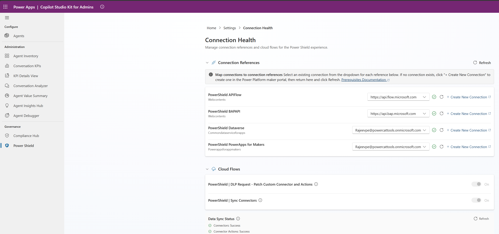

# Govern connector access with Power Shield

Power Shield enables organizations to manage Power Platform connector access through a structured, approval-based workflow for Data Loss Prevention (DLP) policies. Makers request connector access through a self-service wizard; admins review, approve, and manage those requests. Every DLP policy change is traceable to a Power Shield request, ensuring governance compliance and auditability.

## In this article

- [Key concepts](#key-concepts) — terminology and governance model
- [Prerequisites](#prerequisites) — roles, connections, and sync setup
- [Maker workflow](#maker-workflow) — request creation, drafts, and comments
- [Admin workflow](#admin-workflow) — review, approval, and settings
- [Request status lifecycle](#request-status-lifecycle) — statuses and transitions
- [Reference: Key Dataverse tables](#reference-key-dataverse-tables) — table catalog
- [Troubleshooting](#troubleshooting) — common issues and fixes

## Architecture

Power Shield is delivered as an embedded feature within two dedicated code apps and is also accessible from the model-driven app:

- **Copilot Agent Kit** (model-driven app) — launches Power Shield and routes to the appropriate code app based on the user's security role
- **Copilot Agent Kit for Makers** — submit and manage connector access requests
- **Copilot Agent Kit for Admins** — review, approve, and configure Power Shield

## Key concepts

- **Policy Request**: A maker's formal request to access specific connectors in one or more environments. Each request follows a lifecycle from Draft through Implemented (or Rejected/Withdrawn).
- **Service Tree**: An organizational grouping (department, team, or project) that scopes policy requests. Only members can submit requests under a Service Tree.
- **Environment Container**: A named group of Power Platform environments within a Service Tree that defines the DLP policy scope.
- **DLP Policy**: A Data Loss Prevention policy in the Power Platform Admin Center. Power Shield maintains one DLP policy per Service Tree + Environment Container pair, refreshed on each approval — see [What approval does to your DLP policies](#what-approval-does-to-your-dlp-policies).
- **Connector Actions**: Individual operations within a connector (e.g., "Send Email"). Makers can allow or block specific actions per connector.
- **Custom Connector Patterns**: URL patterns for custom connectors classified into DLP data groups (Business, Non-business, Blocked).
- **Compliance Questionnaire**: An optional, admin-configurable set of questions makers answer when submitting a request. Responses serve as decision points during approval.
- **Connector Governance (Default-Blocked Model)**: All non-Microsoft-published connectors are blocked after the initial sync. Only Microsoft-published connectors are available by default. Admins selectively unblock connectors through [Connector Configurations](#connector-configurations).

## Prerequisites

Before using Power Shield, ensure you have:

- **Copilot Agent Kit prerequisites**: All [prerequisites for the Copilot Agent Kit](PREREQUISITES.md) installed and configured for both code apps.
- **Security roles**: Users must be assigned one of the following Dataverse security roles:
  - **CAK - Maker** or **System Administrator** — maker experience in Copilot Agent Kit for Makers
  - **CAK - Administrator** or **System Administrator** — admin experience in Copilot Agent Kit for Admins
- **Power Platform Administrator role** (admins only): Admins who approve requests and create DLP policies must also have the **Power Platform Administrator** role assigned in the [Microsoft 365 admin center](https://admin.microsoft.com). This Microsoft Entra ID role grants permission to create, update, and delete DLP policies via the Power Platform for Admins connector. Without it, DLP policy creation fails after approval.

> [!WARNING]
> Power Shield **will not work** until the **PowerShield | Sync Connectors** cloud flow has run at least once. This flow populates the connector catalog used in the connector selection step of the request wizard. See [Connector and Connector Actions sync](#connector-and-connector-actions-sync) for setup steps, or use the [Connection Health](#connection-health) screen in the admin app to configure everything in one place.

> [!NOTE]
> Developer environments are automatically excluded from Power Shield. Only Production, Sandbox, Trial, Default, and Teams environments are available.

### Connection references

Power Shield uses four connection references. Two require **HTTP with Microsoft Entra ID (preauthorized)** connections that you must create manually. The other two (Dataverse and Power Apps for Makers) use standard connectors that are mapped during setup.

> [!NOTE]
> **Government clouds (GCC, GCC High, DoD):** Endpoint values in this section default to the commercial cloud. If your environment is in a US Government cloud, use the row for your cloud in each connection table below, and substitute the corresponding maker portal for every `https://make.powerapps.com` link in this document:
>
> | Cloud | Maker portal |
> |-------|--------------|
> | **Commercial** | `https://make.powerapps.com` |
> | **GCC** | `https://make.gov.powerapps.us` |
> | **GCC High** | `https://make.high.powerapps.us` |
> | **DoD** | `https://make.apps.appsplatform.us` |
>
> For the full list of cloud-specific service URLs, see [Power Apps US Government — service URLs](https://learn.microsoft.com/en-us/power-platform/admin/powerapps-us-government#power-apps-us-government-service-urls).

> [!IMPORTANT]
> Cloud flows included in the solution remain in an **off** state until you complete the connection reference configuration and manually turn them on.

#### Step 1: Create connections

Create two HTTP with Microsoft Entra ID (preauthorized) connections in your environment. Each connection requires a specific Base Resource URL and Microsoft Entra ID Resource URI (Azure AD Resource URI).

1. Sign in to [Power Apps](https://make.powerapps.com) and select your environment.
2. On the left navigation pane, select **Connections**.
3. Select **+ New connection**.
4. Search for **HTTP with Microsoft Entra ID** and select the **(preauthorized)** variant.
5. Enter the values for the **first connection** (used by the PowerShield APIFlow connection reference) using the row for your cloud:

   | Cloud | Base Resource URL | Microsoft Entra ID Resource URI |
   |-------|-------------------|---------------------------------|
   | **Commercial** | `https://api.flow.microsoft.com` | `https://service.powerapps.com/` |
   | **GCC** | `https://gov.api.flow.microsoft.us` | `https://gov.service.powerapps.us/` |
   | **GCC High** | `https://high.api.flow.microsoft.us` | `https://high.service.powerapps.us/` |
   | **DoD** | `https://api.flow.appsplatform.us` | `https://service.apps.appsplatform.us/` |

   *Refer to the [`Microsoft.PowerApps.Administration.PowerShell`](https://www.powershellgallery.com/packages/Microsoft.PowerApps.Administration.PowerShell) module on PowerShell Gallery — `Microsoft.PowerApps.AuthModule.psm1` (`flowEndpoint` switch and `Get-DefaultAudienceForEndPoint` audience map).*

6. Select **Create** and complete the sign-in prompt.


*Example: Commercial cloud — APIFlow connection details*

7. Repeat steps 3–6 to create the **second connection** (used by the PowerShield BAPAPI connection reference) using the row for your cloud:

   | Cloud | Base Resource URL | Microsoft Entra ID Resource URI |
   |-------|-------------------|---------------------------------|
   | **Commercial** | `https://api.bap.microsoft.com` | `https://api.bap.microsoft.com` |
   | **GCC** | `https://gov.api.bap.microsoft.us` | `https://gov.api.bap.microsoft.us` |
   | **GCC High** | `https://high.api.bap.microsoft.us` | `https://high.api.bap.microsoft.us` |
   | **DoD** | `https://api.bap.appsplatform.us` | `https://api.bap.appsplatform.us` |

   *Refer to the [`Microsoft.PowerApps.Administration.PowerShell`](https://www.powershellgallery.com/packages/Microsoft.PowerApps.Administration.PowerShell) module on PowerShell Gallery — `Microsoft.PowerApps.AuthModule.psm1` (`bapEndpoint` switch).*


*Example: Commercial cloud — BAPAPI connection details*

#### Step 2: Map connections and activate flows

After creating the connections, complete setup using the [Connection Health](#connection-health) screen in the admin app. It maps all four connection references, activates the cloud flows, and verifies data sync from a single page. Sign in as a user with the **Power Platform Administrator** role so the BAPAPI connection can manage DLP policies.

> [!NOTE]
> Activating a flow doesn't trigger an immediate run. The **Sync Connectors** flow runs on a daily schedule. To populate the connector catalog immediately, open the flow in Power Automate and select **Run**, then return to Connection Health and select **Refresh**.

### Connector and Connector Actions sync

Power Shield relies on two Dataverse tables — **Connectors** (`cat_connector`) and **Connector Actions** (`cat_connectoraction`) — that must be populated before the feature can be used. A single scheduled cloud flow keeps these tables current:

| Cloud Flow | Purpose | Target Tables |
|------------|---------|---------------|
| **PowerShield \| Sync Connectors** | Discovers all tenant connectors and fetches available actions per connector. Applies the [default-blocked model](#key-concepts): new non-Microsoft connectors are blocked by default; admin overrides are preserved. | `cat_connector`, `cat_connectoraction` |

#### First-time setup

After turning on the cloud flows (see [Step 2](#step-2-map-connections-and-activate-flows)):

1. Navigate to **Solutions > Copilot Studio Accelerator > Cloud flows**.
2. Open the **"PowerShield | Sync Connectors"** flow and select **Run** from the command bar. Wait for completion.
3. Verify: open the **Connectors** (`cat_connector`) table — you should see hundreds of records.
4. Verify: open the **Connector Actions** (`cat_connectoraction`) table — you should see action records.

#### Ongoing sync

The flow runs on a **daily schedule**. The connector sync preserves admin overrides (block/unblock) and uses `cat_UpsertConnectorActions` to efficiently create, update, and deactivate action records.

## Roles and responsibilities

### Maker

Requires the **CAK - Maker** or **System Administrator** security role. Access Power Shield through the **Copilot Agent Kit for Makers** app (a **[Maker]** badge displays in the header).

Makers can:

- Create and submit connector access requests via the 5-step wizard
- Create and manage Service Trees and Environment Containers
- View own requests and requests where they're a co-owner
- Save drafts and resume later
- Withdraw, clone, or revise and resubmit requests
- Post comments with file attachments on submitted requests

### Admin

Requires the **CAK - Administrator** or **System Administrator** security role. Access Power Shield through the **Copilot Agent Kit for Admins** app (an **[Admin]** badge displays in the header). Approving requests also requires the **Power Platform Administrator** role (see [Prerequisites](#prerequisites)) — the Dataverse security role controls app access; the Power Platform Administrator role controls DLP policy operations.

Admins can:

- View all requests across the tenant
- Assign requests to themselves (**Assign to Me**)
- Approve or reject requests (rejection requires a comment)
- View fulfillment logs and notification history
- Manage [Connector Configurations](#connector-configurations), [Question Configuration](#question-configuration), and [Notification Settings](#notification-settings)
- Post comments with file attachments on any request

Users with the **System Administrator** role have access to both apps.

## Get started

### Launch options

Power Shield is accessible from three apps within the Copilot Agent Kit solution. Choose the launch option that matches your role and workflow.

| App | Type | Audience | Internal name |
|-----|------|----------|---------------|
| Copilot Agent Kit | Model-Driven App | All users (auto-routes by role) | `cat_CopilotStudioAccelerator` |
| Copilot Agent Kit for Admins | Code App | Admins | `cat_copilotstudiokitforadmins` |
| Copilot Agent Kit for Makers | Code App | Makers | `cat_copilotstudiokitformakers` |

#### Option A: Launch from the Copilot Agent Kit model-driven app

1. Open the **Copilot Agent Kit** model-driven app.
2. In the left navigation, expand the **Governance** area.
3. Select **Power Shield**. The unified launcher detects your security role and routes you to the appropriate code app (admin app takes precedence if you have both roles).

#### Option B: Launch from Copilot Agent Kit for Admins

1. Open the **Copilot Agent Kit for Admins** code app.
2. In the left sidebar, navigate to **Governance** → **Power Shield**.

#### Option C: Launch from Copilot Agent Kit for Makers

1. Open the **Copilot Agent Kit for Makers** code app.
2. In the left sidebar, navigate to **Governance** → **Power Shield**.

## Maker workflow

### Home screen (Maker view)

The home screen provides an overview of your connector access requests.


**Header actions:** **+ New Request** (launch the wizard) and **Manage Service Trees**.

**Stat cards:** Four cards summarize your request portfolio — **Total**, **Pending**, **Completed** (with approval rate), and **Policy Failed**. Click a card to filter the grid.

**Request grid:** Lists your requests with status, service tree, environment container, connector counts, and submission date. Click a row for details. Use the row action menu (⋮) for quick **Clone** and **Withdraw** actions.


### Managing Service Trees

Each request must be associated with a Service Tree.

#### Service Tree Management page

Navigate to **Manage Service Trees** from the home screen header. Click **Take a tour** for a guided walkthrough.


The page uses a two-level drill-down:

1. **Service Trees list** — view all trees where you're a member. Search by name. Click to drill in.
2. **Service Tree detail** — view and edit details across the **Details** and **Environment Containers** tabs.

#### Creating a Service Tree

1. Click **+ New Service Tree** on the list page or during the wizard (Step 1).
2. Fill in the fields:
   - **Name** (required)
   - **Organization** (optional)
   - **Description** (optional)
   - **Members**: Paste a username (e.g., `user@domain.com`) and click **+ Add**. You're automatically the first member.


Only members of a Service Tree can see it and submit requests under it.

#### Managing Environment Containers

Environment Containers group Power Platform environments within a Service Tree. Navigate to a Service Tree's **Environment Containers** tab.


To create a container:

1. Click **+ New Container**.
2. Enter a **Container name** (required) and **Description** (required).
3. Filter environments by display name, **Type** (Production, Sandbox, etc.), and **Location**.
4. Select one or more environments using checkboxes.
5. Click **Save**.


### Creating a new request (5-step wizard)

Click **+ New Request** on the home screen. The wizard guides you through five steps. If no compliance questionnaire is configured, Step 2 is automatically skipped.

#### Step 1: Environment & Service Tree

Select the Service Tree and Environment Container for your request.


- **Left panel**: Select a Service Tree (only trees where you're a member). Create new ones inline with **+ New Service Tree**.
- **Right panel**: Select a container. Edit existing containers or create new ones inline. The environments in the selected container display in a read-only table below.

**Validation requirements:**
- A Service Tree and Environment Container must be selected.
- No [in-progress conflict](#in-progress-constraint) — only one active request per Service Tree at a time.
- You must have the System Administrator role in each environment. Clicking **Next** validates this; unauthorized environments are flagged in a dialog.

#### Step 2: Compliance Questionnaire

Answer the compliance questions grouped by category (skipped automatically if no questionnaire is configured). Supported types: Yes/No, Text, Single-select, Multi-select, and Date. Some questions may be conditional. Required questions are marked with an asterisk (*).


#### Step 3: Connector Selection

Select the connectors for your DLP policy. Filter by publisher, tier, release, and risk level.


Use the **Hide Blocked** toggle to show or hide connectors blocked by an admin. Blocked connectors display a red "Blocked by Admin" badge and can't be selected (see [Connector Governance](#key-concepts)).

**Connector Actions:** Click **View Connector Actions** on any connector to configure per-action Allow/Block rules. Use **Allow All** or **Block All** for bulk changes.


**Custom Connector Patterns:** Click **+ Add Custom Connectors** to define URL patterns (maximum 5 per request).


**Confirm selections:** Clicking **Next** opens a confirmation dialog summarizing selected connectors, blocked actions, and custom patterns.


#### Step 4: Business Justification


- **Business justification** (required): 20-character minimum.
- **Supporting Document** (optional): Single file (PDF, DOCX, XLSX, PNG, or JPG, max 25 MB).

#### Step 5: Review & Submit

Review your request across three tabs before submission.


- **Scope tab** — environments (with **Check DLP Membership** links), connectors (with expandable action rules), and custom patterns
- **Details tab** — questionnaire answers, justification, and supporting document
- **Collaboration tab** — add co-owners (maximum 20) who receive read/write access to this request


Click **Submit Request ✓** to open the confirmation dialog, then **Submit ✓** to finalize. Submitted requests can't be edited.


> [!NOTE]
> The **admin comment** (formal decision record on the Summary tab) is distinct from the **Comments thread** (ongoing discussion on the Comments tab).

### Save Draft and Resume

Save your request as a draft at any wizard step and return later.

- Click **Save Draft** (available after Step 1 requirements are met).
- To resume: open the draft and click **Resume Draft**, or select the draft row on the home screen.
- The wizard reopens at the step where you left off with all data restored.

Drafts don't enforce full validation — you can save without completing required fields.

### Withdraw a request

Withdraw a request in **Draft** or **Submitted** status.

1. Open the request detail view or use the row action menu (⋮).
2. Click **Withdraw** and confirm.
3. The request moves to **Withdrawn** status (read-only).

### Revise and resubmit

Revise a withdrawn request:

1. Open the withdrawn request and click **Revise & Resubmit**.
2. Confirm that a new request will be created with the previous data.
3. The wizard opens at Step 1 with pre-populated data (re-attach the supporting document).
4. Make changes and submit.

The original withdrawn request remains unchanged for audit purposes.

### Clone a request

Clone any request to create a new draft with the same configuration.

1. Click the row action menu (⋮) → **Clone** → confirm.
2. A new Draft request is created.

**Copied:** Service Tree, Environment Container, environments, connectors (with action overrides), custom patterns, questionnaire answers, and justification. **Not copied:** co-owners and supporting documents.

### Request detail view (Maker)

Click any request row to view its details across two tabs:

- **Summary** — full request details, co-owners, and admin comment
- **Comments** (after submission) — discussion thread with admins

| Status | Available Actions |
|--------|-------------------|
| Draft | Resume Draft, Withdraw |
| Submitted | Withdraw |
| Withdrawn | Revise & Resubmit |
| All other statuses | Read-only |

### Comments and discussion

Exchange messages with admins via the Comments tab after submission.

- Comments display in a vertical timeline (oldest first). Admin comments have a blue accent.
- Attach files (PDF, DOCX, XLSX, PNG, JPG, max 25 MB each) and preview them in-app.
- Comments are **immutable** — they can't be edited or deleted, ensuring a reliable audit trail.

## Admin workflow

### Home screen (Admin view)

The admin home screen provides a tenant-wide view of all policy requests.


**Stat cards:** Six cards — **All**, **Pending**, **Completed** (with approval rate), **Policy Failed**, **Rejected**, **Withdrawn**. Click a card to filter the grid.

**Settings:** Click the gear (⚙) icon to access the [Settings Hub](#settings-hub).

**Admin grid:** Displays all tenant requests with the same columns as the maker grid, plus **Created By** and **Assigned Admin**.

### Settings Hub

Click the gear (⚙) icon on the admin home screen to configure Power Shield before processing requests.


Four configuration areas:

| Card | Description |
|------|-------------|
| **Connection Health** | Manage connection references and cloud flows for data sync |
| **Connector Configurations** | Manage connector catalog, risk levels, and blocked status |
| **Question Configurations** | Configure the compliance questionnaire |
| **Notification Settings** | Configure email notification delivery |

### Connection Health

Connection Health is the single place to manage Power Shield connection references and cloud flow activation. Use it for initial setup and ongoing monitoring — connections can break and flows can be turned off at any time. Available only to users with the **CAK - Administrator** or **System Administrator** security role.

Open Connection Health from either:

- **Settings Hub** → select **Connection Health** (first card)
- **Admin home screen** → select **Check Health** on the sync flow prerequisites banner (appears when setup is incomplete)



The screen has two collapsible sections and a status indicator:

#### Connection References

Map existing connections to the four Power Shield connection references. Select a connection from the dropdown for each reference. If no connection exists, select **+ Create New Connection** to open the Power Platform maker portal, create the connection, then return and select **Refresh**.

| Connection Reference | Connector Type |
|---------------------|----------------|
| PowerShield APIFlow | Web Contents |
| PowerShield BAPAPI | Web Contents |
| PowerShield Dataverse | Common Data Service |
| PowerShield PowerApps for Makers | Power Apps for Makers |

A green checkmark (✓) appears next to each reference after a connection is successfully mapped.

#### Cloud Flows

After all connection references are mapped, activate the Power Shield cloud flows by toggling each flow to **On**:

| Flow | Purpose |
|------|---------|
| **PowerShield \| Sync Connectors** | Populates the connector and connector actions catalog |
| **PowerShield \| DLP Request - Patch Custom Connector and Actions** | Applies URL patterns and action overrides on DLP approval |

Cloud flows can only be activated after all connection references are mapped. If connections are missing, a warning appears in this section.

#### Data Sync Status

After the **Sync Connectors** flow runs, the Data Sync Status section confirms whether the connector catalog has been populated:

- ✅ **Connectors: Success** — the `cat_connector` table contains data
- ✅ **Connector Actions: Success** — the `cat_connectoraction` table contains data
- ⚠️ **Pending** — data has not yet synced; wait for the flow to complete or run it manually from Power Automate

Select **Refresh** to recheck data sync status at any time.

### Connector Configurations

Browse and manage all connectors synced from your Power Platform environment. Non-Microsoft connectors are [blocked by default](#key-concepts) — use this screen to selectively unblock them. Blocking and unblocking changes apply **immediately** — no sync required.


**Toolbar:** View details and actions, Block, Unblock, Set risk level, Show blocked toggle, Search.

**Connector detail panel:** Click a connector to view metadata (key, category, release tag, sync date, description) and manage individual **Connector Actions** with per-action Block/Unblock controls.


### Question Configuration

Manage the compliance questionnaire that appears in the maker's wizard (Step 2). The kit ships without question data — click **Take a tour** for a guided walkthrough.


The interface has two tabs:

- **Categories** — section headers that group questions. Create with **+ New Category** (name, display order, active status).
- **Questions** — individual prompts. Configure answer type (Boolean, Text, Choice, MultiselectChoice, Date), display order, required flag, tooltip, and conditional logic (parent question + trigger value).

For Choice and MultiselectChoice questions, define answer options with **+ New Option**.

### Notification Settings

Configure email notification delivery.


| Setting | Description | Required |
|---------|-------------|----------|
| **Sender Email Address** | Queue or user mailbox with server-side sync enabled | Yes |
| **Admin Distribution List** | Distribution list or shared mailbox for admin notifications | No |
| **PowerShield App URL** | Full app URL for deep links in emails | No |
| **Notifications Enabled** | Enable or disable all email notifications | — |

> [!IMPORTANT]
> Without the Sender Email Address configured, all email notifications silently fail. Ensure server-side synchronization is enabled for the sender mailbox in Exchange Online.

### Reviewing a request (Admin)

The admin detail view has five tabs:

- **Summary** — full request details (same as maker view)
- **Fulfillment** — DLP policy details and per-environment fulfillment status
- **Comments** — discussion thread with the maker
- **Activity** — fulfillment audit log
- **Notifications** — email notification history

#### Assign to Me

Click **Assign to Me** on a **Submitted** request to move it to **Under Review**, signaling to other admins that you're reviewing it.


#### Approve a request

Approval uses a **2-step wizard** for requests in **Submitted** or **Under Review** status:

**Step 1 — DLP Policy Impact review:**

1. Click **Approve**.
2. The dialog shows a pre-flight check:
   - **No conflicts** — green success message with environment and connector counts.
   - **Existing policies affected** — warning listing affected policies and environments.
   - **Zero-environment conflict** — approval is **blocked** until the admin resolves the conflict in the Power Platform Admin Center.
   - **Post-submission blocked connectors** — warning that these connectors will be excluded.
3. Click **Next →** to proceed.


**Step 2 — Confirmation:**


4. Review the warning: approving creates an immediate, irreversible DLP policy (reversible only via the Power Platform Admin Center).
5. Enter a required **Admin comment**.
6. Click **Confirm Approve**.

After approval, Power Shield automatically sets the status to **Implementing**, resolves DLP conflicts, creates the scoped policy, and updates to **Implemented** (or **Policy Failed** on error). Approval requires the **Power Platform Administrator** role — see [Troubleshooting](#troubleshooting) if approval fails with a permission error.

#### What approval does to your DLP policies

Power Shield maintains **one DLP policy for each Service Tree + Environment Container pair** — one policy for your team's environments. When a request is approved, that single policy is **refreshed** to match the latest approved connectors and actions. The diagram below walks through two requests for the same Service Tree and Environment Container.

```
                  Marketing team (Service Tree)
                            │
                            └── Marketing Production envs (Environment Container)
                                          │
                                          ▼
            ┌─────────────────────────────────────────────────────┐
            │             ONE DLP policy for this scope           │
            └─────────────────────────────────────────────────────┘

  Before REQ-00001 is approved        After REQ-00001 is approved
  ─────────────────────────────       ─────────────────────────────
  (no policy yet)                     Policy contents:
                                       • SharePoint  (Allow)
                                       • Outlook     (Allow)


  Later — REQ-00002 is approved for the same Service Tree + Container
  (asks for SharePoint + Teams):

  Before REQ-00002 is approved        After REQ-00002 is approved
  ─────────────────────────────       ─────────────────────────────
  Policy contents:                    Policy contents (refreshed):
   • SharePoint  (Allow)               • SharePoint  (Allow)
   • Outlook     (Allow)               • Teams       (Allow)

  The same policy slot is reused — its contents are refreshed to
  match the latest approved request. Outlook is no longer allowed
  because REQ-00002 didn't include it.
```

**A note on overlap with other DLP policies:** if any *other* DLP policy in your tenant (managed by Power Shield or created elsewhere) already includes one of the environments in the new request, those environments are removed from that other policy as part of approval, so coverage of an environment doesn't overlap between two policies. The pre-flight check on the **Approve** dialog (Step 1) shows you this impact before you confirm.

#### Reject a request

1. Click **Reject** on a **Submitted** or **Under Review** request.
2. Enter a required comment explaining the rejection.
3. Click **Confirm Reject**. The maker is notified.

#### Fulfillment tab

After approval, this tab shows the DLP policy name, policy ID (with copy buttons), and per-environment fulfillment status.


## Request status lifecycle

```
[New Wizard] ──── Save Draft ───→ Draft ←── Resume Draft
                                    │
                   Maker Withdraw ──┼──→ Withdrawn ──→ Revise & Resubmit (new request)
                                    │
                   Wizard Submit ───┼──→ Submitted
                                    │         │
                   Auto-Reject ─────┼──→ AutoRejected
                                    │
                   Admin Approve ───┼──→ Approved ──→ Implementing ──→ Implemented
                   Admin Reject ────┼──→ Rejected                    ↘ ImplementedWithErrors
                   Assign to Me ────┼──→ UnderReview
                                    │         │
                                    │   Admin Approve ──→ Approved
                                    │   Admin Reject  ──→ Rejected
```

### Status reference

| Status | Display Label | Description | Set By |
|--------|---------------|-------------|--------|
| Draft | Draft | Saved but not submitted | Maker |
| Submitted | Submitted | Awaiting admin review | Maker |
| UnderReview | In Review | Admin has taken ownership | Admin |
| Approved | Approved | DLP policy creation initiated | Admin |
| Implementing | In Progress | DLP policy being created | System |
| Implemented | Completed | DLP policy successfully created | System |
| ImplementedWithErrors | Policy Failed | DLP policy creation encountered errors — view details in the **Activity** tab | System |
| Rejected | Rejected | Admin rejected with comment | Admin |
| AutoRejected | Auto Rejected | Rejected by external flow | System |
| Withdrawn | Withdrawn | Maker withdrew the request | Maker |

### In-progress constraint

Only one active request per Service Tree at a time. A new request is blocked if an existing request has status: Draft, Submitted, UnderReview, Approved, Implementing, or AutoRejected. Terminal statuses (Withdrawn, Rejected, Implemented, ImplementedWithErrors) don't block new requests.

## Reference: Key Dataverse tables

All tables use the `cat_` publisher prefix.

### Master tables

| Table | Purpose |
|-------|---------|
| `cat_servicetree` | Organizational groupings for scoping requests |
| `cat_connector` | Connector catalog (sync flow maintained) |
| `cat_connectoraction` | Individual actions per connector (sync flow maintained) |
| `cat_questioncategory` | Questionnaire section headers |
| `cat_question` | Compliance questions |
| `cat_questionoption` | Answer options for Choice/MultiselectChoice questions |

### Transaction tables

| Table | Purpose |
|-------|---------|
| `cat_policyrequest` | Request header with status, justification, and admin comment |
| `cat_policyrequestenvironment` | Environments per request with fulfillment tracking |
| `cat_policyrequestconnector` | Connectors per request with action overrides |
| `cat_policyrequestanswer` | Questionnaire answers (immutable question text snapshot) |
| `cat_policyrequestparticipant` | Co-owners associated with a request |
| `cat_powershieldcustomconnectorpattern` | Custom connector URL patterns per request |
| `cat_powershieldpolicyrequestcomment` | Discussion thread comments |
| `cat_powershieldpolicyrequestlog` | Append-only fulfillment audit log |

### Supporting tables

| Table | Purpose |
|-------|---------|
| `cat_powershieldenvironmentgroups` | Environment containers scoped to a Service Tree |
| `cat_powershieldenvironmentgroupmembers` | Environments within a container |
| `cat_powershieldservicetreemembers` | Service Tree membership |
| `cat_powershieldsettings` | Key-value notification configuration |

## Troubleshooting

**"No environments available" in the wizard**

- Ensure you have access to at least one non-Developer Power Platform environment.
- Verify the Power Shield APIFlow connection is active. Check **Settings** → **[Connection Health](#connection-health)**.
- Check that the connection user has the required permissions.

**"In-progress conflict" error when creating a request**

- Another active request (Draft, Submitted, Under Review, Approved, or Implementing) exists for the same Service Tree.
- Wait for it to reach a terminal status (Implemented, Rejected, Withdrawn), or withdraw it first.

**Request stuck in "Implementing" status**

- Check the **Activity** tab (admin only) for error details.
- Verify the Power Shield BAPAPI connection is active. Check **Settings** → **[Connection Health](#connection-health)**.
- Ensure the approving admin has the **Power Platform Administrator** role assigned in the [Microsoft 365 admin center](https://admin.microsoft.com). DLP policy write operations (create, update, delete) require this Entra ID role.
- If fulfillment failed, the status may transition to **Policy Failed** — review error details and retry.

**DLP policy creation failed — permission error**

- The approving admin doesn't have the **Power Platform Administrator** role.
- This Entra ID role is required for DLP policy write operations (create, update, delete). Read operations (listing existing policies during the approval pre-flight check) succeed without it.
- Ask your IT admin to assign the Power Platform Administrator role in the [Microsoft 365 admin center](https://admin.microsoft.com).
- After the role is assigned, open the failed request and select **Retry DLP Creation** to re-run fulfillment.

**Cannot see the Settings Hub or admin configuration screens**

- Requires the **CAK - Administrator** security role. Contact your Dataverse administrator.

**Connector icons not loading**

- Icons load from external URLs. The Power Apps Content Security Policy may block some sources. A fallback icon displays — functionality is unaffected.

**No connectors available in wizard Step 3**

- Non-Microsoft connectors are blocked by default. Ask your admin to unblock connectors via **Settings Hub** → **Connector Configurations**.
- Ensure the "PowerShield | Sync Connectors" flow has run at least once. Check **Settings** → **[Connection Health](#connection-health)** for data sync status.
