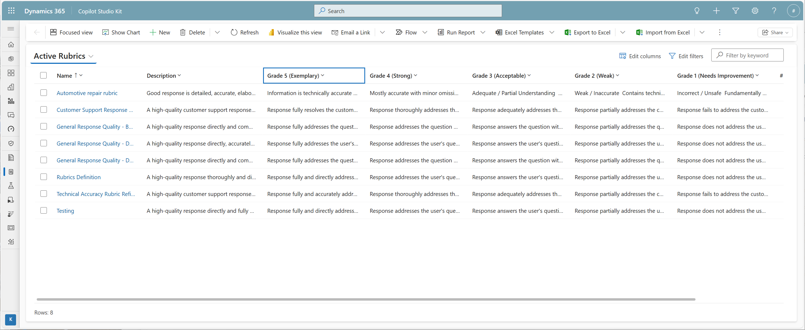
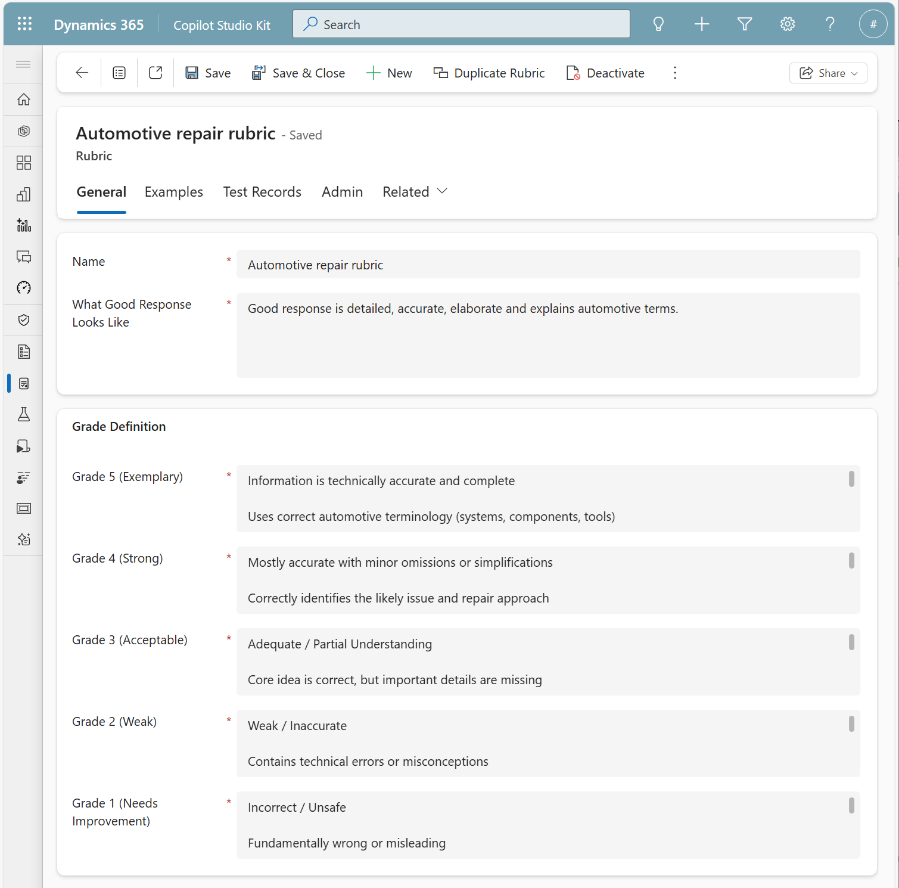

# Rubric Management

## Overview

Rubric Management provides a centralized interface for creating, viewing, editing, duplicating, and deleting evaluation rubrics. Rubrics are reusable assets that define quality standards for evaluating AI-generated responses.

## Understanding Rubrics

A rubric consists of three main components:

1. **What a Good Response Looks Like**: A clear description of quality standards and expectations
2. **Grade Definitions (5 → 1)**: Detailed criteria for each grade level on a 5-point scale
3. **Optional Examples**: Real examples of good and bad responses to illustrate standards

## Accessing Rubric Management

Navigate to the Rubric Management interface in Copilot Studio Kit to view and manage your rubrics.



The list view shows all available rubrics with key information:
- Rubric name
- Description preview
- Creation and modification dates
- Quick actions (edit, duplicate, delete)

## Creating a New Rubric

### Step 1: Define "What Good Looks Like"

Start by clearly articulating what constitutes a high-quality response for your specific use case. This description should:

- Be specific to your domain and organizational standards
- Focus on key quality attributes (accuracy, completeness, tone, etc.)
- Provide context for what the AI should evaluate
- Be written in clear, unambiguous language

**Example**:
```
A good response is detailed, accurate, and follows our IR (Investor Relations)
communication standards. It includes relevant metrics, explains business drivers,
maintains a professional tone, and provides meaningful context without
unnecessary jargon.
```

### Step 2: Set Up Grade Definitions (5 → 1)

Define what each grade level means for your rubric. The system uses a standard 5-point scale:

| Grade | Label | Description |
|-------|-------|-------------|
| **5** | **Exemplary** | Fully satisfies all expectations; professional and polished; no improvements needed |
| **4** | **Strong** | Meets all major requirements with minor areas for improvement; high quality overall |
| **3** | **Acceptable** | Meets minimum expectations but lacks depth or polish; functionally adequate |
| **2** | **Weak** | Contains meaningful gaps in quality, structure, or relevance; needs significant improvement |
| **1** | **Needs Improvement** | Does not meet expectations; major issues with accuracy, relevance, tone, or completeness |



For each grade level, provide detailed criteria that:
- **Are objective and measurable**: Avoid subjective terms; use concrete indicators
- **Build on each other**: Grade 4 should be similar to 5 but with minor gaps; grade 3 should be noticeably less complete than 4
- **Address multiple dimensions**: Consider accuracy, completeness, tone, structure, relevance, etc.
- **Are specific to your use case**: Tailor descriptions to your domain (IR reports, IT summaries, customer service, etc.)

**Example for Grade 5 (Exemplary)**:
```
The response:
• Fully satisfies the expectations of an IR report
• Well-structured, polished, and investor-ready
• Includes all major elements: KPIs, performance drivers, commentary, forward-looking
  insights, and strategic context
• Tone is professional, consistent with corporate IR voice
• Narrative flows logically with crisp, concise explanations
• No irrelevant details; high investor usefulness
```

**Example for Grade 3 (Acceptable)**:
```
The response:
• Communicates correct and sensible content but lacks depth or polish
• Missing one or two key IR elements (e.g., context for results, drivers, or risks)
• Narrative may feel mechanical or generic
• Tone is acceptable but not as polished or investor-friendly
• Provides basic information but limited insight
```

### Step 3: Add Optional Examples

Examples significantly improve rubric quality by providing concrete illustrations of good and bad responses. You can add examples in two ways:

1. **During initial rubric creation**: Manually add examples if you have representative cases
2. **During rubric refinement**: Mark test cases as examples (recommended—see [Rubric Refinement Workflow](04-rubric-refinement-workflow.md))

Good examples should include:
- **The test utterance**: What the user asked
- **The agent response**: What the copilot answered
- **Example designation**: Whether it's a "Good Example" or "Bad Example"
- **Context**: Why this example represents good or bad quality

### Step 4: Save the Rubric

Give your rubric a descriptive name that indicates:
- The use case or domain (e.g., "Investor Relations Report")
- The version or iteration if applicable (e.g., "IR Report v2")
- The evaluation focus if specialized (e.g., "Tone and Style Evaluation")

## Viewing Rubrics

### List View

The list view (RubricManagementListView.png) provides an overview of all rubrics:
- **Search and filter**: Quickly find specific rubrics
- **Sort options**: Order by name, date, or usage
- **Quick preview**: See description snippets without opening full details

### Detail View

Click any rubric to open the detailed view (RubricManagementDetails.png), which shows:
- **General tab**:
  - What good response looks like
  - Complete grade definitions (5 → 1)
- **Examples tab**: Good and bad examples with full context
- **Test Records tab**: Test cases where this rubric is assigned
- **Actions tab**: Edit, duplicate, delete options
- **Related tab**: Test sets and test runs using this rubric

## Editing Rubrics

To edit an existing rubric:

1. **Open the rubric** in detail view
2. **Click "Edit"** in the command bar
3. **Modify any component**:
   - Update "what good looks like" description
   - Refine grade definitions
   - Add, edit, or remove examples
4. **Save changes**

> **Note**: When you edit a rubric, the changes apply immediately to all future test runs. Existing test run results are not affected.

## Duplicating Rubrics

Duplication is useful for:
- **Creating variations**: Test different evaluation criteria while preserving the original
- **Versioning**: Maintain a history of rubric iterations
- **Templating**: Start from an existing rubric and customize for a new use case

To duplicate a rubric:

1. **Select the rubric** to duplicate
2. **Click "Duplicate"** in the command bar or context menu
3. **Provide a new name** for the duplicated rubric
4. **Edit as needed** to customize the new rubric

## Deleting Rubrics

To delete a rubric:

1. **Select the rubric** to delete
2. **Click "Delete"** in the command bar
3. **Confirm deletion** when prompted

> **Important**:
> - Deletion may be restricted if the rubric is referenced by existing test cases or test sets
> - Deleting a rubric does not delete historical test run results that used the rubric
> - Consider duplicating and archiving instead of deleting if you want to preserve history

## Best Practices for Rubric Design

### 1. Start Specific, Not Generic

Write rubrics for a specific use case rather than trying to create one universal rubric. Domain-specific rubrics produce better alignment.

❌ **Too Generic**:
```
5 = Good response
3 = Okay response
1 = Bad response
```

✅ **Specific to Use Case**:
```
5 = Professional IR-quality report with KPIs, drivers, and forward-looking insights
3 = Basic IR information present but lacks depth or investor-ready polish
1 = Missing key IR elements; tone inappropriate for investor communications
```

### 2. Use Observable, Measurable Criteria

Avoid subjective terms; focus on concrete indicators that both humans and AI can assess consistently.

❌ **Subjective**:
```
5 = Feels right and sounds good
```

✅ **Observable**:
```
5 = Includes all required metrics, uses professional tone, follows structured format,
    provides context for all data points
```

### 3. Address Multiple Quality Dimensions

Consider various aspects of quality relevant to your use case:
- **Accuracy**: Is the information correct?
- **Completeness**: Are all necessary elements included?
- **Relevance**: Does it address the specific query?
- **Tone**: Is the style appropriate for the audience?
- **Clarity**: Is it easy to understand?
- **Structure**: Is it well-organized?
- **Groundedness**: Is it supported by source material?

### 4. Iterate Based on Misalignment

Your initial rubric won't be perfect. Use the refinement workflow to:
- Identify patterns in misalignment
- Add examples that clarify edge cases
- Refine descriptions based on observed confusion
- Test and re-test until alignment improves

### 5. Keep Descriptions Concise but Complete

Each grade definition should be detailed enough to guide judgment but concise enough to be quickly understood:
- Use bullet points for clarity
- Lead with the most important criteria
- Include 3-6 key indicators per grade level
- Avoid redundancy across grade levels

### 6. Consider Your Evaluators

Write rubrics with both audiences in mind:
- **AI judges**: Need clear, unambiguous language and concrete criteria
- **Human evaluators**: Need context and examples to apply consistent judgment

### 7. Document the "Why" Behind Standards

Include rationale for quality standards when it helps:
```
Tone is professional and consistent with corporate IR voice because investor
communications must maintain credibility and trust. Casual or marketing-like
language undermines confidence in financial reporting.
```

## Sample Rubrics

For complete examples of well-designed rubrics, see the [Reference](06-reference.md) section, which includes:
- Investor Relations Report rubric
- Business Summaries / Status Report rubric
- Evaluation themes and criteria

---

**Previous**: [← Overview](01-rubrics-refinement-overview.md) | **Next**: [Using Rubrics in Tests →](03-using-rubrics-in-tests.md)
