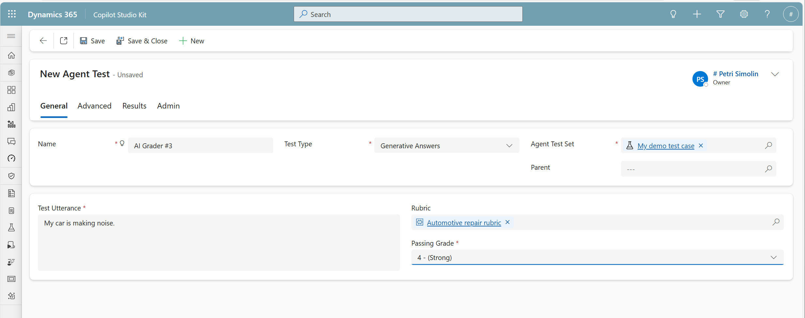

# Using Rubrics in Tests

## Overview

Rubrics can be used in two distinct modes within Copilot Studio Kit test automation. Understanding the difference between these modes is essential for effective use of the Rubrics Refinement feature.

## Two Modes of Rubric Usage

| Aspect | **Testing Mode** (Test Case Level) | **Refinement Mode** (Test Run Level) |
|--------|-----------------------------------|--------------------------------------|
| **Purpose** | Regular test automation with custom grading | Iterative rubric refinement |
| **Assignment Level** | Individual test case | Entire test run |
| **When to Use** | Ongoing quality assurance | When refining rubric quality |
| **AI Reasoning** | Score only (cost-effective) | Score + detailed rationale (more expensive) |
| **Passing Grade** | Determines pass/fail | Informational indicator only |
| **Goal** | Identify low-quality responses | Minimize AI-human misalignment |

---

## Testing Mode: Test Case Level Rubrics

### When to Use Testing Mode

Use test case level rubrics when you:
- Have a refined, trustworthy rubric ready for regular use
- Want to automate quality checks for Generative Answer responses
- Need custom evaluation criteria beyond standard validation
- Want cost-effective automated grading (no detailed rationale needed)

### How to Assign a Rubric at Test Case Level

1. **Open or create a test case** with Test Type = "Generative Answers"
2. **In the test case form**, locate the **Rubric** field
3. **Select a rubric** from the dropdown
4. **Set the passing grade** (default: 5 = Exemplary)
   - Options: 1, 2, 3, 4, or 5
   - Test passes if: AI grade ≥ passing grade
5. **Note**: When a rubric is selected, the **Validation Instructions** field is hidden

### How It Works

When a rubric is assigned at the test case level:

1. **Replaces standard validation**: The rubric-based AI grader replaces the default Generative Answers validation logic
2. **Evaluates the response**: The AI judge assesses the agent's response using the rubric criteria
3. **Assigns a grade**: A score from 1-5 is generated based on the rubric
4. **Determines pass/fail**:
   - **Pass**: Grade ≥ passing grade threshold
   - **Fail**: Grade < passing grade threshold
5. **No detailed rationale**: To keep costs low, only the grade is provided (not the reasoning)

### Setting the Passing Grade

The passing grade determines the minimum acceptable quality level:

| Passing Grade | Meaning | Use When |
|---------------|---------|----------|
| **5** (default) | Only Exemplary responses pass | You require the highest quality standards |
| **4** | Strong or better responses pass | You accept high-quality responses with minor improvements possible |
| **3** | Acceptable or better responses pass | You need responses that meet minimum functional requirements |
| **2** | Weak or better responses pass | You're setting a very low bar (rarely recommended) |
| **1** | All responses pass except the worst | Almost never appropriate for quality assurance |

> **Recommendation**: For most quality assurance use cases, use passing grade **5** or **4** to maintain high standards.

### Purpose of Testing Mode

Testing mode helps you:
- **Identify low-quality responses** that need attention
- **Automate regression testing** with consistent evaluation criteria
- **Scale quality assurance** across many test cases
- **Apply domain-specific standards** that generic validation cannot capture

---

## Refinement Mode: Test Run Level Rubrics

### When to Use Refinement Mode

Use test run level rubrics when you:
- Are creating or refining a rubric
- Need to align AI grading with human judgment
- Want to compare AI and human assessments
- Are iterating to improve rubric quality

### How to Select a Rubric at Test Run Level

1. **Create or open a test run**
2. **In the test run configuration form**, locate the **Rubric** field
3. **Select a rubric** from the dropdown
4. **Set the passing grade** (default: 5)
   - This is **informational only** in refinement mode
   - The goal is alignment, not passing scores
5. **Execute the test run**

### How It Works

When a rubric is assigned at the test run level:

1. **Applies to all Generative Answer tests**: The selected rubric overrides any rubrics set at test case level
2. **Skips non-GA test types**: Test cases that are not Generative Answers are skipped entirely
3. **Runs AI grading with reasoning**: The AI judge provides both:
   - **Grade (1-5)**: The quality score
   - **Rationale**: Detailed reasoning explaining the grade
4. **Enables refinement workflow**: Results include human grading fields and alignment indicators
5. **More expensive**: Generating detailed rationales increases AI processing costs

### Understanding Passing Grade in Refinement Mode

> **Critical Distinction**: In refinement mode, the passing grade is **informational only**, not a goal.

- **Purpose**: The passing grade helps you identify which responses fall below your target threshold
- **Not the goal**: The goal of refinement is to **minimize misalignment between AI and human grades**, not to get all responses to pass
- **Example**: If you set passing grade = 5, and AI gives a grade of 3, that tells you this response falls short of your standard—but what matters is whether the human also grades it as 3 (alignment) or differently (misalignment)

### Differences Between Testing and Refinement Modes

#### When Rubric is Selected at Test Run Level:
- Test run is specifically for rubric refinement
- AI grader provides **grade + rationale** for Generative Answer tests
- Non-Generative Answer test types are **skipped**
- Validation instructions at test case level are **ignored**
- Results view shows **rubric refinement interface** with human grading fields

#### When Rubric is Selected at Test Case Level:
- Test run proceeds normally with all test types
- AI grader provides **grade only** (no rationale) for cost efficiency
- Only test cases with rubrics assigned use AI grading; others use standard validation
- Results view shows **standard test results**

#### When No Rubric is Selected:
- Standard Generative Answers validation applies (meta-prompt + validation instructions)
- Pass/fail determined by existing validation logic
- Results view shows standard test results

---

## Important Behavioral Notes

### Rubric Hierarchy and Overrides

- **Test run level rubric overrides test case level rubrics**: If you select a rubric at the test run level, it applies to all Generative Answer test cases, ignoring any rubrics assigned to individual test cases
- **Test case level rubrics are independent**: When no rubric is selected at test run level, each test case uses its own rubric (if assigned) or standard validation (if not)

### Non-Generative Answer Test Types

When a rubric is selected at the test run level:
- **Non-GA test types are skipped**: Rubrics apply only to Generative Answer test cases
- **Rationale**: Rubrics are designed for evaluating generative responses, not other test types like Action, Topic, or Conversation Flow

When rubric is selected at test case level:
- **Non-GA test types run normally**: Only the specific Generative Answer test case uses the rubric

### Validation Instructions and Rubrics

- **Mutually exclusive**: Rubric-based grading and validation instructions cannot be used together
- **When rubric is selected**: The Validation Instructions field is hidden (test case level) or ignored (test run level)
- **Rationale**: The rubric replaces the validation logic entirely

### Cost Considerations

| Mode | AI Grading Type | Cost | When to Use |
|------|----------------|------|-------------|
| **Testing Mode** (Test Case) | Grade only | Lower | Regular quality assurance; high-volume testing |
| **Refinement Mode** (Test Run) | Grade + Rationale | Higher | Rubric refinement; alignment analysis; low-volume iterative improvement |

---

## Workflow: From Refinement to Testing

The typical workflow progresses from refinement to testing:

### Phase 1: Rubric Refinement (Test Run Level)
1. Create initial rubric
2. Assign rubric at **test run level**
3. Execute test run with AI grading + rationale
4. Provide human grades
5. Compare alignment
6. Refine rubric based on misalignment
7. Repeat until alignment is acceptable

### Phase 2: Regular Testing (Test Case Level)
1. Once rubric is refined and trustworthy
2. Assign rubric at **test case level**
3. Use in ongoing test automation
4. AI grading without rationale (cost-effective)
5. Pass/fail based on passing grade
6. Return to refinement if quality issues emerge

---

## Choosing the Right Mode

### Use **Testing Mode** (Test Case Level) if:
- ✅ Your rubric is stable and well-aligned
- ✅ You're doing routine quality assurance
- ✅ You need cost-effective automated grading
- ✅ Pass/fail results are your primary goal

### Use **Refinement Mode** (Test Run Level) if:
- ✅ You're creating a new rubric
- ✅ You're improving an existing rubric
- ✅ You need to compare AI and human judgment
- ✅ You want to understand AI reasoning
- ✅ Alignment analysis is your primary goal

---

## Best Practices

### 1. Start with Refinement Mode
Always refine a rubric using test run level assignment before deploying it at test case level for regular testing.

### 2. Use Representative Test Cases
For refinement, select test cases that represent the variety of responses you'll encounter in production.

### 3. Set Realistic Passing Grades
Don't default to passing grade = 5 unless you truly require exemplary quality for every response. Consider:
- **Grade 5**: Reserve for critical communications (IR reports, executive summaries)
- **Grade 4**: Appropriate for most business communications
- **Grade 3**: Minimum functional quality for internal tools

### 4. Monitor Alignment Over Time
Even refined rubrics may drift. Periodically re-enter refinement mode to check alignment with current expectations.

### 5. Document Rubric Purpose
Include notes in your rubric description about:
- Intended use case
- Target passing grade
- Any special considerations

### 6. Test at Test Run Level Before Committing
Before assigning a new rubric to many test cases, run a test run with it first to verify it works as expected.

---

**Previous**: [← Rubric Management](02-rubric-management.md) | **Next**: [Rubric Refinement Workflow →](04-rubric-refinement-workflow.md)
