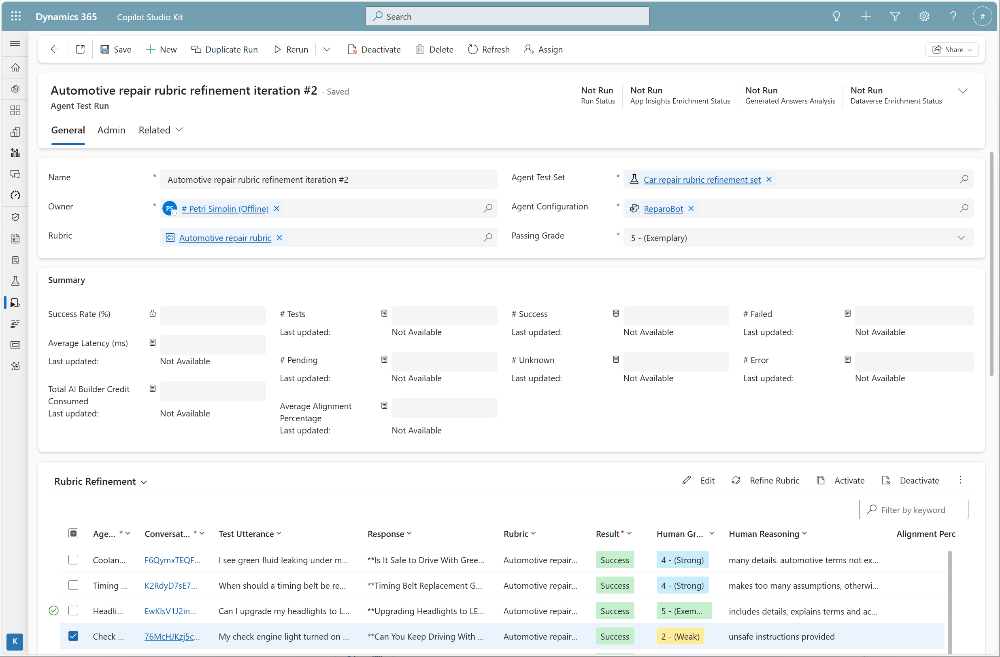
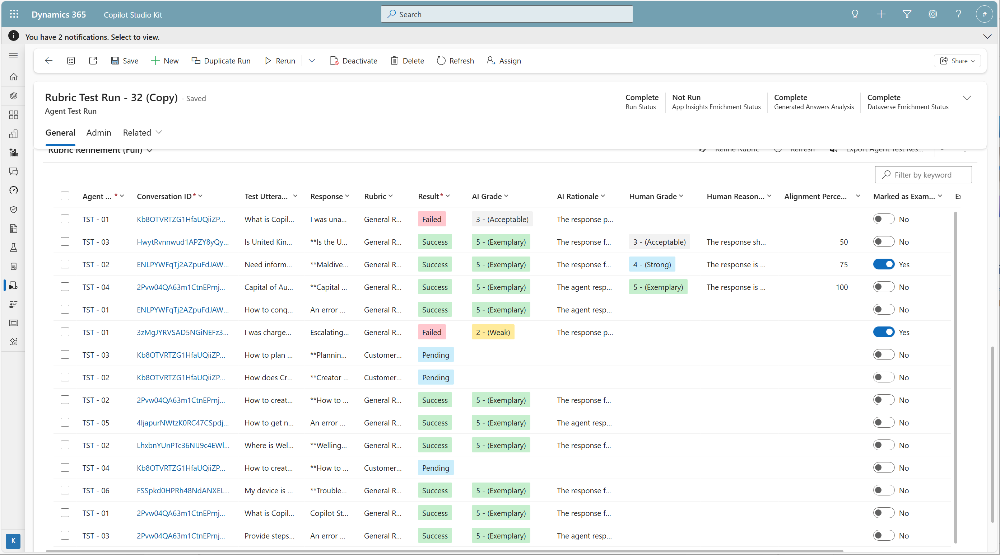
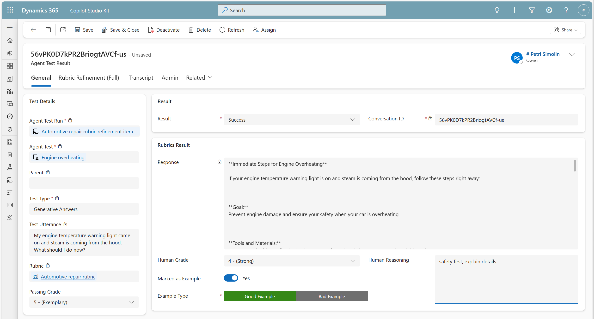
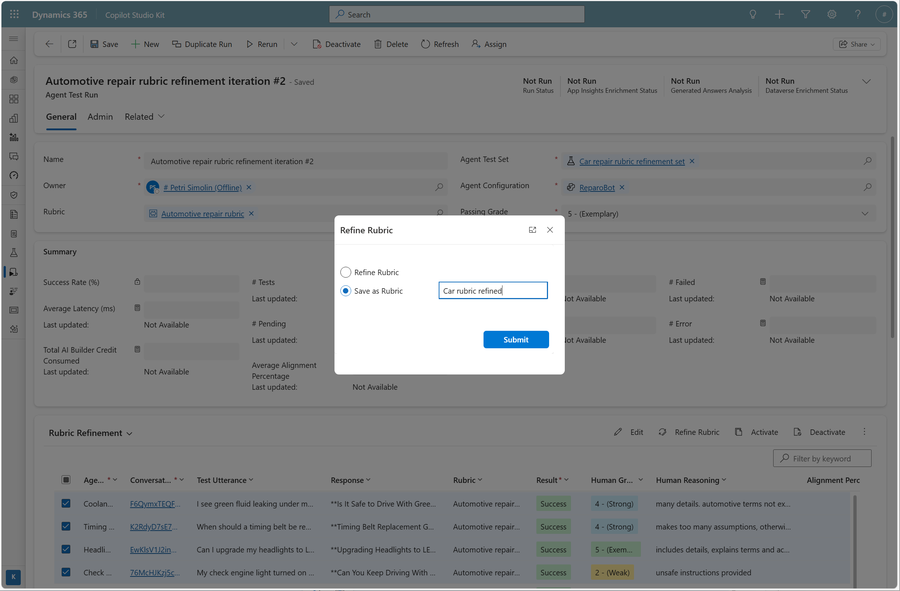

# Rubric Refinement Workflow

## Overview of the Iterative Process

Rubric refinement is fundamentally an iterative cycle designed to bring AI grading into alignment with human judgment. Each iteration follows a systematic process:

**run → review → grade → refine → save → re-run → repeat**

You'll typically need several iterations before achieving acceptable alignment. This is expected and normal—rubric refinement is a process of progressive improvement, not a one-time configuration.

---

## Step-by-Step Workflow

### Step 1: Starting a Rubric Refinement Run

#### Prerequisites
- A test set containing **Generative Answer** test cases
- A rubric (initial or previous iteration) to refine

#### Configuration


1. **Create or duplicate a test run**
   - Navigate to your test set
   - Click "New" or "Duplicate Run" if refining from a previous iteration

2. **Configure the test run**:
   - **Name**: Give it a descriptive name (e.g., "Automotive Repair Rubric - Iteration 2")
   - **Agent Test Set**: Select your test set with Generative Answer test cases
   - **Agent Configuration**: Choose the agent configuration to test
   - **Rubric**: Select the rubric to refine
   - **Passing Grade**: Set the passing grade (default: 5)
     - Remember: In refinement mode, this is informational only
     - It helps identify responses below your target threshold

3. **Execute the test run**
   - Click "Save & Close" then execute the run
   - The system runs each Generative Answer test case
   - AI grading is performed with detailed reasoning

#### What Happens During Execution

- **For each Generative Answer test case**:
  - The agent responds to the test utterance
  - The AI judge evaluates the response using the rubric
  - A grade (1-5) is assigned
  - A detailed rationale explaining the grade is generated

- **Non-Generative Answer test cases are skipped**
  - Only GA test types are evaluated in refinement mode

---

### Step 2: Reviewing Results - Rubric Refinement Views

After the test run completes, you'll use specialized rubric refinement views to assess alignment. The interface provides **two main views** to support unbiased human evaluation.

#### Why Two Views?

Research shows that seeing AI grades can bias human judgment. To avoid this:
- **Standard Refinement View**: Hides AI grades for unbiased human evaluation
- **Full Refinement View**: Shows AI grades for alignment comparison

You'll switch between these views depending on your task.

---

#### Standard Refinement View (AI Grades Hidden)



**Purpose**: Provide unbiased human evaluation without AI influence

**When to Use**:
- When first reviewing responses and providing human grades
- When setting good/bad examples
- When you want to avoid bias from AI assessments

**What's Visible**:
- Test utterance (what the user asked)
- Agent response (what the copilot answered)
- Human grading fields (initially empty):
  - Human Grade selector (1-5)
  - Human Reasoning text field
  - Marked as Example toggle
  - Example Type selector (Good Example / Bad Example)

**What's Hidden**:
- AI grade
- AI rationale

**Navigation**:
- List view shows all test cases in a table
- Click any row to open detailed view for longer responses

---

#### Full Refinement View (AI Grades Visible)



**Purpose**: Compare AI and human assessments to understand alignment

**When to Use**:
- After providing human grades, to compare with AI
- To understand why misalignment occurred
- To identify patterns in AI reasoning
- When analyzing which responses need examples

**What's Visible**:
- Everything from standard view, plus:
- **AI Grade** (1-5)
- **AI Rationale** (detailed reasoning)
- **Alignment Indicator**: Visual indicator showing whether human and AI grades match
  - ✅ **Aligned**: AI grade = Human grade
  - ❌ **Misaligned**: AI grade ≠ Human grade

**Key Insight**:
The Full view helps you understand misalignment patterns:
- Is the AI consistently too lenient or too strict?
- What criteria does the AI emphasize or miss?
- Which types of responses confuse the AI?

---

### Step 3: Human Grading Process

Providing accurate, thoughtful human grades is critical for effective rubric refinement.

#### Option A: List View Grading

Use the list view (Standard or Full) for quick grading:

1. **Review each test case** in the table
2. **Read the test utterance and agent response**
3. **Assign a grade (1-5)** based on the rubric criteria
4. **Enter reasoning** explaining your grade
5. **Move to the next test case**

**Advantages**:
- Fast for short responses
- Good overview of all cases
- Efficient for large test sets

**Disadvantages**:
- Limited space for viewing longer responses
- Less detailed context

---

#### Option B: Detailed View Grading



Use the detailed view for longer, complex responses:

1. **Click any test case** in the list view to open detailed view
2. **Review the full conversation context**:
   - Test utterance displayed prominently
   - Complete agent response with full formatting
   - Any multi-turn conversation history if applicable

3. **Navigate between test cases**:
   - Use the left panel to select different test cases
   - Switch between "Refinement" and "Refinement (full)" tabs

4. **Assign human grade**:
   - Select grade from dropdown (1-5)
   - **Required**: You must provide a grade

5. **Enter human reasoning**:
   - Explain why you assigned this grade
   - Reference specific rubric criteria
   - Note any strengths or weaknesses
   - **Required**: Reasoning is mandatory for refinement

6. **Mark as example if applicable** (see Step 4)

**Advantages**:
- Full context for complex responses
- Better for careful, thoughtful evaluation
- Easier to reference rubric while grading

---

#### Detailed View Components

The detailed view includes two tabs:

**Refinement Tab** (AI Hidden):
- Test utterance
- Agent response
- Human Grade selector (required)
- Human Reasoning text field (required)
- Marked as Example toggle
- Example Type selector

**Refinement (Full) Tab** (AI Visible):
- All of the above, plus:
- AI Grade
- AI Rationale
- Alignment indicator

---

#### Best Practices for Human Grading

1. **Grade without seeing AI assessment first**:
   - Use the Standard Refinement View or "Refinement" tab
   - Form your own opinion before comparing with AI

2. **Be consistent with rubric criteria**:
   - Reference the rubric definitions
   - Apply the same standards across all test cases
   - Don't grade "on a curve"—use absolute standards

3. **Write detailed reasoning**:
   - Explain which rubric criteria were met or missed
   - Be specific about strengths and weaknesses
   - Your reasoning helps the AI understand what to focus on

   **Example Good Reasoning**:
   ```
   Grade 4 (Strong): Response includes accurate technical information about the
   issue and provides clear next steps. Tone is professional and reassuring.
   However, it lacks specific timeline estimates that would make it exemplary
   (Grade 5). All major IR elements present but could be more investor-ready.
   ```

   **Example Poor Reasoning**:
   ```
   Grade 4: Pretty good.
   ```

4. **Don't be influenced by pass/fail**:
   - Remember: The goal is alignment, not passing scores
   - Grade honestly based on quality, not desired outcomes

5. **Grade all test cases consistently**:
   - Complete grading for the entire test set
   - Inconsistent grading reduces refinement effectiveness

---

### Step 4: Marking Examples

Examples significantly improve rubric quality by providing concrete illustrations of good and bad responses.

#### Purpose of Examples

Examples help the AI understand:
- **What good actually looks like** in practice
- **What bad responses contain** that makes them unacceptable
- **Edge cases** where criteria might be unclear
- **Context and nuance** that text descriptions can't fully capture

#### How to Mark Examples

In either the list view or detailed view:

1. **Toggle "Marked as Example"** to **Yes**
2. **Select "Example Type"**:
   - **Good Example**: Illustrates high-quality response
   - **Bad Example**: Illustrates poor-quality response
3. **The system captures**:
   - Test utterance
   - Agent response
   - Your example designation (good/bad)

#### When to Mark Examples

Consider marking a test case as an example if:

✅ **Good Example**:
- Response is Grade 5 (Exemplary) and demonstrates ideal quality
- Response is Grade 4 and shows all key criteria even if not perfect
- Response handles a complex scenario particularly well
- You want to reinforce specific positive behaviors

✅ **Bad Example**:
- Response is Grade 1 (Needs Improvement) and clearly fails expectations
- Response is Grade 2 and shows common errors to avoid
- Response demonstrates a specific pitfall or failure mode
- You want to clarify what "not acceptable" looks like

✅ **Either**:
- The test case represents an edge case or ambiguous scenario
- There's misalignment between AI and human grades (helps clarify your standards)
- The test case is particularly representative of common patterns

#### How Many Examples?

- **Quality over quantity**: A few well-chosen examples are better than many mediocre ones
- **Aim for 3-10 examples** per refinement iteration
- **Balance good and bad**: Include both types to set clear boundaries
- **Represent variety**: Cover different types of queries and responses

> **Tip**: Focus on test cases where there's misalignment—these are often the most valuable examples because they clarify where the rubric is ambiguous.

---

### Step 5: Understanding Alignment

Alignment indicates whether the AI and human grades match.

#### Individual Test Case Alignment

For each test case:
- ✅ **Aligned**: AI grade = Human grade
- ❌ **Misaligned**: AI grade ≠ Human grade

#### Aggregate Alignment Percentage

The overall alignment percentage shows how well the rubric performs across all graded test cases:

```
Alignment % = (Number of aligned grades / Total graded test cases) × 100%
```

**Example**:
- Test run has 30 test cases
- You provided human grades for all 30
- AI and human grades match for 20 test cases
- Alignment = 20 / 30 = **67%**

#### What's Good Alignment?

There's no absolute standard, but general guidelines:

| Alignment % | Assessment | Action |
|-------------|------------|--------|
| **90-100%** | Excellent | Rubric is highly reliable; consider moving to testing mode |
| **75-89%** | Good | Rubric is mostly aligned; refine edge cases |
| **60-74%** | Fair | Rubric needs improvement; focus on misalignment patterns |
| **< 60%** | Poor | Rubric requires significant refinement or redesign |

#### Analyzing Misalignment

When misalignment occurs, investigate:

1. **Direction of misalignment**:
   - Is AI consistently grading higher or lower than humans?
   - This indicates systematic bias in the rubric

2. **Patterns in misaligned cases**:
   - Do certain types of responses cause misalignment?
   - Are specific criteria being misinterpreted?

3. **Magnitude of misalignment**:
   - Off by 1 point (e.g., AI=4, Human=5) → Minor refinement needed
   - Off by 2+ points (e.g., AI=2, Human=5) → Major clarification needed

4. **Read AI rationales** (Full view):
   - What criteria did the AI focus on?
   - What did the AI miss that humans noticed?
   - Is the AI misinterpreting rubric language?

---

### Step 6: Refining and Saving Rubrics

Once you've provided human grades, marked examples, and analyzed alignment, you're ready to refine the rubric.

#### How Rubric Refinement Works



When you click "Refine Rubric," an AI analyzes:

1. **Current rubric content**:
   - "What good response looks like" description
   - Grade definitions (1-5)
   - Existing examples

2. **Human grades and reasoning**:
   - How you assessed each response
   - Your explanations for grades

3. **AI grades and rationale**:
   - How the AI interpreted the rubric
   - Where AI reasoning diverged from humans

4. **Marked examples**:
   - Test utterance + response pairs
   - Good/bad designations
   - Context about what makes them exemplary or poor

5. **Alignment patterns**:
   - Which criteria cause consistent misalignment
   - Where the rubric is ambiguous
   - What needs clarification

The AI then **updates the rubric** to improve alignment:
- Clarifies ambiguous language
- Adds specificity to grade definitions
- Incorporates examples
- Adjusts emphasis on criteria
- Removes contradictions or confusion

---

#### Refining the Rubric

1. **In the rubric refinement view**, click **"Refine Rubric"** button
2. **The system processes** all grading data and generates refinement
3. **Review the refined rubric** (the system may show a preview)
4. **Choose save option**:

---

#### Save Options

**Option 1: Save (Overwrite)**
- Replaces the existing rubric with the refined version
- Original version is lost (no version history in MVP)
- Use when: You're iterating on the same rubric and don't need to preserve history

**Option 2: Save As (Create New)**
- Creates a new rubric with a different name
- Preserves the original rubric
- Use when: You want to compare versions or preserve a baseline

**Recommendation**: For early iterations, use "Save As" to preserve history (e.g., "IR Report v1", "IR Report v2"). Once the rubric stabilizes, use "Save" to iterate.

---

### Step 7: Re-running Tests

After saving the refined rubric, test whether alignment has improved:

1. **Duplicate the test run**:
   - Navigate to the completed test run
   - Click "Duplicate Run"

2. **Execute with the updated rubric**:
   - The duplicated run uses the refined rubric
   - Run it against the same test set

3. **Compare alignment metrics**:
   - Did alignment percentage increase?
   - Are previously misaligned cases now aligned?

4. **Review the results**:
   - Use the Full Refinement View to check alignment
   - Note any remaining misalignment

---

### Step 8: Iteration

Rubric refinement is rarely complete in one cycle. Continue iterating:

1. **Re-run → Review → Grade → Refine → Save → Repeat**

2. **Track progress**:
   - Monitor alignment percentage across iterations
   - Note which types of misalignment decrease

3. **Adjust strategy**:
   - If alignment isn't improving, reconsider rubric approach
   - Add more examples for persistent misalignment patterns
   - Simplify overly complex criteria

4. **Know when to stop**:
   - When alignment reaches acceptable level (typically 75-90%+)
   - When additional iterations show diminishing returns
   - When the rubric reliably identifies quality issues

---

## Complete Workflow Summary

| Step | Action | Output |
|------|--------|--------|
| **1. Start Run** | Configure test run with rubric at test run level | AI grades + rationales generated |
| **2. Review** | Open rubric refinement view (Standard or Full) | Context for grading |
| **3. Grade (Human)** | Provide grades (1-5) and reasoning for all test cases | Human assessments recorded |
| **4. Mark Examples** | Select good/bad examples | Examples captured for refinement |
| **5. Understand Alignment** | Compare AI and human grades; analyze patterns | Alignment percentage and insights |
| **6. Refine & Save** | Click "Refine Rubric"; save or save as | Updated rubric |
| **7. Re-run** | Duplicate run and execute with refined rubric | New alignment data |
| **8. Iterate** | Repeat until alignment is acceptable | Reliable, trustworthy rubric |

---

## Tips for Successful Refinement

### 1. Start with a Reasonable Baseline Rubric
Don't expect perfection from your initial rubric. Focus on:
- Clear "what good looks like" statement
- Basic grade definitions with observable criteria
- You'll refine from there

### 2. Use Consistent Test Cases
Use the same test set across iterations to track alignment improvement. Changing test cases makes it hard to measure progress.

### 3. Grade Honestly and Thoroughly
Your human grades are the "ground truth" for refinement. Invest time in:
- Thoughtful evaluation
- Detailed reasoning
- Consistent application of standards

### 4. Focus on Patterns, Not Individual Cases
One misaligned test case isn't a crisis. Look for:
- Systematic patterns in misalignment
- Repeated errors across multiple test cases

### 5. Use Examples Strategically
Examples are powerful but don't overdo it:
- Mark 3-10 examples per iteration
- Focus on misaligned cases and edge cases
- Balance good and bad examples

### 6. Review AI Rationales
The AI's reasoning (Full view) reveals how it interprets your rubric:
- If AI focuses on the wrong criteria, clarify the rubric
- If AI misses key points, make them more prominent
- If AI uses odd logic, add examples to guide it

### 7. Iterate with Purpose
Each iteration should target specific improvements:
- Iteration 1: Fix major misalignment patterns
- Iteration 2: Add examples for edge cases
- Iteration 3: Fine-tune language for remaining misalignment

### 8. Don't Chase 100% Alignment
Perfect alignment is rarely achievable or necessary:
- Some subjectivity is inherent in evaluation
- Diminishing returns after ~85-90% alignment
- Focus on trustworthy grading, not perfection

### 9. Test with Fresh Data Eventually
After several iterations, test the rubric on new test cases:
- Ensures the rubric generalizes beyond your training set
- Prevents overfitting to specific examples

### 10. Document Your Process
Keep notes on:
- Alignment percentage per iteration
- Key changes made to the rubric
- Insights about what worked or didn't

---

## Troubleshooting Common Issues

### Issue: Alignment Not Improving
**Possible Causes**:
- Rubric criteria are too subjective or vague
- Human grading is inconsistent
- Examples don't clearly illustrate standards

**Solutions**:
- Simplify rubric language; use concrete, observable criteria
- Re-grade test cases with more consistent standards
- Add more examples, especially for edge cases

---

### Issue: AI Is Consistently Too Lenient or Too Strict
**Possible Causes**:
- Grade definitions don't clearly differentiate levels
- "What good looks like" sets wrong expectations

**Solutions**:
- Sharpen distinctions between grade levels
- Add examples showing borderline cases
- Revise "what good looks like" to set proper baseline

---

### Issue: Human and AI Focus on Different Criteria
**Possible Causes**:
- Rubric lists too many criteria without prioritization
- Important criteria are buried or unclear

**Solutions**:
- Prioritize criteria explicitly in grade definitions
- Lead with most important criteria
- Use examples to demonstrate priority

---

### Issue: Long Responses Are Hard to Grade
**Solutions**:
- Use Detailed View for full context
- Break evaluation into dimensions (accuracy, tone, completeness) and assess each
- Consider whether rubric should focus on specific aspects rather than overall quality

---

### Issue: Test Cases Are Too Similar
**Solutions**:
- Expand test set to include variety
- Add test cases covering edge cases, different query types, complex scenarios
- Use test case generation (P1 feature) when available

---

**Previous**: [← Using Rubrics in Tests](03-using-rubrics-in-tests.md) | **Next**: [Best Practices →](05-best-practices.md)
