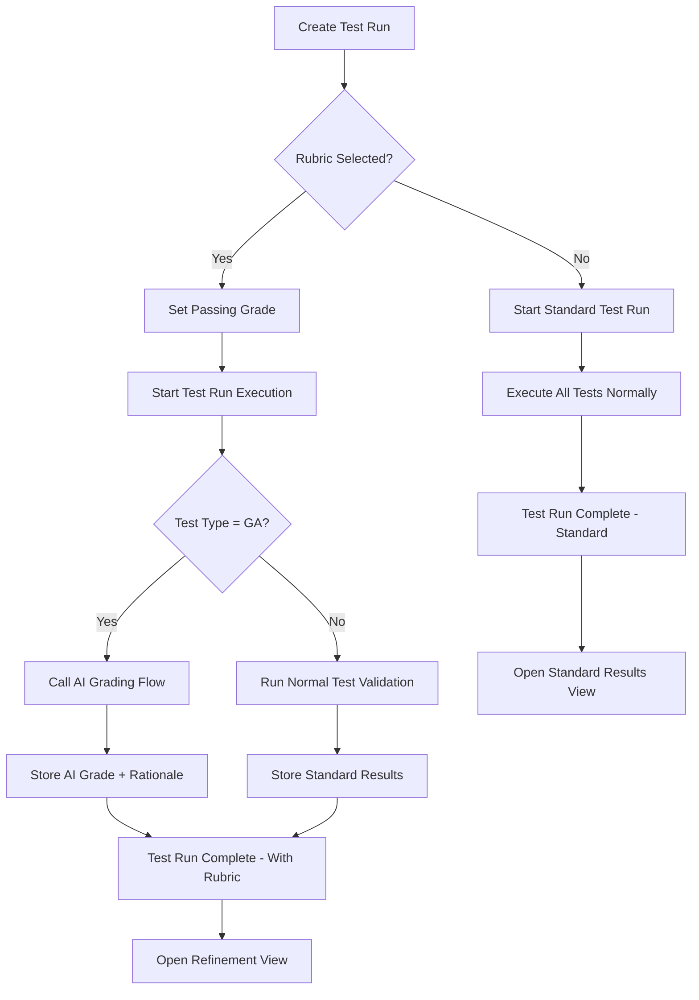
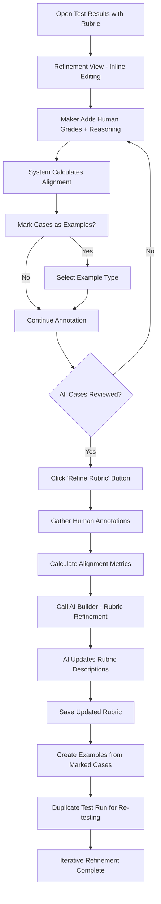
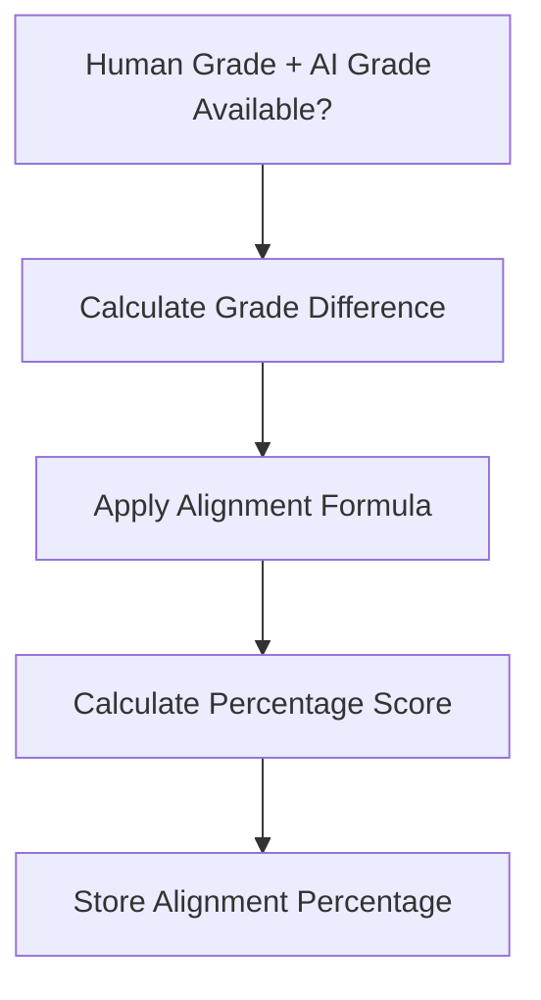

# Eval Rubrics Refinement - Implementation Guide

---

## Table of Contents

1. [Executive Summary](#executive-summary)
2. [Architecture Overview](#architecture-overview)
3. [Data Model Design](#data-model-design)
4. [Workflow Diagrams](#workflow-diagrams)
5. [Implementation Phases](#implementation-phases)
6. [Detailed Component Specifications](#detailed-component-specifications)
7. [AI Builder Integration](#ai-builder-integration)
8. [Power Automate Flows](#power-automate-flows)
9. [Model-Driven App Configuration](#model-driven-app-configuration)
10. [Testing Strategy](#testing-strategy)
11. [Deployment Guide](#deployment-guide)

---

## Executive Summary

This implementation guide provides comprehensive instructions for building the Eval Rubrics Refinement capability in Copilot Studio Kit. The solution enables makers to create, test, refine, and validate reusable evaluation rubrics that align AI-generated responses with organizational quality standards.

---

## Architecture Overview

### Simplified High-Level Architecture

```
┌─────────────────────────────────────────────────────────────┐
│                    Model-Driven App UI                      │
│  • Rubric Management                                        │
│  • Enhanced Test Run with Rubric Selection                  │
│  • Inline Refinement View on Test Results                   │
└────────────────────┬────────────────────────────────────────┘
                     │
┌────────────────────▼────────────────────────────────────────┐
│                  Power Automate Flows                       │
│  • Enhanced Test Execution Flow                             │
│  • AI Grading Flow                                          │
│  • Rubric Refinement Flow                                   │
└────────────────────┬────────────────────────────────────────┘
                     │
┌────────────────────▼────────────────────────────────────────┐
│                    AI Builder                               │
│  • Rubric AI Grader Prompt                                  │
│  • Rubric Refinement Prompt                                 │
└────────────────────┬────────────────────────────────────────┘
                     │
┌────────────────────▼────────────────────────────────────────┐
│                  Dataverse Tables                           │
│  • cat_rubric (New)                                         │
│  • cat_rubricexample (New)                                  │
│  • cat_copilottestrun (Enhanced)                            │
│  • cat_copilottest (Enhanced)                               │
│  • cat_copilottestresult (Enhanced with Human Annotations)  │
└─────────────────────────────────────────────────────────────┘
```

---

## Data Model Design

### New Tables

#### 1. Rubric Table (`cat_rubric`)

**Purpose**: Stores evaluation rubrics with grading criteria and instructions.

**Table Properties**:

- **Schema Name**: `cat_rubric`
- **Display Name**: `Rubric`
- **Plural Display Name**: `Rubrics`

**Schema**:

| Column Name             | Display Name                | Type             | Description                    |
| ----------------------- | --------------------------- | ---------------- | ------------------------------ |
| `cat_rubricid`          | Rubric                      | GUID             | Primary key                    |
| `cat_name`              | Name                        | String(200)      | Rubric name                    |
| `cat_description`       | Description                 | Multiline Text   | What good response looks like  |
| `cat_grade5description` | Grade 5 (Exemplary)         | Multiline Text   | Exemplary (5) criteria         |
| `cat_grade4description` | Grade 4 (Strong)            | Multiline Text   | Strong (4) criteria            |
| `cat_grade3description` | Grade 3 (Acceptable)        | Multiline Text   | Acceptable (3) criteria        |
| `cat_grade2description` | Grade 2 (Weak)              | Multiline Text   | Weak (2) criteria              |
| `cat_grade1description` | Grade 1 (Needs Improvement) | Multiline Text   | Needs improvement (1) criteria |
| `cat_goodexamplecount`  | Good Example Count          | Integer (Rollup) | Number of good examples        |
| `cat_badexamplecount`   | Bad Example Count           | Integer (Rollup) | Number of bad examples         |

**Relationships**:

- One-to-Many with `cat_rubricexample`
- One-to-Many with `cat_copilottestrun` (run-level rubric selection)
- One-to-Many with `cat_copilottest` (test case level rubric)
- One-to-Many with `cat_copilottestresult` (applied rubric)

---

#### 2. Rubric Example Table (`cat_rubricexample`)

**Purpose**: Stores good/bad examples associated with rubrics.

**Table Properties**:

- **Schema Name**: `cat_rubricexample`
- **Display Name**: `Rubric Example`
- **Plural Display Name**: `Rubric Examples`

**Schema**:

| Column Name              | Display Name       | Type           | Description                                       |
| ------------------------ | ------------------ | -------------- | ------------------------------------------------- |
| `cat_rubricexampleid`    | Rubric Example     | GUID           | Primary key                                       |
| `cat_rubricid`           | Rubric             | Lookup         | Reference to cat_rubric                           |
| `cat_name`               | Name               | String(500)    | Auto-generated: EXAMPLE-000N                      |
| `cat_utterance`          | Test Utterance     | Multiline Text | Test utterance/query                              |
| `cat_response`           | Agent Response     | Multiline Text | Agent response                                    |
| `cat_exampletypecode`    | Example Type       | Choice         | Good Example (1), Bad Example (2)                 |
| `cat_grade`              | Human Grade        | Integer        | **Human grade** (1-5) - maker's assessment        |
| `cat_reasoning`          | Human Reasoning    | Multiline Text | **Human reasoning** - why maker judged this way   |
| `cat_sourcetestresultid` | Source Test Result | Lookup         | Optional - traces back to originating test result |

**Relationships**:

- Many-to-One with `cat_rubric`
- Many-to-One with `cat_copilottestresult` (optional - for audit trail)

---

### Enhanced Existing Tables

#### 3. Enhanced Test Run Table (`cat_copilottestrun`)

**Table Properties** (existing table - enhancement only):

- **Schema Name**: `cat_copilottestrun`
- **Display Name**: `Agent Test Run`
- **Plural Display Name**: `Agent Test Runs`

**New Columns**:

| Column Name        | Display Name  | Type    | Description                                       |
| ------------------ | ------------- | ------- | ------------------------------------------------- |
| `cat_rubricid`     | Rubric        | Lookup  | Selected rubric (for run-level rubric assignment) |
| `cat_passinggrade` | Passing Grade | Integer | Minimum passing grade (1-5, default 5)            |

---

#### 4. Enhanced Test Case Table (`cat_copilottest`)

**Table Properties** (existing table - enhancement only):

- **Schema Name**: `cat_copilottest`
- **Display Name**: `Agent Test`
- **Plural Display Name**: `Agent Tests`

**New Columns**:

| Column Name        | Display Name  | Type    | Description                         |
| ------------------ | ------------- | ------- | ----------------------------------- |
| `cat_rubricid`     | Rubric        | Lookup  | Rubric for this test (test-level)   |
| `cat_passinggrade` | Passing Grade | Integer | Minimum passing grade for this test |

---

#### 5. Enhanced Test Result Table (`cat_copilottestresult`)

**Purpose**: Stores test execution results AND human annotations for rubric refinement.

**Table Properties** (existing table - enhancement only):

- **Schema Name**: `cat_copilottestresult`
- **Display Name**: `Agent Test Result`
- **Plural Display Name**: `Agent Test Results`

**New Columns**:

| Column Name                 | Display Name         | Type                 | Description                                 |
| --------------------------- | -------------------- | -------------------- | ------------------------------------------- |
| **AI Grading Fields**       |                      |                      |                                             |
| `cat_aigrade`               | AI Grade             | Integer              | AI grade (1-5)                              |
| `cat_airationale`           | AI Rationale         | Multiline Text       | AI grading reasoning                        |
| `cat_rubricid`              | Rubric               | Lookup               | Which rubric was used for grading           |
| `cat_rubricpassinggrade`    | Rubric Passing Grade | Integer              | Required passing grade                      |
| **Human Annotation Fields** |                      |                      |                                             |
| `cat_humangrade`            | Human Grade          | Integer              | Human grade (1-5) - for refinement          |
| `cat_humanreasoning`        | Human Reasoning      | Multiline Text       | Human reasoning - why maker judged this way |
| `cat_markedasexample`       | Marked as Example    | Boolean              | Should this be added to rubric examples?    |
| `cat_exampletype`           | Example Type         | Choice               | Good Example (1), Bad Example (2)           |
| **Calculated Fields**       |                      |                      |                                             |
| `cat_alignmentpercentage`   | Alignment Percentage | Decimal (Calculated) | Alignment percentage (0-100%) using formula |
| `cat_isaligned`             | Is Aligned           | Boolean (Calculated) | ≥75% alignment (backward compatibility)     |

---

## Workflow Diagrams

### 1. Rubric-Based Test Execution Flow



### 2. Rubric Refinement Flow



### 3. Alignment Calculation Logic



**Alignment Formula**:

```
alignment = 100% × (1 - |AI - Human|/4)
```

**Alignment Rules**:

- **Perfect Alignment (100%)**: When AI grade = Human grade
- **Decreasing Alignment**: As grade difference increases, alignment decreases linearly
- **Maximum Difference**: 4 steps on 1-5 scale maps to 0% alignment
- **Partial Alignment**: All grade differences between 1-3 steps have proportional alignment percentages

**Alignment Matrix**:
| AI/Human | 1 | 2 | 3 | 4 | 5 |
|----------|------|------|------|------|------|
| 1 | 100% | 75% | 50% | 25% | 0% |
| 2 | 75% | 100% | 75% | 50% | 25% |
| 3 | 50% | 75% | 100% | 75% | 50% |
| 4 | 25% | 50% | 75% | 100% | 75% |
| 5 | 0% | 25% | 50% | 75% | 100% |

---

## Detailed Component Specifications

### AI Builder Prompts

#### Prompt 1: Rubric AI Grader

**Purpose**: Evaluate agent responses using a rubric and assign a grade (1-5) with rationale.

**Prompt Template**:

```
You are an expert AI evaluator tasked with grading agent responses using a structured rubric.

**RUBRIC INFORMATION**
Rubric Name: {RubricName}
What Good Response Looks Like: {RubricDescription}

**GRADING SCALE**
Grade 5 (Exemplary): {Grade5Description}
Grade 4 (Strong): {Grade4Description}
Grade 3 (Acceptable): {Grade3Description}
Grade 2 (Weak): {Grade2Description}
Grade 1 (Needs Improvement): {Grade1Description}

**GOOD EXAMPLES**
{GoodExamplesList}

**BAD EXAMPLES**
{BadExamplesList}

**EVALUATION TASK**
User Utterance: {TestUtterance}
Agent Response: {ActualResponse}

**INSTRUCTIONS**
1. Carefully read the rubric criteria for each grade level along with what good response looks like
2. Review the provided good and bad examples
3. Evaluate the agent response against the rubric
4. Assign a grade from 1 to 5
5. Provide clear rationale explaining your grade

**OUTPUT FORMAT (JSON)**
{
  "grade": [1-5],
  "rationale": "Detailed explanation of why this grade was assigned, referencing specific rubric criteria"
}

Evaluate the response and provide your assessment:
```

**Example Format for Good/Bad Examples Lists (JSON Array)**:

**JSON Array Structure:**

```json
[
  {
    "utterance": "How do I reset my password?",
    "response": "I'd be happy to help you reset your password. Here are the steps: 1) Go to the login page and click 'Forgot Password' 2) Enter your email address 3) Check your email for a reset link 4) Follow the link and create a new password. The link expires in 24 hours for security. Is there anything else I can help you with?",
    "grade": 5,
    "reasoning": "Clear step-by-step instructions, mentions security (24-hour expiration), offers additional help, professional tone."
  },
  {
    "utterance": "I'm having trouble with my order delivery",
    "response": "I understand your concern about the delivery delay, and I apologize for any inconvenience. Let me check your order status right away. I can see your order #12345 was delayed due to weather conditions. I'm upgrading you to express shipping at no charge, and you should receive it by tomorrow. I'll also send you tracking updates via SMS. As an apology, here's a 10% discount for your next order.",
    "grade": 5,
    "reasoning": "Shows empathy, takes immediate action, provides compensation, proactive communication, exceeds expectations."
  }
]
```

**When No Examples Available:**

```json
[]
```

**Configuration**:

- Model: GPT-4o or GPT-4 Turbo
- Max tokens: 1500
- Temperature: 0.3 (for consistency)

---

#### Prompt 2: Rubric Refinement

**Purpose**: Refine rubric based on human annotations and misalignments.

**Prompt Template**:

```
You are an expert rubric designer tasked with refining evaluation rubrics based on human feedback and observed misalignments.

**CURRENT RUBRIC**
Rubric Name: {RubricName}
What Good Response Looks Like: {CurrentDescription}

Grade 5 (Exemplary): {CurrentGrade5}
Grade 4 (Strong): {CurrentGrade4}
Grade 3 (Acceptable): {CurrentGrade3}
Grade 2 (Weak): {CurrentGrade2}
Grade 1 (Needs Improvement): {CurrentGrade1}

**HUMAN ANNOTATIONS & FEEDBACK (JSON Array)**
{AnnotationsList}

**ALIGNMENT ANALYSIS**
Total Annotated Cases: {TotalAnnotated}
Average Alignment: {AverageAlignment}%
High Alignment Cases (≥75%): {HighAlignmentCases}
Low Alignment Cases (<75%): {LowAlignmentCases}
Alignment Distribution: {AlignmentDistribution}

**INSTRUCTIONS**
1. Analyze the misalignment patterns from human feedback
2. Identify where rubric criteria are unclear or incomplete
3. Incorporate human reasoning into grade descriptions
4. Refine grade criteria to better capture intended quality standards
5. Ensure criteria are specific, measurable, and actionable
6. Maintain consistency across grade levels

**OUTPUT FORMAT (JSON)**
{
  "refinedDescription": "Updated description of what good response looks like",
  "refinedGrade5": "Updated Grade 5 criteria",
  "refinedGrade4": "Updated Grade 4 criteria",
  "refinedGrade3": "Updated Grade 3 criteria",
  "refinedGrade2": "Updated Grade 2 criteria",
  "refinedGrade1": "Updated Grade 1 criteria"
}

Refine the rubric:
```

**Input Data Sources**:

- **AnnotationsList**: JSON array formatted from `cat_copilottestresult` where human grade/reasoning is populated
  ```json
  [
    {
      "test_name": "Password Reset",
      "utterance": "How do I reset my password?",
      "response": "I'd be happy to help...",
      "ai_grade": 4,
      "human_grade": 5,
      "human_reasoning": "Response was excellent - clear steps and helpful tone",
      "isaligned": false
    }
  ]
  ```
- **Alignment Metrics**: Calculated on-the-fly from current refinement session
- **Total Annotated**: Count of test results with human grades
- **Aligned/Misaligned**: Based on alignment calculation logic

**Configuration**:

- Model: GPT-4o
- Max tokens: 2500
- Temperature: 0.5

---

### Power Automate Flows

#### Flow 1: Enhanced Test Execution Flow (MODIFICATION)

**Trigger**: Manual (from test run record)

**Key Enhancements**:

1. **Check for Rubric Selection**

   - Get test run record
   - Check if `cat_rubricid` is populated
   - Set rubric context for test execution

2. **Test Case Loop Enhancement**

   - For each test case:
     - Check if rubric is selected (run-level or test-level)
     - Priority: **Run-level rubric overrides test-level** (per requirements: run-level is for refinement)
     - If rubric selected AND test type = GA:
       - Call "AI Grading Flow" (child flow)
       - Skip standard GA validation
     - If no rubric or non-GA test:
       - Execute standard validation

3. **Post-Execution**
   - Update test run metrics
   - Set completion status

**Error Handling**:

- Continue execution if AI grading fails for individual test
- Log errors to test result

---

#### Flow 2: AI Grading Flow (NEW - Child Flow)

**Trigger**: Called from parent flow

**Inputs**:

- Test Result ID (GUID)
- Rubric ID (GUID)
- Test Utterance (String)
- Agent Response (String)
- Passing Grade (Integer)

**Steps**:

1. **Get Rubric Details**

   ```
   GET cat_rubric WHERE cat_rubricid = {RubricID}
   INCLUDE: name, description, grade1-5 descriptions
   ```

2. **Get Examples**

   ```
   // Get Good Examples
   goodExamples = GET cat_rubricexample
   WHERE cat_rubricid = {RubricID} AND cat_exampletype = 1
   ORDER BY createdon DESC
   LIMIT: 5

   // Get Bad Examples
   badExamples = GET cat_rubricexample
   WHERE cat_rubricid = {RubricID} AND cat_exampletype = 2
   ORDER BY createdon DESC
   LIMIT: 5

   // Format Good Examples as JSON Array
   goodExamplesArray = SELECT FROM goodExamples:
   {
     "utterance": cat_utterance,
     "response": cat_response,
     "grade": cat_grade,
     "reasoning": cat_reasoning
   }

   // Format Bad Examples as JSON Array
   badExamplesArray = SELECT FROM badExamples:
   {
     "utterance": cat_utterance,
     "response": cat_response,
     "grade": cat_grade,
     "reasoning": cat_reasoning
   }

   // Convert to JSON strings
   goodExamplesList = JSON.stringify(goodExamplesArray)
   badExamplesList = JSON.stringify(badExamplesArray)
   ```

3. **Compose AI Grader Prompt**

   - Replace all placeholders with actual values
   - Handle empty examples gracefully

4. **Call AI Builder: Rubric AI Grader**

   - Submit composed prompt
   - Parse JSON response
   - Extract grade and rationale

**Power Automate Flow Implementation Example**:

**Action: "Format Good Examples"** (Select Action)

```json
{
  "from": "@outputs('Get_Good_Examples')?['body/value']",
  "select": {
    "utterance": "@item()?['cat_utterance']",
    "response": "@item()?['cat_response']",
    "grade": "@item()?['cat_grade']",
    "reasoning": "@item()?['cat_reasoning']"
  }
}
```

**Action: "Convert Good Examples to JSON"** (Compose Action)

```json
{
  "inputs": "@string(outputs('Format_Good_Examples'))"
}
```

**Action: "Format Bad Examples"** (Select Action - same structure)

```json
{
  "from": "@outputs('Get_Bad_Examples')?['body/value']",
  "select": {
    "utterance": "@item()?['cat_utterance']",
    "response": "@item()?['cat_response']",
    "grade": "@item()?['cat_grade']",
    "reasoning": "@item()?['cat_reasoning']"
  }
}
```

**Action: "Convert Bad Examples to JSON"** (Compose Action)

```json
{
  "inputs": "@string(outputs('Format_Bad_Examples'))"
}
```

5. **Calculate Pass/Fail**

   ```
   passed = (aiGrade >= passingGrade)
   resultCode = passed ? 1 : 2  // Success : Failed
   ```

6. **Update Test Result**
   ```
   UPDATE cat_copilottestresult SET
     cat_aigrade = {aiGrade},
     cat_airationale = {aiRationale},
     cat_rubricid = {rubricID},
     cat_rubricpassinggrade = {passingGrade},
     cat_resultcode = {resultCode}
   WHERE cat_copilottestresultid = {testResultID}
   ```

**Error Handling**:

- Try-Catch around AI Builder call
- Default to "Error" result if grading fails
- Log error details to test result

---

#### Flow 3: Rubric Refinement Flow (NEW)

**Trigger**: Manual button on Test Results view

**Inputs**:

- Test Run ID (GUID)
- Rubric ID (GUID)

**Steps**:

1. **Gather Human Annotations**

   ```json
   {
     "action": "List rows",
     "table": "cat_copilottestresults",
     "filter": "cat_copilottestrunid eq '{testRunID}' and cat_rubricid eq '{rubricID}' and cat_humangrade ne null",
     "expand": "cat_copilottest($select=cat_name)"
   }
   ```

2. **Format Annotations as JSON** (Select Action):

   ```json
   {
     "from": "@outputs('Gather_Annotations')?['body/value']",
     "select": {
       "test_name": "@item()?['cat_copilottest']?['cat_name']",
       "utterance": "@item()?['cat_utterance']",
       "response": "@item()?['cat_response']",
       "ai_grade": "@item()?['cat_aigrade']",
       "human_grade": "@item()?['cat_humangrade']",
       "human_reasoning": "@item()?['cat_humanreasoning']",
       "agreement": "@item()?['cat_isaligned']",
       "alignment_percentage": "@item()?['cat_alignmentpercentage']"
     }
   }
   ```

3. **Calculate Alignment Metrics** (Compose Actions):

   ```json
   {
     "total_annotated": "@length(outputs('Format_Annotations'))",
     "alignment_percentages": "@select(outputs('Format_Annotations'), mul(sub(1, div(abs(sub(item()['ai_grade'], item()['human_grade'])), 4)), 100))",
     "average_alignment": "@div(sum(variables('alignment_percentages')), variables('total_annotated'))",
     "high_alignment_cases": "@length(filter(variables('alignment_percentages'), greater(item(), 75)))",
     "low_alignment_cases": "@sub(variables('total_annotated'), variables('high_alignment_cases'))"
   }
   ```

4. **Format Annotations for AI**

   ```
   For each annotated result:
   "Case: {utterance}
   Response: {response}
   Human Grade: {humanGrade}
   Human Reasoning: {humanReasoning}
   AI Grade: {aiGrade}
   AI Rationale: {aiRationale}
   Aligned: {isAligned}
   ---"
   ```

5. **Get Current Rubric**

   ```
   GET cat_rubric WHERE cat_rubricid = {rubricID}
   ```

6. **Call AI Builder: Rubric Refinement**

   - Compose refinement prompt
   - Submit to AI Builder
   - Parse refined rubric JSON

7. **Update Rubric**

   ```
   UPDATE cat_rubric SET
     cat_description = {refinedDescription},
     cat_grade5description = {refinedGrade5},
     cat_grade4description = {refinedGrade4},
     cat_grade3description = {refinedGrade3},
     cat_grade2description = {refinedGrade2},
     cat_grade1description = {refinedGrade1}
   WHERE cat_rubricid = {rubricID}
   ```

8. **Process Marked Examples**

   ```
   FOR EACH result WHERE cat_markedasexample = true:
     CREATE cat_rubricexample
     SET cat_rubricid = {rubricID}
     SET cat_utterance = result.cat_testutterance
     SET cat_response = result.cat_response
     SET cat_exampletype = result.cat_exampletype
     SET cat_humangrade = result.cat_humangrade
     SET cat_humanreasoning = result.cat_humanreasoning
     SET cat_sourcetestresultid = result.cat_copilottestresultid
   ```

**Outputs**:

- Updated rubric
- New examples added
- Notification of completion

---

### Model-Driven App Configuration

#### Enhanced Test Run Form

**Fields**:

- **Rubric** (Lookup to `cat_rubric`)
  - Optional field
  - Shows all available rubrics
- **Passing Grade** (Dropdown: 1-5)
  - Default: 5
  - Helper text: "Minimum grade required for test to pass"

**Business Rules**:

- Show Rubric field when test type is Generative Answers
- Show Passing Grade field when rubric is selected
- Passing grade becomes required when rubric is selected

---

#### Inline Refinement View (Enhanced Test Results Grid)

**Purpose**: Allow makers to add human annotations directly on test results

**Grid Configuration**:

**Visible Columns**:

- Test Utterance (truncated)
- Agent Response (truncated)
- AI Grade (set colors based on grade)
- AI Rationale (tooltip on hover)
- **Human Grade** (Editable dropdown 1-5)
- **Human Reasoning** (Editable multiline)
- **Alignment Percentage** (Progress bar: 0-100% with color coding: Green >75%, Yellow 50-75%, Red <50%)
- **Alignment Status** (Visual indicator: ✅ Aligned (≥75%), ❌ Misaligned (<75%), ⚪ Not Annotated)
- **Mark as Example** (Checkbox)
- **Example Type** (Choice: Good Example (1), Bad Example (2))

**Inline Editing Features**:

- Click on Human Grade cell → Dropdown appears (1-5)
- Click on Human Reasoning cell → Text area appears
- Mark as Example checkbox and update Example Type
- Auto-save on cell focus loss
- Real-time alignment calculation

**Custom Ribbon Button**:

- **Refine Rubric** button
  - Only enabled when rubric is selected for test run
  - Triggers Rubric Refinement Flow
  - Shows progress dialog during AI processing

**Filters**:

- View: "Rubric Refinement"
- Filter: cat_testtypecode = 4 (GA) AND cat_rubricid IS NOT NULL

---

#### Rubric Management Form

**Tabs**:

1. **General**

   - Name (required, unique)

2. **Rubric Definition**

   - What Good Response Looks Like (multiline, required)
   - Grade 5 Description (multiline, required)
   - Grade 4 Description (multiline, required)
   - Grade 3 Description (multiline, required)
   - Grade 2 Description (multiline, required)
   - Grade 1 Description (multiline, required)

3. **Examples**

   - Subgrid: Good Examples (cat_rubricexample where type = Good)
   - Subgrid: Bad Examples (cat_rubricexample where type = Bad)
   - Quick actions: Add Example, Edit Example, Remove Example

4. **Usage**
   - Subgrid: Test Runs using this rubric
   - Subgrid: Test Cases using this rubric
   - Summary: Total usage count

**Custom Ribbon Buttons**:

- **Duplicate Rubric**: Creates copy with "(Copy)" suffix
- **Test Rubric**: Quick way to create test run with this rubric

---

### Calculated Fields

#### Alignment Percentage (`cat_copilottestresult.cat_alignmentpercentage`)

**Type**: Calculated Field (Decimal)

**Formula**:

```powerFx
If(
  And(
    Not(IsBlank(cat_humangrade)),
    Not(IsBlank(cat_aigrade))
  ),
  100 * (1 - (Abs(cat_aigrade - cat_humangrade) / 4)),
  Blank()
)
```

**Logic**:

- If both human and AI grades exist: Calculate alignment percentage using formula
- If either grade missing: Blank (not annotated)
- Result: 0-100% alignment score

#### Alignment Status (`cat_copilottestresult.cat_isaligned`)

**Type**: Calculated Field (Boolean) - For backward compatibility

**Formula**:

```powerFx
cat_alignmentpercentage >= 75
```

**Logic**:

- Aligned: ≥75% alignment (grade difference of 1 or 0)
- Misaligned: <75% alignment (grade difference of 2+ steps)

---

### Rollup Fields

#### Good Example Count (`cat_rubric.cat_goodexamplecount`)

**Type**: Rollup Field
**Source Entity**: cat_rubricexample
**Filter**: cat_exampletype = 1 (Good Example)
**Aggregation**: COUNT

#### Bad Example Count (`cat_rubric.cat_badexamplecount`)

**Type**: Rollup Field
**Source Entity**: cat_rubricexample
**Filter**: cat_exampletype = 2 (Bad Example)
**Aggregation**: COUNT

---

## Testing Strategy

### End-to-End Test Scenario

**Test Case: Complete Rubric Refinement Workflow**

1. **Setup**

   - Create new rubric "Customer Service Quality"
   - Create test set with 5 GA test cases
   - Create test run with rubric selected

2. **Initial Execution**

   - Run test set
   - Verify AI grading completes for all GA tests
   - Check AI grades and rationales are stored

3. **Human Annotation**

   - Open test results in refinement view
   - Add human grades (mix of aligned and misaligned)
   - Add human reasoning for each
   - Mark 2 cases as examples (1 good, 1 bad)

4. **Rubric Refinement**

   - Click "Refine Rubric" button
   - Verify flow executes successfully
   - Check rubric descriptions are updated
   - Confirm examples are added to rubric
   - Verify human annotations are cleared

5. **Re-testing**
   - Duplicate test run
   - Execute with refined rubric
   - Compare AI grades before/after refinement
   - Verify improved alignment

**Success Criteria**:

- All AI grading completes without errors
- Alignment calculation works correctly
- Rubric refinement improves grade descriptions
- Examples are properly stored and used
- Iterative workflow functions smoothly

---
