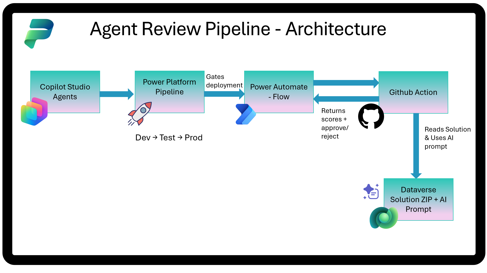

# Agent Review Pipeline

Part of the **Copilot Agent Kit** - a set of tools for managing, monitoring, and governing Copilot Studio agents at scale.

## What is the Agent Review Tool?

The Agent Review Tool evaluates Copilot Studio agents against design best practices - checking naming conventions, topic structure, knowledge source configuration, instruction quality, and more. It produces a scored report highlighting what needs attention before an agent goes to production.

The tool is available in two forms:

- **Code App** - interactive UI inside Power Apps for on-demand reviews
- **Pipeline (this repo)** - automated CI/CD gate that runs the same checks on every deployment

## Agent Review Pipeline

Automated quality gate for agents deployed via Power Platform Pipelines. When a deployment is triggered, this pipeline evaluates the agent using deterministic pattern detection and AI-powered analysis, then approves or rejects the deployment based on a configurable score threshold.

## How It Works

1. **Power Platform Pipeline** triggers a pre-deployment step
2. **Power Automate Flow** dispatches a GitHub Actions workflow via webhook
3. **GitHub Action** downloads the solution ZIP, parses agent configuration, runs AI evaluation, scores, and generates a PDF report
4. **Callback** returns scores to the flow, which approves or rejects the pipeline stage

## What Gets Evaluated

| Stage | Method | What it checks |
|-------|--------|----------------|
| Parse & Detect | Deterministic | Missing model names, descriptions, variable naming, excessive tools |
| Design Patterns | AI (PredictV2) | Topic design, knowledge sources, conversation flow, error handling |
| Instruction Compliance | AI (PredictV2) | Whether agent follows its own system instructions |

## Setup

**📖 [CI/CD Setup Guide](docs/Agent%20Review%20Pipeline%20-%20CICD%20Setup%20Guide.md)** - step-by-step instructions for your organization.

## License

Part of the [Copilot Agent Kit](https://github.com/Ramakrishnan24689/Power-CAT-Copilot-Studio-Kit).
