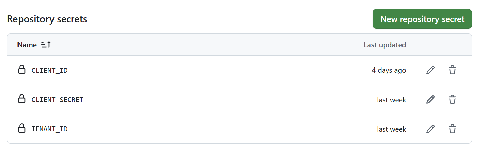
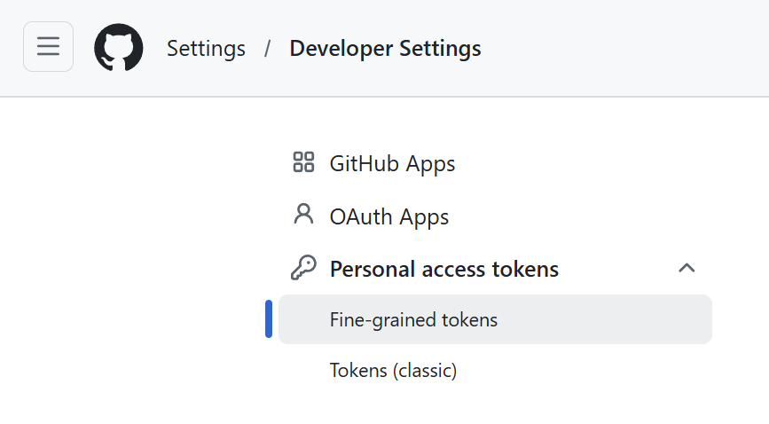
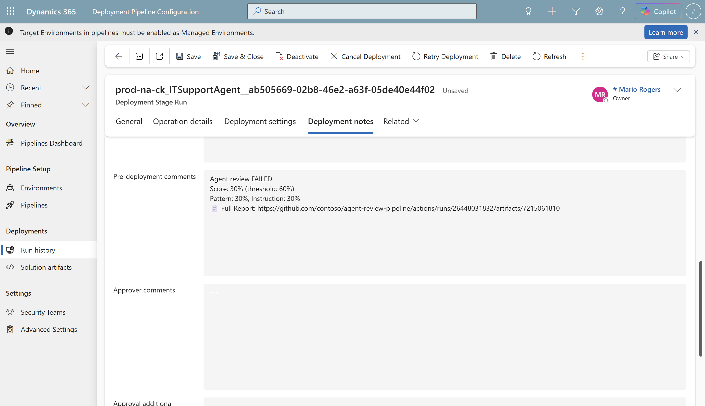

# Agent Review Pipeline - CI/CD Setup Guide

Automated quality gate for Copilot Studio agents deployed through Power Platform Pipelines.

---

## Architecture


```
Pipeline deploys solution
       │
       ▼ OnPreDeploymentStarted
Power Automate ──── workflow_dispatch ────► GitHub Action
  (wait...)                                  │ Download solution ZIP
                                             │ Parse agent configuration
                                             │ Evaluate naming & descriptions
                                             │ Evaluate design best practices
                                             │ Evaluate instruction quality
                                             │ Score & pass/fail + PDF report
Power Automate ◄──── HTTP callback ─────────┘
       │
       ▼
Pipeline approved (score ≥ threshold) or rejected
```

---

## What You'll Need

| Item | Notes |
|------|-------|
| Admin-managed Power Platform Pipeline | [Personal pipelines can't be extended](https://learn.microsoft.com/en-us/power-platform/alm/extend-pipelines) |
| Copilot Studio Kit solution | Provides AI prompts for pattern evaluation and instruction compliance |
| Agent Review Pipeline solution | Provides the pre-deployment gate flow + environment variables |
| GitHub repo | Hosts the action code + workflow |
| Entra ID App Registration (SPN) | For Dataverse API access |
| Copilot/AI credits | AI prompts consume [Copilot Studio credits](https://learn.microsoft.com/en-us/microsoft-copilot-studio/requirements-messages-management) per evaluation run |

---

## Setup Steps

### 1. Import Solutions

Into the **pipeline host environment**, in order:

1. **Copilot Studio Kit** (if not already imported)
2. **Agent Review Pipeline**

> The Copilot Studio Kit must be in the pipeline host environment because the GitHub Action connects there to read deployment artifacts and run AI prompts - both need to be in the same environment.

Verify AI prompts are published after import.

---

### 2. Create App Registration (SPN)

Azure Portal → Entra ID → App registrations → New:
- Name: `Agent Review Pipeline SPN`
- Single tenant, no redirect URI

Generate a client secret. Save these three values:

| Value | Used as GitHub Secret |
|-------|----------------------|
| Application (client) ID | `CLIENT_ID` |
| Directory (tenant) ID | `TENANT_ID` |
| Client secret value | `CLIENT_SECRET` |

---

### 3. Add SPN to Dataverse

Power Platform Admin Center → pipeline host environment → Settings → Application users → New:
- Select the app registration
- Assign the **Agent Review Pipeline Service** role (included in solution)

This role is based on Basic User with two additional org-level permissions:

| Table | Privilege | Access Level |
|-------|-----------|--------------|
| Deployment Artifact | Read | Organization |
| AI Model (`msdyn_aimodel`) | Read | Organization |

> **Note:** If you prefer an OOTB alternative, **Service Reader** also works but grants broader read access to all tables.

---

### 4. Set Up GitHub Repo

Clone or fork the [Agent Review Pipeline](https://github.com/microsoft/Power-CAT-Copilot-Studio-Kit/tree/main/agent-review-pipeline) folder from the Copilot Studio Kit repository into your own repo. The folder contains everything needed to run the action:

```
your-repo/
├── action.yml                    ← action definition
├── package.json                  ← dependencies
├── package-lock.json
├── tsconfig.json
├── src/                          ← source code (customize patterns here)
├── dist/                         ← compiled output (npm run build)
└── .github/workflows/
    └── agent-review.yml          ← workflow template
```

> The `dist/` folder is included pre-built so you can run the action immediately. If you modify `src/`, rebuild with `npm install && npm run build`.

Add 3 secrets (repo → Settings → Secrets → Actions):
- `CLIENT_ID`
- `TENANT_ID`
- `CLIENT_SECRET`



---

### 5. Create GitHub PAT

Create a fine-grained token, preferably from an org-owned service account so the token isn't tied to an individual's lifecycle.

GitHub → Settings → Developer settings → Fine-grained tokens:
- Repository access: only your repo
- Permissions: **Actions** (Read/Write), **Contents** (Read)



Copy the token.

---

### 6. Configure Environment Variables

In the pipeline host environment, open the **Agent Review Pipeline** solution and set:

| Variable | Value |
|----------|-------|
| GitHub Personal Access Token | PAT from Step 5 |
| GitHub Repository Owner | e.g. `contoso` |
| GitHub Repository Name | e.g. `copilot-governance` |
| Pipeline Name Filter | Exact pipeline name (case-sensitive), e.g. `Agent Review Pipeline` |

> **Security note:** The GitHub PAT is stored as a plain-text environment variable. For production use, consider using a [secret environment variable backed by Azure Key Vault](https://learn.microsoft.com/en-us/power-apps/maker/data-platform/environmentvariables-azure-key-vault-secrets) so the value is never exposed in the solution or API responses. If Key Vault is not available, limit risk by using a fine-grained PAT scoped to a single repo with minimal permissions (Actions R/W, Contents Read only).

---

### 7. Create Pipeline & Enable Pre-Deployment Step

1. Power Platform Admin Center → Pipelines → create or select your pipeline
2. Pipeline name must match the **Pipeline Name Filter** environment variable exactly (case-sensitive)
3. On the target stage, enable **"Pre-deployment step required"**

---

### 8. Turn On the Flow

make.powerautomate.com → pipeline host env → open "Agent Review - Pre-Deployment Gate" → verify connections → **Turn on**

---

### 9. Test

Deploy a solution with a Copilot Studio agent through the pipeline. Verify:
- Flow triggers (run history)
- GitHub Action runs (Actions tab)
- PDF report uploaded as artifact
- Pipeline approves or rejects based on score

---

## Flow Definition (Build from Scratch)

Use this if you need to recreate the flow manually.

**Trigger**: When an action is performed → `OnPreDeploymentStarted` (Dataverse, unbound)

**Trigger condition**:
```
@equals(triggerOutputs()?['body/OutputParameters/DeploymentPipelineName'], parameters('Agent Review Tool | Pipeline Name Filter (cat_PipelineName)'))
```

**HTTP Webhook** (dispatches GitHub + waits for callback):

> The `parameters(...)` values below reference the environment variables configured in Step 6.

| Field | Value |
|-------|-------|
| Method | POST |
| URI | `https://api.github.com/repos/@{parameters('cat_GitHubRepoOwner')}/@{parameters('cat_GitHubRepoName')}/actions/workflows/agent-review.yml/dispatches` |
| Headers | `Authorization: Bearer @{parameters('cat_GitHubPAT')}`, `Accept: application/vnd.github.v3+json` |
| Body | `{"ref":"main","inputs":{"artifact_url":"@{triggerOutputs()?['body/OutputParameters/ArtifactFileDownloadLink']}","callback_url":"@{listCallbackUrl()}"}}` |
| Timeout | PT10M |

**Condition**: `@equals(body('HTTP_Webhook')?['scores']?['passed'], true)`

**If yes** → Perform unbound action `UpdatePreDeploymentStepStatus`:
- StageRunId: `@{triggerOutputs()?['body/InputParameters/StageRunId']}`
- Status: `20`

**If no** → Same action, Status: `30`, Comments: score details

**⚠️ Error handler**: Always call `UpdatePreDeploymentStepStatus` with status 30 on failure - otherwise the pipeline hangs forever.

---

## PDF Report

Each evaluation run produces a PDF report uploaded as a GitHub Actions artifact. The report includes:
- Score cards (overall, pattern, instruction)
- Failed patterns with affected topics and recommendations
- Instruction compliance issues

The artifact URL is included in the pre-deployment comments, so reviewers can access the full report directly from the pipeline stage history.



---

## Customization

| What | How |
|------|-----|
| Pass threshold | Change `threshold` input in workflow (default: 60) |
| Add pattern checks | Edit `src/analysis/StageAService.ts`, rebuild with `npm run build` |
| Notifications | Add Teams/email actions in the flow after gating |
| Store results | Add Dataverse "Create row" to `cat_agentreviews` in the flow |

---

## Troubleshooting

| Symptom | Fix |
|---------|-----|
| Flow never triggers | Enable "Pre-deployment step required" on stage; check pipeline name matches exactly |
| Auth fails (401) | SPN not added as Application User in pipeline host env |
| Artifact 403 | SPN missing security role |
| PredictV2 404 | AI prompts not published in environment. Open Copilot Studio Kit solution → AI prompts → verify both are published |
| Pipeline stuck "pending" | Flow errored - add error handler that always calls status 30 |
| Callback never arrives | Check GitHub Actions tab for failed workflow runs |
