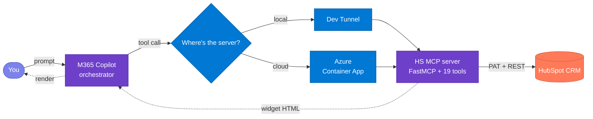
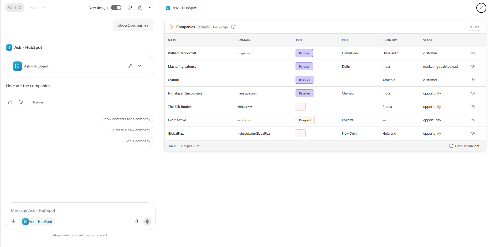
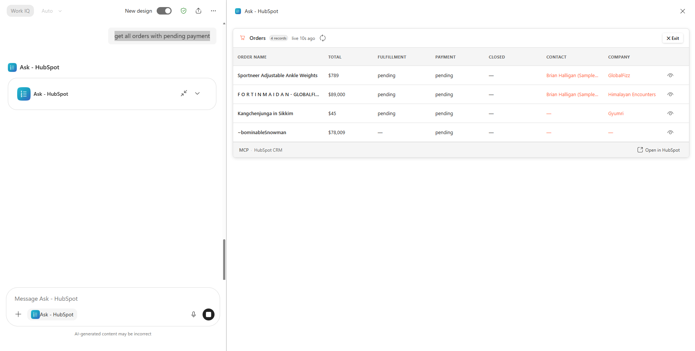
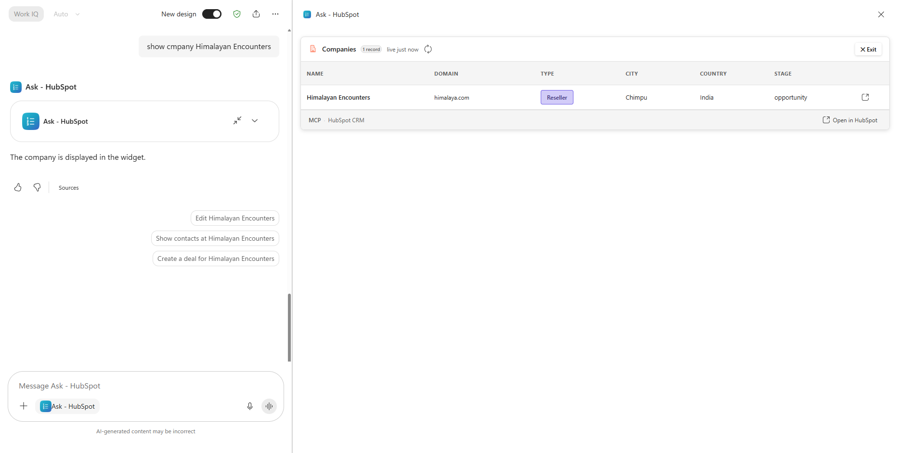
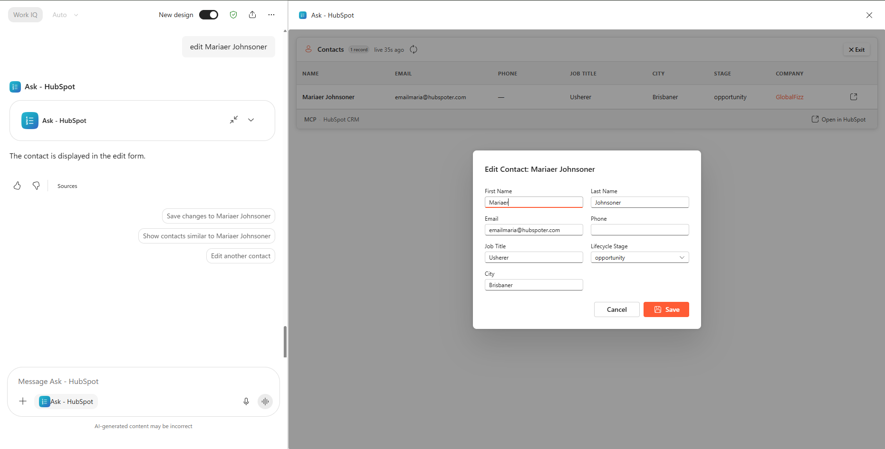
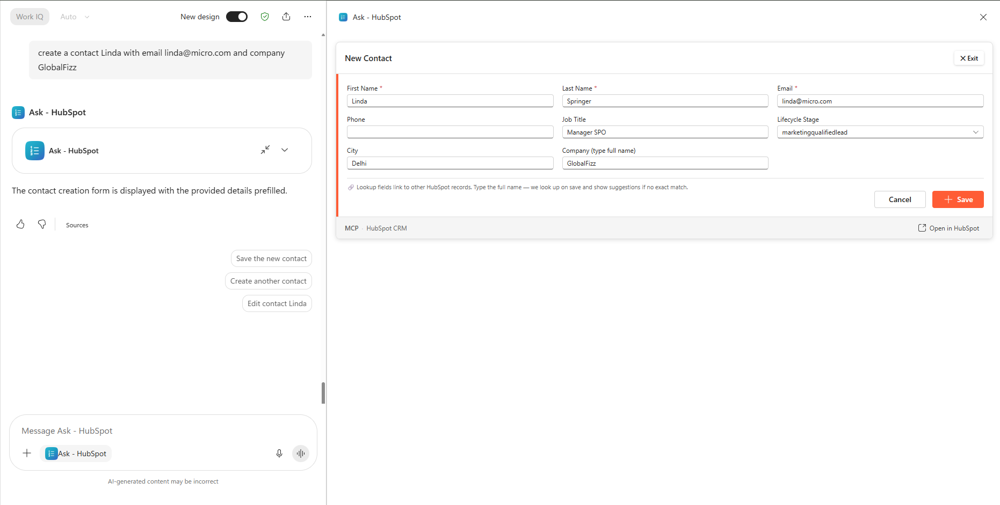
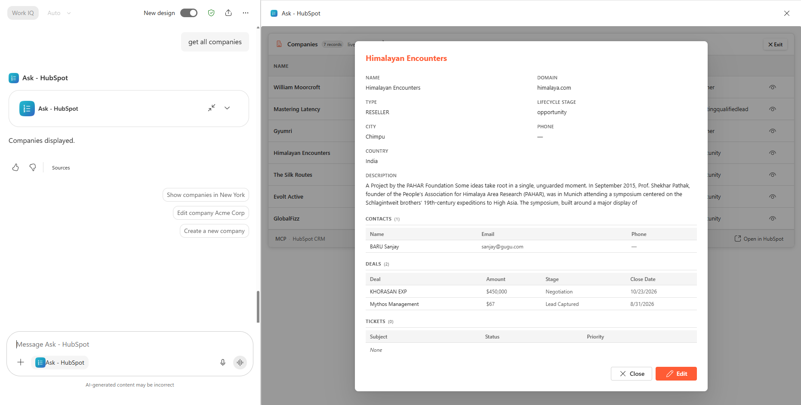
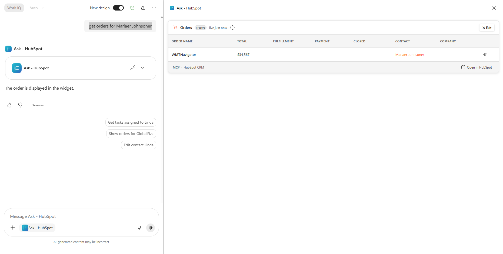

# Ask - HubSpot

**Ask - HubSpot** is a Model Context Protocol (MCP) App that connects a HubSpot CRM account to Microsoft 365 Copilot.

An MCP *server* exposes tools and data to an AI client over the open Model Context Protocol. An MCP *App* goes one step further: it returns an interactive user interface (a widget) alongside each tool response, so the client renders a live, interactive screen instead of plain text. **Ask - HubSpot** is that kind of app for HubSpot.

The flow is simple. A user types a request in plain English. Copilot calls the server. The server queries the HubSpot account and returns an interactive widget that renders inside the Copilot chat.

The server provides the following capabilities:

- The widgets render inline in the Copilot chat rather than in a separate browser tab.
- A user can read, create, and update records across six CRM entities — Companies, Contacts, Deals, Orders, Products, and Activities (Notes, Calls, Tasks, Meetings, Emails).
- Each record opens a 360 view that drills into its associated records (contacts, deals, tickets, line items, companies) inside a modal.
- Lookup fields accept plain names instead of numeric HubSpot record IDs, and the agent resolves each name to the correct record when the form is saved.
- The server runs either on a local laptop or on Azure Container Apps.
- Deployment is scripted. One command deploys the server locally, and two idempotent scripts deploy it to Azure.

<p align="center">
  
  
  
  
  
  
  
  
</p>

**Jump to:** [What this is](#1-what-this-is) · [How it works](#2-how-it-works) · [Install](#3-install) · [Troubleshooting](#4-troubleshooting)

---

## 1. What this is

**Ask - HubSpot** connects your HubSpot CRM to Microsoft 365 Copilot. When you type a request such as "show me companies" or "create a new company called Contoso", Copilot calls the MCP server, and the server returns an interactive widget that renders inside the chat, so you do not need to switch to a separate HubSpot tab. From the Copilot side panel you can read records, create new records, update existing records, and drill into a record's associated data.

**Name resolution:** Lookup fields accept plain names instead of numeric HubSpot record IDs. When you type "Acme Corp" into a Deal's Company field and save the record, the agent resolves that name to the correct company. If more than one record matches, the agent shows up to five suggestions so that you can select the correct one. The same behaviour applies to the Company field on Contacts, Deals, and Orders, the Contact field on Orders, and the Deal field on Orders. See [§2 → RESOLVE FK](#resolve-fk--type-names-not-ids) for the full flow.

> [!TIP]
> Works with any HubSpot account that has API access — Free, Starter, Professional, or Enterprise.

You can run the server in one of two ways:

- **Local.** Your laptop hosts the server, and a dev tunnel exposes it to Copilot over HTTPS. This option suits development, because you can change the code and test it quickly.
- **Azure.** The same server runs in Azure Container Apps. Because Azure hosts the server rather than your laptop, the agent stays available when your laptop is off, and anyone in your Microsoft 365 tenant can use it.



---

## 2. How it works

The app implements **19 tools** — a GET / CREATE / UPDATE trio for each of the six entity groups (Companies, Contacts, Deals, Orders, Products, Activities), plus a shared `hs__get_associations` tool that powers every record's drill-down. Most interactions map to one of eight operations. The table below is a quick reference, and each operation is then shown in action.

### 2.1 Canonical operations

#### Design patterns — 7 operations

These are built on the standard three-tool pattern of GET, CREATE, and UPDATE, plus the name-resolution and clarify behaviours:

| # | Operation | What you say | What happens | Tips |
|---|---|---|---|---|
| 1 | **GET** | "show / get / find companies" | Lists the 10 most recent records | Just name the entity (companies, contacts, deals, orders, products, tasks); no filters needed |
| 2 | **FILTER** *(by field)* | "prospect companies" / "companies in London" | Narrows by a record field value | Type the value directly — type, stage, city, status, priority, or a numeric range; no name lookup needed |
| 2 | **FILTER** *(by parent — FK)* | "contacts for Acme" / "orders for Acme" | Narrows by the parent company, contact, or deal | Use the parent's **exact name**; if several match, pick from suggestions |
| 3 | **IDENTIFY** | "show company Evolt Active" | Fetches that specific record (or all matches if ambiguous) | Name the record and include the entity word so the agent routes to the right one |
| 4 | **EDIT** | "edit Evolt Active" | Opens the record with an edit form | Say "edit" + the record name, change fields in the form, then Save |
| 5 | **CREATE** | "create company Contoso, type PROSPECT, city Seattle" | Pre-filled form — complete and submit | Put known values **in the utterance** so the form pre-fills |
| 7 | **RESOLVE FK** | *(type a name into 🔗 fields)* | Agent matches name → record on Save | In 🔗 fields type the **exact name**; if several match, pick from up to five suggestions |
| 8 | **CLARIFY** | *(agent asks you)* | Disambiguates before acting | If a name could be a company or a contact, answer the agent with the type |

#### Anti-patterns — 1 operation

Drill-down sits outside an entity's GET/CREATE/UPDATE trio. It is powered by the one shared `hs__get_associations` tool, which reads a record's associated objects on demand rather than through that record's own three tools:

> [!NOTE]
> Drill-down is **read-only** — it never changes a record. HubSpot has no one-shot state-change operation (no approve, reject, or convert), so unlike a write, nothing you do from the chat is irreversible.

| # | Operation | What you say | What happens | Tips |
|---|---|---|---|---|
| 6 | **DRILL** | *(click the view icon on a row)* | Opens a 360 modal with associated records | In full-screen view, click the view icon to see contacts, deals, tickets, line items, and companies linked to the record |

### 2.2 What you can do with each record type

Not every record type supports every operation. The table below shows, in plain terms, what you can do with each one. There are no delete operations anywhere — records can be viewed, created, and updated, but never removed from the chat.

| Record type | View / find | Create | Edit / update | Drill-down (associations) |
|---|---|---|---|---|
| **Company** | ✓ | ✓ | ✓ | Contacts, Deals, Tickets |
| **Contact** | ✓ | ✓ | ✓ | Deals, Companies, Tickets |
| **Deal** | ✓ | ✓ | ✓ | Contacts, Companies, Tickets |
| **Order** | ✓ | ✓ | ✓ | Deals, Line Items, Companies |
| **Product** | ✓ | ✓ | ✓ | — |
| **Activity** (Note / Call / Task / Meeting / Email) | ✓ | ✓ | ✓ | Attaches to Company, Contact, or Deal |

Most requests follow one simple pattern:

```
<verb> <entity> [where / with <condition>]
```

Where:

- **verb** is one of get, list, show, create, or edit.
- **entity** is the record type: company, contact, deal, order, product, or an activity (note, call, task, meeting, email).
- **condition** is an optional filter, such as type PROSPECT, city London, status fulfilled, or total over 5000.

Examples:

```
get companies where type = PROSPECT
list contacts for Acme
edit deal Global Fizz
show orders over 5000
create company Contoso, type PROSPECT, city Seattle
log a note for contact Maria
```

You do not have to phrase things this precisely — plain English works — but keeping the verb first, the entity second, and any filter last is the most reliable way to be understood.

### 2.3 In action

#### GET — list recent records

Ask for any entity by name. The agent returns the most recent records as a sortable table with ✏️ Edit / ➕ New controls per row.



#### FILTER — narrow the list

Add conditions to your request — *"prospect companies"*, *"orders over 5000"*, *"contacts for Acme"*, *"meetings titled kickoff"*, *"notes mentioning renewal"*. The agent maps your natural language to the correct HubSpot filter operators (`CONTAINS_TOKEN` for text, `EQ` for picklists, `GTE`/`LTE` for numeric ranges). Foreign-key filters like *"orders for Acme"* traverse HubSpot associations server-side.



#### IDENTIFY — show a specific record

Mention a name and the entity word. If it matches multiple records, the agent surfaces all matches. If it resolves to one, it shows that single record.



#### EDIT — modify a record

Say *"edit"* followed by a name. The matching records appear in the list, and you edit one by following the standard pattern — click the view icon on its row to open the record, then Edit. Date fields (deal close date, order close date, task due date) open a date picker.



#### CREATE — open a pre-filled form

The agent picks out values from your sentence — such as name, city, stage, or company — and pre-fills the create form. You review, complete any remaining fields, and submit. The form's Save button performs the write.



#### DRILL — open the 360 modal

In the full-screen widget, each row shows a view icon. Click it to open a 360 modal that lists the record's associated data inline — for example, a Company shows its Contacts, Deals, and Tickets; a Deal shows its Contacts, Companies, and Tickets; an Order shows its Deals, Line Items, and Companies.



#### RESOLVE FK — type names, not IDs

Fields marked with 🔗 accept plain names. Type a name, hit Save — the agent resolves it to the HubSpot record ID. If there's no exact match, you get up to five suggestions to pick from.



> [!TIP]
> Look for the 🔗 icon on form fields — those are the ones that accept names instead of IDs.

#### CLARIFY — agent asks when ambiguous

If a name could apply to more than one entity type, the agent asks first.

*"get orders for Maria Johnson"* → Agent: *"Is Maria Johnson a company (account) or a contact?"*

---

## 3. Install

The installation has four steps: get the app folder, configure your credentials, run the server locally, and optionally deploy it to Azure. The whole process takes about 30 minutes.

### Step 1 — Get the app folder

Use whichever option matches what you have. **Option A** if you received the `ask-hubspot.zip` package, **Option B** if you are cloning from source.

**Option A — Extract `ask-hubspot.zip`:**
```powershell
Expand-Archive -Path .\ask-hubspot.zip -DestinationPath .\ask-hubspot
cd ask-hubspot
```

**Option B — Clone the repo:**
```powershell
git clone https://github.com/microsoft/mcp-interactiveUI-samples.git
cd mcp-interactiveUI-samples/mcp-apps/hubspot-crm/python
```

**Validate:** You should see `hs_crm_mcp/`, `shared_mcp/`, `widgets/`, `deploy/`, and `agent/` directories.

---

### Step 2 — Get your HubSpot credentials

You need a **Private App Token** from your HubSpot account.

1. Go to **Settings → Integrations → Private Apps** in HubSpot.
2. Click **Create a private app**.
3. Give it a name (e.g. "M365 Copilot MCP").
4. Under **Scopes**, add read and write for every object the app touches:
   - `crm.objects.companies.read`, `crm.objects.companies.write`
   - `crm.objects.contacts.read`, `crm.objects.contacts.write`
   - `crm.objects.deals.read`, `crm.objects.deals.write`
   - `crm.objects.line_items.read`, `crm.objects.line_items.write`
   - `crm.objects.orders.read`, `crm.objects.orders.write` (Commerce)
   - `e-commerce` (Products)
   - `tickets` (read — for ticket drill-downs)
   - `crm.objects.owners.read`
   - Engagements (notes, calls, tasks, meetings, emails) are covered by the CRM object scopes above.
5. Click **Create app** and copy the token.

> [!IMPORTANT]
> The token starts with `pat-na2-...` (or similar depending on your region). Keep it safe — it grants API access to your CRM data.

> [!TIP]
> If a request returns empty results, the most common cause is a missing scope for that object. Add the object's `.read`/`.write` scope and regenerate the token.

**Validate:** You have your Private App Token copied.

---

### Step 3 — Run locally

**Prerequisites** (install these first — the script stops immediately if any are missing):

- 🐍 **Python ≥ 3.11**
- 📦 **Node.js ≥ 18** (for widget build)
- 🌐 **[Dev Tunnels CLI](https://learn.microsoft.com/azure/developer/dev-tunnels/get-started)** — run `devtunnel user login` once
- 🛠️ **[M365 Agents Toolkit](https://aka.ms/teamsfx)** (VS Code extension)
- 🏢 **M365 dev tenant** with **Custom App Upload Enabled ✓** and **Copilot Access Enabled ✓**

**Action:** Copy `.env.example` to `.env` in the project root, then fill in your token:

| Param | Value |
|---|---|
| `HUBSPOT_ACCESS_TOKEN` | Your Private App Token (e.g. `pat-na2-...`) |
| `PORT` | *(optional)* Server port, default `8082` |
| `APPINSIGHTS_CONNECTION_STRING` | *(optional)* App Insights connection string for telemetry |

Then run:
```powershell
.\deploy\LocalDeploy.ps1
```

The script takes 3–4 minutes the first time:
1. 🐍 Python venv + dependencies (~60s)
2. ⚛️ React widget bundle (~45s)
3. 🚀 MCP server on `:8082` (~3s)
4. 🌐 Dev tunnel with public HTTPS URL (~5s)
5. 📤 Agent package uploads to M365 (~15s, device-code sign-in first time)

**Validate:**
1. The terminal shows the LIVE banner:
```text
  =====================================
   ASK - HUBSPOT CRM COPILOT LIVE
  =====================================
  Server  -->  http://localhost:8082
  Tunnel  -->  https://<id>-8082.inc1.devtunnels.ms
  MOS3    -->  agent package live in M365 Copilot
```
2. Test the server:
```powershell
curl -X POST http://localhost:8082/mcp -H "Content-Type: application/json" -d '{"jsonrpc":"2.0","method":"initialize","id":1}'
```
You should get a JSON-RPC response.
3. Open M365 Copilot → pick **Ask - HubSpot** from the agent picker.
4. Wait ~30–60 s for the agent to register; refresh if it doesn't appear.
5. Try *"show me companies"* — a widget should render with a company list.

> [!TIP]
> If the agent doesn't appear in the picker, wait 1–2 minutes and refresh. Still missing? Jump to [§4 Troubleshooting](#4-troubleshooting).

---

### Step 4 — Deploy to Azure (optional)

This step hosts the MCP server in Azure Container Apps instead of on your laptop. Once the server runs in Azure, the agent stays available when your laptop is off, and anyone in your Microsoft 365 tenant can use it.

**Prerequisites:**
- ☁️ **Azure CLI ≥ 2.50** — sign in with `az login`
- 💳 **Azure subscription** with Contributor permissions

**Action:** Copy `deploy/parameters.example.bicepparam` to `deploy/parameters.bicepparam` and fill in your credentials:

| Param | Value |
|---|---|
| `hubspotAccessToken` | Your HubSpot Private App access token (`pat-...`) |
| `acrName` | Globally unique, lowercase alphanumeric, 5–50 chars |
| `location` | Azure region (e.g. `eastus`, `westeurope`) |
| `appInsightsConnectionString` | *(optional)* App Insights connection string |

Then run the **two server scripts** in order. They're split by responsibility and both are idempotent — safe to re-run.

**1. Set up the Azure infrastructure** (one time, or after you change an infrastructure parameter):
```powershell
.\deploy\AzureImageSetup.ps1
```
This script provisions the Resource Group, Container Registry, Container Apps Environment, Container App (with a placeholder image), Log Analytics workspace, and Managed Identity. The first run takes 5–10 minutes, and later runs only verify that the stack is already in place.

**2. Deploy the server and agent** (every time you ship new code):
```powershell
.\deploy\ServerDeploy.ps1
```
This script builds the container image in ACR, points the Container App at that image, and then regenerates the agent manifest against the live Azure URL and uploads it to Microsoft 365 Copilot. If the infrastructure does not exist yet, the script stops and asks you to run `AzureImageSetup.ps1` first.

> [!NOTE]
> **Response speed depends on your Azure Container Apps plan.** The default Consumption plan cold-starts containers on each request after idle timeout (~5–15 s first response). For production or demo use, consider a **Dedicated plan** or set `minReplicas: 1` in your container app config to keep the container warm.

**Validate:**
1. The script prints a public Azure FQDN. Test it:
```powershell
curl -X POST <FQDN>/mcp -H "Content-Type: application/json" -d '{"jsonrpc":"2.0","method":"initialize","id":1}'
```
You should get a JSON-RPC response (not a connection error).
2. Verify the container image: `az containerapp show -g <rg> -n <app> --query "properties.template.containers[0].image" -o tsv` — should return your ACR image.

> [!TIP]
> When you ship new server or agent code later, re-run `.\deploy\ServerDeploy.ps1`. It rebuilds the image and re-uploads the agent against the same infrastructure. You only need to re-run `AzureImageSetup.ps1` when you change an infrastructure parameter such as the region or the ACR name.

> [!NOTE]
> To tear down later: `.\deploy\ServerDestroy.ps1` removes the provisioned resources but leaves your resource group and M365 agent registration intact.

---

#### Suggested sample data

The agent works best when your HubSpot account has records to interact with. If you're on a fresh account, seed this minimum so every operation has something to show:

- **3–5 Companies** with mixed types (PROSPECT, PARTNER, CUSTOMER) and different cities — exercises GET, FILTER by field, and IDENTIFY.
- **3–5 Contacts** linked to those companies, with different lifecycle stages and job titles — exercises FILTER by parent (contacts for a company) and RESOLVE FK.
- **3–5 Deals** across pipeline stages (Lead Captured → Closed Won/Lost), each associated with a company and a contact — exercises FILTER by stage and DRILL.
- **2–3 Orders** with different fulfillment/payment statuses and totals, linked to a deal and company, each with a line item or two — exercises numeric-range FILTER (total over 5000) and DRILL to line items.
- **3–5 Products** with mixed status (active/inactive) and product types — exercises product filters and feeds order line items.
- **A few Activities of each type** — a note, call, task, meeting, and email — attached to a company, contact, or deal — exercises activity list/filter/create/edit and the Related To column.
- **1–2 Tickets** attached to a company, contact, or deal — exercises the read-only drill-down (tickets have no create/edit tool).

> [!TIP]
> A HubSpot developer test account seeds a handful of sample companies and contacts out of the box. Add a few deals, orders, products, and activities as above for the fullest demo across every widget.

---

## 4. Troubleshooting

| Symptom | Fix |
|---|---|
| Agent missing from the picker | Wait 1–2 min after upload and refresh; ensure Custom App Upload is enabled in M365 admin. |
| "Oops! Something went wrong" | Dev tunnel blip — wait 5–10s and resend. |
| Widget doesn't render | Confirm the server is running and responding at `/mcp`. |
| `401 Unauthorized` | Token is invalid or expired — regenerate in HubSpot Settings → Private Apps. |
| Empty results for one entity | Private App is missing that object's CRM scope — add the matching `.read`/`.write` scope (see Step 2) and regenerate the token. |
| `HTTP 400 — One or more associations are invalid` | The record you are linking to does not exist or is not associable — confirm the parent (company, contact, or deal) exists and is spelled exactly. |
| `/mcp` returns 421 "Invalid Host header" | DNS-rebinding protection — already disabled in this codebase via `enable_dns_rebinding_protection=False`. |
| Unicode errors on Windows | Set `PYTHONIOENCODING=utf-8` before running the server. |
| Port in use | Another process is on 8082 — kill it or change `PORT` in `.env`. |
| Agent upload fails with `401` | MOS3 token expired — delete `.mos3_token_cache.json` and re-run `LocalDeploy.ps1` (re-runs the device-code sign-in). |
| `TooLongInstructions` (HTTP 400) on upload | `instruction.txt` is at or above 8,000 chars — trim it below the limit and redeploy. |
| Manifest "drift detected" — not safe to upload | Live server's tool list no longer matches `agent/appPackage/mcp-tools.json` — re-run `deploy\regen_manifests.py`, then redeploy. |
| `/mcp` returns 502 / refused after Azure deploy | Container failed to start — `az containerapp logs show -g <rg> -n <app> --tail 100`; usually a wrong token in `parameters.bicepparam`. |
| `RegistryNameInUse` during Azure deploy | ACR names are global — pick a different `acrName` in `parameters.bicepparam`. |
| Azure infra not found | Run `.\deploy\AzureImageSetup.ps1` first, then `.\deploy\ServerDeploy.ps1`. |
| Tools show dev-tunnel URL after Azure deploy | Re-run `.\deploy\ServerDeploy.ps1` — it re-registers the agent against the live Azure URL. |
