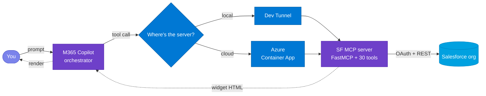
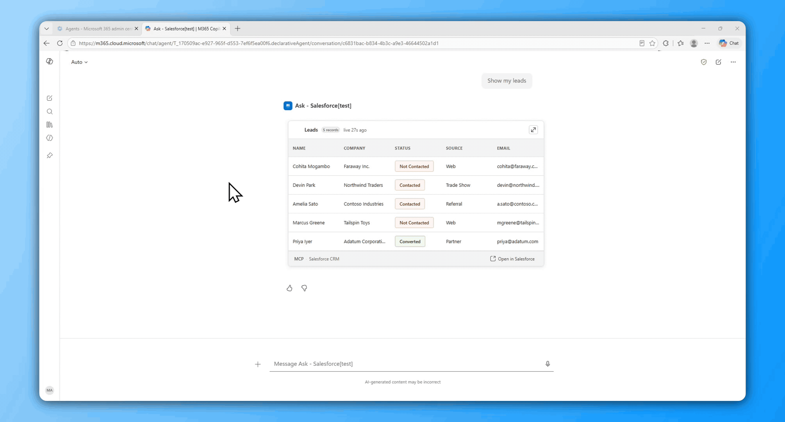
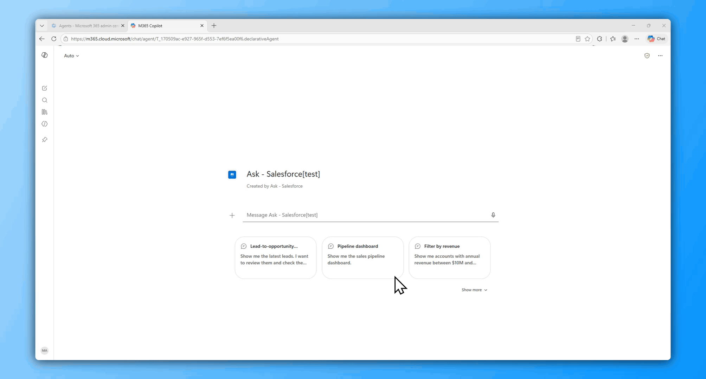
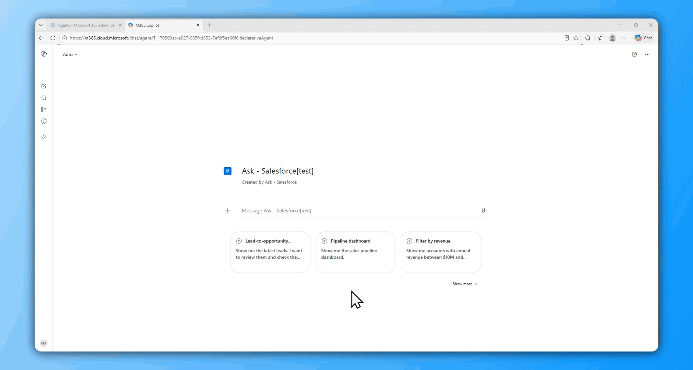

# Ask - Salesforce

**Ask - Salesforce** is a Model Context Protocol (MCP) App that connects a Salesforce org to Microsoft 365 Copilot.

An MCP *server* exposes tools and data to an AI client over the open Model Context Protocol. An MCP *App* goes one step further: it returns an interactive user interface (a widget) alongside each tool response, so the client renders a live, interactive screen instead of plain text. **Ask - Salesforce** is that kind of app for Salesforce.

The flow is simple. A user types a request in plain English. Copilot calls the server. The server queries the Salesforce org and returns an interactive widget that renders inside the Copilot chat.

The server provides the following capabilities:

- The widgets render inline in the Copilot chat rather than in a separate browser tab.
- A user can read, create, and update records across seven CRM entities, and can also view a pipeline dashboard and act on approvals.
- Lookup fields accept plain names instead of 15-character Salesforce Ids, and the agent resolves each name to the correct record when the form is saved.
- The server runs either on a local laptop or on Azure Container Apps.
- Deployment is scripted. One command deploys the server locally, and two idempotent scripts deploy it to Azure.

<p align="center">
  
  
  
  
  
  
  
  
</p>

**Jump to:** [What this is](#1-what-this-is) · [How it works](#2-how-it-works) · [Install](#3-install) · [Troubleshooting](#4-troubleshooting)

---

## 1. What this is

**Ask - Salesforce** connects your Salesforce org to Microsoft 365 Copilot. When you type a request such as "show me the latest leads" or "what's in the pipeline?", Copilot calls the MCP server, and the server returns an interactive widget that renders inside the chat, so you do not need to switch to a separate Salesforce tab. From the Copilot side panel you can read records, create new records, update existing records, view the pipeline dashboard, and act on approvals.

**Name resolution:** Lookup fields accept plain names instead of 15-character Salesforce Ids. When you type "Acme Corp" into an Opportunity's Account field and save the record, the agent resolves that name to the correct account. If more than one record matches, the agent shows up to five suggestions so that you can select the correct one. The same behaviour applies to the Account field on Contacts and Cases, the Contact field on Cases, and the Name and Related To fields on Tasks. See [§2 → RESOLVE FK](#resolve-fk--type-names-not-ids) for the full flow.

> [!TIP]
> The server works with any Salesforce org that exposes the REST API, including a Developer Edition org, a sandbox, or a production org.

You can run the server in one of two ways:

- **Local.** Your laptop hosts the server, and a dev tunnel exposes it to Copilot over HTTPS. This option suits development, because you can change the code and test it quickly.
- **Azure.** The same server runs in Azure Container Apps. Because Azure hosts the server rather than your laptop, the agent stays available when your laptop is off, and anyone in your Microsoft 365 tenant can use it.



---

## 2. How it works

Most interactions map to one of ten operations. The table below is a quick reference, and each operation is then shown in action.

### 2.1 Canonical operations

#### Design patterns — 8 operations

These are the canonical operations. They follow the standard three-tool pattern of GET, CREATE, and UPDATE:

| # | Operation | What you say | What happens | Tips |
|---|---|---|---|---|
| 1 | **GET** | "show / get / find leads" | Lists the most recent records | Just name the entity (leads, opportunities, accounts, contacts, cases, tasks, campaigns); no filters needed |
| 2 | **FILTER** *(by account — FK)* | "show / get / find cases for Acme Corp" | Narrows by the parent account | Use the account's **exact name**; if several match, pick from suggestions. Available on opportunities, contacts, and cases |
| 2 | **FILTER** *(by field — non-FK)* | "show / get / find high-priority cases" | Narrows by a record field value | Type the value directly — stage, status, priority, type, industry, an amount range, or a date range; no name lookup needed |
| 3 | **IDENTIFY** | "show / get / find Global Fizz opportunity" | Fetches that specific record (or all matches if ambiguous) | Name the record and include the entity word (lead, opportunity, account) so the agent routes to the right one |
| 4 | **EDIT** | "edit Global Fizz - Copilot Studio" | Opens the record with an edit form | Say "edit" + the record name, change fields in the form, then Save |
| 5 | **CREATE** | "create opportunity 500K Army, amount 89000" | Pre-filled form — complete and submit | Put known values **in the utterance** (account, amount, close date, stage) so the form pre-fills |
| 8 | **DASHBOARD** | "show me the pipeline" | Pipeline broken down by stage with deal counts and totals | Say "show the pipeline"; add a period such as "this quarter" to scope it |
| 9 | **RESOLVE FK** | *(type a name into 🔗 fields)* | Agent matches name → record on Save | In 🔗 fields type the **exact name**; if several match, pick from up to five suggestions |
| 10 | **CLARIFY** | *(agent asks you)* | Disambiguates before acting | If your request is ambiguous, answer the agent with the entity type (lead, account, opportunity, etc.) |

#### Anti-patterns — 2 operations

These two operations require dedicated tools outside that trio:

> [!IMPORTANT]
> Anti-pattern operations are difficult to reverse. Once you approve, reject, or convert from the chat, the state change takes effect immediately in Salesforce.

| # | Operation | What you say | What happens | Tips |
|---|---|---|---|---|
| 6 | **ACTION** | "convert lead John Smith" | One-shot state change — done | State the action plainly; approvals can be approved or rejected inline from the widget |
| 7 | **DRILL** | *(click ▾ on a row)* | Expands child records below | Click the ▾ on a row to expand children (Opportunity → products and contact roles, Case → comments and tasks) |

### 2.2 What you can do with each record type

Not every record type supports every operation. The table below shows, in plain terms, what you can do with each one. There are no delete operations anywhere — records can be viewed, created, and updated, but never removed from the chat.

| Record type | View / find | Create | Edit / update | Other actions |
|---|---|---|---|---|
| **Lead** | ✓ | ✓ | ✓ | Convert to Account + Contact + Opportunity |
| **Opportunity** | ✓ | ✓ | ✓ | Drill to products and contact roles |
| **Account** | ✓ | ✓ | ✓ | — |
| **Contact** | ✓ | ✓ | ✓ | — |
| **Case** | ✓ | ✓ | ✓ | Drill to comments and tasks |
| **Task** | ✓ | ✓ | ✓ | — |
| **Campaign** | ✓ | ✓ | ✓ | — |

Approve and reject work on any record that is waiting for your decision. The pipeline dashboard aggregates open opportunities by stage; it is a read-only view.

Most requests follow one simple pattern:

```
<verb> <entity> [where / with <condition>]
```

Where:

- **verb** is one of get, list, show, create, edit, or convert.
- **entity** is the record type: lead, opportunity, account, contact, case, task, or campaign.
- **condition** is an optional filter, such as status Qualified, stage Prospecting, account Acme Corp, or priority High.

Examples:

```
get leads where status = Qualified
list opportunities where stage = Prospecting
edit account Acme Corp
show cases for Acme Corp
create opportunity 500K Army amount 89000
convert lead John Smith
```

You do not have to phrase things this precisely — plain English works — but keeping the verb first, the entity second, and any filter last is the most reliable way to be understood.

### 2.3 In action

#### GET — list recent records

Ask for any entity by name. The agent returns the most recent records as a sortable table with ✏️ Edit / ➕ New controls per row.



#### FILTER — narrow the list

Add conditions to your request — status, stage, account, date range. The agent figures out which filter to apply from your wording. Lookup fields (like Account) accept names — the agent resolves them to IDs when querying.

#### IDENTIFY — show a specific record

Mention a name or ID. If it matches multiple records, the agent surfaces all matches. If it resolves to one, it shows that single record.

- *"show Global Fizz opportunity"* → shows matching record(s)

#### EDIT — modify a record

Say *"edit"* followed by a name. If multiple match, pick from a list. If one matches, the form opens directly.

#### CREATE — open a pre-filled form

The agent picks out values from your sentence — name, amount, probability — and pre-fills the form. You review, complete any remaining fields, and submit.



#### ACTION — one-shot state change

- *"show my pending approvals"* → lists approvals; approve or reject inline from the widget
- *"convert lead John Smith"* → creates linked Account + Contact + Opportunity

#### DRILL — expand child records

Opportunities and Cases have a ▾ expand icon on each row. Click it to see child records inline:

- **Opportunity** → products + contact roles
- **Case** → comments + related tasks

#### DASHBOARD — pipeline analytics

*"show me the sales pipeline dashboard"* aggregates open opportunities by stage and presents a horizontal bar chart with a top-accounts panel.



#### RESOLVE FK — type names, not IDs

Fields marked with 🔗 accept plain names. Type a name, hit Save — the agent resolves it. If there's no exact match, you get up to five suggestions to pick from.

> [!TIP]
> Look for the 🔗 icon on form fields — those are the ones that accept names instead of IDs.

#### CLARIFY — agent asks when ambiguous

If your request could apply to more than one entity type, the agent asks first.

*"edit dumdum"* → Agent: *"Is that a Lead, Account, Contact, Opportunity, Case, Task, or Campaign?"*

---

## 3. Install

The installation has four steps: clone the repository, configure your credentials, run the server locally, and optionally deploy it to Azure. The whole process takes about 30 minutes.

### Step 1 — Clone the repo

**Action:**
```powershell
git clone https://github.com/microsoft/Power-CAT-Copilot-Studio-Kit.git
cd Power-CAT-Copilot-Studio-Kit/mcp-apps/salesforce-crm/python
```

**Validate:** You should see `sf_crm_mcp/`, `shared_mcp/`, `widgets/`, `deploy/`, and `agent/` directories.

---

### Step 2 — Get your Salesforce credentials

You need credentials from your Salesforce org. Collect them now, because you will paste them into the appropriate step below.

1. **Org URL** — Setup → Company Information → My Domain. Looks like `https://acme.salesforce.com` or `https://orgfarm-xxx.develop.my.salesforce.com`.
2. **Connected App Consumer Key** — Setup → App Manager → find your Connected App → View → copy the Consumer Key.
3. **Connected App Consumer Secret** — Same page → Click to reveal under Consumer Secret. Copy it before the page hides it again.

> [!IMPORTANT]
> **Connected App configuration:** Your app must be authorized for the `client_credentials` flow. Go to App Manager → your Connected App → Manage → OAuth Policies → set "Run as" to an integration user. Without this, the first token request returns `403 Forbidden`.

> [!IMPORTANT]
> **Required Salesforce permissions:** The integration user (or profile) needs API Enabled, plus Read/Create/Edit on Lead, Opportunity, Account, Contact, Case, Task, and Campaign objects. For approvals, the user needs "Manage Approvals" permission. For lead conversion, "Convert Leads" permission is required.

> [!TIP]
> Salesforce Developer Edition orgs come pre-configured with full API access and sample data. You can start immediately without extra permission setup.

**Validate:** You have your credentials written down — org URL, Consumer Key, Consumer Secret.

---

### Step 3 — Run locally

**Prerequisites** (install these first — the script stops immediately if any are missing):

- 🐍 **Python ≥ 3.11**
- 📦 **Node.js ≥ 18**
- 🌐 **[Dev Tunnels CLI](https://learn.microsoft.com/azure/developer/dev-tunnels/get-started)** — run `devtunnel user login` once
- 🛠️ **[M365 Agents Toolkit](https://aka.ms/teamsfx)** (VS Code extension)
- 🏢 **M365 dev tenant** with **Custom App Upload Enabled ✓** and **Copilot Access Enabled ✓**

**Action:** Copy `.env.example` to `.env` in the project root, then fill in your credentials:

| Param | Value |
|---|---|
| `SF_INSTANCE_URL` | Your Salesforce org URL (e.g. `https://acme.salesforce.com`) |
| `SF_CLIENT_ID` | Connected App Consumer Key |
| `SF_CLIENT_SECRET` | Connected App Consumer Secret |
| `APPINSIGHTS_CONNECTION_STRING` | *(optional)* App Insights connection string for telemetry |

Then run:
```powershell
.\deploy\LocalDeploy.ps1
```

The script takes 3–4 minutes the first time:
1. 🐍 Python venv + dependencies (~60s)
2. ⚛️ React widget bundle (~45s)
3. 🚀 MCP server on `:8080` (~3s)
4. 🌐 Dev tunnel with public HTTPS URL (~5s)
5. ✅ Manifests rebuild + validate (~5s)
6. 📤 Agent package uploads to M365 (~15s, device-code sign-in first time)

**Validate:**
1. The terminal shows the LIVE banner:
```text
  =====================================
   ENTERPRISE SALESFORCE COPILOT LIVE
  =====================================
  Server  -->  http://localhost:8080
  Tunnel  -->  https://<id>-8080.inc1.devtunnels.ms
  MOS3    -->  agent package live in M365 Copilot
```
2. Run `curl -X POST http://localhost:8080/mcp -H "Content-Type: application/json" -d '{"jsonrpc":"2.0","method":"initialize","id":1}'` — you should get a JSON-RPC response.
3. Open M365 Copilot → pick **Ask - Salesforce** from the agent picker.
4. Try *"show me the latest leads"* — a widget should render with a lead list.

> [!TIP]
> If the agent doesn't appear in the picker, wait 1–2 minutes and refresh. Still missing? Jump to [§4 Troubleshooting](#4-troubleshooting).

---

### Step 4 — Deploy to Azure (optional)

This step hosts the MCP server in Azure Container Apps instead of on your laptop. Once the server runs in Azure, the agent stays available when your laptop is off, and anyone in your Microsoft 365 tenant can use it.

**Prerequisites:**
- ☁️ **Azure CLI ≥ 2.50** — sign in with `az login`
- 💳 **Azure subscription** with Contributor permissions

**Action:** Copy `deploy/parameters.example.bicepparam` to `deploy/parameters.bicepparam` and fill in your credentials:

| Param | Value |
|---|---|
| `sfInstanceUrl` | Your Salesforce org URL |
| `sfClientId` | Connected App Consumer Key |
| `sfClientSecret` | Connected App Consumer Secret |
| `acrName` | Globally unique, lowercase alphanumeric, 5–50 chars |
| `location` | Azure region (e.g. `eastus`, `westeurope`) |
| `appInsightsConnectionString` | *(optional)* App Insights connection string |

Then provision the Azure infrastructure once:
```powershell
.\deploy\AzureImageSetup.ps1
```

This first run provisions: Resource Group, Container Registry, Container Apps Environment, Container App, Log Analytics, and Managed Identity. It takes 5–10 minutes and is idempotent — re-running it verifies the stack rather than recreating it. Then build the image, deploy it, and upload the agent:
```powershell
.\deploy\ServerDeploy.ps1
```

`ServerDeploy.ps1` provisions no infrastructure; it builds a fresh image in ACR, points the existing Container App at it, and re-registers the agent. Re-run it any time you ship new server or agent code. If the infrastructure is not there yet, it stops and tells you to run `AzureImageSetup.ps1` first.

> [!NOTE]
> **Response speed depends on your Azure Container Apps plan.** The default Consumption plan cold-starts containers on each request after idle timeout (~5–15 s first response). For production or demo use, consider a **Dedicated plan** or set `minReplicas: 1` in your container app config to keep the container warm.

**Validate:**
1. The script prints a public Azure FQDN. Test it:
```powershell
curl -X POST <FQDN>/mcp -H "Content-Type: application/json" -d '{"jsonrpc":"2.0","method":"initialize","id":1}'
```
You should get a JSON-RPC response (not a connection error).
2. Verify the container image: `az containerapp show -g <rg> -n <app> --query "properties.template.containers[0].image" -o tsv` — should return your ACR image.

> [!NOTE]
> To tear down later: `.\deploy\ServerDestroy.ps1` removes the provisioned resources but leaves your resource group and M365 agent registration intact.

---

#### Suggested sample data

The agent works best when your Salesforce org has records to interact with. If you're on a fresh org, seed this minimum:

- **3–5 Leads** with mixed statuses (Open, Contacted, Qualified) and different owners — exercises GET, FILTER, and convert
- **3–5 Opportunities** with different stages, at least one with Products and Contact Roles — exercises DRILL and DASHBOARD
- **2–3 Cases** with at least one Case Comment and a related Task — exercises DRILL (comments + tasks)
- **1 pending Approval** (submit an Opportunity for approval) — exercises ACTION (approve/reject)

> [!TIP]
> Salesforce Developer Edition orgs include sample leads, accounts, contacts, and opportunities out of the box. For the best demo, add a few Products to an Opportunity and submit one record for approval.

---

## 4. Troubleshooting

| Symptom | Fix |
|---|---|
| Agent missing from the picker | Wait 1–2 min and refresh; ensure Custom App Upload is enabled (ATK → Accounts). |
| "Oops! Something went wrong" | Dev tunnel blip — wait ~10s and resend. |
| `403 Forbidden` on first call | Connected App not authorized for `client_credentials` — App Manager → your Connected App → Manage → OAuth Policies → set "Run as" to an integration user. |
| Empty results for an entity | The integration user's profile lacks Read permission on that object — Setup → Profiles → your profile → Object Permissions. |
| `/mcp` returns 421 "Invalid Host header" | DNS-rebinding protection — already disabled in current code; on older versions set `enable_dns_rebinding_protection=False` in `salesforce_server.py`. |
| `/mcp` returns 502 / refused | Container failed to start — `az containerapp logs show -g <rg> -n <app> --tail 100`; usually wrong creds in `parameters.bicepparam`. |
| `RegistryNameInUse` during deploy | ACR names are global — pick a different `acrName`. |
| Azure infra not found | Run `.\deploy\AzureImageSetup.ps1` first, then `.\deploy\ServerDeploy.ps1`. |
| Manifest "drift detected" | Re-run the deploy script to rebuild with the correct `MCP_GATEWAY_URL`. |
| MOS3 upload fails with `403` | Token expired — delete `.mos3_token_cache.json` and re-run. |
| `TooLongInstructions` rejection | `instruction.txt` exceeds 8000 chars — trim it. |
| Tools show dev-tunnel URL after Azure deploy | Re-run `.\deploy\ServerDeploy.ps1` — it re-registers the agent against the live Azure URL. |

