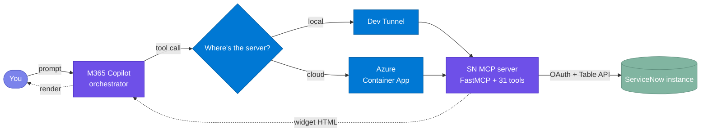

# Ask - ServiceNow

**Ask - ServiceNow** is a Model Context Protocol (MCP) App that connects a ServiceNow instance to Microsoft 365 Copilot.

An MCP *server* exposes tools and data to an AI client over the open Model Context Protocol. An MCP *App* goes one step further: it returns an interactive user interface (a widget) alongside each tool response, so the client renders a live, interactive screen instead of plain text. **Ask - ServiceNow** is that kind of app for ServiceNow.

The flow is simple. A user types a request in plain English. Copilot calls the server. The server queries the ServiceNow instance and returns an interactive widget that renders inside the Copilot chat.

The server provides the following capabilities:

- The widgets render inline in the Copilot chat rather than in a separate browser tab.
- A user can read, create, and update records across five ITSM and HR entities, and can also act on approvals, search knowledge articles, and browse the service catalog.
- Lookup fields accept plain names instead of internal sys_ids, and the agent resolves each name to the correct record when the form is saved.
- The server runs either on a local laptop or on Azure Container Apps.
- Deployment is scripted. One command deploys the server locally, and two idempotent scripts deploy it to Azure.

<p align="center">
  
  
  
  
  
  
  
  
</p>

**Jump to:** [What this is](#1-what-this-is) · [How it works](#2-how-it-works) · [Install](#3-install) · [Troubleshooting](#4-troubleshooting)

---

## 1. What this is

**Ask - ServiceNow** connects your ServiceNow instance to Microsoft 365 Copilot. When you type a request such as "show me open incidents" or "resolve INC0010001", Copilot calls the MCP server, and the server returns an interactive widget that renders inside the chat, so you do not need to switch to a separate ServiceNow tab. From the Copilot side panel you can read records, create new records, update existing records, act on the approval queue, and search knowledge articles.

**Name resolution:** Lookup fields accept plain names instead of internal sys_ids. When you type "Beth Anglin" into an incident's Caller field and save the record, the agent resolves that name to the correct person. If more than one person matches, the agent shows up to five suggestions so that you can select the correct one. The same behaviour applies to the Assigned To, Requested For, Opened For, and HR Service fields. See [§2 → RESOLVE FK](#resolve-fk--type-names-not-ids) for the full flow.

> [!TIP]
> The server works with any ServiceNow instance that exposes the Table API, including a free PDI, a sub-production instance, or an enterprise instance. HR Case operations additionally require the **HR Service Delivery** plugin (`com.sn_hr_core`).

You can run the server in one of two ways:

- **Local.** Your laptop hosts the server, and a dev tunnel exposes it to Copilot over HTTPS. This option suits development, because you can change the code and test it quickly.
- **Azure.** The same server runs in Azure Container Apps. Because Azure hosts the server rather than your laptop, the agent stays available when your laptop is off, and anyone in your Microsoft 365 tenant can use it.



---

## 2. How it works

Most interactions map to one of ten operations. The table below is a quick reference, and each operation is then shown in action.

### 2.1 Canonical operations

#### Design patterns — 8 operations

These are the canonical operations. They follow the standard three-tool pattern of GET, CREATE, and UPDATE:

| # | Operation | What you say | What happens | Tips |
|---|---|---|---|---|
| 1 | **GET** | "show / get / find incidents" | Lists the most recent records | Just name the entity (incidents, requests, changes, problems, catalog); no filters needed |
| 2 | **FILTER** *(by person — FK)* | "show / get / find open incidents assigned to Joe" | Narrows by the assigned or caller person | Use the person's **exact name** as it appears in ServiceNow; if several match, pick from suggestions |
| 2 | **FILTER** *(by field — non-FK)* | "show / get / find high-severity incidents" | Narrows by a record field value | Type the value directly — severity, type, state (New, In Progress, Resolved), priority (P1–P4), category, or a date range; no name lookup needed |
| 3 | **IDENTIFY** | "show / get / find INC0010001" | Fetches that specific record | Use the full record number **with its prefix** (INC, REQ, CHG, PRB, HRC) — the prefix routes to the right entity |
| 4 | **EDIT** | "edit INC0010001" | Opens the record with an edit form | Say "edit" + the record number, change fields in the form, then Save |
| 5 | **CREATE** | "create incident for Beth Anglin, P2" | Pre-filled form — complete and submit | Put known values **in the utterance** (caller, priority, short description) so the form pre-fills |
| 8 | **SEARCH** | "search knowledge for VPN setup" | Searches articles or browses catalog | Add keywords after "search knowledge for…"; for catalog say "browse service catalog" |
| 9 | **RESOLVE FK** | *(type a name into 🔗 fields)* | Agent matches name → person on Save | In 🔗 fields type the person's **exact name**; if several match, pick from up to five suggestions |
| 10 | **CLARIFY** | *(agent asks you)* | Disambiguates before acting | If your request is ambiguous, answer the agent with the entity type (incident, change, etc.) |

#### Anti-patterns — 2 operations

These two operations require dedicated tools outside that trio:

> [!IMPORTANT]
> Anti-pattern operations are difficult to reverse. Once you approve, reject, or resolve from the chat, the state change takes effect immediately in ServiceNow.

| # | Operation | What you say | What happens | Tips |
|---|---|---|---|---|
| 6 | **ACTION** | "resolve INC0010001 as solved remotely" | One-shot state change — done | State the outcome plainly; approvals can be approved or rejected inline from the widget |
| 7 | **DRILL** | *(click ▾ on a row)* | Expands child records below | Click the ▾ on a row to expand children (Request → items, Change → tasks) |

### 2.2 What you can do with each record type

Not every record type supports every operation. The table below shows, in plain terms, what you can do with each one. There are no delete operations anywhere — records can be viewed, created, and updated, but never removed from the chat.

| Record type | View / find | Create | Edit / update | Other actions |
|---|---|---|---|---|
| **Incident** | ✓ | ✓ | ✓ | Resolve |
| **Service Request** | ✓ | ✓ | ✓ | — |
| **Change Request** | ✓ | ✓ | ✓ | — |
| **Problem** | ✓ | ✓ | ✓ | — |
| **HR Case** | ✓ | ✓ | ✓ | — |

Approve and reject work on any record that is waiting for your decision, whether it is an incident, a request, or a change.

Most requests follow one simple pattern:

```
<verb> <entity> [where / with <condition>]
```

Where:

- **verb** is one of get, list, show, create, edit, or resolve.
- **entity** is the record type: incident, problem, request, change request, or HR case.
- **condition** is an optional filter, such as state Closed, assigned to Don Goodliffe, priority High, or caller Beth Anglin.

Examples:

```
get incidents where state = Closed
list problems where priority = Planning
edit incident INC0010003
show incidents assigned to Don Goodliffe
create incident for Beth Anglin priority P2
```

You do not have to phrase things this precisely — plain English works — but keeping the verb first, the entity second, and any filter last is the most reliable way to be understood.

### 2.3 In action

#### GET — list recent records

Ask for any entity by name. The agent returns the most recent records as a sortable table with priority indicators and per-row ✏️ Edit / ▾ Expand controls.


#### FILTER — narrow the list

Add conditions to your request — state, priority, assignee, date range. The agent figures out which filter to apply from your wording. Lookup fields (like Assigned To) accept names — the agent resolves them to IDs when querying.

#### IDENTIFY — show one record

Every ServiceNow record number carries its type in the prefix (`INC` / `REQ` / `CHG` / `PRB` / `HRC`). Mention a number and the agent routes to the correct entity automatically.

- *"show INC0010001"* → displays that single incident
- *"get CHG0000079"* → displays that single change request

#### EDIT — modify a record

Say *"edit"* followed by a record number and the inline form opens, pre-filled with current values. Change what you need and hit Save.


#### CREATE — open a pre-filled form

The agent picks out values from your sentence — caller, priority, description — and pre-fills the form. You review, complete any remaining fields, and submit.

#### ACTION — one-shot state change

- *"resolve INC0010005"* → opens the resolve form with a close-code picklist
- *"show my pending approvals"* → lists approvals; approve or reject inline from the widget


#### DRILL — expand child records

Requests and Changes have a ▾ expand icon on each row. Click it to see child records inline:

- **Service Request** → request items
- **Change Request** → change tasks


#### SEARCH — knowledge and catalog

- *"search knowledge for VPN setup"* → searches published knowledge articles
- *"browse service catalog"* → lists available catalog items


#### RESOLVE FK — type names, not IDs

Fields marked with 🔗 accept plain names. Type a name, hit Save — the agent resolves it. If there's no exact match, you get up to five suggestions to pick from.

> [!TIP]
> Look for the 🔗 icon on form fields — those are the ones that accept names instead of IDs.

#### CLARIFY — agent asks when ambiguous

If your request could apply to more than one entity type, the agent asks first.

*"show me the network outage from yesterday"* → Agent: *"Is that an incident, request, change request, problem, or HR case?"*

---

## 3. Install

The installation has four steps: clone the repository, configure your credentials, run the server locally, and optionally deploy it to Azure. The whole process takes about 30 minutes.

### Step 1 — Clone the repo

**Action:**
```powershell
git clone https://github.com/microsoft/Power-CAT-Copilot-Studio-Kit.git
cd Power-CAT-Copilot-Studio-Kit/mcp-apps/servicenow-itsm/python
```

**Validate:** You should see `servicenow_mcp/`, `shared_mcp/`, `widgets/`, `deploy/`, and `agent/` directories.

---

### Step 2 — Get your ServiceNow credentials

You need credentials from your ServiceNow instance. Collect them now, because you will paste them into the appropriate step below.

**OAuth (client credentials):**
1. **Instance hostname** — the first part of your instance URL (e.g. `dev342951` for `https://dev342951.service-now.com`). No `https://` prefix.
2. **Create the OAuth integration** — In ServiceNow, go to **System OAuth → Application Registry** and click **New**. Choose **New Inbound Integration Experience**, then click **New Integration**. In the dialog that opens, select the **OAuth - Client credentials grant** option.
3. **Give it a name** — Enter a **Name** for the integration.
4. **Client ID and Client Secret** — The dialog shows the **Client ID** and **Client Secret**. Copy both now, because the secret is masked after you close the dialog.
5. **Set the Auth scope user** — Set the **Auth scope** (the OAuth application user) to a user account. Tokens issued to this integration run as that user, so it must have the roles listed below.
6. **Save** — Click **Save** to create the integration.
7. **Verify:** `curl -X POST "https://<instance>.service-now.com/oauth_token.do" -d "grant_type=client_credentials" -d "client_id=<id>" -d "client_secret=<secret>"` should return JSON with an `access_token`.

> [!IMPORTANT]
> **Required ServiceNow roles:** The user you select as the Auth scope needs read/write access to the tables used by the agent. At minimum: `itil` (Incidents, Requests, Changes, Problems), `sn_hr_core.case_writer` (HR Cases), and `knowledge` (KB search). Enterprise admins may need to grant these explicitly.

> [!TIP]
> Free PDIs hibernate after ~10 days of inactivity. If you see connection timeouts, log in to developer.servicenow.com → Manage → Wake Up Instance.

**Validate:** You have your credentials written down — hostname + OAuth Client ID and Client Secret.

---

### Step 2.5 — Activate HR Cases (optional)

This step is only needed if you want the **HR Case** tools. HR is not enabled on most instances by default.

1. Log into your instance as an **admin**.
2. In the **filter navigator**, type **`Plugins`**.
3. Under **ServiceNow products**, search for the **HR Core Business Suite** tile.
4. Click the tile, then click **Install** (load demo data if offered).
5. Wait for the install to finish.

**Validate:** Type **`sn_hr_core_case.list`** in the filter navigator — the list should open (no "Invalid table" error). HR Service Delivery is a licensed app; if the tile is unavailable, your instance has no HR entitlement and HR Cases can't be enabled there.

---

### Step 3 — Run locally

**Prerequisites** (install these first — the script stops immediately if any are missing):

- 🐍 **Python ≥ 3.11**
- 📦 **Node.js ≥ 18**
- 🌐 **[Dev Tunnels CLI](https://learn.microsoft.com/azure/developer/dev-tunnels/get-started)** — run `devtunnel user login` once
- 🛠️ **[M365 Agents Toolkit](https://aka.ms/teamsfx)** (VS Code extension)
- 🏢 **M365 dev tenant** with **Custom App Upload Enabled ✓** and **Copilot Access Enabled ✓**

**Action:** Copy `.env.example` to `.env` in the project root, then fill in your credentials:

| Param | Value |
|---|---|
| `SERVICENOW_INSTANCE` | Your instance hostname (e.g. `dev342951`) |
| `SERVICENOW_AUTH_MODE` | `oauth` |
| `SERVICENOW_CLIENT_ID` | OAuth Client ID |
| `SERVICENOW_CLIENT_SECRET` | OAuth Client Secret |

Then run:
```powershell
.\deploy\LocalDeploy.ps1
```

The script takes 3–4 minutes the first time:
1. 🐍 Python venv + dependencies (~60s)
2. ⚛️ React widget bundle (~45s)
3. 🚀 MCP server on `:8081` (~3s)
4. 🌐 Dev tunnel with public HTTPS URL (~5s)
5. ✅ Manifests rebuild + validate (~5s)
6. 📤 Agent package uploads to M365 (~15s, device-code sign-in first time)

**Validate:**
1. The terminal shows the LIVE banner:
```text
  =====================================
   ENTERPRISE SERVICENOW COPILOT LIVE
  =====================================
  Server  -->  http://localhost:8081
  Tunnel  -->  https://<id>-8081.inc1.devtunnels.ms
  MOS3    -->  agent package live in M365 Copilot
```
2. Run `curl -X POST http://localhost:8081/mcp -H "Content-Type: application/json" -d '{"jsonrpc":"2.0","method":"initialize","id":1}'` — you should get a JSON-RPC response.
3. Open M365 Copilot → pick **Ask - ServiceNow** from the agent picker.
4. Try *"show me open incidents"* — a widget should render with an incident list.

> [!TIP]
> If the agent doesn't appear in the picker, wait 1–2 minutes and refresh. Still missing? Jump to [§4 Troubleshooting](#4-troubleshooting).

---

### Step 4 — Deploy to Azure (optional)

This step hosts the MCP server in Azure Container Apps instead of on your laptop. Once the server runs in Azure, the agent stays available when your laptop is off, and anyone in your Microsoft 365 tenant can use it.

**Prerequisites:**
- ☁️ **Azure CLI ≥ 2.50** — sign in with `az login`
- 💳 **Azure subscription** with Contributor permissions

**Action:** Copy `deploy/parameters.example.bicepparam` to `deploy/parameters.bicepparam` and fill in your credentials:

| Param | Value |
|---|---|
| `servicenowInstance` | Instance hostname |
| `servicenowAuthMode` | `oauth` |
| `servicenowClientId` | OAuth Client ID |
| `servicenowClientSecret` | OAuth Client Secret |
| `acrName` | Globally unique, lowercase alphanumeric, 5–50 chars |
| `location` | Azure region (e.g. `eastus`, `westeurope`) |

Then run the **two server scripts** in order. They're split by responsibility and both are idempotent — safe to re-run.

**1. Set up the Azure infrastructure** (one time, or after you change an infrastructure parameter):
```powershell
.\deploy\AzureImageSetup.ps1
```
This script provisions the Resource Group, Container Registry, Container Apps Environment, Container App (with a placeholder image), Log Analytics workspace, and Managed Identity. The first run takes 5–10 minutes, and later runs only verify that the stack is already in place.

**2. Deploy the server and agent** (every time you ship new code):
```powershell
.\deploy\ServerDeploy.ps1
```
This script builds the container image in ACR, points the Container App at that image, and then regenerates the agent manifest against the live Azure URL and uploads it to Microsoft 365 Copilot. If the infrastructure does not exist yet, the script stops and asks you to run `AzureImageSetup.ps1` first.

> [!NOTE]
> **Response speed depends on your Azure Container Apps plan.** The default Consumption plan cold-starts containers on each request after idle timeout (~5–15 s first response). For production or demo use, consider a **Dedicated plan** or set `minReplicas: 1` in your container app config to keep the container warm.

**Validate:**
1. `ServerDeploy` prints a public Azure FQDN. Test it:
```powershell
curl -X POST <FQDN>/mcp -H "Content-Type: application/json" -d '{"jsonrpc":"2.0","method":"initialize","id":1}'
```
You should get a JSON-RPC response (not a connection error).
2. Verify the container image: `az containerapp show -g <rg> -n <app> --query "properties.template.containers[0].image" -o tsv` — should return your ACR image.

> [!TIP]
> When you ship new server or agent code later, re-run `.\deploy\ServerDeploy.ps1`. It rebuilds the image and re-uploads the agent against the same infrastructure. You only need to re-run `AzureImageSetup.ps1` when you change an infrastructure parameter such as the region or the ACR name.

> [!NOTE]
> To tear down later: `.\deploy\ServerDestroy.ps1` removes the provisioned resources but leaves your resource group and M365 agent registration intact.

---

#### Suggested sample data

The agent works best when your ServiceNow instance has records to interact with. If you're on a fresh instance, seed this minimum:

- **3–5 Incidents** with mixed states (New, In Progress, Resolved) and priorities (P1–P4), assigned to different people
- **2–3 Requests or Changes** with at least one child record (request item or change task) to exercise DRILL
- **2–3 Knowledge articles** with searchable keywords (e.g. "VPN", "password reset")
- **3+ distinct Users** in sys_user for name lookups and fuzzy matching

> [!TIP]
> Free PDIs from [developer.servicenow.com](https://developer.servicenow.com) include ~50 incidents, ~10 changes, KB articles, and demo users out of the box. You can start immediately without seeding.

---

## 4. Troubleshooting

| Symptom | Fix |
|---|---|
| Agent missing from the picker | Wait 1–2 min and refresh; ensure Custom App Upload is enabled (ATK → Accounts). |
| "Oops! Something went wrong" | Dev tunnel blip — wait ~10s and resend. |
| `401 Unauthorized` on first call | Wrong OAuth creds — re-copy Client ID/Secret from the **OAuth - Client credentials grant** dialog and confirm a user is set as the Auth scope. |
| `connection timeout` | PDI hibernated — wake it at developer.servicenow.com → Manage → Wake Up Instance. |
| HR Case queries return empty | HR not enabled — see [Step 2.5](#step-25--activate-hr-cases-optional) (install **HR Core Business Suite**). |
| `/mcp` returns 421 "Invalid Host header" | DNS-rebinding protection — already disabled in current code; on older versions set `enable_dns_rebinding_protection=False` in `servicenow_server.py`. |
| `/mcp` returns 502 / refused | Container failed to start — `az containerapp logs show -g <rg> -n <app> --tail 100`; usually wrong creds in `parameters.bicepparam`. |
| `RegistryNameInUse` during deploy | ACR names are global — pick a different `acrName`. |
| Manifest "drift detected" | Re-run the deploy script to rebuild with the correct `MCP_GATEWAY_URL`. |
| MOS3 upload fails with `403` | Token expired — delete `.mos3_token_cache.json` and re-run. |
| `TooLongInstructions` rejection | `instruction.txt` exceeds 8000 chars — trim it. |
| Tools show dev-tunnel URL after Azure deploy | Re-run `.\deploy\ServerDeploy.ps1` — it re-registers the agent against the live Azure URL. |

